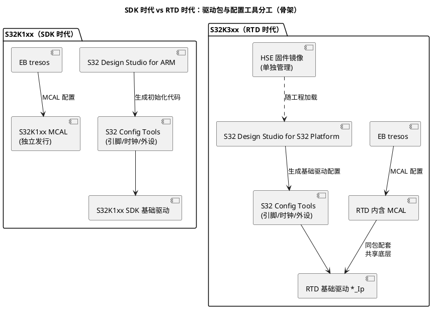

# S32K1xx SDK 与 S32K3 RTD：生态对比

> 一句话定位：K1 时代"裸机 SDK 与 AUTOSAR MCAL 两条平行产品线"，K3 时代合并为 RTD（Real-Time Drivers）一套包——理解这次合并，才能理解为什么 K3 工程里厂商驱动与 MCAL 的边界变了。
> 等级：L1→L2 ｜ 前置：[01-内核与资源对比](01-内核与资源对比.md)

## 原理

### S32K1xx SDK 时代的形态

S32K1xx SDK（S32K1xx Software Development Kit）是 NXP 为 K1 家族提供的**基础外设驱动包**，定位是裸机/RTOS 开发：

- 驱动按外设组织（时钟、GPIO、LPUART、FlexCAN、FTM 等），API 直接面向寄存器语义，不遵循 AUTOSAR 接口规范；
- 配套 S32 Design Studio for ARM（基于 Eclipse 的 IDE）与 S32 Config Tools（配置工具：引脚 Pins、时钟 Clocks、外设 Peripherals），图形化生成引脚复用、时钟树、外设初始化代码；
- **与 AUTOSAR 的关系是"平行"**：要做 AUTOSAR 项目，另购/另下 MCAL（S32K1xx MCAL），在 EB tresos 里配置，与 SDK 不共享代码——SDK 驱动与 MCAL 驱动是同一硬件的两套封装，二选一，一般不混用；
- 这是 Kinetis 时代思想的延续：厂商基础驱动优先，AUTOSAR 是叠加层。

### RTD 时代的形态（K3 主推）

RTD（Real-Time Drivers，实时驱动）是 NXP 面向 S32K3（及后续平台）的统一软件驱动包，一次发行覆盖两层：

- **基础驱动（Base / IP 驱动）**：寄存器级封装（命名如 `Siul2_Port_Ip`、`Clock_Ip` 一类的 *_Ip 组件，具体以所用 RTD 版本为准），地位相当于 K1 的 SDK 驱动、TC377 的 iLLD（见 [资源与iLLD](../../../2-L2进阶/TC377平台/资源与iLLD/README.md)）；
- **AUTOSAR MCAL**：与基础驱动同包发行、版本配套，遵循 MCAL 规范（Mcu/Port/Spi/Adc/Pwm/Gpt/Icu/Fls/Fee/Wdg/Dio），MCAL 内部调用基础驱动或与之共享底层实现；
- **与 AUTOSAR 对齐的集成材料**：随包提供集成说明、示例工程（含与 RTD-ASR/AUTOSAR 基础软件配合的形态），不再是"两套平行封装"。

### 两个时代的工具链分工

配置工具分工要点：

- **S32 Config Tools 管硬件资源**：引脚复用、时钟树、非 AUTOSAR 外设的基础配置——这些是"芯片事实"，与 AUTOSAR 无关；
- **EB tresos 管 MCAL 参数**：MCAL 模块的作业模式、通道配置、通知回调等——这些是"BSW 行为"；
- 两个工具的产物要在工程里合并（链接与初始化顺序），RTD 时代两者引用同一套基础驱动/底层配置，一致性由版本配套保证；K1 SDK+MCAL 组合则需要项目自己保证"别把 SDK 时钟驱动和 MCAL 时钟驱动都编进来"。

### K3 特有：HSE 固件带来的额外一环

K3 的安全能力在 HSE（见 [01-内核与资源对比](01-内核与资源对比.md)），HSE Firmware 是独立于 RTD 的镜像：有独立版本号、独立发布节奏，需要烧入芯片并由启动流程加载。工程上意味着：RTD 版本、HSE FW 版本、工具链版本三者要一起纳入版本管理。

## 寄存器与位表

> 本篇讲生态与工具链，不涉及位表。配置项核对关注点如下：

| 关注对象 | 看什么 | 权威出处 |
|---|---|---|
| SDK/RTD 版本与器件支持列表 | 所用料号是否被该版本支持 | NXP 官网发布说明 |
| MCAL 与基础驱动版本配套关系 | 版本兼容矩阵 | RTD 发行说明/Release Notes |
| Config Tools 生成物范围 | 哪些文件是生成代码（不可手改） | S32 Config Tools 文档 |
| EB tresos 配置范围 | MCAL 参数项与基础驱动边界 | tresos 工程手册 + RTD 集成指南 |
| HSE FW 版本与镜像 | 版本兼容、烧写位置 | HSE 固件发行说明 |

## 双平台对照（S32K 生态 vs TC377 生态）

| 维度 | S32K1xx | S32K3xx | TC377 |
|---|---|---|---|
| 基础驱动 | S32K1xx SDK | RTD 基础驱动（*_Ip） | iLLD |
| MCAL 形态 | 独立发行的 S32K1xx MCAL | RTD 内含 MCAL，同包配套 | MCAL 独立于 iLLD，版本配套 |
| 图形配置 | S32 Config Tools | S32 Config Tools | AURIX Development Studio（部分配置） |
| AUTOSAR 配置 | EB tresos | EB tresos | EB tresos |
| 安全软件 | CSEc 驱动散在 SDK/安全库 | HSE FW + 安全服务接口 | HSM 固件/She 库（按项目） |
| 厂商驱动与 MCAL 关系 | 平行、二选一 | 同包融合、共享底层 | 平行但官方给配套矩阵 |

## 代码/实操

- K1 裸机/RTOS 工程：S32DS + Config Tools + SDK，典型初始化顺序是时钟→引脚→外设，全部由 Config Tools 生成 `clock_config.c`/`pin_mux.c` 一类文件（命名以生成器版本为准）；
- K1 AUTOSAR 工程：EB tresos 配 MCAL，引脚/时钟的"芯片事实"部分仍建议在 tresos 的 Mcu/Port 配置里完成，不要 SDK 与 MCAL 混编两套时钟驱动；
- K3 工程：RTD 包选定后，基础驱动版本 = MCAL 版本 = 集成示例版本一起锁定；HSE FW 镜像作为独立构建产物管理；
- 迁移评估时的第一件事：把现有工程对 SDK API 的依赖列清单（尤其时钟、Flash、引脚初始化），逐项映射到 RTD 基础驱动或 MCAL，没有一一对应的部分就是自研/CDD 补齐范围（MCAL 边界方法论见 [MCAL总览](../../../../04-MCAL与外设驱动/1-L1基础/MCAL总览/README.md)）。

## 易错点与陷阱

1. **SDK 与 MCAL 混编**（K1）：两套时钟/引脚驱动同时初始化，后写的覆盖先写的，现象是"配置看似生效但频率不对"；
2. **把 Config Tools 生成代码当自己的改**：升级工具后手改部分被覆盖丢失，生成代码一律放独立目录并标注"generated"；
3. **RTD 版本混搭**：基础驱动用 A 版本、MCAL 用 B 版本，接口对不上或行为不一致，RTD 必须整包锁定版本；
4. **忽略 EB tresos 与 S32CT 的职责边界**：两边都配同一个外设（如 LPUART），一处改了另一处没改，集成后行为"时对时错"；
5. **HSE FW 版本游离在版本管理之外**：安全启动验签行为随 HSE FW 版本变化，复现"上一次还能启动"必须连 FW 版本一起回退；
6. **拿 K1 SDK 例程直接往 K3 搬**：外设代差（见 01 篇）决定例程思路可参考、代码不可平移；
7. **以为 RTD 的基础驱动就是 MCAL**：基础驱动（*_Ip）无 AUTOSAR 语义（无 Det 上报、无标准返回值），AUTOSAR 分层里必须走 MCAL 层封装。

## 面试高频题

1. **S32K1 SDK 和 RTD 的本质区别是什么？**
   答：SDK 是纯基础外设驱动，与 AUTOSAR MCAL 平行、互不相干；RTD 把基础驱动与 MCAL 合并为一个配套发行的包，MCAL 之下共享同一套底层实现，厂商驱动与 AUTOSAR 生态从"平行"变成"融合"。

2. **EB tresos 和 S32 Config Tools 各管什么？为什么需要两个工具？**
   答：S32CT 管芯片资源事实（引脚复用、时钟树、非 AUTOSAR 外设配置），tresos 管 BSW/MCAL 行为（作业模式、通道、回调）。一个是硬件视角、一个是 AUTOSAR 视角，K3 时代两者产物在 RTD 配套下合并。

3. **K1 平台做 AUTOSAR 项目，SDK 还有用吗？**
   答：正式量产形态用 MCAL；SDK 的价值在bring-up 阶段（快速点灯、验证时钟/引脚）与无 AUTOSAR 的小项目。两者不能同时初始化同一外设资源。

4. **迁移 K1→K3，软件生态侧的迁移痛点有哪些？**
   答：驱动 API 体系换代（SDK→RTD）、配置工具链更换（S32DS for ARM→S32DS for S32 Platform，配置格式不兼容）、MCAL 版本跨大版本、新增 HSE FW 管理、链接文件/内存布局随 K3 分区重做。

5. **RTD 时代"厂商驱动与 MCAL 更融合"对 AUTOSAR 工程师意味着什么？**
   答：好处是配置一致性与版本配套由 NXP 保证、集成材料齐全；代价是耦合更紧——换 RTD 版本等于同时动基础驱动与 MCAL，回归测试范围要按"整包升级"规划，而不是单模块升级。

## 延伸

- [01-内核与资源对比.md](01-内核与资源对比.md)：两代硬件代差，生态换代的原因；
- [资源与iLLD](../../../2-L2进阶/TC377平台/资源与iLLD/README.md)：TC377 侧"基础驱动与 MCAL 关系"的对照；
- [MCAL总览](../../../../04-MCAL与外设驱动/1-L1基础/MCAL总览/README.md)：MCAL 边界与集成方法论；
- [AUTOSAR配置工具](../../../../10-工具链与工程化/2-L2进阶/AUTOSAR配置工具/README.md)：EB tresos 的工作流细节；
- [S32K工程模板](../../../../12-项目实战/2-L2进阶/S32K工程模板/README.md)：落地工程组织；
- [S32K平台](../README.md) / [02-芯片与体系结构](../../README.md)。
