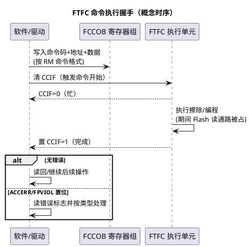

# FTFC 机制：S32K1 的 Flash 总管家

> 一句话定位：FTFC 统一管理 Program Flash 与 FlexNVM 的擦、写、保护与读时序——命令靠 FCCOB 寄存器组提交、完成靠 CCIF 标志轮询，擦写期间取指会停摆，是所有"写 Flash 时死机"问题的源头。
> 等级：L1→L2 ｜ 前置：[02-存储器映射初识](../../../00-入门导读/02-存储器映射初识.md)

## 原理

### FTFC 管什么

FTFC（Flash 控制器，NXP K1 RM 中管理 Flash 存储体的模块，全称以 RM 为准）统一管理两类存储体：

| 存储体 | 作用 | 说明 |
|---|---|---|
| Program Flash（程序闪存） | 存代码与常量 | 擦写单位为扇区（Sector，KB 量级，具体值查 RM 扇区表） |
| FlexNVM（数据闪存） | 存数据：普通 Data Flash 或 EEE 备份区 | 与 FlexRAM 配合可做硬件 EEE（见 [02-EEE模拟EEPROM](02-EEE模拟EEPROM.md)） |

K3 上的对应控制器命名、寄存器与命令体系不同（查 K3 RM Flash 章节），且无 FlexNVM/EEE 概念；本篇以 K1 为主体。

### 命令接口：FCCOB + CCIF 的握手模型

软件不能像写 RAM 一样直接写 Flash 地址完成编程，而是向 FTFC 提交"命令"：把命令码与参数（地址、数据）按格式写入 FCCOB（Flash Common Command Object，命令寄存器组），随后触发执行，等待完成。

握手三要点：

1. **CCIF 是唯一"忙/闲"标志**：清零表示命令启动，回 1 表示完成；上电后首次访问 Flash 命令接口前也要确认 CCIF=1；
2. **错误位必须检查**：ACCERR（访问错误，命令/参数非法）、FPVIOL（保护违例，目标在保护区内）置位时命令不执行，写 1 清除后才能继续（位定义与清除方式查 RM FSTAT 寄存器）；
3. **命令格式有宽度要求**：FCCOB 各字段按半字/字组织，写错宽度直接 ACCERR——这是手搓驱动的高发错误区。

### 擦写单位与"擦慢写快"

| 操作 | 单位（量级） | 典型耗时（量级） |
|---|---|---|
| 擦除（Erase） | 扇区（KB 级，具体查 RM） | 毫秒级（查 DS 时序参数） |
| 编程（Program） | Phrase/Longword（4~8 字节级，查 RM） | 微秒级 |

工程含义与 TC377 DMU 完全同构：擦除远慢于编程，所以上层软件（Fee/标定/Bootloader）必须把小数据聚合到扇区粒度再擦写，且作业调度不能在"等擦除"上忙等（见 [Fls与Fee](../../../../04-MCAL与外设驱动/2-L2进阶/Fls与Fee/README.md)）。

### 擦写期间取指行为：stall 与 RAM 例程

- Flash 同一时刻只能服务"读（取指/取数）"或"擦写"之一；擦写期间对该 Bank 的任何读访问都会**停摆（Stall）或总线错误**——包括 CPU 取指；
- 后果链：擦写函数若本身在 Flash 里执行，发起命令后自己就被 stall 卡死到命令结束；更糟的是喂狗代码也在 Flash 里时，长擦除直接触发看门狗复位；
- 标准规避：把 Flash 驱动关键函数与喂狗逻辑放进 **RAM** 执行（SDK 的 flash 驱动即按此设计，把命令序列放 RAM 例程；放置手段与 K1 SRAM 分区见 DS 存储映射）。

### 等待状态随核频变化

Flash 物理读取时间固定，核频越高，一个总线周期越短，需要插入的等待状态（Wait State）越多：RM 提供"核频/总线频 → 等待状态数"对照表，时钟配置变化时必须同步核对。配少了是时序违例（偶发取指错），配多了白白损失性能。两个联动场景：

- 提频（如进 HSRUN）而没改等待状态：高频下偶发指令错乱，极难定位；
- 时钟配错导致实际频率超标：与等待状态不足叠加，Flash 读不再是确定行为。

### ECC 概念

- Program Flash 与 FlexNVM 都带 ECC（Error Correction Code，错误校验码，SECDED 量级），存储单元写入时生成、读出时校验；
- 擦净但未编程的单元读出全 1 属正常；**半新不旧或意外翻转的位**会触发 ECC 不可纠正错误（可能升级为总线错误/复位，行为查 RM）；
- 经典坑：对 FlexNVM 裸区（非 EEE 模式）按普通内存"读未初始化区域"，ECC 报错——裸 Data Flash 读之前先擦净、别读未定义区域。

## 寄存器与位表

> 位号与地址一律查 RM FTFC 章节；下表只列"必须知道名字"的公开关注点（K1）：

| 关注对象 | 作用 | 使用要点 | 权威出处 |
|---|---|---|---|
| FCCOB 寄存器组 | 命令码+参数载体 | 按 RM 命令格式与访问宽度写 | RM FTFC 章节 |
| FSTAT：CCIF | 命令完成标志 | 清 0 触发、等 1 完成 | RM FTFC 章节 |
| FSTAT：ACCERR | 访问错误（命令/参数非法） | 置位须写 1 清除再继续 | RM FTFC 章节 |
| FSTAT：FPVIOL | 保护违例（目标受保护） | 同上，并核对保护配置 | RM FTFC 章节 |
| 保护寄存器（FPROT/DPROT 类） | 扇区/数据 Flash 保护 | 只能"扩大保护"，缩小受限（见 03 篇） | RM FTFC 章节 |
| 等待状态配置 | 读延迟随频率 | 按 RM 对照表设置 | RM FTFC/时钟章节 |
| FlexRAM 相关（EEE 使能等） | FlexRAM 模式切换 | 见 02 篇 | RM FTFC 章节 |

## 双平台对照（S32K vs TC377）

| 维度 | S32K1 FTFC | TC377 DMU |
|---|---|---|
| 命令提交 | FCCOB 寄存器组按格式写入 | 写命令接口的命令序列 |
| 完成判定 | CCIF 标志轮询 | 命令状态位/中断 |
| 错误上报 | ACCERR/FPVIOL 等标志位 | 操作状态/错误码寄存器 |
| 保护机制 | FPROT/DPROT+后门密钥（03 篇） | ENDINIT + UCB 扇区保护 |
| 擦写期间取指 | 同 Bank stall，驱动搬 RAM 规避 | 同 Bank stall，驱动搬 PSPR 规避 |
| 验证手段 | 读回比对/按手册流程 | 硬件擦除/编程验证命令 |
| 硬件 EEE | 有（FlexNVM+FlexRAM） | 无，Fee 直接管理 DFlash |

TC377 侧细节见 [03-DMU与扇区](../../../2-L2进阶/TC377平台/存储器映射/03-DMU与扇区.md)。

## 代码/实操

- SDK（K1）的 flash 驱动把命令序列封进 RAM 例程（`FLASH_DRV_*` 一类接口，命名以所用 SDK 版本为准），业务代码不要绕过封装手搓 FCCOB；
- 典型调用链（概念）：检查 CCIF → 组命令（Erase Flash Sector / Program Phrase）→ 触发 → 等 CCIF → 查错误位；异步化交给上层（Fls 的 Job 模型）；
- EEE 相关命令（分区、使能）见 [02-EEE模拟EEPROM](02-EEE模拟EEPROM.md)；保护与解锁见 [03-分区与安全](03-分区与安全.md)；
- Bootloader 里"擦写自身所在 Flash"是 FTFC 机制的典型考场：升级代码必须整体在 RAM（或双区）执行，喂狗一并搬走（Bootloader 实践见 [Bootloader 34-37实现细节](../../../../06-诊断与标定/3-L3高级/Bootloader/02-34-37实现细节.md)）。

## 易错点与陷阱

1. **在 Flash 里执行擦写函数**：命令一发起 CPU 就 stall，轻则卡顿重则看门狗复位——驱动必须 RAM 化；
2. **不查 ACCERR/FPVIOL 就重试**：错误标志不清除，后续命令全部被拒，表现为"擦写函数永远失败"；
3. **FCCOB 写错宽度/顺序**：直接 ACCERR，命令根本没执行；照 RM 命令格式逐字段核对；
4. **擦除按字节/页地址发起**：擦除必须扇区对齐，地址换算错会拒命令；
5. **提频不改等待状态**：高频下偶发取指出错，错误现象与"软件 bug"一模一样；
6. **裸读未擦净的 FlexNVM 区域**：ECC 不可纠正错误，总线错误/复位行为查 RM；Data Flash 上电先擦净再读；
7. **擦写期间中断在 Flash 里执行**：中断向量/ISR 也在被擦 Bank 时，stall 波及全系统；Bootloader 要规划"擦写窗口内只跑 RAM 代码"；
8. **把 EEE 命令与普通编程混用同一 FlexNVM 区**：分区模式决定用途（02 篇），混用直接数据错乱。

## 面试高频题

1. **S32K1 上软件怎么写 Flash？为什么不能像 RAM 一样直接赋值？**
   答：写 FCCOB 寄存器组提交命令（命令码+地址+数据），清 CCIF 触发，等 CCIF 置 1 完成，并检查 ACCERR/FPVIOL。Flash 编程是物理位翻转操作，需要命令状态机控制时序与校验，不能随机写。

2. **擦 Flash 时 CPU 在干什么？怎么规避？**
   答：擦写期间该 Flash Bank 读通路被占，CPU 取指/取数会 stall。规避：把 Flash 驱动与喂狗逻辑放 RAM 执行；Bootloader 场景整体规划"擦写窗口内只跑 RAM 代码"。

3. **CCIF、ACCERR、FPVIOL 分别是什么？**
   答：CCIF 是命令完成标志（清 0 触发、置 1 完成）；ACCERR 表示命令/参数非法的访问错误；FPVIOL 表示目标地址处于保护区。错误位要写 1 清除后才能继续发命令。

4. **为什么擦除单位远大于编程单位？对上层软件有什么影响？**
   答：物理机制决定：擦除按扇区把浮栅集体复位，编程按 phrase 小粒度写入。上层必须聚合小数据（Fee 的职责），否则写几个字节就要擦一整个扇区，寿命与耗时都不可接受。

5. **Flash 等待状态是什么？什么时候要重新配？**
   答：Flash 物理读取时间固定，核频越高需插入越多等待周期对齐时序。时钟配置变化（尤其进 HSRUN 提频）时按 RM 对照表重新核对，否则高频下取指出错。

6. **S32K1 与 TC377 的 Flash 管理机制有何异同？**
   答：同：命令式擦写、完成标志轮询、同 Bank 擦写会 stall、擦慢写快。异：命令载体（FCCOB 寄存器组 vs 命令序列接口）、保护体系（FPROT+后门密钥 vs ENDINIT+UCB）、S32K1 独有硬件 EEE。

## 延伸

- [02-EEE模拟EEPROM.md](02-EEE模拟EEPROM.md)：FlexNVM 的另一半故事——硬件 EEPROM 模拟；
- [03-分区与安全.md](03-分区与安全.md)：保护、密钥与量产锁死策略；
- [03-DMU与扇区](../../../2-L2进阶/TC377平台/存储器映射/03-DMU与扇区.md)：TC377 侧对照细读；
- [Fls与Fee](../../../../04-MCAL与外设驱动/2-L2进阶/Fls与Fee/README.md)：FTFC 之上的异步作业模型；
- [Bootloader](../../../../06-诊断与标定/3-L3高级/Bootloader/README.md)：擦写机制的最大用户；
- [S32K平台](../README.md) / [02-芯片与体系结构](../../README.md)。
