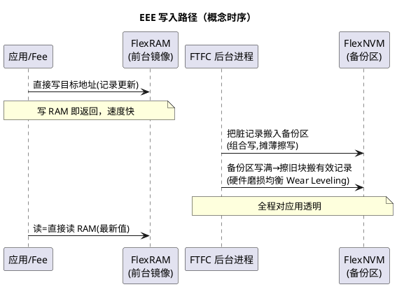
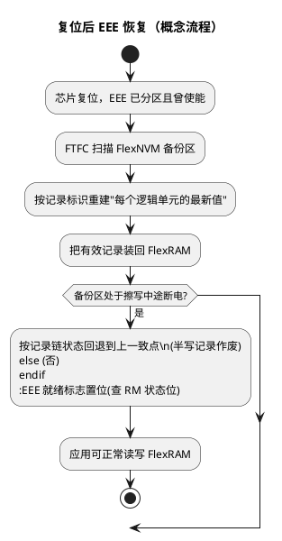

# EEE 模拟 EEPROM：K1 的硬件级 NVM 方案

> 一句话定位：EEE（EEPROM Emulation）把 FlexNVM 的一部分划成备份区、FlexRAM 当缓冲——应用写 RAM 即返回，硬件后台搬进 Data Flash 并做磨损均衡，是 S32K1 独有、K3 已移除的机制。
> 等级：L1→L2 ｜ 前置：[01-FTFC机制](01-FTFC机制.md)

## 原理

### 三个角色：FlexNVM 备份区、FlexRAM、EEE 记录

| 角色 | 作用 | 说明 |
|---|---|---|
| FlexRAM（4 KB 量级，查 DS） | EEE 数据的前台镜像 | EEE 使能后，应用对它的读写就是"读写 EEPROM" |
| FlexNVM 备份区 | 真正的持久化介质 | 分区命令把 FlexNVM 的部分/全部扇区划为 EEE 备份（分区大小档位查 RM） |
| EEE 记录（EEPROM Record） | FlexRAM 8 字节对齐单元的备份单位 | 写 FlexRAM 某单元即生成/更新对应记录（格式与大小约束查 RM） |

使用前提是**一次性分区操作**：出厂芯片 FlexNVM 未分区，首次使用前要执行分区命令（设定"多少 FlexNVM 做 EEE 备份、多少留作普通 Data Flash"），分区会触发擦除并丢失原有数据，且一经设定不能改回（除非整个重来）——量产上把它固定在 EOL 烧录环节。

### 写入路径：RAM 命中 → 后台搬运

要点：

- **写时延两段式**：写 FlexRAM 立即完成；后台搬运由 FTFC 自动做，不占软件调度。但备份区正在擦写时，新的记录更新可能被阻塞（等 CCIF 类机制，行为查 RM）——所以周期性快速写也要给硬件留搬运窗口；
- **磨损均衡（Wear Leveling）由硬件做**：备份区按块轮转使用，有效记录在块间搬移摊平擦写次数； endurance（寿命次数）指标与"EEE 备份区大小"正相关——备份区划得越大，同样写频下每块分摊的擦写越少（量化指标查 DS 的 EEE endurance 表）；
- **记录管理最小单位是 8 字节**：改 1 字节也会产生整条记录更新，碎数据应聚合成记录块写，否则 endurance 被放大消耗。

### 冷启动恢复流程

关键认知：**上电后 EEE 恢复需要时间**——FlexRAM 里的数据不是"复位即就绪"。软件必须在首次访问前确认 EEE 就绪（状态位查 RM FTFC 章节），否则读到的可能是未恢复完的数据。

### 与 AUTOSAR Fee 的关系（两平台对照）

| 方案 | 平台 | 分层形态 | 磨损均衡 |  blockSize/性能 |
|---|---|---|---|---|
| Fee on EEE | S32K1（典型） | Fee 之下直接是 FTFC-EEE（Fls 层弱化甚至旁路） | **硬件**（FTFC 内置） | 写快（RAM 命中）；容量受 FlexRAM 4KB 量级限制 |
| Fee on Data Flash | TC377 / S32K3 | Fee 之下是 Fls → 普通 Data Flash | **软件**（Fee/底层 IP 实现） | 写走完整异步作业链；容量可用整个 Data Flash |

- S32K1 上 NvM→Fee→EEE：Fee 主要做"逻辑块到 EEE 地址"的映射与 API 语义，擦写调度大头在硬件；
- TC377 上 NvM→Fee→Fls→DMU/DFlash：磨损均衡、块管理、立即写/常规写调度都在软件栈里，Fee 的复杂度和可配置性高得多；
- 两平台 Fee 的 SWS 语义相同（上层 NvM 无感），**但失效模式与调优手段完全不同**——EEE 侧调"分区大小/记录布局"，软件 Fee 调"扇区数/阈值/作业优先级"。深入见 [Fls与Fee](../../../../04-MCAL与外设驱动/2-L2进阶/Fls与Fee/README.md) 与 TC377 侧 [01-PFlash与DFlash](../../../2-L2进阶/TC377平台/存储器映射/01-PFlash与DFlash.md)。

### EEE 使能的启动时序注意

- 上电初始化顺序（概念）：确认 FTFC 空闲（CCIF=1）→ 若 FlexRAM 未处于 EEE 模式，发"EEE 使能"命令 → 等 EEE 就绪 → 才能访问 FlexRAM 数据；
- 分区与使能是两步：分区（一次性、EOL 做）≠ 使能（每次上电或保持，视模式配置）；
- EEE 备份区擦写进行中的复位：硬件靠记录链保证回到一致点，但"最后一次写"可能丢失——对"必须落盘"的数据，写后要留出搬运时间再断电（或查询备份完成状态，手段查 RM）。

## 寄存器与位表

> 位号与命令码查 RM FTFC 章节；EEE 相关公开关注点（K1）：

| 关注对象 | 作用 | 使用要点 | 权威出处 |
|---|---|---|---|
| FlexRAM 模式控制 | FlexRAM 作普通 RAM / EEE 数据区切换 | EEE 使能命令写入 | RM FTFC 章节 |
| EEE 分区命令 | 设定 FlexNVM 的 EEE 备份大小档位 | 一次性、触发擦除、量产 EOL 执行 | RM FTFC 章节 |
| EEE 就绪状态 | 恢复完成/可访问标志 | 首次访问前必须确认 | RM FTFC 章节 |
| EEE 记录格式 | 记录头/数据组织约束 | 8 字节对齐，大小查 RM | RM FTFC 章节 |
| EEE endurance 参数 | 备份区大小 vs 写次数指标 | 选型/容量规划依据 | DS 可靠性章节 |

## 双平台对照（S32K vs TC377）

| 维度 | S32K1（EEE） | TC377（软件 Fee on DFlash） |
|---|---|---|
| 持久化介质 | FlexNVM 的 EEE 备份区 | 普通 DFlash 扇区 |
| 前台缓冲 | FlexRAM（硬件镜像） | Fee 软件缓冲/无 |
| 磨损均衡 | 硬件内置 | 软件实现（Fee/IP） |
| 有效容量 | 受 FlexRAM/FlexNVM 分区限制 | 整个 DFlash |
| 写路径 | 写 RAM 即返回+后台搬运 | 完整 Fls 异步作业 |
| 上电恢复 | 硬件扫描恢复，需等就绪 | Fee 初始化读管理区 |
| 掉电一致性 | 记录链回退到一致点 | Fee 的事务/冗余块策略 |

## 代码/实操

- SDK（K1）flash 驱动提供 EEE 相关接口（分区、使能、查询状态一类，命名以所用版本为准）， Fee 集成时底层对接概念：逻辑块地址落在 FlexRAM 窗口内；
- 典型 EOL 烧录顺序（概念）：烧程序 → EEE 分区（若未做）→ 使能并验证 → 写入产线数据 → 锁保护（见 [03-分区与安全](03-分区与安全.md)）；
- 验证 EEE 行为的两个实验：①连续快写后立即断电，上电检查最后写丢到哪条（掉电一致性边界）；②统计写频×记录数×预期寿命 vs DS endurance 表（寿命预算）。

## 易错点与陷阱

1. **跳过"EEE 就绪"直接读 FlexRAM**：上电恢复未完成，读到旧/空数据，偶发且难复现；
2. **分区当日常初始化做**：分区会擦掉整个 FlexNVM 且不能随意改档位，只能放 EOL 一次性流程；
3. **把 FlexRAM 当普通 RAM 又想要 EEE**：FlexRAM 模式切换会丢内容，模式要在初始化早期定死；
4. **1 字节一写**：记录最小 8 字节，碎写把 endurance 消耗放大 8 倍，要聚合写；
5. **不看寿命预算**：EEPROM 区写频 × 记录数 × 项目年限超 DS endurance 表，量产后期批量失效；
6. **写后立刻断电**：后台还没搬完，最后一次写丢失；关键数据写后留搬运窗口或查完成状态；
7. **K3 上找 EEE**：K3 无硬件 EEE，方案要换成 Fee on Data Flash（见 [01-内核与资源对比](../S32K1与S32K3对比/01-内核与资源对比.md)）；
8. **EEE 区与普通 Data Flash 混用**：分区边界之外当普通 Data Flash 用没问题，越界写则行为未定义——地址窗口按分区档位算清。

## 面试高频题

1. **EEE 的基本原理？为什么写 EEPROM 区很快？**
   答：FlexNVM 划备份区、FlexRAM 作前台。应用写 FlexRAM 即返回，FTFC 后台把记录搬进备份区并做磨损均衡。快是因为前台是 RAM 写，慢活对软件透明。

2. **磨损均衡在 EEE 里由谁做？怎么规划寿命？**
   答：S32K1 的 EEE 由硬件做（备份区块轮转+有效记录搬移）。寿命规划按"写频 × 记录粒度 × 年限"对照 DS endurance 表，并尽量加大备份区、聚合写降低放大系数。

3. **上电后马上读 FlexRAM 安全吗？**
   答：不安全。EEE 冷启动要扫描备份区恢复记录，恢复完成前数据未就绪；必须先查 EEE 就绪状态位（查 RM）再访问。

4. **S32K1 的 Fee 和 TC377 的 Fee 有什么本质区别？**
   答：S32K1 典型是 Fee on EEE：磨损均衡和掉电一致性靠硬件，Fee 退化成地址映射层；TC377 是 Fee on 普通 DFlash：块管理、磨损均衡、立即写调度全在软件栈，复杂度与可调性都更高。上层 NvM 语义一致，调优对象完全不同。

5. **断电瞬间 EEE 正在擦写，数据会坏吗？**
   答：硬件按记录链保证回到上一个一致点，半写记录作废，不会损坏整区；但"最后一次写入"可能丢失，关键写要留搬运窗口。

6. **第一次用一颗全新 S32K1，直接使能 EEE 会怎样？**
   答：不行。新片 FlexNVM 未分区，必须先执行一次性分区命令（选定 EEE 备份档位），该操作会擦除 FlexNVM，量产上放 EOL 烧录环节执行。

## 延伸

- [01-FTFC机制.md](01-FTFC机制.md)：命令接口与擦写行为底座；
- [03-分区与安全.md](03-分区与安全.md)：EOL 烧录顺序与保护策略；
- [Fls与Fee](../../../../04-MCAL与外设驱动/2-L2进阶/Fls与Fee/README.md)：AUTOSAR 内存栈分层；
- [01-PFlash与DFlash](../../../2-L2进阶/TC377平台/存储器映射/01-PFlash与DFlash.md)：TC377 的 DFlash 形态对照；
- [01-内核与资源对比](../S32K1与S32K3对比/01-内核与资源对比.md)：K3 为何没有 EEE；
- [S32K平台](../README.md) / [02-芯片与体系结构](../../README.md)。
