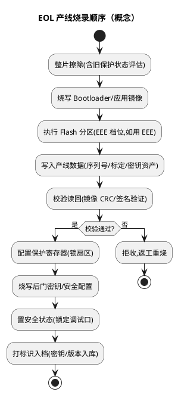

# 分区与安全：Flash 保护、安全启动与量产锁死

> 一句话定位：Flash 保护区 + 安全状态位 + 后门密钥 + Mass Erase 解锁，共同回答一个问题——"这颗芯片量产之后，谁能改里面的东西"；EOL（End of Line，产线烧录）顺序错了，代价是整批板子无法返工。
> 等级：L1→L2 ｜ 前置：[01-FTFC机制](01-FTFC机制.md)、[02-EEE模拟EEPROM](02-EEE模拟EEPROM.md)

## 原理

### Flash 保护：锁得上、解不开的"单向棘轮"

S32K1 的 FTFC 提供两类保护概念（K3 机制类似但寄存器体系不同，查各自 RM）：

| 保护对象 | 机制（概念） | 特性 |
|---|---|---|
| Program Flash 保护区（FPROT 类寄存器） | 把若干扇区标记为写/擦保护 | 保护只能"扩大"不能现场"缩小"，缩小需走解锁路径 |
| Data Flash（FlexNVM）保护（DPROT 类） | 同上，覆盖数据区 | 同上 |
| 后门密钥（Backdoor Key） | 预先烧入的密钥，通过特定命令比对正确后临时解除保护状态 | 比对失败有次数限制，密钥即资产 |

"只能扩大不能缩小"是安全设计：运行中若代码被攻破，攻击者也无法通过改保护寄存器放开 Flash——放开只有两条路：**密钥后门**（知道密钥才能临时开）或 **Mass Erase 整片擦除后重来**（数据同归于尽）。

### 安全状态与启动校验

- 芯片有安全状态位（FSEC 相关字段，位定义查 RM）：**出厂默认安全（Secure）**——安全状态下调试口受限、Flash 内容不可被外部读出，防抄板/防提取固件；
- **安全启动（Secure Boot）概念**：复位后只允许校验通过的代码运行。K1 上依托 CSEc（SHE 兼容加密引擎）可构建 BOOT_MAC 校验类方案（固件镜像哈希+密钥验签，机制查安全应用笔记）；K3 上由 HSE 承担：HSE 固件先启动，校验应用镜像签名后才放行主核——启动信任链从"软件自证"变成"独立安全核担保"（一句话概念，深入见 [功能安全与信息安全](../../../../11-功能安全与信息安全/README.md)）；
- 与 TC377 对照：TC377 用 BMHD（Boot Mode Header）里的起始地址+校验和/HSM 固件做启动级把关（见 [01-CCU与时钟树](../../../2-L2进阶/TC377平台/时钟系统/01-CCU与时钟树.md) 同目录的存储器映射笔记），思路同源：**启动头/元数据不通过，就不跳应用**。

### 调试口解锁与 Mass Erase 策略

| 策略 | 做法 | 适用 |
|---|---|---|
| 量产锁死 | EOL 最后一步：写保护+安全状态+密钥全配置，调试口基本不可用 | 量产件，防抄防改 |
| 可返修策略 | 保留 Mass Erase 使能：维修时整片擦除→重新烧写（原数据全丢） | 需要产线返工的产品 |
| 密钥后门策略 | 预置 backdoor key，授权维修"不擦除临时解锁" | 有安全资产且要保留数据返修的产品 |

要点：**Mass Erase 使能位（MEEN 类字段，位定义查 RM）是最后的恢复通道**。如果把它关死且密钥丢失，芯片对外就是黑盒——只能换件。策略要在项目安全概念阶段定，不能到量产前拍脑袋。

### EOL（产线烧录）视角的标准顺序

两条纪律：

1. **锁死动作永远放最后**：保护、密钥、安全状态全部在"校验通过"之后配置，烧废了还能重来；
2. **密钥是资产管理不是代码变量**：后门密钥、密钥槽内容必须入库、随项目交接，丢失即失去返修能力。

### CSEc / HSE 密钥概念（一句话）

- CSEc（K1）：SHE 兼容加密引擎，内置密钥槽（RAM/Flash 密钥）+ BOOT_MAC 配置，密钥经安全协议写入后不可读出（操作细节查安全应用笔记）；
- HSE（K3）：独立安全核管理密钥全生命周期（导入/派生/销毁），应用经服务接口请求加解密与验签，密钥永不出安全域。

## 寄存器与位表

> 位号/字段布局查 RM；K1 公开关注点：

| 关注对象 | 作用 | 使用要点 | 权威出处 |
|---|---|---|---|
| FPROT/DPROT 类保护寄存器 | 扇区/数据区保护 | 只能扩大；缩小走解锁路径 | RM FTFC 章节 |
| FSEC 类安全配置 | 安全状态/密钥使能/擦除使能 | SEC/KEYEN/MEEN 等字段布局查 RM | RM FTFC 章节 |
| 后门密钥比对命令 | 密钥正确则临时解除保护 | 失败次数受限 | RM FTFC 章节 |
| Mass Erase | 整片擦除解锁 | 受 MEEN 类字段约束 | RM FTFC 章节 |
| K3 安全启动配置 | HSE 启动镜像/验签配置 | K3 安全手册/HSE 文档 | K3 RM + HSE 应用笔记 |

## 双平台对照（S32K vs TC377）

| 维度 | S32K1 | S32K3 | TC377 |
|---|---|---|---|
| 扇区保护 | FPROT/DPROT（单向棘轮） | 保护机制体系升级（查 RM） | UCB 固化配置 |
| 解锁路径 | 后门密钥 / Mass Erase | HSE 参与的安全访问（查手册） | UCB 密码/特定流程 |
| 安全启动 | CSEc BOOT_MAC 类方案 | HSE 验签后放行主核 | BMHD 校验 + HSM |
| 调试口管控 | 安全状态位约束 | HSE/安全状态约束（查手册） | 安全等级位约束 |
| 量产锁死 | EOL 末步写保护+安全位 | EOL 末步+HSE 生命周期管理 | EOL 末步烧 UCB |

## 代码/实操

- SDK/烧录器通常提供保护与解锁的操作入口（调试器侧经 S32DS/烧录工具的解锁选项，芯片侧经 FTFC 命令），具体界面/命令以所用工具版本为准；
- 开发期建议：调试板保持"可 Mass Erase"的宽松配置，量产程序在 EOL 由产线程序统一下锁——不要把开发期安全配置直接复制到量产流程；
- 验证锁死效果的两个实验：①锁死后尝试调试器读 Flash（应被拒）；②按维修流程走一遍 Mass Erase 重烧（确认返工通道真的通）；
- Bootloader 与 OTA 场景对"在线改写"的要求要提前与保护策略对齐：哪些区允许应用自更新（不锁或软锁）、哪些区绝对锁死（见 [Bootloader](../../../../06-诊断与标定/3-L3高级/Bootloader/README.md)）。

## 易错点与陷阱

1. **EOL 顺序颠倒**：先锁安全状态再烧写，烧到一半失败——板子卡在"锁死+半程序"状态，无法重烧只能换件；
2. **密钥当普通常量提交到代码仓**：密钥泄漏=保护形同虚设；密钥资产走独立管理（产线服务器/加密库）；
3. **Mass Erase 使能被随手关死**：密钥再一丢，返修通道彻底关闭，售后只能换板；
4. **保护"只能扩大"记反了**：以为运行时能随便放开保护区，实际放开要走密钥/擦除路径，OTA 写保护区直接 FPVIOL；
5. **安全启动配置与镜像不同步**：验签密钥/BOOT_MAC 配置与实际镜像不匹配，量产板集体起不来——EOL 校验步骤必须含启动验证（真跑一次复位启动）；
6. **开发板与量产件安全配置不分**：开发板锁死后同事无法调试，产线件没锁死直接流出——两套配置模板严格分离；
7. **忘了 K3 的 HSE 生命周期**：K3 上安全状态推进（开发→产线→锁死）与 HSE 固件联动，只改应用侧配置不等于完成锁死（机制查 K3 安全手册）。

## 面试高频题

1. **S32K1 的 Flash 保护为什么"只能扩大不能缩小"？**
   答：防运行期攻击——代码被攻破后也无法改寄存器放开 Flash。放开只有两条正路：后门密钥比对或 Mass Erase，两者都要"知道密钥"或"牺牲数据"。

2. **后门密钥（Backdoor Key）机制是什么？设计时要注意什么？**
   答：预先烧入的密钥，通过命令比对正确后临时解除保护状态（有限次尝试）。设计要点：密钥是资产管理，入库交接、控制尝试次数、与量产流程绑定，不能当代码常量。

3. **EOL 烧录为什么把"锁死"放最后一步？**
   答：保护、密钥、安全状态配置后基本不可逆（不擦除回不去）。放在镜像校验通过之后，保证烧废的板子还能返工重烧；顺序颠倒的代价是整批不可恢复。

4. **量产锁死和可返修策略怎么权衡？**
   答：锁死=调试口受限+密钥/擦除恢复；返修需求高的产品保留 Mass Erase 通道或密钥后门。核心是把"维修时怎么解锁"在安全概念阶段设计好，而不是出事后救火。

5. **K1 与 K3 的安全启动有什么区别？**
   答：K1 依托 CSEc 做 BOOT_MAC 类镜像校验，属于引擎级方案；K3 由 HSE 独立安全核先启动、验签通过才放行主核，信任链更完整，且密钥全生命周期在安全域内管理。

6. **调试器连不上量产板，可能是什么原因？**
   答：安全状态为 secure、调试口被锁、保护配置拒绝访问。恢复路径：有密钥走密钥后门，无密钥走 Mass Erase（若使能），都不行则只能换件——这正是锁死策略的目的。

## 延伸

- [01-FTFC机制.md](01-FTFC机制.md)：保护命令的载体与错误位；
- [02-EEE模拟EEPROM.md](02-EEE模拟EEPROM.md)：EOL 中的分区步骤；
- [功能安全与信息安全](../../../../11-功能安全与信息安全/README.md)：安全启动/密钥体系纵深；
- [Bootloader](../../../../06-诊断与标定/3-L3高级/Bootloader/README.md)：在线更新与保护策略的对齐；
- [01-内核与资源对比](../S32K1与S32K3对比/01-内核与资源对比.md)：CSEc→HSE 代差；
- [S32K平台](../README.md) / [02-芯片与体系结构](../../README.md)。
