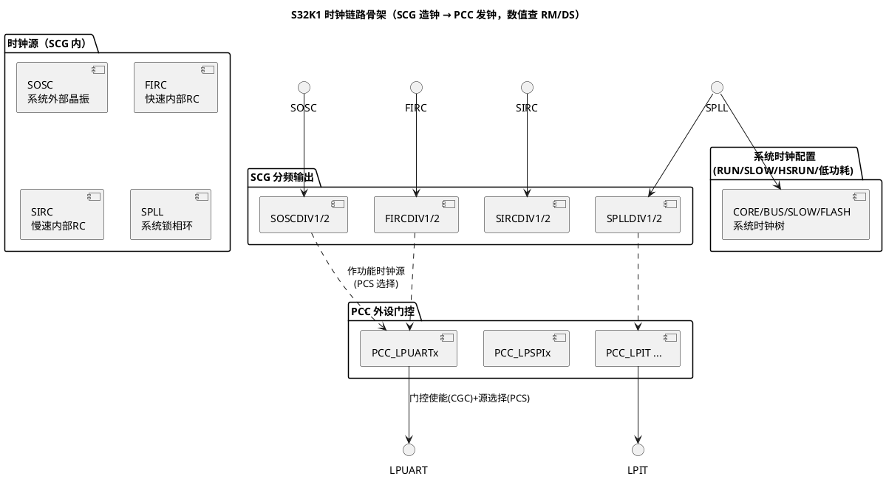

# SCG 与 PCC：时钟的产生与分发

> 一句话定位：SCG（System Clock Generator，系统时钟发生器）负责"造钟"——管振荡器/PLL 与系统时钟域；PCC（Peripheral Clock Control，外设时钟控制）负责"发钟"——每个外设一个门控开关加源选择；配错顺序是"外设无声无息不工作"的头号原因。
> 等级：L1→L2 ｜ 前置：[01-从零认识一颗MCU](../../../00-入门导读/01-从零认识一颗MCU.md)

## 原理

### 分工模型：造钟的 SCG、发钟的 PCC

- **SCG 管四类源**：SOSC（外部晶振，频率由板级决定，常见 8 MHz 量级以原理图为准）、FIRC（快速内部 RC，48 MHz 量级，查 RM）、SIRC（慢速内部 RC，低功耗/看门狗类用途）、SPLL（System PLL，系统主频来源）；每个源带独立分频输出（DIV1/DIV2），供外设挑用；
- **SCG 还管系统时钟配置（System Clock Config）**：按电源模式（RUN/SLOW/HSRUN/低功耗模式）整组切换 CORE/BUS/SLOW/FLASH 各域频率——切模式=整组换档，不是单点改频；
- **PCC 每外设一条目**：典型如 PCC_LPUARTx/PCC_LPSPIx/PCC_LPIT，含两大要素——CGC（时钟门控使能，不开=外设无时钟=读写寄存器无效）与 PCS（部分外设的时钟源选择，从 SCG 各 DIV 输出中挑一个）。

### 一条典型链路（符号化，频率以 DS/RM 为准）

- 系统侧：SOSC（8M 量级）→ SPLL 倍频 → CORE 时钟（如 80~112 MHz 档，量级见 [01-内核与资源对比](../S32K1与S32K3对比/01-内核与资源对比.md)）；
- 外设侧：FIRC 48 MHz 量级经 FIRCDIV1 分频 → PCC 里 PCS 选它 → LPUART 波特率源（48 MHz 整数好分频，是外设源选 FIRC 的常见理由）；
- 工程含义：**"外设跑多快"由两级决定**——SCG 的 DIV 输出决定候选频率，PCC 的 PCS 决定用哪个候选；波特率算错时两级都要查。

### 配置顺序：先源后门控

正确顺序（概念）：

1. 使能并稳定时钟源（SOSC 起振稳定、SPLL 锁定——必须等锁定标志再切）；
2. 配各源 DIV 分频输出；
3. 切换系统时钟配置（RUN/HSRUN）到目标档；
4. 逐外设：PCC 先选 PCS 源，再开 CGC 门控；
5. 最后才碰外设自身寄存器（分频/波特率/工作模式）。

顺序反了的现象：向未开门控的外设写配置——总线不报错但寄存器不生效（或读回全 0），等时钟开了一看"配置丢了"；以及 PLL 未锁就切源——系统短暂跑飞。

### 时钟安全监控（概念）

- SCG 支持对时钟源的监控（Loss of Clock/Stuck at 检测类机制，具体位与行为查 RM SCG 章节）：晶振停振/PLL 失锁时可触发中断或复位，而非系统无声死掉；
- 另有独立时钟监视单元（CMU，Clock Monitoring Unit）对关键源做频率窗口监视（阈值与寄存器查 RM）；
- 功能安全相关项目必须回答"晶振坏了系统怎么表现"——把时钟失效告警接到复位/安全状态路径，并实测验证（与 TC377 的 SMU 安全链路对照见下表）。

## 寄存器与位表

> 位号与地址查 RM SCG/PCC 章节；公开关注点（K1）：

| 关注对象 | 作用 | 使用要点 | 权威出处 |
|---|---|---|---|
| SOSCCSR/SPLLCFG 等源控制 | 源使能/锁定状态/倍频配置 | 等 PLL 锁定标志再切换 | RM SCG 章节 |
| 各源 DIV 寄存器 | DIV1/DIV2 分频输出 | 分频值与上限约束查 RM | RM SCG 章节 |
| 系统时钟配置寄存器（RCCR 类） | 各模式系统时钟域组 | 切模式整组换档 | RM SCG 章节 |
| PCC_xxx：CGC 位 | 外设时钟门控 | 先开钟后配寄存器 | RM PCC 章节 |
| PCC_xxx：PCS 位 | 外设功能时钟源选择 | 仅部分外设支持，查表 | RM PCC 章节 |
| 时钟监控（SCG 内/CMU） | 失振/失锁/频率窗口检测 | 告警路由到复位或安全动作 | RM SCG/CMU 章节 |

## 双平台对照（S32K vs TC377）

| 维度 | S32K1（SCG+PCC） | TC377（CCU 体系） |
|---|---|---|
| 造钟单元 | SCG（SOSC/FIRC/SIRC/SPLL） | CCU 管辖的 OSC/PLL/后备时钟 |
| 系统域切换 | RUN/SLOW/HSRUN 整组配置 | CCU 分频器组多域输出 |
| 外设门控 | PCC 每外设 CGC 位 | CCUCON* 每模块一位（+模块 CLC） |
| 外设源选择 | PCC 的 PCS 位（部分外设） | 模块自身/分频挂载关系决定 |
| 失效兜底 | SCG 监控+复位/中断（查 RM） | 自动切后备时钟+SMU 安全状态 |
| 配置入口 | S32 Config Tools 时钟工具 / Mcu 模块 | iLLD 时钟 API / Mcu 模块 |

TC377 侧全景见 [01-CCU与时钟树](../../../2-L2进阶/TC377平台/时钟系统/01-CCU与时钟树.md)。

## 代码/实操

- SDK（K1）时钟初始化由 Config Tools 生成 `clock_config.c` 一类文件（命名以生成器为准），运行时切换用 SDK 时钟 API（名称以版本为准）；
- AUTOSAR 工程：以上全部收口到 MCAL 的 Mcu 模块（Mcu_Init/Mcu_DistributePllClock 等标准接口，见 [Mcu模块](../../../../04-MCAL与外设驱动/2-L2进阶/Mcu模块/README.md)）；外设门控/源选择随各 MCAL 驱动初始化完成；
- 排障三板斧（S32K 版）：①读 PCC 确认目标外设 CGC 开了没；②读 SCG 各 DIV 确认候选频率真的在跑；③有条件用时钟输出引脚+示波器实测（引脚复用支持查 DS）；
- 低功耗模式进出：VLPR/VLHS 等模式切换=系统时钟配置整组换档+外设时钟受影响清单核对，恢复路径与初始化对称（模式切换细节查 RM SCG 章节）。

## 易错点与陷阱

1. **先配外设后开 CGC**：配置静默丢失/读回全 0，"新外设不工作"第一查 PCC；
2. **PCS 选了没使能的分频输出**：源配置了但 DIV 输出没开/分频为 0，外设时钟实际没有——两级都要核对；
3. **PLL 没等锁定就切系统时钟**：短暂跑飞后复位，现象"初始化途中偶发重启"；
4. **HSRUN 提频忘了 Flash 等待状态**：与 [01-FTFC机制](../存储器与Flash/01-FTFC机制.md) 联动，高频下取指错乱；
5. **波特率/超时按核频心算**：外设功能时钟来自所选 DIV 源（可能 48M/8M），不是 CORE 频率，按错基准整体偏差；
6. **时钟失效告警没接处理**：晶振坏了系统"无声死"，功能安全评审必修项；
7. **低功耗进出不对称**：进低功耗关了一堆门控，出来没全开，部分外设复活失败；
8. **跨域访问节拍差**：SLOW 域外设与 CORE 不同频，"读状态→等标志"的循环时间按外设域频率估算。

## 面试高频题

1. **SCG 和 PCC 的分工是什么？**
   答：SCG 造钟（振荡器/PLL/分频输出+系统时钟配置），PCC 发钟（每外设的时钟门控 CGC 与源选择 PCS）。"配外设先开 PCC 门控"是铁律。

2. **外设时钟配置的正确顺序？**
   答：源稳定（含 PLL 锁定）→ DIV 输出配置 → 系统时钟切换 → PCC 选 PCS 并开 CGC → 外设自身寄存器配置。顺序颠倒导致配置丢失或系统跑飞。

3. **LPUART 波特率为什么常选 FIRC 作源？**
   答：FIRC 为 48 MHz 量级的整数好分频频率，常用波特率能精确整除；而核频/其他源可能除不尽带来累计误差（具体源可用性查 RM PCC 表）。

4. **晶振停振，S32K1 会怎样？怎么保证安全？**
   答：SCG 的时钟监控（失振/失锁检测）可触发中断或复位（行为配置查 RM）；安全项目要使能监控并把告警路由到安全动作（复位/降级），并实测注入晶振失效验证。

5. **与 TC377 的时钟体系相比，S32K 的特点是什么？**
   答：造钟发钟分离清晰（SCG/PCC）、系统时钟按电源模式整组切换；TC377 集中在 CCU 体系且失效兜底更强（后备时钟自动切换+SMU）。两者在 MCAL 里都被 Mcu 模块收口。

## 延伸

- [02-SIM复用配置.md](02-SIM复用配置.md)：另一路"路由"——信号与触发复用；
- [01-SCG与PCC 配套的外设清单](../外设资源清单/01-外设速查表.md)：各外设时钟依赖速查；
- [01-CCU与时钟树](../../../2-L2进阶/TC377平台/时钟系统/01-CCU与时钟树.md)：TC377 侧对照；
- [Mcu模块](../../../../04-MCAL与外设驱动/2-L2进阶/Mcu模块/README.md)：MCAL 对时钟的封装；
- [S32K平台](../README.md) / [02-芯片与体系结构](../../README.md)。
