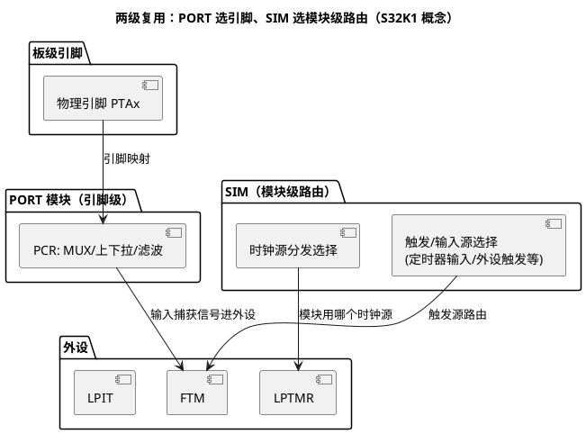

# SIM 复用配置：芯片级路由器

> 一句话定位：SIM（System Integration Module，系统集成模块）在"模块级"做信号路由——外设时钟源分发、触发/输入源选择都归它；而 PORT 模块管"引脚级"复用——谁懂分工，谁就不会在错误的寄存器里找配置项。
> 等级：L1→L2 ｜ 前置：[01-SCG与PCC](01-SCG与PCC.md)

## 原理

### SIM 与 PORT 的分工：两级复用

S32K1 上"复用（Multiplexing）"这个词出现在两个层面，职责完全不同：

| 层面 | 模块 | 管什么 | 典型配置 |
|---|---|---|---|
| 引脚级 | PORT（每引脚 PCR 寄存器） | 物理引脚接到哪个外设功能（MUX 位）、上下拉、滤波 | "PTA3 这个脚当 LPUART0_RX" |
| 模块级 | SIM（SOPT/SCGC 类系统选项寄存器） | 外设模块用哪个时钟源/哪个触发输入/哪路信号进哪个外设 | "LPTMR 的时钟源选哪路""定时器触发输入选哪个" |

一句话记忆：**PORT 决定"信号从哪个脚进来"，SIM 决定"信号/时钟送到哪个模块、模块用哪路源"**。配置工具（S32 Config Tools 的 Pins 视图）替你写 PORT，但 SIM 侧的模块级选择常散在时钟/外设配置里——理解边界才找得到配置项。

### SIM 的典型职责（S32K1，具体位查 RM SIM 章节）

- 外设时钟源分发：部分外设的功能时钟源选择经 SIM 系统选项完成（与 PCC 的 PCS 分工以 RM 为准，两者都出现时按"模块查 RM"核对，历史版本演进过）；
- 触发/输入源路由：定时器类外设的触发输入选择、外部信号进内部模块的路由（选项表查 RM SIM 章节）；
- 出厂/系统级配置杂项：一些系统行为选项寄存器归 SIM 管（看门狗窗口、调试选项等，逐项查 RM）。

### LPIT/LPTMR 时钟源选择的坑（高频）

- **LPTMR**：时钟源选择位在 LPTMR 自身（PSR 寄存器的 PCS 字段，查 RM），候选源包括内部 RC 类与预分频输出——如果选了"没使能的分频输出"或"分频值为 0 的档"，LPTMR 直接不计数，且没有任何报错；
- **LPIT**：功能时钟依赖 PCC 的门控与源选择配置（查 RM PCC 章节），时钟没到位时寄存器写不进/计数不跑；
- 坑的共性：**定时器"不计数"先查时钟源链路**（源使能了吗→分频输出开了吗→门控开了吗→源选择指向了吗），四环少一个都是"无声失败"；具体寄存器归属（LPTMR 自身/SIM/PCC）按 RM 核对，别凭记忆。

### K3 与 TC377：SIM 的"消亡"

- **S32K3 没有传统 SIM**：模块级触发路由交给 TRGMUX（触发多路复用器）、引脚交给 SIUL2，时钟门控仍在 PCC 体系——SIM 的职责被拆分重组（见 [01-内核与资源对比](../S32K1与S32K3对比/01-内核与资源对比.md)）；
- **TC377 也没有 SIM 对应物**：触发路由分散在 GTM（定时器触发网）、ERU（外部事件路由）与各模块自身配置里；从 TC377 转 S32K1 的工程师容易低估 SIM 这层"中间路由"，因为 AURIX 上这类选择大多在模块自己或 GTM 里完成；
- 迁移视角：跨平台搬配置时，"这个源选择在哪个模块寄存器里"没有统一答案——S32K1 部分在 SIM、部分在 PCC、部分在模块自身；K3 在 TRGMUX/PCC；TC377 在 GTM/ERU/模块——**只能按各自 RM 的信号路由章节逐项映射**。

## 寄存器与位表

> 位号/选项表查 RM SIM 章节；K1 关注点：

| 关注对象 | 作用 | 使用要点 | 权威出处 |
|---|---|---|---|
| SIM_SOPT 类系统选项寄存器 | 时钟源分发/触发输入/系统行为选择 | 每个 SOPT 管一组杂项，按 RM 索引 | RM SIM 章节 |
| 触发输入选择字段 | 定时器/外设触发源路由 | 选项表查 RM，与 PORT 引脚选择配合 | RM SIM 章节 |
| LPTMR_PSR：PCS | LPTMR 时钟源选择 | 候选源必须先使能 | RM LPTMR 章节 |
| LPIT 时钟配置（PCC 侧） | LPIT 功能时钟门控与源 | 门控+源两级核对 | RM PCC 章节 |
| PORT_PCRn：MUX | 引脚功能复用 | 引脚级，与 SIM 分工勿混淆 | RM PORT 章节 |

## 双平台对照（S32K1 vs TC377）

| 维度 | S32K1（SIM+PORT） | TC377 |
|---|---|---|
| 模块级路由 | SIM（时钟分发/触发选择） | 无集中模块；GTM/ERU/模块自身 |
| 引脚级复用 | PORT 的 MUX 位 | IO 端口模块（IOCR 等） |
| 触发交换 | SIM 选择+FTM/PDB 链 | GTM 触发网+ERU |
| K3 演进 | TRGMUX+SIUL2 接替 | —（对照基线） |
| 配置入口 | S32CT Pins/时钟工具+手配 SOPT | iLLD/EB tresos 按模块配置 |

## 代码/实操

- SDK（K1）：PORT 部分由 Pins 工具生成 `pin_mux.c`；SIM 侧选项散落在时钟/外设配置生成物中（文件名以生成器为准）——评审时重点核对触发源与时钟源选择项；
- AUTOSAR 工程：引脚复用收口到 Port 模块、时钟到 Mcu（见 [Port与Dio](../../../../04-MCAL与外设驱动/1-L1基础/Port与Dio/README.md) 与 [Mcu模块](../../../../04-MCAL与外设驱动/2-L2进阶/Mcu模块/README.md)）；SIM 杂项里与 Port/Mcu 无关的系统行为选项，由集成方在底层初始化补齐；
- 排障思路：信号没到外设→先查 PORT 的 MUX（脚对不对）→再查 SIM 的路由（源选对没）→最后查外设自身（极性/滤波/使能）；定时器不跑→按"源使能→分频→门控→PCS/源选择"四环查（见 [01-SCG与PCC](01-SCG与PCC.md)）。

## 易错点与陷阱

1. **在 PORT 里找"时钟源选择"、在 SIM 里找"引脚上下拉"**：两级职责混了，配置项根本不在那里——先分层再查 RM；
2. **LPTMR 选了未使能的源**：不计数、无报错，四环链路逐环排查（源→分频→门控→选择）；
3. **触发链路只配了一半**：PORT 让信号进了引脚，SIM 没把该信号路由到目标外设——信号"到了门口没进屋"；
4. **以为 SIM 配置工具全覆盖**：Pins 工具管 PORT，SIM 部分系统选项可能要手写寄存器，遗漏项评审时靠信号流清单兜底；
5. **跨平台凭记忆配路由**：S32K1/K3/TC377 的"源选择在哪个模块"完全不同，必须按各自 RM 重查；
6. **K1 工程直接照抄 K3 的 TRGMUX 思路**（或反之）：K1 没有 TRGMUX，K3 没有 SIM，路由模型代际不同，只能按平台重新设计。

## 面试高频题

1. **S32K1 上 SIM 和 PORT 的区别？**
   答：PORT 管引脚级复用（物理脚↔外设功能、上下拉），SIM 管模块级路由（时钟源分发、触发/输入源选择）。两级配合才完成一条信号链路。

2. **一个输入捕获信号没进 FTM，你怎么排查？**
   答：三步：查 PORT 的 MUX（引脚映射对不对）→ 查 SIM 的路由（该输入源有没有选到 FTM）→ 查 FTM 自身（通道极性/滤波/使能）。跨层排查比盯着外设寄存器快。

3. **LPTMR 不计数，可能的原因？**
   答：时钟链路四环：源没使能、分频输出没开、门控没开、PCS 源选择指向了空档。LPTMR 的 PCS 在自身 PSR 寄存器（查 RM），这类"无声失败"只能逐环查。

4. **TC377 上为什么找不到 SIM？**
   答：AURIX 没有集中式系统集成模块，时钟在 CCU 体系、触发在 GTM/ERU、复用在 IO 模块，职责被分散到各功能单元；S32K1 的 SIM 是 Kinetis 血统的集中式路由遗产，K3 也已用 TRGMUX/SIUL2 把它拆掉。

5. **从 TC377 迁移到 S32K1，复用配置的思路差异？**
   答：TC377 按模块分散配置；S32K1 要多考虑 SIM 这层中间路由——引脚对了信号不一定到模块。迁移时做一张"信号→引脚→SIM 路由→模块"的链路表逐项核对。

## 延伸

- [01-SCG与PCC.md](01-SCG与PCC.md)：时钟的产生与门控，与 SIM 路由配套理解；
- [01-内核与资源对比](../S32K1与S32K3对比/01-内核与资源对比.md)：K3 上 SIM 的接替者 TRGMUX/SIUL2；
- [Port与Dio](../../../../04-MCAL与外设驱动/1-L1基础/Port与Dio/README.md)：MCAL 对引脚复用的封装；
- [GTM](../../../2-L2进阶/TC377平台/GTM/README.md)：TC377 触发路由的对照物；
- [S32K平台](../README.md) / [02-芯片与体系结构](../../README.md)。
