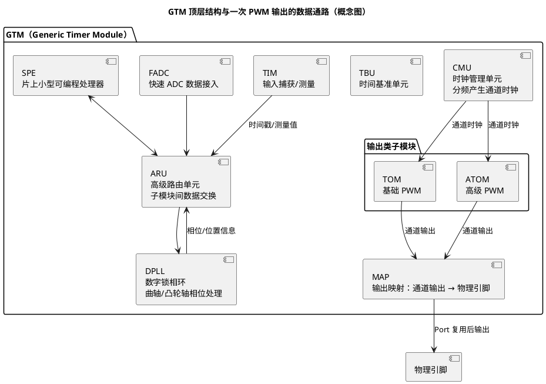

# GTM 架构概览

> 一句话：GTM（Generic Timer Module，通用定时器模块）是 TC377 内部的"定时器矩阵"IP，把时钟生成、时间基准、PWM 输出、输入捕获、数据路由做成一组可自由拼接的积木——在 EB tresos 里配的每一个 MCAL Pwm 通道，硬件本体最终都落在这里。
> 等级：L3 ｜ 前置：[01-CCU与时钟树](../时钟系统/01-CCU与时钟树.md)

## 太长不看

- **人话直觉**：GTM 是"定时器乐高城市"：CMU 供时钟、TOM/ATOM 是输出工位、ARU 是传送带。
- **本篇解决**：GTM 为什么这么复杂？几十路 PWM 的"同频同相、运行中改参数、输入输出联动"靠哪几个积木拼出来？
- **赶时间记住 3 条**：
  1. 框图 = CMU 时钟 → TOM/ATOM 出波形，输出再经 MAP 映射到引脚；
  2. 影子寄存器保证运行中改占空比无毛刺；
  3. MCS/ARU 是高级数据流，入门先跳过。

## 原理

### 为什么需要 GTM

传统定时器（FTM、CCU6 一类）的思路是"一个模块一个固定计数器，通道围着计数器转"，适合几路相互独立的 PWM。但发动机喷油/点火、电机逆变器控制要求的是：

- 几十路 PWM，**同频、相位关系可控**（如三相六桥臂互补输出）；
- 周期/占空比运行中安全更新（不能改一半出现毛刺，需要影子寄存器机制）；
- 与曲轴/凸轮轴等输入信号**锁相联动**（点火提前角随转速动态计算）；
- 波形形态复杂：单次脉冲、可变序列、多路之间有因果时序。

GTM 的答案是：把"定时器"拆成解耦的子模块矩阵，用**路由**而不是固定连线组合出这些能力。它是 TC377 上最复杂的外设 IP，没有之一。

### 顶层结构（一次 PWM 输出的数据通路）

配置一路输出 PWM，硬件上经过四个环节：

1. **CMU（Clock Management Unit，时钟管理单元）**：从 GTM 输入时钟分频出多路"通道时钟"（固定时钟组 + 全局时钟组），供各子模块选用；
2. **TOM / ATOM**：通道内"计数 + 比较"生成方波（详见本目录 [02-TOM与ATOM](02-TOM与ATOM.md)）；
3. **输出映射（MAP）**：把某个子模块通道的输出接到指定的 GTM 输出引脚——通道与引脚不是一一固定的，映射关系查 UM 与 datasheet；
4. **引脚**：经 Port 复用，波形最终出现在物理引脚上。

输入侧的 **TIM（Timer Input Module，定时器输入模块）** 负责捕获/测量（周期、占空比、时间戳），测量结果送入 **ARU（Advanced Routing Unit，高级路由单元）**——GTM 内部子模块之间的数据交换总线。有了 ARU，"TIM 测曲轴 → DPLL（Digital Phase Locked Loop，数字锁相环）算相位 → ATOM 改输出"才能闭成环，全程不经过 CPU。



### ARU 是什么概念

ARU 可以理解为 GTM 内部的"片上高速数据总线"：每个参与路由的子模块占用若干读/写端口，按地址流式收发数据（时间戳、比较值、状态字）。它解释了 GTM 为什么叫"矩阵"：TIM、DPLL、FADC、SPE、ATOM 之间不是点对点连线，而是都挂在 ARU 上按需取数。**端口数量、带宽、地址分配查 UM GTM 章节**，应用层记"ARU = 子模块间数据交换总线"即可。

### 配置一个 PWM 的心智模型

记住五步，顺序不能乱——**通道 → 子模块 → 时钟源 → 输出映射 → 引脚**：

| 步骤 | 回答的问题 | 典型出错方式 |
|---|---|---|
| 1 通道 | 用哪个 TOM/ATOM 的哪个通道？ | 通道已被 MCAL Pwm/Icu 占用却重复分配 |
| 2 子模块 | TOM 还是 ATOM？时钟选择哪个全局计数器？ | 需要高级特性却选了 TOM |
| 3 时钟源 | CMU 哪路时钟、分频多少、周期分辨率够吗？ | 时钟没使能，输出恒为空闲电平 |
| 4 输出映射 | 该通道输出是否使能并路由到目标引脚？ | 通道在翻转、引脚却没波形（映射没开） |
| 5 引脚 | Port 复用是否配成 GTM 输出？ | 被 Port MCAL 或手写 Port 初始化覆盖 |

MCAL Pwm 配置界面里的"通道选择"，本质就是在替你回答第 1、2 步；第 3~5 步藏在驱动内部，但排查问题时必须自己走一遍。

## 寄存器与位表

GTM 是数一数二大的外设，寄存器数量以千计，**具体位号/通道数/参数一律查 UM 的 GTM 章节**。先建立子模块速览表：

| 缩写 | 全称 | 职责（概念级） |
|---|---|---|
| CMU | Clock Management Unit | 分频产生固定/全局通道时钟 |
| TBU | Time Base Unit | 提供全局时间基准（供 TIM/DPLL 等打时间戳） |
| TOM | Timer Output Module | 基础 PWM 输出通道组 |
| ATOM | Advanced Timer Output Module | 增强型输出（影子更新更灵活、可接 ARU） |
| TIM | Timer Input Module | 输入捕获：测周期/占空比/脉冲/时间戳 |
| ARU | Advanced Routing Unit | 子模块间数据交换总线 |
| DPLL | Digital Phase Locked Loop | 对输入信号锁相/倍频，算相位与位置 |
| FADC | Fast Analog-to-Digital Converter 接口 | 快速接入 ADC 数据进 GTM 处理链 |
| SPE | Scalar Processor Engine | GTM 内部小型可编程处理器 |
| MAP | （输出映射） | 子模块通道输出 → GTM 输出引脚的路由 |
| MON | （监控子模块） | 对输出/死区等做监控（安全相关） |
| BRC | Broadcast | 向多个目的地广播数据（挂 ARU） |

关键控制概念（位定义查 UM GTM 章节）：

| 控制点 | 作用 | 备注 |
|---|---|---|
| GTM 全局使能/时钟 | GTM 总开关 | 不开则一切子模块无声 |
| CMU 时钟使能 | 每路通道时钟单独使能 | 忘使能是"无输出"第一原因 |
| TGC 通道使能（ENDIS 类） | 通道计数器启停 | 通道级开关 |
| 输出使能（OUTEN 类） | 通道输出是否连到映射 | 通道在计数但引脚无声的元凶 |
| 通道比较值（含影子） | 决定周期与占空比 | 影子机制保证无毛刺更新 |
| SRC 中断节点 | GTM 到 CPU 的服务请求 | 通知/异常走这里，优先级查 UM |

## 双平台对照

GTM 与 S32K 的 eMIOS（Enhanced Modular Input Output Subsystem）/FTM（FlexTimer）不是同一量级的东西：

| 概念 | TC377 GTM | S32K eMIOS | S32K FTM |
|---|---|---|---|
| 定位 | "定时器小系统"（自带 CPU、PLL、ADC 接口） | 增强型通用定时器 | 传统定时器 |
| PWM 生成单元 | TOM/ATOM 通道 | 统一通道 UC | FTM 通道 |
| 共享时基 | 通道对全局计数器 + CMU 全局时钟 | counter bus A/B/C/D | 每模块一个计数器 |
| 数据路由 | ARU（子模块间流式互联） | 无等价物 | 无 |
| 复杂波形 | ATOM + DPLL/SPE 组合 | 依赖输出模式组合 | 互补+死区等组合模式 |
| 学习曲线 | 陡（子模块多、间接层次多） | 中 | 缓 |
| 典型用途 | 发动机/电机/多路精确同步 PWM | 电机/通用 PWM/输入 | 通用 PWM/输入捕获 |

从 S32K 迁过来的心智转变：**FTM/eMIOS 是"配一个外设"，GTM 是"在一个小系统里规划资源"**——先规划时钟和通道分配，再谈波形参数。

## 代码/实操

iLLD（Infineon Low Level Driver，英飞凌底层驱动库）里以 GTM TOM PWM 为例，五步心智模型对应的调用概念（**接口签名以 `IfxGtm_Tom_Pwm.h` 等头文件为准**）：

```c
/* 概念示例：展示风格与步骤，非可直接编译代码 */
IfxGtm_enable(&MODULE_GTM);                    /* 0. GTM 总开关 */
/* 1/3. 模块级初始化：内部含 CMU 时钟配置（以 IfxGtm/IfxGtm_Cmu.h 为准） */
IfxGtm_Tom_Pwm_initModule(&gtmDriver, &moduleCfg);

/* 2. 通道级配置：TOM x 通道 y、周期/占空、极性、引脚 */
IfxGtm_Tom_Pwm_Config chCfg;
IfxGtm_Tom_Pwm_initConfig(&chCfg, ...);        /* 填默认值再覆盖 */
chCfg.tom      = IfxGtm_Tom_0;                 /* 成员名以头文件为准 */
chCfg.channel  = IfxGtm_Tom_Ch_0;
/* 4. 通道输出使能与引脚映射在 initChannel/initChannelPin 内部完成 */
IfxGtm_Tom_Pwm_initChannel(&chDriver, &chCfg); /* 生成驱动句柄 */

/* 5. 引脚复用由 initChannelPin 一类接口完成，或由 Port/iLLD Port 配置 */
IfxGtm_Tom_Pwm_setDutyCycle(&chDriver, duty);  /* 运行中改占空比 */
```

在 EB tresos + MCAL 环境里，上述全部动作由英飞凌 Pwm 驱动代替完成，你配置的是逻辑通道——两者如何对应见 [03-与MCAL-Pwm的关系](03-与MCAL-Pwm的关系.md)。

## 易错点与陷阱

- **GTM 总开关/时钟没开**：所有子模块无声，先查这个再查通道。
- **只配通道不配 CMU 时钟**，或时钟使能位没置：计数器不走，输出恒为空闲电平。
- **通道使能了、输出使能没开**：内部在翻转、引脚上永远安静——"通道在数、引脚不响"是最迷惑的状态。
- **通道号 ≠ 引脚号**：TOM 通道与物理引脚之间隔着一层映射，映射表查 UM/datasheet，别按引脚名猜通道。
- **MCAL 与手写 iLLD 双方都碰 GTM**：一方初始化把另一方的通道/时钟冲掉，详见 [03-与MCAL-Pwm的关系](03-与MCAL-Pwm的关系.md)。
- 把 GTM 当 FTM 用，只记"通道+周期+占空"三件事，遇到 Icu 共享冲突/复杂波形就卡壳——缺的是资源规划视角。

## 面试高频题

1. **GTM 是什么？为什么 AURIX 要搞这么个模块？**
   答：通用定时器矩阵 IP。为了发动机/电机控制需要的大量精确同步 PWM、输入锁相联动和复杂波形，把时钟（CMU）、输出（TOM/ATOM）、输入（TIM）、路由（ARU）解耦成矩阵，用路由组合能力而不是固定连线。
2. **配置一路 GTM PWM 要经过哪几步？**
   答：选通道 → 选子模块与时钟源（CMU/全局计数器）→ 输出映射 → 引脚复用；外加总开关与各级使能。
3. **ARU 的作用？**
   答：GTM 内部子模块间的数据交换总线，TIM/DPLL/FADC/SPE/ATOM 之间通过它流动时间戳与比较值，形成不经 CPU 的闭环。
4. **TOM 和 ATOM 的区别？（一句话版）**
   答：TOM 是基础 PWM 通道；ATOM 是增强版，影子更新更灵活、可接 ARU 数据流，适合复杂波形（详见本目录 02 篇）。
5. **GTM 与 FTM 类定时器的本质区别？**
   答：FTM 是单个外设，GTM 是带路由和小处理器的"定时器子系统"；前者配参数，后者先做资源规划。
6. **为什么你配了 MCAL Pwm 却没输出，要从 GTM 查起？**
   答：MCAL Pwm 只是标准接口层，硬件本体是 GTM 通道/时钟/映射/引脚，任何一环断链都会无输出（排查决策树见 03 篇）。

## 延伸

- [TOM与ATOM](02-TOM与ATOM.md)：PWM 生成引擎的内部结构
- [与MCAL-Pwm的关系](03-与MCAL-Pwm的关系.md)：EB tresos 配置如何落到 GTM
- [TC377平台](../README.md) | [时钟系统](../时钟系统/README.md) | [中断系统](../中断系统/README.md)
- [MCAL 总览](../../../../04-MCAL与外设驱动/1-L1基础/MCAL总览/README.md) | [MCAL Pwm](../../../../04-MCAL与外设驱动/2-L2进阶/Pwm/README.md)
- [图表规范与模板](../../../../00-总览/图表规范与模板.md)
- 工程深入场景：量产项目里"MCAL Pwm 配置全过、引脚却无波形"，集成阶段就要沿"GTM 使能 → CMU 时钟 → 通道/输出使能 → 输出映射 → Port 复用"这条链路逐级确认——本篇的五步模型就是排查时的检查单。
