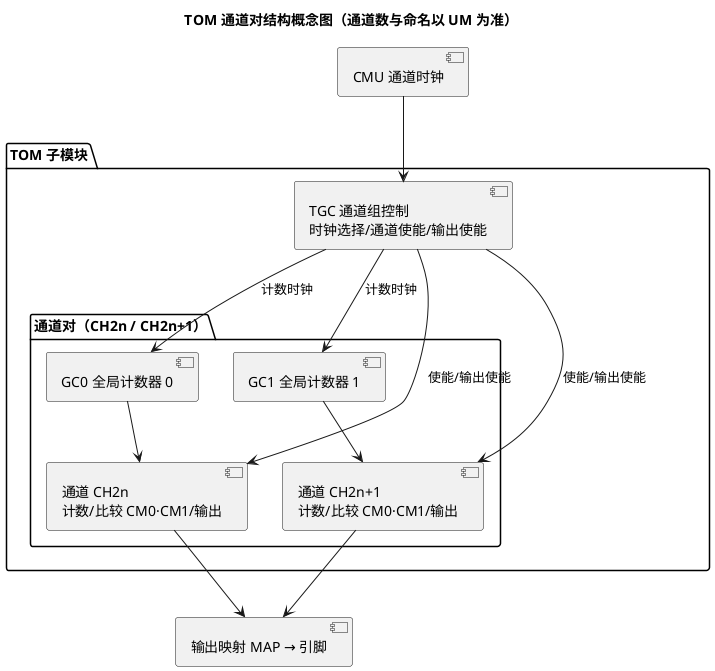

# TOM 与 ATOM：GTM 的 PWM 输出引擎

> 一句话：TOM（Timer Output Module，定时器输出模块）用"通道对共享计数器 + 两个比较值"产生基础 PWM，ATOM（Advanced TOM）在此之上加灵活的影子更新与 ARU 数据流联动等高级能力，用于复杂波形；互补 PWM 的死区概念也在这层落地。
> 等级：L3 ｜ 前置：[01-GTM架构概览](01-GTM架构概览.md)

## 太长不看

- **人话直觉**：TOM 是基础工位、ATOM 是升级款——带故障安全的死区/急停，桥臂驱动用 ATOM。
- **本篇解决**：一路 PWM 在 TOM/ATOM 里怎么生成？互补输出为什么必须配死区？
- **赶时间记住 3 条**：
  1. 通道 = 计数器 + 比较器，周期/占空比就是两个比较值；
  2. 互补输出必须配死区，直通 = 炸管；
  3. ATOM 的使能/急停链路是安全相关。

## 原理

### TOM 的结构：通道对 + 全局计数器

TOM 内部由若干**通道对**组成（每对两个通道），通道对共享两个**全局计数器 GC0/GC1**；每个通道内部有自己的计数路径与**两个 16 位比较值寄存器**。比较匹配事件驱动输出翻转，这就是 TOM PWM 的全部原理。

- 全局计数器（GC0/GC1）：通道对级共享，好处是**同一对内两个通道天然同频同相**，做多路同步 PWM 不需要软件对齐；
- 通道计数器：可跟随全局计数器，也可按自身时钟独立计数（时钟来源与选择方式查 UM GTM 章节）；
- 比较值：本笔记记作 CM0/CM1（AURIX 实际 SFR 命名与位定义以 UM 为准）。常用一路定**周期**（计数到此清零），另一路定**占空比翻转点**。



### PWM 生成原理（文字图 + 波形）

计数器从 0 数到"周期比较值"清零，循环往复（锯齿波）；当计数等于"占空比较值"时输出翻转。占空比 ≈ 翻转点 / 周期值。

```
计数:  0 ──→ CM0(周期) 清零 ──→ 0 ──→ CM0 清零 ──→ …   （锯齿循环）
输出:  ──────┐
              └──────────────────────┐                      （在 CM1 匹配点翻转）
                                      └──── …
       （极性/置位复位方向以 UM 为准，示意：高电平起始）
```

```wavedrom
{signal: [
  {name: '通道计数器', wave: 'rrrr'},
  {name: 'PWM 输出', wave: '1.0.....'}
], head: {text: 'TOM 边沿对齐 PWM 示意（锯齿每格一格，匹配点翻转，占空比≈CM1/CM0）', tick: -1}}
```

### 死区为什么必须

电机 H 桥同一桥臂的上下管（如 Q1/Q4）**绝不允许同时导通**：上下管直通等于把电源正负极短接，瞬间大电流"炸管"。而功率管的关断存在存储时间/驱动延时，理想互补的两路 PWM 在翻转瞬间会出现两管同时半开的窗口。解决办法是**死区（Dead Time）**：两路输出都强制关断一小段时间，让先关的管子彻底关断，再开对管。

```wavedrom
{signal: [
  {name: '上管 Q1', wave: '1.0.......1'},
  {name: '下管 Q4', wave: '0...1...0.1'}
], head: {text: '互补输出与死区（示意：每个切换沿前后的"都关断"窗口）', tick: -1}}
```

在 GTM 里生成互补死区的常见做法：同对/相邻通道错开比较值软件构造死区，或使用输出级/监控（MON 类）子模块做死区窗口监控；**硬件死区机制的准确实现以 UM GTM 章节为准**（另注：AURIX 的 CCU6 外设内建互补死区生成，电机控制也存在"CCU6 路线"）。

### ATOM 的增量能力（概念）

ATOM = Advanced TOM，通道结构与 TOM 相似，增量在于：

- **更灵活的影子/更新控制**：新比较值何时生效（立即/下周期/事件触发）可控得更细，动态调占空比时不毛刺；
- **可与 ARU 数据流联动**：比较值可来自 DPLL/SPE 等 ARU 源的计算结果，适合"随曲轴相位变化的喷油/点火曲线"这类复杂波形；
- **输出模式更丰富**：电平类/单次类输出形态，覆盖非周期波形；
- **故障/安全侧能力**：与监控类子模块配合的异常处理路径（具体能力以 UM 为准）。

一句话总结选择：**常规周期性 PWM 用 TOM；要 ARU 联动、精细更新策略或复杂波形，上 ATOM**。

### TIM 一句话

TIM（Timer Input Module）是 GTM 输入侧的捕获模块：测周期/占空比/脉冲宽/打时间戳，结果进 ARU 供 DPLL 等消费——它是"Icu（Input Capture Unit）输入捕获"在 GTM 里的硬件本体，细节查 UM。

## 寄存器与位表

通道级寄存器**位号与命名一律查 UM GTM 章节**，这里只建概念索引：

| 寄存器概念 | 所属层级 | 作用 | 备查 |
|---|---|---|---|
| 全局控制（TGC 类） | 通道组 | 时钟源选择、通道使能（ENDIS 类）、输出使能（OUTEN 类） | UM |
| GC0/GC1 全局计数器 | 通道对 | 共享计数基准，同对通道同步的关键 | UM |
| 通道计数器 | 通道 | 实际参与比较的计数值 | UM |
| 比较值寄存器（本笔记 CM0/CM1 记法） | 通道 | 周期与占空比翻转点；带影子传输 | UM |
| 影子寄存器 | 通道 | 暂存新参数，边界时刻统一生效，防毛刺 | UM |
| 状态/中断寄存器 | 通道 | 匹配/溢出事件标志，经 SRC 节点申请中断 | UM |
| ATOM 附加控制 | 通道 | 更新策略选择、ARU 数据源选择 | UM |

比较值使用要点（方向/极性以 UM 与驱动实现为准）：

| 要点 | 说明 |
|---|---|
| 周期值 = 0 或占空值 ≥ 周期值 | 输出异常/恒定电平，配置期就要校验 |
| 分辨率与 CMU 时钟联动 | 时钟越快分辨率越高、可表达周期越短；先定时钟再算比较值 |
| 更新策略 | 运行中改占空比必须走影子/边界更新，直接改生效值会出毛刺 |

## 双平台对照

| 能力 | TC377 TOM | TC377 ATOM | S32K eMIOS | S32K FTM |
|---|---|---|---|---|
| 基础周期 PWM | ✔ | ✔ | ✔（OPWM 等模式） | ✔ |
| 同频同步 | 通道对全局计数器 | 同左 | counter bus 共享时基 | 模内计数器天然同步 |
| 影子/双缓冲 | 基础 | 更灵活 | 有 | 有（LOADOK 类机制） |
| 与输入锁相联动 | 无 | 经 ARU（DPLL 等） | 无 | 无 |
| 死区 | 软件错开/查 UM | 同左/监控配合 | MCB 类模式可带死区（查 RM） | 组合模式硬件互补+死区 |
| 典型用途 | 通用 PWM | 复杂波形/发动机 | 电机/通用 | 电机/通用 |

从 S32K 迁移直觉：FTM 的"互补+硬件死区"组合模式，在 GTM 世界要换成"通道对 + 错开比较值（或走 CCU6/监控配合）"的思路，别找"一键互补死区"的寄存器。

## 代码/实操

iLLD 概念示例（**签名以 `IfxGtm_Tom_Pwm.h` / `IfxGtm_Atom_Pwm.h` 为准**）：

```c
/* TOM：常规周期 PWM */
IfxGtm_Tom_Pwm_Config cfg;
IfxGtm_Tom_Pwm_initConfig(&cfg, ...);      /* 默认值 */
cfg.tom     = IfxGtm_Tom_0;                /* 选 TOM */
cfg.channel = IfxGtm_Tom_Ch_2;             /* 选通道（成员名以头文件为准） */
/* 周期/占空：以 ticks 或频率接口设置，本质写比较值 */
IfxGtm_Tom_Pwm_initChannel(&drv, &cfg);
IfxGtm_Tom_Pwm_setDutyCycle(&drv, duty);   /* 运行时更新（内部走影子） */

/* ATOM：需要复杂波形/精细更新时替换为 IfxGtm_Atom_Pwm_* 系列 */
```

两件事必须自查：①初始化时把引脚/输出映射一并配好（initChannelPin 类接口或 Port 配置）；②互补死区若用软件错开法，改占空比时**两路比较值要原子地一起更新**，否则中途一个先生效会瞬时直通。

## 易错点与陷阱

- **通道使能了、输出使能（OUTEN 类）没开**：内部翻转、引脚无声——TOM 排查第一嫌疑。
- 时钟选择跟错了全局计数器：同对不同相，或者周期与预期差一档——画清"通道→计数器→CMU 时钟"链路再配。
- 比较值边界：周期值为 0、占空值 ≥ 周期值、分辨率不够把占空比量化成台阶——配置期校验。
- 运行中直接改生效比较值而不是走影子：波形上出现毛刺/窄脉冲。
- 软件死区两路更新不原子：瞬时直通风险（这是"偶尔炸管"的经典原因）。
- 死区时间算错：只按软件延时算，漏掉驱动器延时与功率管开关特性，实际死区不足。
- 忘了 TOM/ATOM 输出极性与空闲（Idle）电平配置：波形"反相"或初始化瞬间引脚跳变。
- 与 MCAL Pwm/Icu 争通道：EB tresos 里逻辑通道背后是同一个物理通道，冲突要在配置期发现（见 [03-与MCAL-Pwm的关系](03-与MCAL-Pwm的关系.md)）。

## 面试高频题

1. **TOM 怎么生成一路 PWM？**
   答：通道计数器按选定时钟计数；两个比较值一个定周期（计数到即清零）、一个定占空翻转点；比较匹配驱动输出电平翻转，周期性循环即得方波。
2. **通道对与全局计数器 GC0/GC1 的意义？**
   答：同对两通道共享计数基准，天然同频同相，适合需要同步关系的多路 PWM；通道也可退化为独立计数。
3. **TOM 与 ATOM 怎么选？**
   答：常规周期 PWM 用 TOM；需要 ARU 数据流联动（如随曲轴相位变的波形）、更细的影子更新策略、更丰富输出模式时用 ATOM。
4. **为什么需要死区？死区时间怎么估？**
   答：防 H 桥同桥臂上下管直通短路；要覆盖功率管关断存储时间、驱动器延时并留裕量，按器件手册最坏情况取值。
5. **运行中改占空比为什么要走影子寄存器？**
   答：新值先写影子、在周期边界统一生效，避免生效值被改一半导致毛刺脉冲或窄脉冲。
6. **GTM 里做输入捕获的是谁？**
   答：TIM 子模块，测周期/占空比/时间戳并送 ARU；对应 AUTOSAR MCAL 的 Icu 模块底层。

## 延伸

- [GTM架构概览](01-GTM架构概览.md)：CMU/ARU/MAP 全景
- [与MCAL-Pwm的关系](03-与MCAL-Pwm的关系.md)：通道分配与"不输出"排查
- [MCAL Pwm](../../../../04-MCAL与外设驱动/2-L2进阶/Pwm/README.md) | [Gpt与Icu](../../../../04-MCAL与外设驱动/2-L2进阶/Gpt与Icu/README.md)
- [TC377平台](../README.md) | [图表规范与模板](../../../../00-总览/图表规范与模板.md)
- 工程深入场景：电机 H 桥驱动"偶发炸管"的经典根因就在本篇——软件死区的两路比较值没有原子更新，中途一路先生效造成上下管瞬时直通；做逆变器/电机 CDD 时这条要进代码评审清单。
