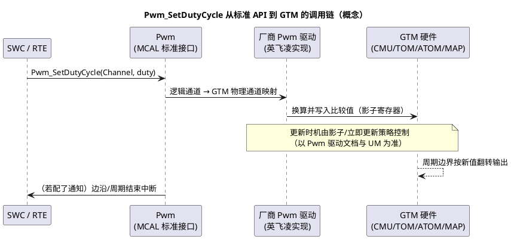
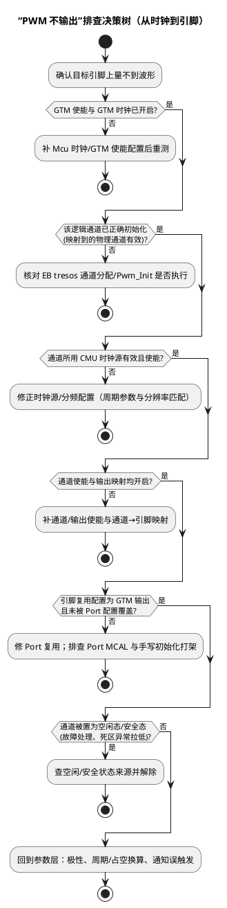

# 与 MCAL Pwm 的关系：从 EB tresos 到 GTM 硬件

> 一句话：EB tresos 里配的每个 Pwm 通道，最终由英飞凌 MCAL Pwm 驱动落到某个 GTM TOM/ATOM 通道 + CMU 时钟 + 输出映射 + 引脚复用上；看懂这条落点链路，"配置没报错但不出波形"才有得排查。
> 等级：L3 ｜ 前置：[02-TOM与ATOM](02-TOM与ATOM.md)、[02-iLLD与MCAL的关系](../资源与iLLD/02-iLLD与MCAL的关系.md)

## 太长不看

- **人话直觉**：MCAL Pwm 是遥控器，GTM 是电视机——EB 配置最终变成 GTM 寄存器。
- **本篇解决**：EB tresos 里的一个 Pwm 通道，经过哪条链路落到 GTM 哪个寄存器？不出波形按什么顺序查？
- **赶时间记住 3 条**：
  1. 通道号 → TOM/ATOM 的映射在配置工具里定，不是引脚固定的；
  2. 影子更新 = 占空比无缝切换；
  3. 无波形先查时钟树，再查通道映射。

## 原理

### 调用链：标准 API 到硬件

AUTOSAR MCAL 的 Pwm 模块只规定**标准接口**（`Pwm_Init`、`Pwm_SetDutyCycle`、`Pwm_SetPeriod`、`Pwm_SetOutputToIdle` 等）与配置语义（通道、周期、极性、空闲态、通知）。芯片相关的"怎么落到硬件"由供应商驱动实现。在 TC377 上，这个实现的目标就是 GTM：



### 配置项如何落到 GTM

- **通道分配**：EB tresos 里的 PwmChannel 背后是"某个 TOM/ATOM 的某个通道"，由配置/映射表决定（具体分配规则查驱动手册）；
- **时钟与周期**：Pwm 周期参数 + 时钟设置决定 CMU 分频与通道比较值（分辨率受时钟约束）；
- **极性/空闲态**：落到输出模式与空闲电平配置；
- **通知（Notification）**：边沿/周期事件走 GTM 的 SRC 中断节点进入 CPU；
- **Icu 共享冲突**：Icu（Input Capture Unit，输入捕获）在 TC377 上同样消耗 GTM 资源（TIM 类通道）。同一 GTM 通道资源不能既做输出又做捕获，Pwm 与 Icu 的通道分配必须互斥——配置工具会做资源检查（检查粒度以工具与驱动版本为准）。

### MCAL 生成代码与 iLLD 的关系

- EB tresos 生成的是**配置代码**（`Pwm_Cfg.c`/`Pwm_PBcfg.c` 一类）+ 标准接口的静态代码骨架；
- 接口实现来自**英飞凌 MCAL 驱动包**，其内部直接操作底层（与 iLLD 同厂同思路，但不等于"MCAL 调 iLLD"——对应关系以驱动包文档/源码为准）；
- iLLD 是另一条独立路线：不走标准接口，直接驱动硬件，常用于 CDD（Complex Device Driver，复杂设备驱动）与快速原型。两者并存的坑见 [iLLD与MCAL的关系](../资源与iLLD/02-iLLD与MCAL的关系.md)。

### "PWM 不输出"排查决策树

配置能过编译、就是不出波形——按链路从源头往引脚走：



## 寄存器与位表

MCAL 配置语义 → GTM 落点对照（具体 SFR 位定义查 UM GTM 章节，通道分配表查驱动手册）：

| MCAL 配置项 | GTM 侧落点 | 排查抓手 |
|---|---|---|
| PwmChannelId / 通道分配 | 某 TOM/ATOM 物理通道 | 逻辑号≠物理通道号，查映射表 |
| PwmPeriod / 时钟设置 | CMU 分频 + 周期比较值 | 算一遍实际分辨率与周期上限 |
| 极性（高/低有效） | 输出模式/极性控制 | 波形反相先查这里 |
| 空闲状态（Idle State） | 通道强制输出态 | `Pwm_SetOutputToIdle` 验证 |
| 通知（边沿/周期） | 通道事件 → SRC 中断节点 | 中断优先级与 ISR 挂接 |
| Pwm 与 Icu 通道 | 同一 GTM 资源池，互斥分配 | 配置期资源冲突检查 |

`Pwm_SetDutyCycle` 的占空比按 AUTOSAR 规范以 0x8000 表示 100%（16 位表示法，具体以所采用规范的 SWS 定义为准）——换算错误会出现"占空比只有一半"的经典现象。

## 双平台对照

| 维度 | TC377：MCAL Pwm + GTM | S32K：MCAL Pwm + eMIOS/FTM |
|---|---|---|
| 底层外设 | GTM TOM/ATOM（经 CMU/MAP） | eMIOS 统一通道或 FTM |
| 通道分配 | EB tresos 配置，驱动内映射 | EB tresos 配置，驱动内映射 |
| 配置面 | 大：时钟树/映射/资源池 | 小：通道+时基为主 |
| 输入捕获共享 | Icu 同落 GTM（TIM 类资源） | Icu 落 eMIOS/FTM 输入 |
| 无输出排查深度 | 需下探到 CMU/输出映射/引脚复用 | 一般到通道/复用层 |

## 代码/实操

EB tresos 侧的配置次序（概念流程）：

1. **Mcu**：时钟配置（含 GTM 相关时钟/使能）；
2. **Port**：目标引脚复用为 GTM 输出；
3. **Pwm**：General（时钟/分频相关）→ PwmChannel（通道、周期、极性、空闲态、通知）→ PwmChannelClass 归类；
4. 生成代码，集成层在启动序列调用 `Pwm_Init`；运行期用标准接口控制。

```c
/* 概念示例：AUTOSAR 应用侧只看得到标准接口 */
Pwm_Init(&Pwm_Config);                 /* 初始化（EB tresos 生成的配置） */
Pwm_SetDutyCycle(PwmChannel_0, 0x4000U); /* 50% 占空（0x8000=100%） */
Pwm_SetOutputToIdle(PwmChannel_0);     /* 输出回空闲态 */
```

若同一工程里 CDD 又用 iLLD 碰 GTM：**初始化次序与通道/时钟归属要在集成设计里写死**（谁拥有 GTM 全局配置、谁只碰自己的通道），否则相互冲掉。

## 易错点与陷阱

- **逻辑通道号 ≠ GTM 物理通道号**：排查时先查分配表，别按界面序号猜硬件通道。
- Mcu 阶段没把 GTM 时钟/使能配齐：Pwm 配置全对也无输出（决策树第一关）。
- **Pwm 与 Icu 抢同一 GTM 资源**：配置期放过了、运行期一个模块无声——资源冲突检查要跑。
- Port 复用被覆盖：Port MCAL 配置与手写/iLLD 的引脚初始化打架，后者把复用改成 GPIO。
- 空闲态/极性配反：不是"没输出"，是"电平不合预期"，先看空闲态再看周期参数。
- 占空比换算错：0x8000=100% 的 16 位表示法没对齐，导致输出比例不对。
- 通知中断没挂好：波形正常但功能异常（丢边沿、统计错）——查 SRC 优先级与 ISR。
- 在 CDD 里直接改 GTM 寄存器"帮"MCAL 调参数：绕过影子机制，出毛刺甚至直通风险。

## 面试高频题

1. **MCAL Pwm 底层落到哪里？画出链路。**
   答：应用/RTE → Pwm 标准接口 → 英飞凌 Pwm 驱动（逻辑→物理通道映射）→ GTM（CMU 时钟、TOM/ATOM 比较值、输出映射）→ 引脚。
2. **Pwm 和 Icu 为什么可能冲突？**
   答：两者在 TC377 上同用 GTM 资源（输出用 TOM/ATOM，捕获用 TIM 类），通道资源互斥，配置期必须做资源检查。
3. **PWM 不输出，你的排查顺序？**
   答：GTM 使能/时钟 → 通道初始化与映射 → CMU 时钟源 → 通道/输出使能 → 引脚复用与覆盖 → 空闲/安全态，最后回参数层（背本文决策树）。
4. **Pwm_SetDutyCycle 的参数含义？**
   答：AUTOSAR 用 16 位占空表示，0x8000 对应 100%（以所依据 SWS 为准）；驱动内部换算成通道比较值。
5. **EB tresos 生成的代码和 iLLD 是什么关系？**
   答：tresos 生成 MCAL 配置与标准接口集成层；iLLD 是独立厂商底层库。MCAL 驱动实现与 iLLD 同厂同思路但相互独立，共存时要管好资源归属。

## 延伸

- [GTM架构概览](01-GTM架构概览.md) | [TOM与ATOM](02-TOM与ATOM.md)
- [iLLD与MCAL的关系](../资源与iLLD/02-iLLD与MCAL的关系.md)
- [MCAL Pwm](../../../../04-MCAL与外设驱动/2-L2进阶/Pwm/README.md) | [MCAL 总览](../../../../04-MCAL与外设驱动/1-L1基础/MCAL总览/README.md) | [Gpt与Icu](../../../../04-MCAL与外设驱动/2-L2进阶/Gpt与Icu/README.md)
- [TC377平台](../README.md)
- 工程深入场景：SOP 前整机联调"PWM 无输出"是高频事故——按本篇决策树从 Mcu 时钟层一路查到 Port 复用；另外 CDD 用 iLLD 与 MCAL Pwm 共存时，GTM 通道/时钟归属必须在集成设计文档里写死，否则互相冲掉配置。
