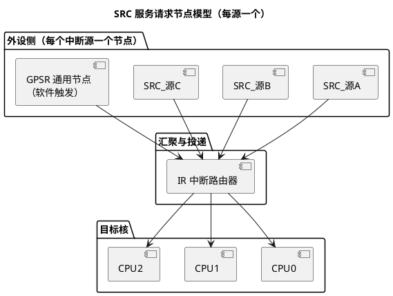

# SRC 模块：每个中断源一个"服务请求节点"

> 一句话定位：AURIX 没有 NVIC 那样的集中式控制器，而是给每个中断源配一个 SRC（服务请求节点）——使能、优先级、目标核、触发方式全在这个源自己的寄存器里定。
> 等级：L2 ｜ 前置：[02-NVIC与中断](../../../1-L1基础/ARM-Cortex-M/02-NVIC与中断.md)、[03-中断初识-从轮询到中断](../../../00-入门导读/03-中断初识-从轮询到中断.md)

## 原理

### 从"集中控制"到"分布节点"

TC3xx 的中断体系把控制器拆散到源侧：每个能发中断的外设（每个通道/组）都有专属的 SRN（Service Request Node，服务请求节点），其配置寄存器习惯上称为该源的 SRC 寄存器（命名与分布查 UM 中断章节）。IR（Interrupt Router，中断路由器）收集所有节点的请求，仲裁后投递给目标核（路由策略见 [02-IR路由与多核分配](02-IR路由与多核分配.md)）。

### 节点里有什么（字段概念）

| 字段（概念名） | 作用 | 说明 |
|---|---|---|
| SRE（Service Request Enable） | 使能该源 | 不使能则请求到不了 IR |
| SRPN（Service Request Priority Number） | 优先级号 | 仲裁用，号大者优先（与 OS 的关系见 03 篇） |
| TOS（Target Output Selection） | 目标核选择 | 该中断发给哪个核（部分源的可选项含 GTM，查 UM） |
| 触发敏感性（SRSS 概念） | 电平/上升沿/下降沿/任意沿 | 电平与边沿的选择见下节 |
| SRR/CLRR | 置位/清除请求标志 | 软件触发与测试入口 |
| IOV（Interrupt Overflow 概念） | 溢出指示 | 边沿型请求未及时处理时的丢失提示 |

> 字段名/位号/复位值一律查 UM 的 SRC 章节；安全相关源可能有额外写保护（解锁要求查对应源说明）。

### 边沿触发 vs 电平触发

- **电平触发**：请求线保持有效期间持续请求。ISR 必须先清外设侧的请求源（读数据、清标志），让电平撤销，否则退出后立刻重入——"中断风暴"多半是它；
- **边沿触发**：捕获信号跳变。适合脉冲型事件；但 ISR 处理期间到来的新跳变只挂起一次，高频场景要评估会不会溢出（看 IOV 类指示）；
- 选择原则：外设给的是状态标志（读即清类）通常配电平；外部引脚事件类通常配边沿。具体每源的推荐配置以 UM/外设章节为准。

### 软件触发：测试与核间通知

- 向某节点的置位位写 1 可软件产生中断：不用等硬件条件就能单测 ISR（挂个断点直接验证进出流程）；
- GPSR（General Purpose Service Request，通用服务请求节点）是"没有外设背景"的纯软件节点：TOS 指到别的核，就是核间通知的基础设施（用法见 02 篇）。

### 一个请求要过几道门

从外设事件到 ISR 执行，要过三层门，排障时按序逐层看：

1. **源级**：SRC 使能位（SRE 概念）不开，请求停在源上——看该源挂起标志是否置位；
2. **路由级**：IR 按 TOS 投递——目标核不对，请求永远到不了你的 ISR（见 02 篇）；
3. **核级**：目标核的使能状态与当前优先级决定何时被接受（见 03 篇）。

三层只查一层就下结论，是中断排障最常见的翻车点。

### ISR 进出的硬件动作（概念）

TriCore 中断开销低的硬件基础：进入中断时由硬件自动保存一份上下文到 CSA（Context Save Area，上下文保存区，链表式管理），同时抬升核内当前优先级；ISR 用专门的中断返回指令恢复上下文。软件不必手写"保存/恢复全部寄存器"的序言尾声（细节查内核架构手册）。工程含义：短 ISR 的进出成本很低，"把工作切成很多小中断"的粒度选择比软件保存方案更自由——但该移交任务的仍然要移交。

## 寄存器与位表

| 关注点 | 位置 | 权威出处 |
|---|---|---|
| 各源 SRC 的地址分布 | 中断章节的源列表 | UM |
| 字段位号与复位值 | SRC 寄存器描述 | UM |
| GPSR 节点清单与命名 | 服务请求节点总表 | UM |
| 每源可选的 TOS 目标 | 源描述中的路由说明 | UM |
| TriCore 侧中断入口（向量表布局、当前优先级机制） | CPU 架构相关章节 | UM/内核架构手册 |

### 软件触发测试五步（不依赖硬件）

1. 查 UM 找到目标源的 SRC 地址与软件置位方式（或选一个空闲 GPSR 节点）；
2. 配好 SRPN/TOS/触发方式，注册 ISR（iLLD 宏或 OS 配置）；
3. 调试器写置位位，断点应停在 ISR 入口；
4. 单步走完"读数据→清源→退出"，确认没有立即重入（电平型重点验证）；
5. 复位源节点挂起标志，确认状态归零，测试环境可复用。

这套流程把"中断链路通不通"和"外设功能对不对"解耦——先证明链路，再调外设，问题域一下子变小。

## 双平台对照（TC377 SRC vs Cortex-M NVIC）

| 维度 | AURIX SRC/IR | Cortex-M NVIC（S32K） |
|---|---|---|
| 组织方式 | 每源一个节点，分布在外设侧 | 集中式 NVIC，统一编号 |
| 优先级 | SRPN 0~255（号大优先） | 可配置位宽（常见 16 级，号小优先，注意方向相反） |
| 目标选择 | TOS 逐源选核（多核原生） | 单核 NVIC 无路由问题（多核器件另配路由机制） |
| 向量获取 | 按优先级（及服务类型）索引入口（布局查 UM） | 向量表按源编号直接取入口 |
| 使能方式 | 源级 SRE + 目标核级控制 | NVIC ISER 逐位或 PRIMASK/BASEPRI 全局屏蔽 |
| 软件触发 | 写 SRR/GPSR | NVIC 软件触发中断寄存器（STIR，若实现） |

## 代码/实操

- iLLD 侧：ISR 用宏注册到指定优先级（`IFX_INTERRUPT` 风格，把函数放进对应核的中断向量段；宏形态以所用 iLLD 版本为准）；
- MCAL 侧：各驱动（Adc/Spi/Pwm 等）的通道优先级参数最终落到对应 SRC，由 Irq 类模块统一生效（配置入口以 MCAL 包为准）；
- TRACE32 单测套路：找到目标源的 SRC 地址（查 UM）→ 手工写 SRR 触发 → 断点停在 ISR → 单步验证清源逻辑 → 确认退出后不再重入（电平型必查）。

## 易错点与陷阱

1. **TOS 配错核**：中断在别的核触发，那边没挂 ISR → 请求永远挂起或引发异常；"这边等中断、那边收中断"的灵异现象先查 TOS；
2. **电平型不清源**：ISR 只处理不清标志，退出即重入，CPU 被一个中断吃满；
3. **边沿型高频溢出**：处理太慢丢跳变，且常无显式报错，要监控 IOV 类指示或统计进中断次数；
4. **优先级方向搞反**：从 Cortex-M 迁移过来的工程师按"号小优先"配置，全部抢占关系颠倒；
5. **改配置前不看写保护**：部分源/字段有解锁要求，写入被静默忽略；
6. **软件触发当生产逻辑**：SRR 触发只用于测试/通知，别拿它模拟硬件时序；
7. **三层门只检查一层**：只看 ISR 代码不看源级/路由级/核级状态，排障方向从一开始就错。

## 面试高频题

1. **SRC 与 NVIC 的本质区别？**
   答：组织模型不同。SRC 把配置分布到每个中断源（使能/优先级/目标核/触发方式逐源独立），NVIC 把所有源集中编号统一管理。前者天然适配多核路由，后者胜在简单直接。

2. **SRPN 相同的两个中断会怎样？**
   答：互不抢占（只有更高优先级才能打断当前服务），同优先级请求排队等待，由仲裁规则决定次序（细节查 UM）。工程上仍建议避免同核同优先级，减少不确定性。

3. **怎么选电平还是边沿触发？**
   答：看请求源的性质：标志保持型（不清就一直有效）配电平，配合 ISR 清源；脉冲跳变型配边沿，注意高频下可能溢出。以 UM 对该源的建议为准。

4. **如何不依赖硬件条件测试一个 ISR？**
   答：用软件触发：写该源 SRR（或用 GPSR）产生请求，断点验证 ISR 进入、清源与退出；再用 TRACE32 检查该源挂起状态是否被正确消费。

5. **中断"风暴"的常见根因？**
   答：电平触发但 ISR 没清外设请求源，退出即重入；或边沿配置下干扰信号频繁跳变。先分清触发方式再对症。

6. **TriCore 的中断进出为什么快？**
   答：硬件自动做上下文保存（CSA 链表）并抬升当前优先级，ISR 无需软件保存寄存器现场；返回时硬件恢复。短 ISR 的进出成本低，但仍不改变"长活移交任务"的原则（见 03 篇）。

## 延伸

- [02-IR路由与多核分配.md](02-IR路由与多核分配.md)：TOS 怎么定、多核怎么分；
- [03-中断优先级实践.md](03-中断优先级实践.md)：SRPN 与 AUTOSAR OS 的耦合；
- [多核架构](../../../3-L3高级/多核架构/README.md)：核间通信与同步的宏观图景；
- [GTM](../GTM/README.md)：中断源大户的模块本体；
- [TC377平台](../README.md) / [02-芯片与体系结构](../../README.md)。
