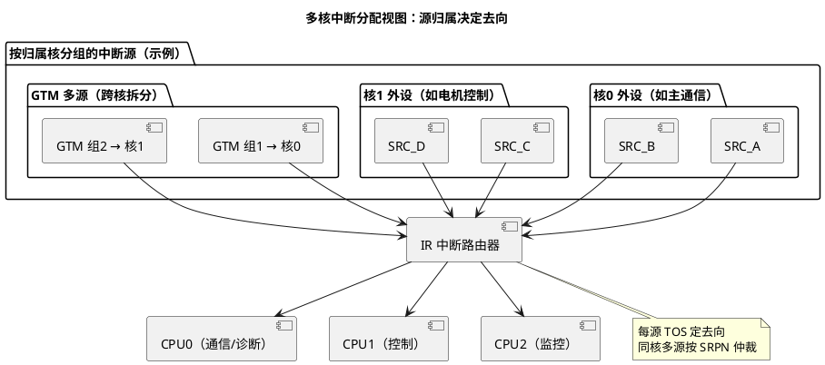
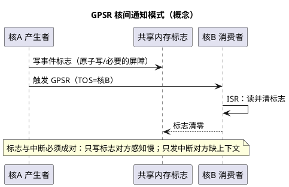

# IR 路由与多核中断分配

> 一句话定位：IR（中断路由器）按每个 SRC 的 TOS 把请求投递到某个核——中断跟着"外设归属核"走；分错核的现象是"这边核干等中断、那边核莫名进异常"。
> 等级：L2 ｜ 前置：[01-SRC模块](01-SRC模块.md)

## 原理

### IR 的角色

IR（Interrupt Router，中断路由器）是所有 SRN（Service Request Node，见 [01-SRC模块](01-SRC模块.md)）的汇聚点：逐源读取 TOS（Target Output Selection，目标核选择）决定投递目标，同核多请求时按 SRPN（优先级号）仲裁，优先级最高的先送、其余挂起。部分源的 TOS 还能指向 GTM 等非 CPU 目标（可选目标以 UM 各源说明为准）。

### 分配策略：中断跟着归属走

1. **外设归属核原则**：外设的驱动跑在哪个核、数据被谁消费，中断就 TOS 到那个核——中断处理与数据路径同核，避免跨核搬数据的延迟与一致性开销；
2. **OS 核减负原则**：跑 AUTOSAR OS 调度与诊断的核尽量少接高频硬件中断，高频源分给专用核；
3. **多源外设拆分**：GTM 这类一个模块几十个源的"大户"，按功能组拆到不同核（如电机相关定时事件归控制核、其他归监控核），避免单核中断过载；
4. **跨核通知**：共享事件用"GPSR 软件中断 + 共享内存标志"模式——核 A 写标志再触发 GPSR（TOS 指向核 B），核 B 在 ISR 里消费标志，比轮询省带宽、比共享硬件中断干净（同步细节见 [多核架构](../../../3-L3高级/多核架构/README.md)）。

### 核间通知：GPSR + 共享标志（模式）

### 多核角色划分示例（概念）

| 核 | 典型角色 | 中断特征 | 分配倾向 |
|---|---|---|---|
| CPU0 | 通信/诊断/OS 调度 | 事件驱动、中等频率 | 通信协议栈相关源，避开高频控制源 |
| CPU1 | 电机/运动控制 | 高频、硬实时 | 控制环相关源 + GTM 控制组 |
| CPU2 | 监控/监控类功能 | 低频、批量 | 慢速统计源 + GPSR 接收端 |

角色划分是中断分配的前置输入：先定"谁负责什么"，中断归属自然浮出；反过来"先配中断再补角色说明"必然返工。

### 分配错误的典型现象

| 现象 | 根因 |
|---|---|
| 某核死等中断，另一核偶发异常/挂死 | TOS 配错核：目标核没挂对应 ISR |
| Cat2 ISR 一进 OS 就报错/Protection Hook | ISR 注册的核与 TOS 实际到达的核不一致 |
| 高优先级任务周期性抖动 | 高频中断全堆在调度核，被中断抢走 CPU 时间 |
| 偶发丢事件、计数对不上 | 边沿型源分配到过载核，处理不及时溢出 |

## 寄存器与位表

> 与 SRC 共用一套寄存器视图（见 01 篇），本篇关注的是"配置项怎么取值"，位号查 UM。

| 配置项 | 取值依据 | 权威出处 |
|---|---|---|
| TOS（目标核） | 外设归属核/消费数据的核 | UM 中断章节 |
| SRPN（优先级） | 见 03 篇优先级规划 | UM 中断章节 |
| GTM 各源清单 | GTM 章节的中断源表 | UM GTM 章节 |
| GPSR 节点分配 | 软件通知拓扑设计 | UM 中断章节 |
| 核间服务机制细节 | 跨核中断相关章节 | UM |

## 双平台对照（AURIX vs S32K）

| 维度 | TC377（AURIX TC3xx） | S32K |
|---|---|---|
| 多核中断路由 | 每源 SRC 自带 TOS，逐源选核 | S32K1 单核无此问题；S32K3 多核有中断定向/汇聚机制（具体见对应 RM） |
| 软件核间通知 | GPSR + 共享内存标志 | 单核不涉及；多核器件用对应核间中断机制 |
| 多源大户处理 | GTM 源逐个 TOS，天然可拆 | 视模块与器件而定 |
| 典型坑 | TOS 与 ISR 注册核不一致 | 多核器件上类似的路由错配问题 |

## 代码/实操

- MCAL/OS 配置侧：在 Tresos/EB 里把外设通道的"优先级 + 目标核"一起配，ISR 通过 OS-Application 绑定到对应核；两处必须同核同优先级，CI 里加配置一致性检查（见 03 篇的优先级表方法）；
- TRACE32 双核断点：在"干等"的核上看目标源 SRC 的挂起位——若一直为 0 说明请求没来或没使能；若一直为 1 说明来了但没被服务（大概率路由到别的核了）；再到"另一边"的核看它的当前优先级字段验证；
- 统计法：每核维护"进中断计数"，用 TRACE32/Delta 窗口对比实际分布与设计分布，是发现"堆核"最直接的手段。

## 易错点与陷阱

1. **TOS 与 ISR 注册核不一致**：硬件把请求送到 A 核，ISR 挂在 B 核——配置工具里两处入口分属不同页面，评审时必须成对检查；
2. **高频源全堆调度核**：OS 调度抖动、任务超时连锁反应，把"看起来无关"的模块拖下水；
3. **共享外设两个核都开中断**：同一事件两边都响应，数据被消费两次或撕裂；共享外设的源只允许一个 TOS 归属；
4. **核间通知只写共享变量不发电磁波（中断）**：对方核可能长时间不调度，通知时序不可控；反过来只发中断不带数据标志也不行——ISR 里无从知道通知内容；
5. **改了 TOS 忘记改优先级规划**：迁核后优先级冲突/抢占关系变化，见 03 篇。

## 面试高频题

1. **怎么决定一个中断路由到哪个核？**
   答：默认跟着外设归属核走（驱动与数据消费者所在核）；再按负载调整：高频源避开调度核、GTM 多源按功能拆分；跨核数据流要么改设计同核化，要么用核间通知显式交接。

2. **GTM 这种几十个中断源的模块怎么分配？**
   答：按功能组归属拆分：控制相关定时事件归控制核，监控/慢速事件归监控核；同时核对每源的 TOS 与优先级，避免单核中断过载（GTM 本身见 GTM 目录）。

3. **跨核怎么通知另一个核"有事发生"？**
   答：共享内存放事件标志（保证原子性/可见性），再触发 GPSR 软件中断（TOS 指向对方核），对方在 ISR 中消费标志；双向各配一对。纯轮询在大系统里浪费带宽且时序差。

4. **"丢中断/别的核响应了"怎么定位？**
   答：先看源 SRC 挂起位：恒 0 → 没产生或未使能；恒 1 → 来了没被服务，多半 TOS 错核。再看两个核的当前优先级与中断计数，对照配置表核对 TOS 与 ISR 注册核是否一致。

5. **多核系统里中断使能/禁止要注意什么？**
   答：禁止是核视角（本核不响应）而请求仍在节点挂起，重新使能可能集中补投；跨核动态改别人核的中断配置要经对方核执行，避免竞态。

6. **为什么"外设归属核"是中断分配的第一原则？**
   答：中断处理与数据消费者同核，避免跨核搬运的延迟与一致性开销；中断到了别的核，要么数据再搬回来，要么处理结果送过去，两条路都比"就地处理"贵。

## 延伸

- [01-SRC模块.md](01-SRC模块.md)：节点字段与触发方式；
- [03-中断优先级实践.md](03-中断优先级实践.md)：SRPN 规划与 OS 耦合；
- [GTM](../GTM/README.md)：最大中断源大户；
- [多核架构](../../../3-L3高级/多核架构/README.md)：核间同步与数据一致性；
- [TC377平台](../README.md)。
