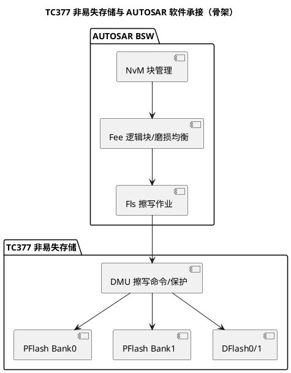

# PFlash 与 DFlash：代码与数据各回各家

> 一句话定位：PFlash（程序闪存）放代码与常量、支持片上执行与双 Bank 在线升级；DFlash（数据闪存）放运行参数、被 Fee 用来仿真 EEPROM——两者分工、组织与保护机制完全不同。
> 等级：L2 ｜ 前置：[02-存储器映射初识](../../../00-入门导读/02-存储器映射初识.md)

## 原理

### 两种 Flash 的分工

- PFlash（Program Flash，程序闪存）：
  - 存放程序（`.text`）、常量（`.rodata`）、启动头（BMHD，Boot Mode Header）；
  - 支持片上执行（XIP，eXecute In Place），CPU 经 SRI 总线（Shared Resource Interconnect，共享资源互连）直接取指；
  - 带 ECC（Error Correction Code，错误校验码）保护，未初始化区域读出可能触发不可纠正错误陷阱（Trap）；
  - TC37x 组织为双 Bank（Bank0/Bank1），是 OTA（Over The Air，在线升级）与"擦写不停机"的物理基础；总容量、每 Bank 大小查 DS（数据手册）存储器组织章节。
- DFlash（Data Flash，数据闪存）：
  - 存放运行参数、标定量、诊断数据；
  - 不用于取指（把函数放进去跑不是设计用途）；
  - AUTOSAR 中由 Fee（Flash EEPROM Emulation，闪存仿真 EEPROM）把它抽象成"逻辑块"，上层 NvM（NVRAM Manager，非易失内存管理）只见块号不见扇区；
  - TC37x 含 DFlash0/DFlash1 等分区，具体布局查 DS。

### 擦除单位 vs 编程单位

Flash 物理特性：编程只能把位从 1 写成 0，擦除才把 0 恢复成 1，且擦除必须整扇区进行。

| 概念 | 含义 | 典型量级 | 权威出处 |
|---|---|---|---|
| 擦除单位（Sector，扇区） | 一次擦除动作覆盖的最小区域 | 数 KB 到数十 KB | DS 扇区表 |
| 编程单位（Page，页） | 一次编程命令写入的最小数据块 | 数十字节 | DS 扇区表 |

推论：改一个字节往往要"读出整扇区 → 内存中改 → 擦除扇区 → 回写"，这正是 Fee 要做地址管理、磨损均衡（Wear Leveling）的原因。

### 双 Bank 切换与 OTA



OTA 典型布局（概念，A/B 分区大小按项目划分）：

```text
PFlash
├── Bank0 ┐ 一侧运行（当前程序 + 各自的 BMHD 启动头）
├── Bank1 ┘ 另一侧接收新程序
└── 升级完成后经 swap 机制交换两个 Bank 的映射（由 UCB 配置，流程查 UM Flash Swap 章节）
```

- 升级期间 CPU 从 Bank A 取指，擦写 Bank B，互不阻塞（原理详见 [03-DMU与扇区](03-DMU与扇区.md)）；
- 新程序校验通过后置换启动选择，失败则回退旧 Bank——"不断电升级 + 失败可回滚"都建立在这对 Bank 上。

### 上电启动与 BMHD（概念）

BMHD（Boot Mode Header，启动模式头）是 PFlash 里描述启动入口的结构：含启动地址、校验字段等，芯片上电按"校验通过才跳转"的规则逐个尝试（字段布局与校验算法查 UM 启动章节）：

- 每个 Bank 各有 BMHD，且带备份副本，形成"主失败用备、备失败换 Bank"的容错链；
- OTA 写新程序时必须同步写好新 Bank 的 BMHD——新代码再正确，启动头不对也起不来，这是升级流程评审的必查项；
- BMHD 校验失败时的兜底行为（进入引导模式等）查 UM 启动章节，量产工装要按兜底路径准备烧写手段。

### 典型分区方案（概念示例）

| 分区 | 放什么 | 变更频率 | 管理方 |
|---|---|---|---|
| 程序区（Bank A/B） | 应用 + BSW 完整镜像 | 随 OTA | bootloader |
| 只读数据区 | 常量表、校准表 | 随版本发布 | 构建系统 |
| DFlash 逻辑块区 | Fee 管理的运行参数 | 运行期高频 | Fee |
| DFlash 产线数据区 | 序列号、产线校准 | 产线一次性 | 产线工装 |

分区边界要在链接脚本与 Fee/Fls 配置里保持同一套数字——三处各写一份常量是漂移的起点。

### 写保护概念

- 每个扇区可配置写保护（Write Protection），防止误擦写破坏程序；
- 保护配置存放在 UCB（User Configuration Block，用户配置块）中，如 PFlash/DFlash 各自的保护配置字段（字段名与布局查 UM 的 UCB 章节）；
- UCB 本身也是 Flash：写入"确认（Confirm）"字后固化，修改需先解除保护/输入密码（Password），密码丢失可能导致无法再改保护配置——按"接近烧砖"的严重度对待。

## 寄存器与位表

> 本篇只给"要看什么"，具体寄存器名、位定义、地址、命令码一律以 UM（用户手册）/DS 对应章节为准，不抄手册、更不凭记忆写位号。

| 关注对象 | 作用 | 关键概念 | 权威出处 |
|---|---|---|---|
| 擦写命令接口 | DMU 接收擦除/编程/校验命令的入口 | 命令序列（Command Sequence） | UM Flash 章节 |
| 扇区保护寄存器/UCB | 扇区级写保护、密码 | UCB 的 PROCON 类字段 | UM UCB 章节 |
| BMHD | 启动头：启动地址、校验和 | BMHD0/BMHD1（各有副本） | UM 启动章节 |
| swap 配置 | 双 Bank 交换 | UCB 中 swap 相关字段 | UM Flash Swap 章节 |
| ECC 状态 | 正确/错误统计与告警 | ECC 错误寄存器 | UM Flash 章节 |

## 双平台对照（AURIX vs S32K）

| 维度 | TC377（AURIX TC3xx） | S32K1xx（Cortex-M4） |
|---|---|---|
| 代码闪存 | PFlash，双 Bank，支持 XIP 与 Bank 交换 | Program Flash，单体为主，OTA 依赖 bootloader 搬运 |
| 数据闪存 | DFlash0/1，纯数据用途 | FlexNVM，可配置为普通数据闪存或 EEEPROM 备份 |
| 仿真 EEPROM | Fee 纯软件实现（逻辑块+磨损均衡） | FTFC 支持硬件 EEE 加速（仍需软件层适配） |
| 擦写控制器 | DMU（详见 03 篇），命令序列式 | FTFC 闪存控制器，命令+状态标志式 |
| 在线升级 | 双 Bank + swap，天然 A/B | 单体闪存，A/B 需自行在应用层做搬运与回退 |
| 扇区/页大小 | 查 DS 扇区表 | 查 S32K 参考手册 FTFC 章节 |

## 代码/实操

- iLLD（Infineon Low Level Driver）提供 Flash 擦/写/校验的封装（`IfxFlash_*` 前缀），典型调用顺序"解锁 → 擦扇区 → 校验 → 页编程 → 校验 → 回锁"（接口签名以所用 iLLD 版本为准）；
- MCAL/BSW 层：Fls 按 Bank/扇区配置作业队列，Fee 把 NvM 逻辑块映射到 DFlash 物理地址，配置方法见 [Fls与Fee](../../../../04-MCAL与外设驱动/2-L2进阶/Fls与Fee/README.md)；
- TRACE32：用内存窗口直接查看扇区内容、BMHD 字段与 UCB 配置；擦写异常时先看 Flash 模块状态/错误码寄存器（地址查 UM），再对照 map 文件确认是否擦到了在用区域。

## 易错点与陷阱

1. 把 Fee 管辖的 DFlash 当"裸 Flash"直接擦写：逻辑块地址映射被破坏，NvM 读出的数据错乱且难以复现；
2. OTA 擦写目标 Bank 时恰好从该 Bank 取指：读通路被擦写阻塞，程序跑飞或 Trap（机制见 03 篇）；
3. 读未初始化（未擦除过）的 Flash 区域：ECC 双位错直接触发 Trap，不是"读到随机数"；
4. UCB 确认字一写就固化：工厂/产线烧写流程里必须有 UCB 烧写与校验的独立步骤和检查单；
5. 页编程时数据量不足一页或地址跨页：编程命令被拒绝，错误码要当场查，不能"重试碰运气"；
6. 以为"写一个字节只影响一个字节"：忽略擦除粒度，导致高频小写入快速磨损某个扇区；
7. OTA 只刷代码不更新 BMHD/校验：升级流程本身有洞，回滚分支从没真正验证过；
8. 分区边界三处硬编码（链接脚本/Fls/Fee 各一份）：任何一处改动没同步，运行期读写到"邻居"分区，问题表现为数据偶发错乱。

## 面试高频题

1. **PFlash 和 DFlash 的分工是什么？为什么不用一块 Flash 通吃？**
   答：PFlash 为取指优化（XIP、等待状态、双 Bank），DFlash 为数据更新优化（擦写次数寿命、页大小适合小写入）。分开后代码区可整片写保护，数据区高频擦写不危及程序，寿命模型也各自独立。

2. **擦除单位与编程单位为什么差这么多？**
   答：Flash 物理上按"块"擦除（浮栅集体复位），按"页"编程（页缓冲一次写入保证位线时序）。擦大写小是所有 NOR Flash 的共性，也正是 Fee 地址管理与磨损均衡存在的原因。

3. **双 Bank 怎么支撑 OTA？**
   答：A/B 各存一份完整程序，运行 A 擦写 B；升级完成经启动头/swap 机制切换到 B，失败回退 A。擦写与取指在不同 Bank，互不阻塞。

4. **误擦了程序区会怎样？为什么写保护能挡住？**
   答：轻则取指读到错误数据触发 ECC Trap，重则直接变砖需重刷。扇区写保护配置固化在 UCB 中，DMU 对受保护扇区拒绝擦写命令，属于硬件级兜底。

5. **Fee 和直接操作 DFlash 的区别？**
   答：Fee 提供"逻辑块"抽象，内部做地址翻译、磨损均衡、掉电一致性；直接操作 DFlash 则要自己处理这一切，且与 Fee 并存会互相踩踏（详见 Fls与Fee 目录）。

6. **BMHD 在启动和 OTA 里起什么作用？**
   答：它是 PFlash 里描述启动入口的头结构，上电靠"校验通过才跳转"选择启动位置。OTA 要保证新 Bank 的 BMHD 正确写入，才能做到"升级失败自动回退旧 Bank"，是 A/B 升级容错链的一环。

## 延伸

- [02-DSRAM-PSPR-DSPR.md](02-DSRAM-PSPR-DSPR.md)：易失存储的分区决策；
- [03-DMU与扇区.md](03-DMU与扇区.md)：擦写命令序列与擦写期间的行为；
- [Fls与Fee](../../../../04-MCAL与外设驱动/2-L2进阶/Fls与Fee/README.md)：上层软件如何使用这两种 Flash；
- [TC377平台](../README.md) / [02-芯片与体系结构](../../README.md)。
