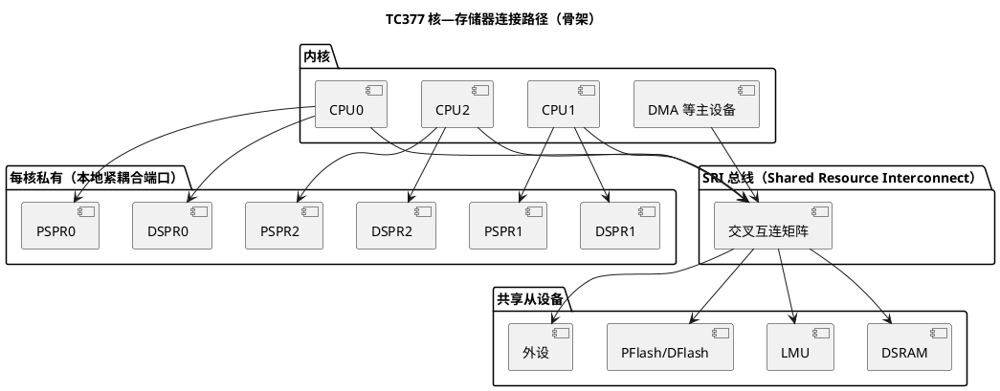

# DSRAM、PSPR、DSPR：RAM 的三六九等

> 一句话定位：DSPR/PSPR 是每核私有的紧耦合 RAM（本核访问零等待），DSRAM/LMU 是挂在 SRI 总线上的共享 RAM——放对位置是性能问题，放错位置是多核踩内存问题。
> 等级：L2 ｜ 前置：[01-PFlash与DFlash](01-PFlash与DFlash.md)

## 原理

### 存储器家族全景

TC377（三核 TriCore）的易失存储不是"一大块 SRAM"，而是一个按"归属核"分层的体系（各区块大小与地址范围查 DS 存储器组织章节）：

- DSPR（Data Scratchpad RAM，数据紧耦合存储）：每核一块（DSPR0/1/2），本核数据访问零等待，常放每核栈与热点数据；
- PSPR（Program Scratchpad RAM，程序紧耦合存储）：每核一块（PSPR0/1/2），本核取指零等待，是放关键 ISR 代码的首选；
- DSRAM（Data SRAM，共享数据存储）：全芯片共享，任何核、DMA 都能经 SRI 总线访问；
- LMU（Local Memory Unit，本地存储单元）：共享系统 RAM，部分区域有系统级特殊用途（具体保留区查 UM）。

以上 RAM 均带 ECC：上电后从未初始化的 RAM 直接读，可能触发 ECC 错误——启动代码必须先清 RAM 再交给应用。

### 核到内存的连接路径

要点：

- 每核访问"自己的"DSPR/PSPR 走本地紧耦合端口，不经 SRI 仲裁，延迟固定且最低；
- DSPR/PSPR 同时也作为 SRI 从设备暴露给其他主设备（他核/DMA 可访问，但要跨总线、与本核竞争，性能和一致性都要额外考虑；各从设备的可访问性以 UM 总线章节为准）；
- 共享 DSRAM/LMU 的访问延迟受 SRI 仲裁影响——多主设备抢同一从设备时延迟抖动，硬实时数据尽量别放在共享区。

### 放什么数据到哪里的决策表

| 数据/代码类型 | 推荐位置 | 理由 | 反例后果 |
|---|---|---|---|
| 关键 ISR 代码（如电流环） | 本核 PSPR | 取指零等待、不受 Flash 等待状态与 SRI 争用影响 | 放 PFlash：等待状态+总线争用，抖动放大 |
| 每核栈、热点变量 | 本核 DSPR | 本地端口零等待 | 放共享区：每次访问都仲裁，栈操作高频受害 |
| 多核共享缓冲（如核间队列） | DSRAM/LMU | 各核访问路径对称 | 放某核 DSPR：他核/经 SRI 访问慢且挤占本地带宽 |
| DMA 大缓冲 | DSRAM/LMU | DMA 与 CPU 并行度高 | 放 PSPR：DMA 访问受限/低效（以 UM 总线拓扑为准） |
| 大体积只读表 | PFlash（.rodata） | 省宝贵的 RAM | — |

### 与 MemMap/链接脚本的联动

AUTOSAR 的 MemMap 机制（通过 `#pragma section` 等编译指示把代码/数据归入自定义段）与链接脚本共同决定"段名 → 物理区域"的落位：

- 启动代码（cstart）负责：`.bss` 清零、`.data` 从 PFlash 加载镜像复制到 RAM 目标区；
- Infineon 侧工具链/驱动通常提供按核区分的段命名（CPU0/CPU1/CPU2 × DSRAM/PSPR 风格），具体段名以所用 MCAL 包的 MemMap.h 与链接脚本为准；
- 方法论层面：MemMap 决定"源码里标什么段"，链接脚本决定"段放哪个地址"，两边必须一起改、一起评审。机制详解见 [05-AUTOSAR-MemMap机制](../../../../01-编程语言/2-L2进阶/内存管理/05-AUTOSAR-MemMap机制.md)。

### 决策如何落地：三步闭环

放置决策不能停留在注释里，要走闭环：

1. **需求标注**：代码评审对每个新变量/函数问三个问题——谁访问（单核/多核/DMA）、访问频率多高、对时序多敏感；
2. **段级归属**：按 MemMap 机制给源码打段标记（每核数据段、程序段、共享段），让"归属"显式可见；
3. **链接落位**：链接脚本把段映射到 DSPR/PSPR/DSRAM/PFlash 地址区间，map 文件作为最终凭证归档，供评审与事后排障对照。

配套动作：上电启动代码完成 `.bss` 清零与 `.data` 搬运（PFlash 加载镜像 → RAM 目标区）；DMA 缓冲还要关注对齐与边界（是否涉及缓存一致性问题，以所用型号的缓存配置与 UM 为准）。

## 寄存器与位表

本篇的核心"表"不是寄存器，而是地址地图（各区域起止地址、大小查 DS 的 Memory Map 章节；总线主从端口与仲裁查 UM 总线章节）：

| 区段 | 归属 | 本核访问 | 他核/DMA 访问 | 权威出处 |
|---|---|---|---|---|
| DSPR0/1/2 | 每核私有 | 本地端口，零等待 | 经 SRI，受仲裁 | DS/UM |
| PSPR0/1/2 | 每核私有 | 本地端口，零等待 | 经 SRI，受限情况以 UM 为准 | DS/UM |
| DSRAM | 全局共享 | 经 SRI | 经 SRI | DS/UM |
| LMU | 全局共享 | 经 SRI | 经 SRI，注意系统保留区 | DS/UM |

## 双平台对照（AURIX vs S32K）

| 维度 | TC377（AURIX TC3xx） | S32K1xx（Cortex-M4） |
|---|---|---|
| 拓扑 | 三核各自 DSPR/PSPR + 共享 DSRAM/LMU | 单核统一 SRAM，无紧耦合 RAM（TCM）划分 |
| 放置决策 | 必答题：栈/ISR/共享数据要分区放置 | 基本不用决策，统一地址空间 |
| 访问差异 | 本地端口 vs SRI 仲裁，延迟差明显 | 统一总线矩阵，差异小 |
| 多核一致性 | 软件负责（共享区+同步原语） | 单核无此问题 |
| ECC | RAM 带 ECC，需先初始化 | 视型号/配置（查对应 RM） |

## 代码/实操

- TRACE32 定位法：对"卡死/数据错乱"的变量，先看它的地址落在哪个区段（对照 DS 地址地图），再判断是否被别的核或 DMA 踩踏；
- map 文件评审：抽查 `_stack`、ISR 段、共享缓冲的地址，与决策表逐条对照；
- 把最关键 ISR 搬进 PSPR 后，用性能计数器/示波器对比执行时间，验证收益（方法见资源与 iLLD 目录）。

## 易错点与陷阱

1. 上电不清 RAM 直接读：ECC 错误陷阱随机出现，现象像"程序偶发跑飞"；
2. 共享数据不加同步：多核环境下"读到半新半旧"是常态，必须用原子操作/自旋锁/核间通知配合（见 [中断系统](../中断系统/README.md) 的核间通知）；
3. 大缓冲挤占 DSPR：每核 DSPR 有限，栈被挤出去后性能反而下降；
4. DMA 目标随意放 PSPR：可用性与效率都要按 UM 总线拓扑确认，别想当然；
5. 只改 MemMap 不改链接脚本（或反之）：段名悬空，链接期才报错，且报错信息晦涩；
6. 假设"他核访问我的 DSPR 和本核一样快"：跨总线访问延迟和带宽都差一截，性能评估要按实际路径算；
7. DMA 缓冲不做对齐/边界检查：跨区访问或越界踩邻居，报错点离根因十万八千里。

## 面试高频题

1. **为什么关键 ISR 要放 PSPR？**
   答：PSPR 本核取指零等待，不受 PFlash 等待状态、擦写阻塞和 SRI 总线争用影响，执行时间确定，适合硬实时中断。

2. **DSPR 和 DSRAM 的本质区别？**
   答：归属与路径。DSPR 每核私有、本核走本地端口零等待；DSRAM 全局共享、所有主设备经 SRI 仲裁访问。前者快但独占，后者通用但有争用。

3. **每核栈应该放哪？为什么？**
   答：本核 DSPR。栈访问频率极高且对延迟敏感，放私有紧耦合 RAM 收益最大；放共享区会被 DMA/他核流量拖慢。

4. **多核共享变量需要注意什么？**
   答：放共享区只是前提，还要保证访问原子性（对齐+原子指令或锁）、防止编译器乱序（volatile/屏障），必要时用核间中断做事件通知。

5. **MemMap 机制与链接脚本是什么关系？**
   答：MemMap 在源码层把代码/数据标记到逻辑段，链接脚本把段映射到物理地址（DSPR/PSPR/DSRAM/PFlash）。两者配套使用，是"放置决策"的落地手段。

## 延伸

- [01-PFlash与DFlash.md](01-PFlash与DFlash.md)：非易失存储侧的分区；
- [03-DMU与扇区.md](03-DMU与扇区.md)：为什么执行代码放 PFlash 会有等待状态与擦写阻塞；
- [05-AUTOSAR-MemMap机制](../../../../01-编程语言/2-L2进阶/内存管理/05-AUTOSAR-MemMap机制.md)：段级放置的软件机制；
- [TC377平台](../README.md) / [02-芯片与体系结构](../../README.md)。
