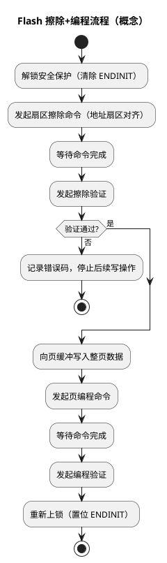

# DMU 与扇区：Flash 擦写的"里子"

> 一句话定位：DMU（Flash 管理单元）把脆弱的浮栅擦写包装成"命令序列 + 验证 + 保护"的可控接口——理解它才能解释擦写卡顿、验证失败、ENDINIT 上锁与读保护。
> 等级：L2 ｜ 前置：[02-DSRAM-PSPR-DSPR](02-DSRAM-PSPR-DSPR.md)

## 原理

### DMU 的角色

DMU（Data Memory Unit，AURIX 中管理 PFlash/DFlash 擦写与保护的功能单元，UM 中的正式组织与命名以手册为准）承担四件事：

1. **擦写命令序列**：软件不直接对 Flash 地址写数据完成编程，而是把命令码、目标地址、数据按序列写入命令接口，由 DMU 执行；
2. **验证（Verify）**：擦除/编程后支持硬件校验命令（擦除验证、编程验证），别用"读回来自己比"替代；
3. **保护**：ENDINIT（End of Initialization，安全看门狗的初始化结束保护位）锁定关键配置，扇区级写保护固化在 UCB（详见 [01-PFlash与DFlash](01-PFlash与DFlash.md)）；
4. **读通路管理**：PFlash 读等待状态（Wait State，见下文）与 ECC。

### 标准擦写流程

要点：

- 擦除与编程是两个独立命令，中间的验证是质量闸门，量产代码不要跳过；
- 页数据必须按"整页、按序"写满页缓冲再发编程命令，字数不足或顺序错误会被拒绝（页大小查 DS 扇区表）；
- ENDINIT 解锁窗口要尽量短：解锁 → 擦写 → 立刻回锁，别把整段应用逻辑泡在解锁状态里。

### 擦写期间 CPU 在干什么

- **擦写 DFlash**：PFlash 取指不受影响，只是访问 DFlash 的读会被阻塞/报错，属于"舒服"的场景；
- **擦写本核正在取指的 PFlash Bank**：该 Bank 读通路被擦写占住，取指停摆（stall）或触发异常——如果此刻喂狗代码也在同一 Bank，直接演变成看门狗复位；
- **规避**：双 Bank 场景下"从 Bank A 跑、擦 Bank B"；或把擦写驱动与喂狗逻辑放进 PSPR/RAM（放置方法见 [02-DSRAM-PSPR-DSPR](02-DSRAM-PSPR-DSPR.md)）。

### 等待状态随频率变化

PFlash 读延迟 = 访问时间 + 等待状态数，等待状态由内核频率决定：频率越高，需要的等待状态越多（配置值与频率对照关系查 UM Flash 章节的等待状态表）。两个工程含义：

- 超频（或 PLL 配错导致频率超标）会同时踩中"等待状态不足"和"时序违例"，Flash 读不再是确定行为；
- 把热代码搬进 PSPR 可以同时消灭等待状态与擦写阻塞，是 ISR 优化的常规手段。

### 擦写周期对程序的影响面

| 场景 | 影响面 | 应对 |
|---|---|---|
| 擦写 DFlash | 仅 DFlash 读阻塞 | Fee 作业队列化，避开系统峰值时段 |
| 擦写另一 Bank 的 PFlash | 本 Bank 取指不受影响 | OTA 标准姿势 |
| 擦写本核取指的 PFlash Bank | 取指 stall / Trap / 看门狗复位 | 禁止；规划执行位置 |
| 擦写期间他核/DMA 访问同一 Bank | 读阻塞或错误 | 跨核约定擦写窗口，暂停相关访问 |

设计阶段的动作：把"哪些代码路径会在擦写期间执行"画出来（bootloader、NvM 写链路、喂狗路径），逐一确认不在目标 Bank 里——这页图随设计文档归档。

### 量产烧写视角

- 产线典型顺序：擦 → 写程序 → 写标定/产线数据 → 校验读回 → 最后烧 UCB（保护/密码），UCB 步骤双人复核；
- 密码与 UCB 内容属于资产管理：密码丢失意味着保护配置不可再修改，必须入库、随项目交接；
- 返修路径要预先设计：制定 UCB 策略时就回答"想解除保护怎么办"，否则售后只能换板；
- 烧写工装按 BMHD 兜底行为准备恢复手段（见 01 篇 BMHD 小节）。

### 擦写时间的两个量级（概念）

- 擦除远慢于编程：擦除要把整个扇区复位，毫秒级；页编程微秒级；两者还要各加验证时间（典型量级与上限查 DS/UM 的 Flash 时序参数表）；
- 工程含义一：Fls/Fee 的作业调度必须按"擦除是慢操作"设计——不要在等擦除的循环里忙等烧 CPU，用异步状态机/回调；
- 工程含义二：看门狗喂狗周期要覆盖"最长擦写+验证"的窗口，否则写一次 Flash 就复位一次。

## 寄存器与位表

> 命令码、寄存器地址、位定义全部以 UM Flash 章节为准，此处只列"必须知道的关注点"。

| 关注对象 | 作用 | 使用要点 | 权威出处 |
|---|---|---|---|
| 命令接口 | 触发擦除/编程/验证/挂起/恢复 | 按命令序列写，多数要求特定访问宽度 | UM Flash 章节 |
| 完成状态 | 命令是否结束、是否出错 | 轮询或中断；出错码必须读出并处理 | UM Flash 章节 |
| ENDINIT | 安全保护锁 | 经安全看门狗解锁/回锁，窗口最小化 | UM 安全看门狗章节 |
| 扇区保护（UCB） | 扇区写保护 | 固化后修改受限（见 01 篇） | UM UCB 章节 |
| 等待状态配置 | 读延迟随频率 | 按频率对照表设置 | UM Flash 章节 |
| ECC 状态 | 可纠正/不可纠正错误统计 | 出错告警可接入 SMU | UM Flash/SMU 章节 |

## 双平台对照（AURIX vs S32K）

| 维度 | TC377 DMU（概念模型） | S32K FTFC |
|---|---|---|
| 命令方式 | 写命令接口触发擦/编/验证 | 写命令寄存器+状态标志（CCIF 等）轮询 |
| 保护机制 | ENDINIT + UCB 扇区保护 | Flash 保护区寄存器 + 加密后门（视型号） |
| 验证 | 硬件擦除/编程验证命令 | 依手册提供的校验/读回对比流程 |
| 双 Bank | 原生双 Bank + swap | 单体为主，OTA 自行搬运 |
| ECC | 内建，错误可上报 SMU | 视型号/配置（查 RM） |

## 代码/实操

- iLLD 封装了命令序列（`IfxFlash_*` 前缀：擦扇区、页编程、验证、解锁/回锁），业务代码不要绕过封装手搓命令（接口以所用版本为准）；
- MCAL 的 Fls 是异步作业模型：发起 Job 后轮询/回调拿结果，主循环里要给 Fls_MainFunction 喂饭（详见 [Fls与Fee](../../../../04-MCAL与外设驱动/2-L2进阶/Fls与Fee/README.md)）；
- TRACE32 排障三板斧：查 Flash 模块状态/错误码寄存器（地址查 UM）→ 查目标地址是否扇区对齐/是否受保护 → 查 ENDINIT 是否处于解锁状态被意外长期保持。

## 易错点与陷阱

1. 忘解锁 ENDINIT：命令被拒，表现为"擦写函数一直返回失败"，错误码里有保护类提示；
2. 忘回锁 ENDINIT：功能上"能用"，但安全审查/量产流程必挂，属于隐患型 bug；
3. 扇区地址未对齐或跨扇区：命令直接拒绝，必须按扇区边界组织擦写计划；
4. 页缓冲写一半就发编程命令：写入不完整还可能污染整页，必须严格整页提交；
5. 在被擦 Bank 里取指：stall/Trap/看门狗复位三连，OTA 代码路径要专门评审（见 01 篇 OTA 布局）；
6. 跳过验证命令：擦除"看似成功"但个别位未复位，编程后偶发位错误，问题潜伏到出厂后；
7. 擦写期间高频访问同一 Bank 的数据表：读阻塞拖垮无关功能，数据表要么搬 RAM、要么避开擦写窗口；
8. 解锁后调用可能阻塞的函数（等待、长循环）：ENDINIT 长期开窗，安全审查与量产流程都过不去。

## 面试高频题

1. **为什么擦除单位远大于编程单位？**
   答：物理机制决定：擦除按扇区给浮栅集体复位，编程按页经页缓冲一次写入。所以高频小数据更新必须靠 Fee 做聚合与磨损均衡。

2. **擦写时 CPU 在做什么？会不会卡死？**
   答：取决于取指位置：跑在被擦 Bank 里会 stall 甚至 Trap；跑在另一 Bank/PSPR 则不受影响。所以 OTA/擦写驱动要规划好执行位置。

3. **ENDINIT 是什么？为什么要有它？**
   答：安全看门狗的初始化结束保护位，上锁后禁止修改关键安全配置（含 Flash 命令通路）。它防的是"程序跑飞后误擦写"，属于芯片级安全栅栏；使用纪律是短解锁、快回锁。

4. **验证命令和自己读回比对有什么区别？**
   答：硬件验证按存储单元物理状态检查（含边缘单元判定），比软件读回比对更严格，能暴露"读着对但物理未完全擦净"的隐患。

5. **等待状态为什么随频率变化？如何优化？**
   答：Flash 物理访问时间固定，频率升高后一个时钟周期变短，需要插入更多等待周期对齐。优化手段：按手册表配置，以及把关键代码搬进 PSPR。

6. **量产烧写为什么把 UCB 放最后一步？**
   答：UCB 固化后保护配置难以再改，放最后并双人复核，可以保证前面烧写、校验出问题时还能返工；顺序一旦颠倒，烧废的板子可能无法恢复。

## 延伸

- [01-PFlash与DFlash.md](01-PFlash与DFlash.md)：两种 Flash 的分工、OTA 与写保护；
- [02-DSRAM-PSPR-DSPR.md](02-DSRAM-PSPR-DSPR.md)：把擦写驱动与关键代码放进 RAM 的方法；
- [Fls与Fee](../../../../04-MCAL与外设驱动/2-L2进阶/Fls与Fee/README.md)：上层软件的异步作业模型；
- [资源与iLLD](../资源与iLLD/README.md)：Flash 底层驱动的封装形态；
- [TC377平台](../README.md) / [02-芯片与体系结构](../../README.md)。
