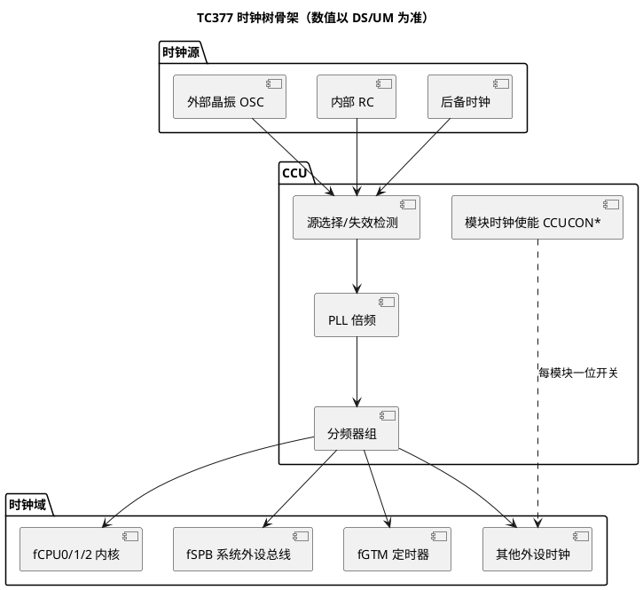

# CCU 与时钟树：全芯片的节拍器

> 一句话定位：外部晶振/内部 RC 经 CCU（中央时钟单元）选源、倍频（PLL）、分频后分发给内核、总线和各外设——树上任何一级配错，下游全部"跑调"。
> 等级：L2 ｜ 前置：[01-SCG与PCC](../../../1-L1基础/S32K平台/时钟系统/01-SCG与PCC.md)

## 原理

### 时钟源：三条起点

| 时钟源 | 定位 | 说明 |
|---|---|---|
| 外部晶振（OSC） | 主时钟源 | 频率由板级决定（常见 20 MHz 量级，以原理图为准），精度高、噪声低 |
| 内部 RC 振荡器 | 快速启动/辅助 | 上电即可用、无需等待晶振起振，精度低于晶振 |
| 后备时钟（Backup Clock） | 时钟失效兜底 | 检测到振荡器/PLL 失效时自动切换维持基本运行（频率值查 UM） |

### CCU 的职责与典型时钟树

CCU（Central Clock Unit，中央时钟单元）负责：源选择、PLL 管理（见 [02-PLL配置](02-PLL配置.md)）、分频产生各时钟域、按模块分发与使能（见 [03-外设时钟门控](03-外设时钟门控.md)）、时钟失效检测。

典型链路（概念示例，各频率上限与分频档位查 DS/UM）：晶振 f_osc → PLL → f_PLL（内核主频规划值，TC377 常见规划在 200 MHz 量级，以 DS 为准）→ 分频出 fCPU0/1/2（三核同源）、fSPB（外设总线，有独立上限）、fGTM（定时器专用）等。

### 时钟失效检测 → 安全状态（AURIX 特色）

安全链路：振荡器停止/PLL 失锁 → CCU 检测 → 自动切换到后备时钟维持运转 → 告警上报 SMU（Safety Management Unit，安全管理单元）→ SMU 按配置把系统导入安全状态（如复位/关输出）。

工程含义：功能安全相关系统里，"时钟失效后芯片不是黑屏死机，而是带告警地降级"，SMU 的时钟类告警必须使能并在评审中核对。

### 时钟域与外设的挂载关系（概念）

| 时钟域 | 典型挂载对象 | 工程注意 |
|---|---|---|
| fCPU0/1/2 | 各核取指、核本地数据处理 | 三核同源，调试时按同一基准理解 |
| fSPB（系统外设总线域） | 传统外设（通信、IO 类） | 频率低于内核，驱动延时/超时按本域频率算 |
| fGTM | GTM 定时器阵列 | 独立规划，直接决定定时粒度（见 GTM 目录） |
| 其他外设时钟 | 模块各自相关 | 挂载关系以 UM 时钟章节的分发表为准 |

跨域访问（内核高频、外设低频）天然存在节拍差：驱动里"读状态→等标志"的循环时间要按外设域频率估算，别拿内核主频心算。

### 各模块独立时钟使能

- 每个外设模块有独立时钟开关（CCU 的模块使能寄存器，每位对应一个模块，位定义查 UM CCU 章节）；
- 关闭未用模块时钟是低功耗基本手段，也是"外设无响应"的头号嫌疑（坑与排障见 03 篇）；
- 各时钟域并非同频：fSPB 通常低于 fCPU，挂在其上的外设寄存器访问节奏与内核不同，驱动里的延时/超时计算要用对应域的频率。

## 寄存器与位表

> 寄存器名/位号/地址一律查 UM CCU 章节，此处只列关注点。

| 关注对象 | 作用 | 关键概念 | 权威出处 |
|---|---|---|---|
| 振荡器控制 | 晶振使能与监测 | 起振稳定窗口 | UM CCU/OSC 章节 |
| PLL 控制 | 倍频参数与锁定状态 | 见 02 篇 | UM PLL 章节 |
| 分频寄存器 | 各时钟域分频值 | 与上限联动约束 | UM CCU 章节 |
| 模块使能（CCUCON*） | 每模块时钟开关 | 位↔模块映射表 | UM CCU 章节 |
| 失效检测状态 | 振荡器/PLL 告警标志 | 告警→SMU | UM SMU 章节 |

## 双平台对照（AURIX vs S32K）

| 维度 | TC377（AURIX TC3xx） | S32K1xx |
|---|---|---|
| 时钟管理单元 | CCU 集中管理 | SCG（System Clock Generator）+ SIM 分发 |
| 源 | 晶振/内部 RC/后备时钟 | SOSC/SPLL/SIRC/FIRC |
| 失效兜底 | 自动切后备时钟 + SMU 安全状态 | 时钟监视器告警/复位（CMU/LOS 类机制，查 RM） |
| 模块门控 | CCUCON* 每模块一位 + 模块 CLC | PCC（Peripheral Clock Control）每外设一位 |
| 时钟域 | fCPU/fSPB/fGTM 等多域 | CORE/SLOW/BUS/FLASH 等域 |

## 代码/实操

- 上电典型时序（概念）：内部 RC 起跑 → 等晶振稳定 → 配 PLL 等锁定 → 切换到 f_PLL → 按需使能各模块时钟。MCAL 中由 Mcu 模块封装（`Mcu_Init` / 时钟分发类 API，接口以所用 MCAL 为准，见 [Mcu模块](../../../../04-MCAL与外设驱动/2-L2进阶/Mcu模块/README.md)）；
- TRACE32 验证：读 CCU 各寄存器确认实际生效的分频/使能值，别只看配置工具里的"期望值"；
- 板级验证：若引脚复用支持时钟输出（查 DS 引脚复用表），把内部时钟引到示波器实测，是"频率到底是多少"的终极仲裁。

## 易错点与陷阱

1. 先配外设后开时钟：配置悄悄丢失，详见 03 篇，此处只强调"排查任何新外设第一步先查时钟开关"；
2. 改 PLL 后不等锁定就切源：系统短暂跑在错误频率上，表现为一串外设乱码后复位；
3. fSPB 超上限：配置工具可能不拦你（尤其手写参数时），必须对照 DS 电气特性核对各域上限；
4. OS tick 按错频率算：tick 周期整体漂移，所有超时/调度"看起来对但都慢/快一点"，极难肉眼发现；
5. 时钟失效告警没接 SMU 处理：安全机制名存实亡，功能安全评审必修项；
6. 只核对内核主频不核对 fSPB/fGTM：内核对了、外设域超限或粒度不满足，问题藏在中期联调；
7. 把"时钟配置"当成一次性初始化：改频、低功耗恢复、安全复位后的时钟状态重建都没有对应流程，后期补丁式修。

### 时钟配置评审要点（清单）

1. 每个用到的时钟域都有明确的"目标频率 + 来源 + 分频链"记录；
2. 各域频率不超 DS 上限，PLL 组合满足 VCO 约束（见 02 篇）；
3. 模块时钟使能清单与外设使用清单一一对应（不多开、不漏开）；
4. 时钟失效告警路由到 SMU 且有处理策略；
5. 低功耗恢复路径与初始化路径对称（恢复后时钟状态可校验）；
6. 频率相关常量（外设分频、超时换算）统一引用同一组频率宏，不允许手抄数字；
7. 版本演进时新增外设同步进"时钟使用清单"，防止无人认领的悬空使能位。

## 面试高频题

1. **画出 TC377 从晶振到内核的时钟链路。**
   答：晶振 OSC → CCU 源选择 → PLL 倍频得 f_PLL → 分频器组分出 fCPU0/1/2（三核同源）、fSPB、fGTM 等 → 各模块经独立使能位获得时钟。（具体频率与分频档位以 DS/UM 为准。）

2. **时钟失效后芯片会发生什么？**
   答：CCU 检测到振荡器/PLL 失效后自动切到后备时钟维持基本运行，并上报 SMU；SMU 按配置执行安全动作（复位/进安全状态）。这是 AURIX 功能安全设计的一部分。

3. **为什么要给每个模块独立时钟使能？**
   答：一是低功耗（未用模块关钟），二是故障隔离（出问题模块可单独关停），三是初始化次序可控（先开钟再配寄存器）。

4. **fCPU 和 fSPB 为什么不同频？**
   答：内核要高频跑计算，传统外设不需要也扛不住那么高频率，低频外设总线降低功耗与设计难度。代价是跨域访问与驱动延时要按各自频率计算。

5. **怎么确认芯片当前真实跑在什么频率？**
   答：读 CCU 寄存器拿实际分频/使能值反推；有条件时用时钟输出引脚+示波器实测；TRACE32 读寄存器比看配置工具可信。

## 延伸

- [02-PLL配置.md](02-PLL配置.md)：倍频原理与频率规划；
- [03-外设时钟门控.md](03-外设时钟门控.md)：模块级开关与经典顺序坑；
- [Mcu模块](../../../../04-MCAL与外设驱动/2-L2进阶/Mcu模块/README.md)：MCAL 对时钟初始化的封装；
- [GTM](../GTM/README.md)：对时钟档位最敏感的模块；
- [资源与iLLD](../资源与iLLD/README.md)：时钟底层驱动封装速查；
- [TC377平台](../README.md) / [02-芯片与体系结构](../../README.md)。
