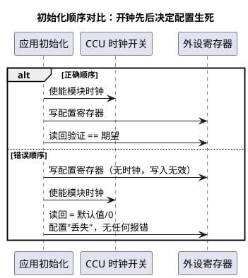
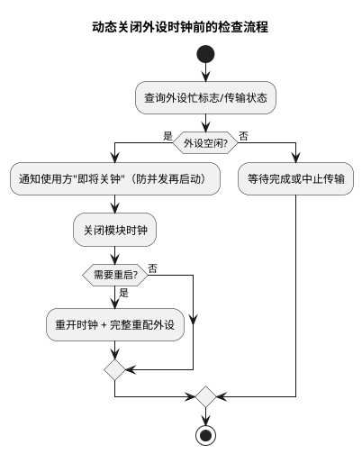

# 外设时钟门控：先开钟，再动外设

> 一句话定位：每个外设的时钟可独立开关（为功耗、也为故障隔离），但"先配寄存器、后开时钟"的顺序错误会让配置悄无声息地丢失——本篇讲机理、讲顺序、讲排障清单。
> 等级：L2 ｜ 前置：[01-CCU与时钟树](01-CCU与时钟树.md)

## 原理

### 门控的动机

1. **功耗**：不用/少用的外设关掉时钟，静态与动态功耗立刻下降，是低功耗设计的第一杠杆；
2. **故障隔离**：某外设异常时可单独关它的时钟再开（软复位辅助手段）；
3. **初始化次序控制**：时钟开关本身就是外设"上电顺序"的一部分。

TC377 上每个模块有时钟使能位（CCU 的模块使能寄存器，每位对应一个模块），部分模块还有自己的模块时钟控制寄存器 CLC（Clock Control，概念）——两层开关以 UM 各模块章节的说明为准。

### 经典坑：先配外设、后开时钟

坑的本质：外设没有时钟时寄存器不响应写入，而总线层面通常不会给你报错（具体读回行为：读 0、读默认值还是总线异常，以 UM 对应模块说明为准）——于是"写成功了"的假象一直维持到你读回验证或功能不工作为止。

### 关钟前的安全检查（流程）

核心纪律：关钟是"事务性动作"——确认空闲、独占决策权、再动手；重开钟后一律完整重配，不赌"寄存器还记得"。

### 关时钟之后的世界

- 寄存器内容：多数实现中内容保持、但不可访问（读行为查 UM）；重新开钟后是否恢复到关钟前状态，同样以 UM 为准——安全做法是"每次开钟后完整重配"；
- 传输中关钟：外设正在搬数据（如 SPI/DMA 进行中）时关钟，可能挂起总线或丢数据——关钟前必须确认外设空闲；
- 低功耗场景：核睡眠/待机时，唤醒源（如唤醒引脚、定时器类模块）的时钟必须保持，否则"睡了叫不醒"（各低功耗模式保持哪些时钟，查 UM 电源管理章节）。

### 低功耗模式下的时钟保持（概念）

| 场景 | 时钟要求 | 恢复动作 |
|---|---|---|
| 单核睡眠 | 本核停跑，唤醒源时钟必须保持 | 唤醒后校验时钟状态再继续 |
| 系统级待机 | 按 UM 电源管理模式确定"保持集合" | 唤醒后镜像初始化流程 |
| 深度低功耗 | 多数时钟关闭 | 重开后逐外设完整重配 |

设计原则：低功耗恢复路径必须与上电初始化路径对称（同一套"开钟+重配"代码生成两份流程），并用"唤醒后读回时钟状态校验"兜底。

## 寄存器与位表

> 位定义、模块映射、访问保护查 UM CCU 章节，此处只列关注点。

| 关注对象 | 作用 | 使用要点 |
|---|---|---|
| 模块使能寄存器（CCUCON*，概念） | 每位一个模块的时钟开关 | 位↔模块映射表贴在团队 wiki，别靠记忆 |
| 模块 CLC（概念） | 模块级时钟控制 | 与 CCU 位配合，以模块章节为准 |
| 访问保护 | 部分时钟寄存器写受保护（如 ENDINIT 类） | 解锁-修改-回锁窗口最小化 |
| 时钟状态读回 | 确认开关实际状态 | 配置后读回，别信"写过了" |

## 双平台对照（AURIX vs S32K）

| 维度 | TC377（AURIX TC3xx） | S32K1xx |
|---|---|---|
| 门控位置 | CCU 模块使能位（+模块 CLC） | PCC（Peripheral Clock Control）每外设一位 |
| 关钟后读寄存器 | 行为以 UM 为准 | 通常读 0（无时钟不响应，查 RM） |
| 低功耗联动 | 各模式保持时钟集合查 UM | VLPR/VLPS 等模式时钟策略由模式配置决定 |
| 典型坑 | 先配后开钟、传输中关钟 | 同款坑：PCC 未开先配外设 |

## 代码/实操

- 标准初始化模板（概念）：开模块时钟 → 复位外设（如支持）→ 写配置 → 读回验证 → 使能外设功能。读回验证是发现顺序错误的最廉价手段；
- iLLD 模块驱动内部一般自带时钟使能步骤（以所用版本为准），但混用裸寄存器代码时要自己补齐；
- TRACE32：新外设无响应时，第一步读 CCU 使能位确认时钟状态，第二步读回一个已知寄存器（如版本 ID 类寄存器，存在与否查模块章节）确认模块可访问。

### 排障清单：新外设没反应

1. 模块时钟使能位开了吗？（读回确认）
2. 复位释放了吗？（复位状态寄存器）
3. 寄存器读回验证做了吗？（配置真的写进去了？）
4. 有无访问保护未解锁（ENDINIT 类）？
5. 引脚复用/Port 配置对了吗？
6. 低功耗恢复路径上有没有漏掉重开时钟？

## 易错点与陷阱

1. **顺序坑**：先写配置后开钟，写入无效且无报错——把"开钟"做成外设初始化函数的第一行；
2. **传输中关钟**：DMA/SPI 进行中关模块时钟，总线挂死比丢数据更常见，关钟前查忙标志；
3. **唤醒后忘开钟**：低功耗恢复代码与初始化代码不对称，"睡一觉外设就没了"；
4. **以为关钟=断电**：门控只断时钟，漏电流级别的外设级电源管理是另一回事；
5. **读回值不验证**：所有"配置写入"都默认成功，问题拖到联调才爆；
6. **两处代码抢着开关同一模块时钟**：一个流程开了、另一个关了，间歇性抽风，时钟开关必须单一归属管理；
7. **调试器读外设辅助排查时也受门控影响**：时钟没开时连"看寄存器"都看不真切，先用调试器开钟再查外设状态；
8. **把关钟当复位手段滥用**：外设异常就"关钟再开钟"，掩盖真实根因，且重配流程缺失时行为更不可预测。

## 面试高频题

1. **为什么要做外设时钟门控？**
   答：降功耗（未用模块关钟）、故障隔离（单独关停/重启出问题的模块）、配合低功耗模式裁剪活动时钟集合。

2. **外设初始化的正确顺序是什么？**
   答：先使能模块时钟（含解锁必要的访问保护），再复位/写配置寄存器，然后读回验证，最后使能功能。顺序反了配置会无声丢失。

3. **关掉时钟后寄存器会怎样？**
   答：一般内容保持但不可访问（读行为以 UM 为准）；工程上不依赖"恢复原状"，重开时钟后一律完整重配。

4. **低功耗模式下时钟管理要注意什么？**
   答：唤醒源时钟必须保持；恢复流程要镜像初始化流程重开各模块时钟并重配；两套流程要保持对称，最好同源生成。

5. **新加的外设完全没反应，怎么快速定位？**
   答：按清单走：时钟使能位→复位释放→寄存器读回→访问保护→引脚复用→低功耗恢复路径。前两步就能筛掉大半问题。

6. **怎么安全地动态关一个外设的钟？**
   答：先确认外设空闲（忙标志）、通知潜在使用方独占决策权，再关钟；需要重启时重开钟并完整重配。切忌传输中途关钟或"关了就不管恢复路径"。

## 延伸

- [01-CCU与时钟树.md](01-CCU与时钟树.md)：门控位所在的全局时钟框架；
- [02-PLL配置.md](02-PLL配置.md)：频率规划与"配错的现象"；
- [Mcu模块](../../../../04-MCAL与外设驱动/2-L2进阶/Mcu模块/README.md)：MCAL 对外设时钟管理的封装；
- [资源与iLLD](../资源与iLLD/README.md)：外设驱动中的时钟使能封装；
- [TC377平台](../README.md) / [02-芯片与体系结构](../../README.md)。
