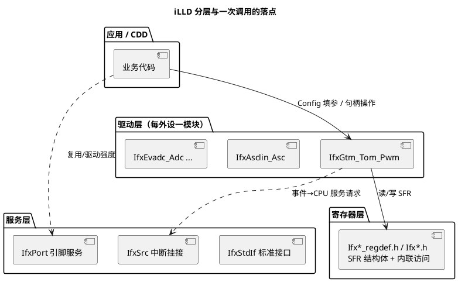

# iLLD 分层设计

> 一句话：iLLD（Infineon Low Level Drivers，英飞凌底层驱动库，随 AURIX Development Studio 交付）自下而上分"寄存器层 → 驱动层 → 服务层"，用"Config 结构体填参 → init 生成句柄 → 拿句柄调操作"的句柄式风格，是 TC377 上写裸驱/CDD 的第一选择。
> 等级：L2 ｜ 前置：[01-从零认识一颗MCU](../../../00-入门导读/01-从零认识一颗MCU.md)

## 原理

### 三层结构

| 层 | 内容 | 典型文件/前缀（以库实际目录为准） |
|---|---|---|
| 寄存器层 | SFR（Special Function Register，特殊功能寄存器）结构体映射 + 内联读写函数，只碰地址与位，无状态 | `Ifx*_regdef.h`、`Ifx*.h`，如 `IfxGtm_regdef.h` |
| 驱动层 | 每个外设一个驱动模块：Config/句柄结构体、init 系列、操作系列 | `IfxGtm_Tom_Pwm`、`IfxAsclin_Asc`、`IfxEvadc_Adc` 等 |
| 服务层 | 跨外设的通用服务：标准接口（管道/定时器）、中断挂接、引脚服务、系统定时 | `IfxStdIf`、`IfxSrc`、`IfxPort`、`IfxStm` 等 |



分层的好处：驱动层封装"结构体+流程"（初始化次序、影子更新等容易错的细节），寄存器层保留"想戳就能戳"的直通能力——做 CDD 时两层配合用。

### 句柄式 API 风格

iLLD 的模块几乎都长一个样，三段式：

1. **`IfxXxx_initConfig(&cfg, ...)`**：把 Config 结构体填成安全默认值；
2. **覆盖成员**：只改你关心的（通道、引脚、波特率、中断优先级……成员名以头文件为准）；
3. **`IfxXxx_init(&drv, &cfg)`**：按配置初始化硬件，产出**驱动句柄**（如 `IfxGtm_Tom_Pwm_Driver`），之后所有操作都拿句柄调用（`IfxGtm_Tom_Pwm_setDutyCycle(&drv, ...)`）。

句柄里保存了模块/通道/引脚等运行状态，所以同一份驱动代码可以在多个通道实例上复用——这与 MCAL"全局静态配置 + 通道号"的风格是两种流派。

### 中断怎么挂

外设事件到 CPU 走的是 SRC（Service Request Node，服务请求节点）。iLLD 里通常在 Config 中填服务请求优先级与类型，init 时一并写入 SRC；ISR（中断服务函数）由用户按编译器约定实现并在向量表登记（具体接口以 `IfxSrc.h` 与各驱动头文件为准）。这也是与 AUTOSAR OS 中断体系冲突的高发区，见 [02-iLLD与MCAL的关系](02-iLLD与MCAL的关系.md)。

## 寄存器与位表

iLLD 的"位表"在头文件里而不在 UM 里复述——UM 定义硬件，iLLD 用结构体+内联函数把它们包起来。文件命名规律（以库实际目录为准）：

| 文件/命名 | 含义 |
|---|---|
| `Ifx<外设>_regdef.h` | 外设 SFR 结构体、位域定义 |
| `Ifx<外设>.h` | 模块级内联访问函数（如 `IfxGtm_enable`） |
| `Ifx<外设>_<单元>.h` | 子单元内联函数（如 `IfxGtm_Cmu_*`、`IfxGtm_TOM_CH_*`） |
| `Ifx<外设>_<功能>.h/.c` | 驱动层模块（如 `IfxGtm_Tom_Pwm.h`） |
| `Ifx<外设>_Cfg*.h` | 引脚/时钟等映射表（如 `IfxGtm_PinMap`） |

位域访问模式：`MODULE_GTM.TOM[x].CH[y].SR0.U` 一类（寄存器名以 `regdef` 头文件为准）。**读改写 vs 直写、位域宽度、保留位处理**这些细节，内联函数已封装好，优先用内联函数而不是手戳寄存器，避免状态不同步。

## 双平台对照

| 维度 | TC377 iLLD | S32K SDK（S32K1xx 风格） |
|---|---|---|
| API 命名 | `Ifx` 前缀 + 单元路径，如 `IfxGtm_Tom_Pwm_setDutyCycle` | `模块_DRV_动词`，如 `FTM_DRV_...`、`LPUART_DRV_...` |
| 状态载体 | 驱动句柄结构体（每实例一份） | state 结构体指针 + 通道号 |
| 配置方式 | Config 结构体 + `initConfig` 默认值，手改成员 | 配置结构体/配置工具生成，初始化时传入 |
| 层次 | 寄存器层/驱动层/服务层分离清晰 | SDK 驱动 + HAL，寄存器层不强调 |
| 引脚映射 | `Ifx*_PinMap` 编译期表 | 配置工具/宏 |
| 获取方式 | AURIX Development Studio 自带 | S32 Design Studio + SDK 包 |

从 S32K 迁移的直觉转变：S32K SDK 是"驱动函数 + state 指针"，iLLD 是"Config → init → 句柄"的对象式用法；先看例程怎么填 Config，比啃头文件快。

## 代码/实操

两个最小概念示例（**接口签名一律以对应头文件为准**）：

```c
/* 例 1：GTM TOM PWM（驱动层，句柄式） */
IfxGtm_enable(&MODULE_GTM);                    /* 模块级：开 GTM（寄存器层内联） */
IfxGtm_Tom_Pwm_Config cfg;
IfxGtm_Tom_Pwm_initConfig(&cfg, ...);          /* 1. 默认值 */
cfg.tom = IfxGtm_Tom_0;                        /* 2. 覆盖成员（成员以头文件为准） */
cfg.channel = IfxGtm_Tom_Ch_0;
IfxGtm_Tom_Pwm_Driver drv;                     /* 句柄 */
IfxGtm_Tom_Pwm_initChannel(&drv, &cfg);        /* 3. init：产句柄、配硬件 */
IfxGtm_Tom_Pwm_setDutyCycle(&drv, duty);       /* 运行期操作 */

/* 例 2：ASCLIN 当 UART 用（服务层 IfxStdIf 风格的读写） */
IfxAsclin_Asc asc;
IfxAsclin_Asc_Config ascCfg;
IfxAsclin_Asc_initConfig(&ascCfg, ...);        /* 波特率/引脚/缓冲等成员以头文件为准 */
IfxAsclin_Asc_init(&asc, &ascCfg);
IfxAsclin_Asc_write(&asc, buf, &len, timeout); /* 阻塞式发送概念 */
```

上手路径：AURIX Development Studio（ADS，英飞凌官方免费 IDE）新建工程时直接选芯片对应的外设例程（UART/PWM/ADC 等），例程即"填好 Config 的最佳范文"——**先跑例程，再把 Config 搬进自己的工程**。

## 易错点与陷阱

- 跳过 `initConfig` 直接定义未初始化的 Config：成员是垃圾值，初始化行为不可预期。
- init 之后再改 Config 结构体不生效：参数已搬进硬件与句柄，要改参数用 set 类接口或重新 init。
- 中断只填了优先级没登记 ISR/向量：事件丢、程序"看起来死等"；ISR 写法还要匹配编译器约定。
- 同一外设被多处重复 `init`（main 一处、CDD 一处）：后到的把先到的配置冲掉——工程里约定唯一 owner。
- iLLD 版本与芯片不匹配：引脚映射/模块宏对不上，编译期就该暴露，别硬改库源码绕过。
- 一边用 iLLD API、一边手戳同一寄存器：API 句柄里的缓存状态与硬件脱节，行为诡异。
- 在 AUTOSAR 工程里把 ADS 例程的 `core_main` 初始化原样搬进来：会重复甚至破坏 MCAL 已做的时钟/外设初始化（见下篇）。

## 面试高频题

1. **iLLD 分几层？各层职责？**
   答：寄存器层（SFR 映射+内联访问）、驱动层（每外设的 Config/init/操作模块）、服务层（标准接口、中断挂接、引脚等跨外设服务）。
2. **描述 iLLD 的句柄式编程模式。**
   答：`initConfig` 填默认 → 覆盖 Config 成员 → `init` 生成驱动句柄 → 用句柄调操作接口；句柄承载实例状态，可多实例复用。
3. **iLLD 与 MCAL 的定位差异？**
   答：iLLD 是厂商私有底层库、面向裸驱/快速原型；MCAL 是 AUTOSAR 标准化抽象、面向可移植的基础软件（详见下篇）。
4. **iLLD 里外设中断怎么接上 CPU？**
   答：Config 中填服务请求优先级，init 写入对应 SRC 节点，用户按向量表约定实现 ISR（以 IfxSrc 与驱动头文件为准）。
5. **为什么 CDD 里常用 iLLD 而不直接写寄存器？**
   答：iLLD 封装了初始化次序、影子更新、引脚映射等易错细节，又有寄存器层兜底；开发效率与可维护性都高于纯手写。

## 延伸

- [iLLD与MCAL的关系](02-iLLD与MCAL的关系.md) | [常用iLLD接口速查](03-常用iLLD接口速查.md)
- [GTM](../GTM/README.md)：TOM/ATOM 通道与配置心智模型
- [CDD设计方法论](../../../../04-MCAL与外设驱动/2-L2进阶/CDD设计方法论/README.md) | [驱动分层思想](../../../../04-MCAL与外设驱动/1-L1基础/驱动分层思想/README.md)
- [TC377平台](../README.md) | [图表规范与模板](../../../../00-总览/图表规范与模板.md)
