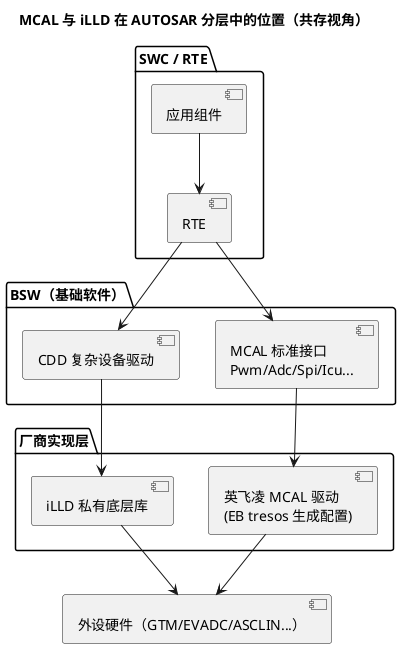

# iLLD 与 MCAL 的关系

> 一句话：MCAL（Microcontroller Abstraction Layer，微控制器抽象层）是 AUTOSAR 标准化、可移植的外设接口（EB tresos 配置生成），iLLD 是英飞凌私有底层库（裸驱/快速原型）；实际工程里基础栈跑 MCAL，CDD（Complex Device Driver）在 MCAL 覆盖不了的场景直接调 iLLD——两者共存要管住"时钟、重复初始化、中断优先级"三件事。
> 等级：L2 ｜ 前置：[01-iLLD分层设计](01-iLLD分层设计.md)

## 原理

### 定位差异：标准接口 vs 厂商库

- **MCAL**：AUTOSAR 定义的一组**标准 C 接口与配置语义**（Pwm/Adc/Spi/Icu/Port/Mcu…），由 EB tresos（Elektrobit 配置工具）生成配置代码，供应商提供实现。价值在**可移植**：换芯片换 MCAL 包，应用与 BSW 不动。
- **iLLD**：英飞凌随 ADS（AURIX Development Studio）交付的**私有驱动库**，无标准接口约束，直接暴露硬件能力（如 GTM 的 ATOM/ARU 特性）。价值在**能力完整、上手快**，但不可移植。



两条通路到同一批硬件——这就是"共存"的全部含义，也是全部风险来源。

### 工程实践组合

典型的 AURIX + AUTOSAR 工程：

- 基础功能（常规 PWM、ADC、SPI 通信、DIO）全部走 **MCAL**，享受标准化与工具链检查；
- **CDD 直接调 iLLD** 出现在两类场景：
  1. **复杂波形/高级特性**：GTM 的 ATOM + ARU + DPLL 联动、多路精确同步 + 软件死区等，MCAL Pwm 配置面覆盖不到；
  2. **MCAL 未覆盖的外设/用法**：特殊外设、DMA 大吞吐、极限时序要求的位操作。
- MCAL 生成代码与 iLLD 的关系：tresos 生成的是配置 + 标准接口集成层；英飞凌 MCAL 驱动实现与 iLLD 同厂同思路但**相互独立**（对应关系以驱动包文档/源码为准）。CDD 调 iLLD 不是绕过 AUTOSAR，而是 AUTOSAR 明文允许的扩展点。

### 共存的三个坑（机制级）

1. **重复初始化外设/时钟**：Mcu MCAL 已按配置初始化 GTM/EVADC 时钟，CDD 又执行 iLLD 的模块级 init（可能含复位/全局配置），把 MCAL 配好的通道冲掉——症状是"单独都好，一起就坏"；
2. **中断优先级体系冲突**：AUTOSAR OS 管理中断优先级与 ISR 类别（Cat1/Cat2），iLLD 例程直接写 SRC 优先级、用裸 ISR 写法，两套约定打架会造成中断丢失或 OS 断言；
3. **引脚归属不清**：Port MCAL 与 iLLD `IfxPort`/驱动 init 各配一遍复用，后写的赢，先配的模块无声。

## 寄存器与位表

本篇的"位表"是**资源归属表**——共存工程里每类资源只能有一个 owner：

| 共享资源 | MCAL 侧 owner | iLLD/CDD 侧 owner | 冲突后果 | 裁决办法 |
|---|---|---|---|---|
| 外设全局时钟/使能（GTM、EVADC…） | Mcu/Pwm/Adc 配置 | `IfxGtm_enable` 等模块 init | 后到者重置全局，前者通道失效 | 全局资源统一归 MCAL（或明确归 CDD），写进集成设计 |
| GTM 通道（TOM/ATOM/TIM） | Pwm/Icu 通道分配 | `IfxGtm_Tom_Pwm` 等句柄 | 同通道双写，波形错乱 | 通道分配表冻结，配置期互斥检查 |
| EVADC 组/通道 | Adc 配置 | `IfxEvadc_Adc_*` | 扫描互相打断 | 组级划分归属 |
| 引脚复用 | Port 配置 | `IfxPort`/驱动 init | 复用被覆盖，模块无声 | 每个引脚唯一 owner，文档化 |
| SRC 中断节点 | OS/MCAL 中断配置 | `IfxSrc`/Config 优先级 | 优先级失配、ISR 不被调 | 统一走 OS 中断体系登记 |

## 双平台对照

| 维度 | TC377 | S32K |
|---|---|---|
| 标准栈 | MCAL（EB tresos + 英飞凌驱动包） | MCAL（EB tresos + NXP 驱动包） |
| 私有库 | iLLD（ADS 交付） | S32K1xx：SDK；S32K3：RTD |
| CDD 挂底层方式 | CDD 直接调 iLLD | CDD 调 SDK/RTD 底层接口 |
| 典型冲突 | GTM 通道、SRC 优先级、Port 复用 | FTM/eMIOS 通道、中断、复用 |
| 规避思路 | 资源 owner 表 + 初始化次序约定 | 同左 |

## 代码/实操

CDD 里用 iLLD 驱动 GTM TOM PWM 的骨架（**签名以头文件为准**）：

```c
/* CDD 内部：只在 CDD 拥有的通道上操作，绝不动 MCAL 拥有的通道/时钟 */
static IfxGtm_Tom_Pwm_Driver myPwm;         /* CDD 私有句柄 */

void MyCdd_Init(void)
{
    IfxGtm_Tom_Pwm_Config cfg;
    IfxGtm_Tom_Pwm_initConfig(&cfg, ...);   /* 默认值 */
    cfg.tom = ...; cfg.channel = ...;       /* 只用分配给 CDD 的通道（成员以头文件为准） */
    IfxGtm_Tom_Pwm_initChannel(&myPwm, &cfg);
}
```

初始化次序约定（共存工程的生命线）：

1. EcuM 启动 → Mcu/Port/Pwm 等 MCAL 初始化（先到）；
2. CDD 的 iLLD init 在 MCAL 之后执行（后到），且**不做模块级复位/全局时钟重配**；
3. 运行期双方只碰各自资源。

**决策表：这个功能用 MCAL 还是 CDD+iLLD？**

| 场景 | 建议 |
|---|---|
| 常规 PWM/ADC/SPI/DIO，BSW 或普通 SWC 使用 | MCAL |
| 需要 GTM 高级特性（ATOM/ARU/DPLL 联动、特殊同步/死区策略） | CDD + iLLD |
| MCAL 未覆盖的外设/特殊工作模式 | CDD + iLLD |
| 对可移植性要求高（多平台车型项目） | 尽量 MCAL，CDD 隔离在最小接口后 |
| 无 AUTOSAR 的原型/工具类工程 | 直接 iLLD 裸驱 |
| 时序不确定时 | 先按 MCAL 评估，配置面确实不够再上 CDD |

## 易错点与陷阱

- **两边都初始化同一外设**：不是编译错误，是运行期互相冲掉的"时好时坏"——资源 owner 表要落到文档。
- 把 ADS 例程的初始化整段搬进 AUTOSAR 工程：例程里的时钟/全局初始化会破坏 MCAL 配置，只搬"通道级"调用。
- iLLD 的裸 ISR 写法与 OS 中断体系冲突：应按 OS 的 ISR 框架包一层再调 iLLD 处理逻辑。
- CDD 里调 `IfxGtm_enable`/模块 init 这类**全局动作**：影响的不只是自己那几个通道。
- Port 复用双写：不是"谁对谁错"，是"后写的赢"——把引脚 owner 写清楚。
- EVADC 组被两侧扫描：转换请求互相打断，结果偶发错乱。
- 认为"CDD 就是没规矩的代码"：恰恰相反，CDD 是 AUTOSAR 的正式扩展点，资源约定与接口设计要比 MCAL 更严格。

## 面试高频题

1. **MCAL 与 iLLD 的本质区别？**
   答：MCAL 是 AUTOSAR 标准接口层（可移植、EB tresos 生成配置）；iLLD 是厂商私有底层库（能力完整、不可移植）。一个面向标准化，一个面向硬件直达。
2. **CDD 为什么可以直接用 iLLD？**
   答：CDD 是 AUTOSAR 分层里预留的扩展点，位于 BSW 中直通硬件；RTE 只看 CDD 对外暴露的接口，内部用 iLLD 还是寄存器是它的自由。
3. **两者共存最容易踩的三个坑？**
   答：重复初始化外设/时钟（后者冲掉前者）、中断优先级体系冲突（OS 体系 vs 裸 SRC 写法）、引脚复用双写覆盖。
4. **什么时候选择 CDD + iLLD 而不是扩展 MCAL 配置？**
   答：MCAL 配置面覆盖不了的高级特性（如 GTM 的 ARU/DPLL 联动复杂波形）、未支持的外设或特殊时序要求；否则优先 MCAL 保可移植性。
5. **如何防止 CDD 破坏 MCAL 的配置？**
   答：资源 owner 表（外设/通道/引脚/中断逐一归属）+ 初始化次序约定（CDD 后于 MCAL 且不做全局动作）+ 运行期只碰自己的句柄。

## 延伸

- [iLLD分层设计](01-iLLD分层设计.md) | [常用iLLD接口速查](03-常用iLLD接口速查.md)
- [GTM](../GTM/README.md)：GTM 资源与通道模型（冲突的"现场"）
- [MCAL 总览](../../../../04-MCAL与外设驱动/1-L1基础/MCAL总览/README.md) | [CDD设计方法论](../../../../04-MCAL与外设驱动/2-L2进阶/CDD设计方法论/README.md) | [驱动分层思想](../../../../04-MCAL与外设驱动/1-L1基础/驱动分层思想/README.md)
- [TC377平台](../README.md)
