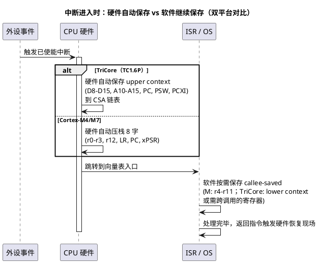

# 寄存器模型

> 一句话定位：CPU 里程序员真正"看得见"的全部状态载体——通用寄存器、状态/控制寄存器、外设映射寄存器（SFR），以及"谁在什么时刻动它们"，这是读反汇编、定位 Trap/HardFault、写启动代码的地基。
> 等级：L2 ｜ 前置：[01-编程模型与寄存器](../../1-L1基础/ARM-Cortex-M/01-编程模型与寄存器.md)

## 原理

### 1. 寄存器的三大类

| 类别 | 英文/别名 | 访问方式 | 典型例子 |
|---|---|---|---|
| 通用寄存器 | GPR（General Purpose Register） | 指令操作数直接引用，无地址 | TriCore D0–D15 / A0–A15；Cortex-M r0–r12 |
| 状态与控制寄存器 | SPR（Special Purpose Register） | 特殊指令或专用访问路径 | PC、PSW / xPSR、PCXI、CONTROL、PRIMASK、ICR |
| 外设特殊功能寄存器 | SFR（Special Function Register） | 内存映射（MMIO）普通读写 | CAN 控制器、PORT、ADC、GTM 的配置寄存器 |

要点：

- GPR/SPR 在**内核内部**，不占地址空间；SFR 在**地址空间中有唯一地址**，用普通 load/store 指令访问。
- AUTOSAR MCAL 驱动的本质工作循环就是：读 SFR → 改位域 → 写回 → 轮询/等待状态位。
- "程序员可见寄存器组"（programmer-visible register set）是**编译器 ABI、OS 上下文切换、调试器栈回溯**三方共同的契约，任何一方不守约，现场必然错乱。

### 2. 状态标志（Flags）

- 条件标志：N/Z/C/V（及 M4/M7 的 Q、GE）记录最近一次 ALU 运算结果，供条件跳转使用。
- 特权标志：TriCore 在 PSW 中带 I/O 特权级（用户态/内核态分级，具体分级数查架构手册）；Cortex-M 用 CONTROL.nPRIV 区分特权/非特权。
- 中断使能状态：TriCore 由 PSW/ICR/PCXI.PIE 联合记录；Cortex-M 由 PRIMASK / BASEPRI / FAULTMASK 三件套承担。

### 3. 调用约定下的寄存器分工

调用约定（Calling Convention，属于 ABI 的一部分）把寄存器切成三块：

1. **参数/返回值/临时寄存器**（caller-saved，调用者保存）：调用别人前若后面还要用，调用者自己先保存；
2. **被调用者保存寄存器**（callee-saved）：函数要用就必须先压栈、返回前恢复；
3. **专用寄存器**：SP、返回地址、PC，由硬件与编译器模板化维护。

### 4. 谁在什么时刻动这些寄存器

| 时刻 | 主体 | 动作 |
|---|---|---|
| 编译期 | 编译器 | 静态分配变量到 callee-saved 寄存器；生成函数序言/尾声的保存恢复代码 |
| 函数调用 | 硬件 + 编译器序言 | TriCore：CALL 指令保存 lower context；Cortex-M：只写 LR，其余靠软件序言 |
| 中断/异常进入 | 硬件 | TriCore：自动保存 upper context 到 CSA；Cortex-M：自动压栈 8 个字（见下图） |
| OS 调度点 | RTOS（PendSV/SVC 或 TriCore 切换钩子） | 切换 SP（MSP/PSP）、切 CSA 链头、恢复下一任务现场 |
| 启动阶段 | 启动代码（startup_xxx.s / cstart） | 设初始 SP、初始化 CSA、清 BSS、拷数据段 |
| 在线调试 | 调试器（JTAG/SWD/DAP） | 不打断程序流地观察/修改内核与外设寄存器 |



## 寄存器与位表

### TriCore（TC1.6P）vs Cortex-M（ARMv7-M）寄存器组对照

| 角色 | TriCore TC1.6P | Cortex-M4/M7 | 说明 |
|---|---|---|---|
| 通用数据寄存器 | D0–D15（32 位） | r0–r12 | |
| 专用地址寄存器 | A0–A15（32 位） | 无独立地址寄存器组 | M 核数据/地址同用一组 GPR |
| 栈指针 | A10（SP） | r13 = MSP 或 PSP | M 核由 CONTROL.SPSEL 选择，handler 恒用 MSP |
| 返回地址 | A11（RA，随 upper context 保存） | r14（LR，异常时为 EXC_RETURN） | |
| 程序计数器 | PC | r15（PC） | |
| 状态寄存器 | PSW | xPSR = APSR + IPSR + EPSR 三个视图 | |
| 上下文信息 | PCXI（指向 CSA 链） | 无直接对等物 | M 核靠压栈 + EXC_RETURN 表达 |
| CSA 链管理 | FCX / LCX | 无（纯软件栈） | |
| 中断屏蔽/锁 | ICR + PSW 中相关位 | PRIMASK / BASEPRI / FAULTMASK | 位定义均查对应手册 |
| 栈切换 | A10 唯一（多栈软件自管） | MSP/PSP 硬件双栈 | |

### Cortex-M 状态标志（APSR，位号属 ARMv7-M 公开定义）

| 标志 | 位置 | 含义 |
|---|---|---|
| N | bit31 | 结果为负 |
| Z | bit30 | 结果为零 |
| C | bit29 | 进位/无借位 |
| V | bit28 | 有符号溢出 |
| Q | bit27 | 累加饱和 |
| GE[3:0] | bit16–19 | SIMD 打包比较结果（M4/M7） |

TriCore PSW 中 IO（特权级）、CDC（调用深度计数）、IE（中断使能）等位号与复位值：**查 TriCore Architecture Manual 的 PSW/PCXI 章节**；PCXI 中 PCX/PIE/UL/PCXS 的位分布同样以手册为准，不要凭记忆写进代码。

### 调用约定速查（概念级）

| 约定项 | Cortex-M（AAPCS） | TriCore（GCC/TASKING ABI） |
|---|---|---|
| 参数寄存器 | r0–r3，超出走栈 | D/A 寄存器前若干个，数量与类型规则**以所用编译器 ABI 手册为准** |
| 返回值 | r0（64 位用 r0:r1） | 标量结果一般在 D0，宽结果规则查 ABI 手册 |
| caller-saved | r0–r3、r12（IP） | lower context 覆盖范围（D0–D7、A2–A7 一带） |
| callee-saved | r4–r11 | upper context 覆盖范围（D8–D15、A10–A15），由硬件保存与函数序言共同保证 |
| 栈对齐 | SP 双字（8 字节）对齐 | 由 ABI 规定，查编译器手册 |

## 双平台对照

| 维度 | TC377（TriCore TC1.6P） | S32K（Cortex-M4/M7） |
|---|---|---|
| 硬件保存的上下文 | upper context：D8–D15、A10–A15、PC、PSW、PCXI | 8 字：r0–r3、r12、LR、PC、xPSR |
| 保存目的地 | CSA 链表（通常位于 DSPR，64 字节/块，FCX/LCX 管理） | 软件栈（MSP） |
| 函数调用成本 | CALL 自动保存 lower context（A2–A7、D0–D7），快但耗 CSA | 仅跳转 + 写 LR，保存全靠编译器序言 |
| 返回机制 | RET 指令按 PCXI 恢复上下文 | BX LR / POP {pc} |
| 栈模型 | 单栈指针 A10 | 双栈 MSP/PSP，handler/线程天然隔离 |
| 典型崩溃姿势 | CSA 区未初始化 → 第一次中断即 Context Trap | 中断里误用/误切 PSP → 栈污染、HardFault |

## 代码/实操

- 裸寄存器操作（TriCore 风格，位域操作前先读后写）：

```c
/* 概念示例：改 SFR 位域的标准三步 */
uint32_t reg = MODULE_HW->CTRL;      /* 1. 读回 */
reg = (reg & ~MASK_CFG) | NEW_CFG;   /* 2. 改位域（先清后置） */
MODULE_HW->CTRL = reg;               /* 3. 写回 */
```

- 调试时优先看：出错现场的 PSW/xPSR（特权/标志）、PC（出错指令）、SP 与栈内容（判断溢出/跑飞）、TriCore 的 PCXI/CSA 链或 M 核的 LR/EXC_RETURN（谁调进来的）。

## 易错点与陷阱

1. **CSA 没初始化就开中断**：TriCore 的上下文全靠 CSA 链表，启动代码漏配 `__CSA_BEGIN`/`__CSA_END` 或 FCX 初值，第一次中断就 Context Trap。
2. **handler 里用 PSP 语义写代码**：Cortex-M 中断恒用 MSP，若线程用 PSP 而中断里切栈，极易踩坏线程栈。
3. **假设 r0–r3/参数寄存器跨调用保值**：caller-saved 寄存器被调函数可随意破坏，跨调用暂存必须用局部变量（编译器会放 callee-saved 或栈）。
4. **对 SFR 用读-改-写**：有些标志位"读清零"或"写 1 清零"，读-改-写会误清事件标志——先看 UM/RM 的位行为说明再动手。
5. **volatile 缺失**：编译器把 SFR 访问优化掉或重排，现象是"加打印就好了"。
6. **把架构位号记在脑子里写码**：位号一律以手册/厂商头文件为准，人脑位号是 Trap 的头号来源。

## 面试高频题

1. **TriCore 一次函数调用保存了什么？和 Cortex-M 有何不同？**
   答：TriCore 的 CALL 触发硬件保存 lower context（D0–D7、A2–A7），中断再叠加 upper context（D8–D15、A10–A15、PC、PSW、PCXI），全部进 CSA；Cortex-M 函数调用只写 LR，仅异常/中断时硬件自动压 8 个字到栈，r4–r11 靠软件序言保存。
2. **什么是 caller-saved / callee-saved？为什么要分？**
   答：调用约定规定哪些寄存器被调函数可以随意用（caller 负责保）、哪些必须原样恢复（callee 负责保）。分工让分开编译的模块能互相链接调用，也让调试器能按约定回溯栈。
3. **中断进入时 Cortex-M 硬件压了哪 8 个寄存器？为什么是这几个？**
   答：r0–r3、r12、LR、PC、xPSR——正是 AAPCS 的 caller-saved 全集 + 返回信息，这样 ISR 的 C 编译产物无需额外保存即可满足调用约定。
4. **TriCore 的 PCXI 是干什么的？**
   答：Previous Context Information，指向当前 CSA 链，记录上一个上下文的位置与部分状态（PIE 等，位分布查架构手册），是 RET 与中断返回、上下文切换的锚点。
5. **调试 HardFault/Trap 时你先看哪些寄存器？**
   答：压栈帧里的 PC（出错指令）、xPSR/PSW（标志与特权）、LR/PCXI（调用来源）、SP 及栈深（是否溢出），再结合 map 文件反查符号。

## 延伸

- [02-流水线与性能](02-流水线与性能.md)：寄存器之后，指令如何一条条流过 CPU
- [05-存储层次](05-存储层次.md)：寄存器是金字塔的塔尖
- [TriCore架构](../../3-L3高级/TriCore架构/README.md)：CSA、trap、DSPR/PSPR 细节
- [ARM-Cortex-M](../../1-L1基础/ARM-Cortex-M/README.md)：MSP/PSP、NVIC、编程模型细节
- [异常与Trap](../../3-L3高级/异常与Trap/README.md)：Trap/HardFault 定位决策树
- [上级目录](../README.md)
