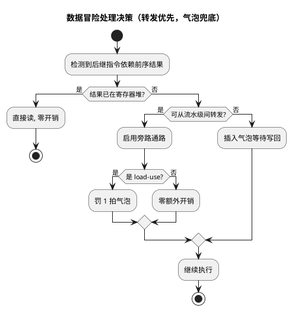

# 流水线与性能

> 一句话定位：指令级并行的来龙去脉——五段流水线、三类冒险与对策、CPI 度量，以及为什么流水线越深、双发射越猛，中断延迟和 WCET 分析反而越难。
> 等级：L2→L3 ｜ 前置：[01-寄存器模型](01-寄存器模型.md)

## 太长不看

- **人话直觉**：流水线=工厂流水线，吞吐上去但"刹车"（分支/中断）代价更大。
- **本篇解决**：CPI 为什么不是 1？流水线越深到底好还是坏？
- **赶时间记住 3 条**：
  1. CPI 理想=1，冒险使它变大；
  2. 分支预测失败=流水线排空；
  3. 深流水+双发射提吞吐但 WCET 更难算。

## 原理

### 1. 经典五段流水线（Pipeline）

| 级 | 名称 | 干什么 |
|---|---|---|
| IF | 取指（Instruction Fetch） | 按 PC 从存储器取指令 |
| ID | 译码（Instruction Decode） | 识别指令、读寄存器堆 |
| EX | 执行（Execute） | ALU 运算、地址计算、分支判定 |
| MEM | 访存（Memory Access） | load/store 实际访问数据存储器 |
| WB | 写回（Write Back） | 结果写回寄存器堆 |

流水线的本质是"装配线"：任一时刻 5 条指令各占一级，理想情况**每周期完成一条指令**（CPI = 1），单条指令的总延迟并未缩短，缩短的是**吞吐率倒数**。

### 2. 三类冒险（Hazard）与对策

| 冒险类型 | 英文 | 成因 | 对策 |
|---|---|---|---|
| 数据冒险 | Data Hazard | 后一条指令要用前一条尚未写回的结果（RAW 最常见） | 转发/旁路（Forwarding/Bypassing）；不行再插气泡（Stall/Bubble） |
| 控制冒险 | Control Hazard | 跳转/分支目标未知，取指方向存疑 | 分支预测（静态/动态）、延迟分支、提前判定 |
| 结构冒险 | Structural Hazard | 两条指令抢同一硬件（典型：取指与取数抢同一存储端口） | 哈佛结构分开取指/数据通路；资源复制 |

- **转发**：把 EX 的结果直接"抄近道"送到下一条指令的 EX 输入，不等 WB；但 **load-use 冒险**（load 的数据在 MEM 末尾才可用，紧跟的指令立即要用）转发也接不上，必须罚 1 拍气泡。
- **分支预测**：猜错则冲刷（flush）错误路径上的指令，付出"预测错误惩罚"；猜对了零代价。



### 3. CPI 与性能模型

- `CPI = 总时钟周期 / 总指令数`；`执行时间 = 指令数 × CPI × 时钟周期`。
- 实际 CPI = 理想 CPI + 数据冒险罚拍 + 控制冒险罚拍 + 结构冒险罚拍 + 存储系统罚拍（等待状态/Cache miss）。
- MCU 手册常给 DMIPS/MHz（约等于 1/CPI 的归一化值），是对比核性能的粗尺子，不是你的代码实测值。

### 4. 流水深度对中断延迟的影响

- 中断/异常要求**精确的现场**：入栈/保存上下文时，流水线里未完成的指令要么做完、要么作废，异常返回还要恢复流水。
- 流水越深、超标量越宽，**冲刷与恢复的代价越大**，中断进入/退出延迟越倾向于变大、且更不确定（还有 cache miss 叠加）。
- 功能安全视角：深流水 + 分支预测 + cache 让**最坏情况执行时间（WCET）**分析变难；汽车高阶安全核常用"确定性优先"的配置（关预测、用 TCM）换可分析性。

### 5. 超标量与双发射（概念）

- 超标量（Superscalar）：一个周期取发多条指令到多条执行通路；**双发射（Dual-issue）**即每周期最多 2 条。
- 双发射的收益条件：指令对能凑成可并行（如一条 ALU + 一条访存）、无寄存器依赖、无结构冲突；**平均加速远小于 2 倍**。
- 本库双平台相关概念：TriCore TC1.6P 部分内核具备双发射能力；Cortex-M7 为双发射 6 级流水。两家的具体级数、发射规则、DMIPS/MHz **均以各自架构手册/厂商手册为准**。

## 寄存器与位表

本篇主题无常规"位表"，与流水线/性能相关的可观测、可配置寄存器以**概念清单**列出：

| 用途 | Cortex-M（S32K） | TriCore（TC377） | 备注 |
|---|---|---|---|
| 周期计数 | DWT.CYCCNT（32 位周期计数器，由 DEMCR 中的跟踪使能位开启） | OCDS/性能监视相关计数器（名称与数量查架构手册 Performance Monitoring 章节） | 实测 CPI 的首选工具 |
| 指令/访存计数 | DWT 的 CPICNT 等计数器组 | 架构手册中性能监视单元的对应事件选择寄存器 | 位定义均查对应手册 |
| 分支/预测相关控制 | 一般不可由用户态配置 | 一般不可由用户态配置 | 属微架构实现细节 | 
| 指令缓存/预取控制 | 与 Flash 加速器/缓存配置寄存器相关（见 05-存储层次） | PFLASH 缓冲相关配置（见 05-存储层次） | 具体寄存器查 UM/RM |

> 提醒：Cortex-M 的 DWT/DEMCR 寄存器名属 ARMv7-M 公开定义，位号以 ARMv7-M Architecture Reference Manual 与厂商 RM 为准；TriCore 性能计数器的寄存器名与事件号查 TriCore Architecture Manual，不凭记忆写。

## 双平台对照

| 维度 | TC377（TriCore TC1.6P） | S32K（Cortex-M4 / M7） |
|---|---|---|
| 流水线结构 | 部分内核双发射；流水级数与发射规则以架构手册为准 | M4 经典 3 级顺序流水；M7 双发射 6 级（顺序执行，以 ARM 手册为准） |
| 取指/数据通路 | 分离的程序/数据通路（配合 DSPR/PSPR，见 05-存储层次） | I-Code/D-Code 端口分离，地址空间统一映射 |
| 分支处理 | 分支预测能力以架构手册为准 | M7 带分支预测；M4 基本静态处理（以手册为准） |
| 指令确定性 | PSPR 执行近零等待，确定性高 | ITCM/Flash 预取加速；M7 开 cache 后波动变大 |
| 中断延迟数量级 | 手册给出典型/最大值（查 UM 中断章节，与频率相关） | M4/M7 手册标注 12 周期量级（0 等待存储条件，以手册为准） |
| 性能实测手段 | OCDS/性能计数器、GTM 定时打点 | DWT.CYCCNT、SysTick 打点 |

## 代码/实操

Cortex-M 上用 DWT 周期计数器（CYCCNT）实测一段代码的周期数（概念示例，寄存器名以 CMSIS 头文件为准）：

```c
/* 1. 使能：DEMCR 置跟踪使能位，DWT_CTRL 置 CYCCNTENA 位（位号查 ARMv7-M ARM） */
/* 2. 夹取计数 */
uint32_t t0 = DWT->CYCCNT;
CriticalPath();
uint32_t dt = DWT->CYCCNT - t0;    /* 实际消耗的时钟周期数 */
```

实测 CPI 的套路：`dt` 除以该段反汇编里的指令条数即得平均 CPI，再与"理想 1.0"的差值就是冒险 + 存储罚拍的总账。

打点纪律：

- 被测代码尽量放 SRAM/ITCM/PSPR 执行，避免 Flash 等待状态污染结论（见 05-存储层次）；
- 多次测量取**最大值/分布**而不是平均值——实时系统关心最坏情况；
- 严防编译器把打点语句重排或优化掉，必要时加编译屏障，打完看一眼反汇编。

TriCore 侧等价手段：OCDS/性能计数器（配置方式查架构手册与调试器文档），或用 STM/GTM 定时器打时间戳、进出关键段翻转 GPIO 用示波器直接量。

## 易错点与陷阱

1. **把 CPI 等同于流水级数**：级数是空间结构，CPI 是时间平均值；等待状态、冒险、cache miss 全会推高 CPI。
2. **基准代码跑在 Flash 上对比 SRAM/TCM 性能**：Flash 等待状态与预取行为会污染对比结论，做核性能对比先固定代码位置。
3. **假设双发射 = 2 倍性能**：依赖指令对可并行才双发，典型代码加速有限。
4. **中断延迟只看周期数不看存储等待**：压栈/取向量都要访存，存储系统慢则实际延迟成倍放大；比较两平台延迟务必同条件下看手册的测试假设。
5. **用示波器翻转 GPIO 测延迟但忘了优化**：测量代码本身被优化/重排，先看反汇编确认翻转路径。
6. **WCET 分析忽略冲刷惩罚**：深流水核上"最坏情况"不是平均情况的 1.2 倍，安全相关任务要用专用工具或保守配置。

## 面试高频题

1. **流水线为什么能提高性能？单条指令变快了吗？**
   答：不能缩短单条指令延迟，是通过重叠执行把完成率提高到接近每周期一条（吞吐率↑），本质是时间并行。
2. **三类冒险各举一例和对策？**
   答：数据冒险——加法结果马上被下一条用，靠转发、load-use 插气泡；控制冒险——条件跳转方向未知，靠分支预测与冲刷；结构冒险——取指和取数抢同一端口，靠哈佛结构/资源复制。
3. **转发为什么解决不了 load-use？**
   答：load 的数据要到 MEM 级末尾才从存储器回来，而紧跟指令的 EX 输入在上一拍就要就绪，转发通路在时间上接不上，只能停一拍。
4. **为什么流水线越深中断延迟越差？**
   答：异常进入/退出需要排空或冲刷流水线并精确恢复现场，级数越多代价越大；叠加分支预测、cache 后不确定性也变大。
5. **怎么实测一段代码的周期数？**
   答：Cortex-M 用 DWT.CYCCNT（先使能跟踪位）夹取前后计数；TriCore 用 OCDS/性能计数器或 GTM/STM 定时器打点；注意把代码与数据固定到确定性存储区，多次取最坏值。
6. **Cortex-M7 双发射，为什么实测常常不到 2 IPC？**
   答：双发射要求相邻指令无依赖、无结构冲突且能配对；真实代码依赖密集、访存比例高，平均 IPC 远低于理论峰值。

## 延伸

- [01-寄存器模型](01-寄存器模型.md)：流水线上流动的就是对这些寄存器的读写
- [03-Cache与MPU](03-Cache与MPU.md)：存储系统罚拍的主要来源
- [05-存储层次](05-存储层次.md)：Flash 等待状态与预取如何影响实测性能
- [TriCore架构](../../3-L3高级/TriCore架构/README.md) / [ARM-Cortex-M](../../1-L1基础/ARM-Cortex-M/README.md)
- [多核架构](../../3-L3高级/多核架构/README.md)：核内并行之外的核间并行
- [上级目录](../README.md)
- 工程深入场景：AUTOSAR 项目里某运行时监控（如 E2E 超时）报某函数偶发超周期，用 DWT.CYCCNT 夹取实测发现 CPI 异常——根因是任务代码在 Flash 上执行、分支密集吃满预取惩罚；把该函数搬进 SRAM/ITCM 后抖动收窄，这类"确定性调优"正是本篇 CPI 模型的用武之地。
