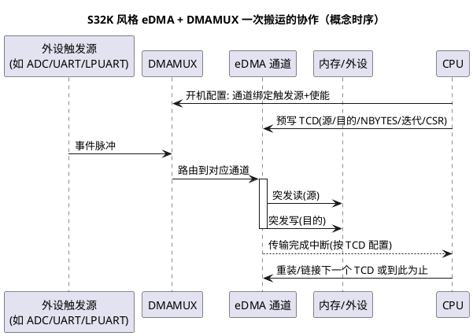

# 总线与 DMA

> 一句话定位：核与外设之间的"道路规则"——总线层级、AMBA 家族、仲裁与优先级、带宽与延迟的取舍，以及 DMA 靠"突发 + 免 CPU"把搬运活干得又快又省的机制。
> 等级：L2→L3 ｜ 前置：[02-流水线与性能](02-流水线与性能.md)

## 太长不看

- **人话直觉**：总线是小区道路，仲裁是红绿灯，DMA 是代驾——CPU 只下单不搬砖。
- **本篇解决**：谁在争总线、争不到会怎样？DMA 搬运最少要配哪几样？
- **赶时间记住 3 条**：
  1. 主发起从响应，仲裁定顺序；
  2. DMA 三要素：源/目的/触发；
  3. 完成用中断通知，别轮询。

## 原理

### 1. 总线层级：核内 → 系统 → 外设

| 层级 | 位置 | 特点 | 典型内容 |
|---|---|---|---|
| 核内总线 | CPU 内部 | 极宽极快，与核同频 | 寄存器堆读写、私有 DSPR/PSPR 端口 |
| 系统总线/互联 | SoC 骨干 | 多主多从，仲裁集中 | CPU、DMA、Flash 控制器、共享 SRAM、GTM |
| 外设总线 | 骨干经桥降速挂外设 |低速省电、寄存器型访问 | PORT/ADC/CAN/LIN 等配置接口 |

- 桥（Bridge）承担层级间的协议与速率转换，也是性能突变的"关卡"：跨桥访问天然比同层访问慢。
- 多主设备（CPU、DMA、多核、调试口）共享从设备（SRAM/Flash/外设）——**仲裁器**决定谁先用路。

### 2. AMBA 家族（概念）

AMBA（Advanced Microcontroller Bus Architecture）是 ARM 生态的片上总线标准：

| 成员 | 定位 | 一句话 |
|---|---|---|
| AHB / AHB-Lite | 高速系统骨干 | 高带宽，挂 CPU/DMA/SRAM/Flash |
| APB | 外设总线 | 简单省电，挂慢速配置寄存器 |
| AXI | 高性能（更多见于 A 核/SoC） | 读写通道分离、outstanding、突发 |

NXP S32K 即基于 AMBA 体系：核与存储经总线矩阵（crossbar）互联，外设经 AHB→APB 桥挂载（各型号拓扑以 RM 的系统互联章节为准）。英飞凌 AURIX 有自己的互联命名（如 SRI/SPB 一类的共享资源互联/系统外设总线），模型同样是"骨干 + 桥 + 外设"，具体名称与拓扑**以 TC377 UM 为准**。

### 3. 仲裁与优先级

- 常见策略：**固定优先级**（高优先级主设备饿死低者）、**轮转**（Round-Robin，公平）、**时分/加权**（TDMA/加权仲裁，可分析性好，汽车 SoC 常用）。
- 仲裁影响的是**延迟确定性**：固定优先级对高优先级主设备延迟最优但可能饿死他人；轮转公平但抖动大。
- 汽车场景要点：GTM/大块 DMA 搬运时 CPU 访问共享区变慢，常见"CPU 偶发卡顿"的真实原因不在软件，在总线仲裁。

### 4. 带宽 vs 延迟

- **带宽（Bandwidth）**：单位时间搬多少数据，≈ 总线频率 × 数据位宽 × 突发效率；看吞吐、看大块搬运。
- **延迟（Latency）**：一次请求从发出到响应返回的时间；看寄存器读写手感、看事件响应。
- 两者独立：高带宽总线（突发流水）单次小访问延迟未必低；外设配置访问要的是**低延迟**，大块搬运要的是**高带宽**。
- **突发传输（Burst）**：一次地址 + 连续多个数据，摊薄地址/仲裁开销，是总线效率的核心手段，也是 DMA 快的第一原因。

### 5. DMA 为什么快

| CPU 搬运（循环 copy） | DMA 搬运 |
|---|---|
| 每字一次取指（循环指令反复取） | 零取指 |
| 读改寄存器、更新指针、判循环、跳转 | 硬件地址自增 + 计数器 |
| 占用 CPU 全部流水 | CPU 完全并行干别的 |
| 逐字零散访问总线 | 突发成串占线，总线效率高 |

DMA（Direct Memory Access）的本质：把"地址自增 + 计数 + 收发同步"固化成硬件状态机，CPU 只负责开局与收尾。概念上仍会"周期窃取"（cycle stealing）——DMA 与 CPU 分时占总线，搬运越猛 CPU 访存越慢。

### 6. 描述符式 DMA（概念）

- 简单 DMA：一套源/目的/计数寄存器，搬完一轮靠中断续填——CPU 仍被频繁打扰。
- **描述符（Descriptor）式**：把一轮传输的完整参数（源、目的、步长、次数、下一个描述符指针）打包成内存中的描述符链；DMA 硬件自动取链、自动衔接（scatter-gather 散列-聚集），CPU 可以"配置一次，睡觉收尾"。
- S32K eDMA 的 TCD（Transfer Control Descriptor）即描述符思想的落地；TC377 DMA 亦支持链式/队列化传输组织（具体形态查 UM）。

### 7. DMA 与 CPU 的三种协作模式

| 模式 | CPU 参与度 | 适用 | 代价 |
|---|---|---|---|
| 轮询 | 反复查完成标志 | 短搬运、无中断环境 | 空转烧 CPU |
| 中断驱动 | 完成中断里续填参数/换缓冲 | 通用收发流 | 每轮一次中断开销 |
| 链式/描述符 | 配置一次"睡到底" | 大批量、多段搬运 | 描述符占内存 + 配置复杂 |

流式收发（ADC 连续采样、串口大流量）的标准姿势：**环形缓冲 + DMA 自动回卷 + 半满/全满双中断**——CPU 每次醒来处理半个缓冲区，DMA 同时写另一半，吞吐与实时性兼得；这也是 AUTOSAR MCAL 里 ADC/SPI 分组转换背后的搬运骨架。

## 寄存器与位表

DMA 配置的"概念字段表"（两平台落点对照；**位号一律查对应手册**）：

| 概念字段 | 作用 | S32K（eDMA，字段名以 RM 为准） | TC377（DMA，字段名以 UM 为准） |
|---|---|---|---|
| 源地址/目的地址 | 起止位置 | TCD 的 SADDR / DADDR | 通道的 SADR / DADR 一类 |
| 传输宽度 | 每次几位 | SSIZE / DSIZE | 传输宽度控制字段 |
| 单次搬运量 | 一个服务搬多少 | NBYTES（minor loop 粒度） | 块长/事务长度类字段 |
| 迭代计数 | 搬多少轮 | CITER / BITER（major loop） | 事务计数类字段 |
| 源/目的修正 | 地址步长（含散列） | SOFF / DOFF / SLAST / DLAST | 步长/增量控制字段 |
| 触发选择 | 谁来点火 | DMAMUX CHCFG（路由外设到通道） | 通道触发源选择（TSRC 一类） | 
| 完成与链接 | 中断 + 下一描述符 | TCD CSR（INTMAJOR / MAJLINK 等） | 通道中断/链式控制字段 |
| 环形缓冲 | 自动回卷 | 模/偏移特性（RM 相关章节） | 模式/回卷配置（UM 相关章节） |

> 提醒：S32K1 与 S32K3 的 eDMA/DMAMUX 在通道数、DMAMUX 形态、TCD 细节上均有差异；TC377 每个 CPU 各自有 DMA 模块，通道数与触发源映射因核而异——**通道数、触发源表、字段位号一律以各自 RM/UM 的 DMA 章节为准**，本表只承载概念。

## 双平台对照

| 维度 | TC377（AURIX） | S32K（NXP） |
|---|---|---|
| DMA 引擎形态 | 每 CPU 配套 DMA 模块（多引擎并行、就近服务本核外设，通道数查 UM） | 集中式 eDMA 引擎 + DMAMUX 触发路由（S32K1/K3 细节不同，查 RM） |
| 触发/请求模型 | 硬件请求线映射到通道（映射表查 UM） | 外设请求经 DMAMUX 编码选择通道（路由表查 RM） |
| 传输组织 | 事务/链式组织，支持块与队列（形态查 UM） | TCD 描述符 + minor/major 双层循环 + 链接 |
| 典型用户 | GTM、ADC 结果、DSPI/ASCLIN 收发、ERU 联动（以 UM 映射表为准） | ADC、LPUART/LPSPI/LPI2C 收发、FlexCAN 报文 RAM、FlexIO（以 RM 为准） |
| 配置入口 | iLLD 封装（IfxDma_* 一类，以 iLLD 手册为准） | SDK/寄存器直配（edma_drv / eDMA 寄存器组） |
| 与 CPU 关系 | DMA 走系统互联与 CPU 抢共享从设备；放 DSPR 注意跨核访问代价 | 同样抢总线；M7 平台注意 D-cache 一致性（见 03-Cache与MPU） |

## 易错点与陷阱

1. **配了 eDMA 忘开 DMAMUX 通道使能**：通道永远不触发，"配置都对就是不动"，排查先看触发链两层使能。
2. **minor/major loop 概念混用**（S32K）：NBYTES 是单次服务量，CITER/BITER 才是大循环；想把 512 字节按 16 字节×32 次搬，参数是"NBYTES=16, 迭代 32"不是"一次 512"。
3. **DMA 缓冲放错存储区**：M7 平台放可缓存区没做 clean/invalidate（见 03）；TC377 平台把本核 DMA 缓冲放到别的核的 DSPR，跨核访问慢一截。
4. **完成中断标志没清**：进 ISR 处理完不清标志，退出立刻重入，现象是"系统假死在中断里"。
5. **大块搬运把总线打满**：GTM/显示类大流量 DMA 与 CPU 抢共享 SRAM，CPU 偶发卡顿；规划分区（各自 DSPR/本地 SRAM）或错峰。
6. **对齐与宽度不匹配**：16 位访问落在奇地址、突发跨边界被拆碎，性能骤降甚至总线错误——缓冲区按突发友好方式对齐。
7. **以为 DMA 一定比 CPU 快**：小数据量（几个字节）时 DMA 启动开销可能大于 CPU 循环；搬运量小于阈值时手搬反而快。

## 面试高频题

1. **DMA 为什么比 CPU 循环搬运快？**
   答：免取指/免循环开销、地址自增与计数硬件化、突发传输摊薄总线开销、CPU 完全并行；代价是与 CPU 分时抢总线（cycle stealing）。
2. **什么是突发传输？为什么重要？**
   答：一次仲裁一次地址、连续传多个数据的总线事务；把每字一次的仲裁/地址开销摊薄到整串数据上，是总线带宽效率的关键。
3. **带宽和延迟的区别？各对应什么应用关注点？**
   答：带宽是单位时间吞吐（大块搬运、日志、采集流），延迟是单次请求往返时间（外设寄存器读写、事件响应）；高带宽不等于低延迟。
4. **总线仲裁有哪些策略？各自的代价？**
   答：固定优先级（低优先级可能饿死）、轮转（公平但抖动）、时分/加权（确定性最好、利用率略低）；汽车 SoC 偏好可分析的策略。
5. **S32K 上 DMAMUX 是干什么的？**
   答：把众多外设 DMA 请求路由/复用到 eDMA 的有限通道上，通道号与触发源在 DMAMUX 中绑定并使能，eDMA 只认通道不认外设。
6. **DMA 与 cache 一致性问题怎么防？**
   答：DMA 缓冲区放非缓存/共享区，或发送前 clean、接收前 invalidate 对应 cache 行；并保证缓冲区对齐到 cache 行边界，避免"顺带失效邻居"。

## 延伸

- [03-Cache与MPU](03-Cache与MPU.md)：DMA 一致性问题的另一半
- [05-存储层次](05-存储层次.md)：DMA 缓冲放哪个存储区最划算
- [01-寄存器模型](01-寄存器模型.md)：SFR 与寄存器访问模型
- [TC377平台](../TC377平台/README.md) / [S32K平台](../../1-L1基础/S32K平台/README.md)：平台专区
- [上级目录](../README.md)
- 工程深入场景：ADAS 域控上 ADC 高速流 + 多路 CAN DMA + GTM 同跑，CPU 访问共享 SRAM 偶发卡顿、任务抖动超标——定位到最后不是软件问题，是总线仲裁与分区规划问题；按本篇思路把各主设备缓冲迁回各自本地 RAM/错峰搬运，抖动收窄，这类"系统性性能问题"是总线知识真正的用武之地。
