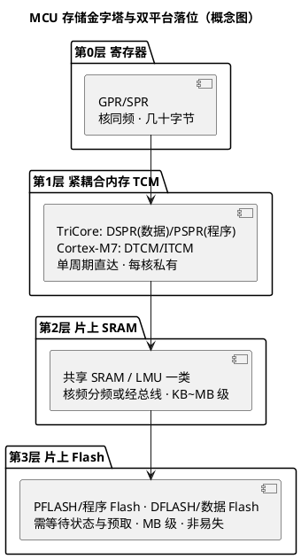

# 存储层次

> 一句话定位：寄存器→紧耦合内存（DSPR/PSPR、ITCM/DTCM）→SRAM→Flash 的金字塔，速度/容量/易失三角怎么摆平，代码放 PSPR 的收益与代价，以及 Flash 等待状态与预取如何悄悄决定实测性能。
> 等级：L2→L3 ｜ 前置：[03-Cache与MPU](03-Cache与MPU.md)、[04-总线与DMA](04-总线与DMA.md)

## 太长不看

- **人话直觉**：寄存器-缓存-SRAM-Flash=手边-桌面-柜子-仓库。
- **本篇解决**：代码放 PSPR/ITCM 真的有收益吗？上电后 .data 怎么进的 RAM？
- **赶时间记住 3 条**：
  1. 远端存储访问加等待状态；
  2. copy table 上电搬 .data 进 RAM；
  3. 热代码/关键 ISR 放紧耦合内存。

## 原理

### 1. 存储金字塔

越往上越快、越小、越贵（按字节），越往下越慢、越大、越便宜；每一层都是下一层的"缓存代理"（寄存器由编译器管理，TCM 由链接脚本管理，SRAM/Flash 由程序自己管理）：



### 2. 速度 / 容量 / 易失三角

| 维度 | 寄存器 | TCM（DSPR/PSPR、ITCM/DTCM） | SRAM | Flash |
|---|---|---|---|---|
| 速度 | 与核同拍 | 单周期直达 | 1~数拍（经互联） | 多拍（等待状态 + 预取） |
| 容量 | 几十~几百字节 | 数十~数百 KB/核 | 数十~数百 KB | 数百 KB~数 MB |
| 易失性 | 上下文丢失即失 | 易失（复位即空） | 易失（复位即空） | **非易失**（断电保持） |
| 谁管理 | 编译器/ABI | 链接脚本显式分配 | 链接脚本/OS 分区 | 烧写/擦除协议 |

三角的工程含义：**掉电必须记住的只能进 Flash；跑得最快的只能小；又大又快又便宜的不存在。**

### 3. 哈佛 vs 冯诺依曼（概念化）

| 结构 | 取指与取数通路 | 代表 |
|---|---|---|
| 冯诺依曼（von Neumann） | 同一存储、同一通路 | 经典通用 CPU |
| 哈佛（Harvard） | 程序与数据分开存储、分开通路 | MCU 常用其变体（消除取指/访存结构冒险） |

- **TriCore**：分离总线结构——程序通路（PFLASH→PSPR/指令侧）与数据通路（DSPR 等）分离，是哈佛式设计；DSPR 又可被取指侧访问（机制细节以架构手册为准）。
- **Cortex-M3/M4**：统一 4GB 地址映射（冯诺依曼式地址空间），但总线矩阵上分 I-Code/D-Code/System 端口——"哈佛式端口、冯诺依曼式地址空间"。
- **Cortex-M7**：I/D 侧分离 cache + ITCM/DTCM，更接近哈佛。
- 一句话：现代 MCU 几乎都是"混血"，谈哈佛/冯诺依曼时要先问对方在说**存储**还是**端口**还是**地址映射**。

### 4. 代码放 PSPR/ITCM 的收益与代价

收益：

1. 零等待执行：无 Flash 等待状态、无预取瓶颈，时序确定性最好；
2. 执行与 CPU 访问 PFLASH（取常量等）可并行，总线减负；
3. 中断类/关键路径函数放这里，最坏执行时间（WCET）显著收窄。

代价：

1. **易失**：复位后 RAM 为空，启动阶段必须把代码从 Flash 搬运进去（copy table 增大启动时间与 Flash 镜像体积）；
2. 占用宝贵的本地 RAM，与数据争容量；
3. 搬运要"整块走"：TriCore 代码里的字面量池（literal pool，编译器塞在代码间的常量）必须随代码一起搬，链接脚本分段要完整；
4. Flash 侧校验/CRC 策略要重新规划（运行副本与 Flash 镜像不一致）。

### 5. 等待状态与 Flash 预取

- Flash 的物理读取速度跟不上核频：核频越高，每次访问要插入的**等待状态（Wait State）**越多——具体计算表（核频↔等待数）在 UM/RM 的 Flash 控制器章节，**超频/改频后忘重配等待状态 = 偶发取指错误**的经典事故。
- **预取（Prefetch）**：Flash 行宽较宽，取一条指令顺带带回同行相邻指令，顺序执行时后续指令"免费"——分支跳转会打破预取连续性，所以分支密集代码在 Flash 上更吃亏。
- 等待状态 + 预取解释了"同一段代码放 Flash 与放 SRAM/PSPR 实测性能差异明显"（见 [02-流水线与性能](02-流水线与性能.md)）。

## 寄存器与位表

本篇无位级寄存器表，改列"关键配置项/落点"清单（位号与具体寄存器一律查手册）：

| 配置项 | TC377 | S32K | 查哪里 |
|---|---|---|---|
| Flash 等待状态 | 核频↔等待数按表配置（PFLASH 相关配置） | FTFC 与核频匹配的等待/加速配置（含 Flash 缓存策略） | UM/RM 的 Flash 控制器/时钟章节 |
| 代码段放置 | .text→PFLASH；关键函数→PSPR（链接脚本自定义段） | .text→Flash；关键函数→SRAM/ITCM（RAMfunc 机制） | 链接脚本 + 厂商启动代码 |
| 数据段放置 | .data/.bss→DSPR（本核）或 LMU（共享） | .data/.bss→SRAM/DTCM | 链接脚本 |
| 启动搬运 | copy table：Flash→DSPR/PSPR | startup：Flash→SRAM（.data）、.bss 清零 | 启动代码 |
| CSA/栈区 | CSA 区在 DSPR 内划分、FCX/LCX 初始化 | 栈在 SRAM（MSP/PSP） | 启动代码 + OS 移植层 |

## 双平台对照

| 层次 | TC377（TriCore TC1.6P，容量以数据手册为准） | S32K（容量以数据手册为准） |
|---|---|---|
| 程序存储 | PFLASH（每核本地程序 Flash 区，带缓冲） | 程序 Flash（S32K1）；S32K3 另有 Flash 组织差异 |
| 本地指令 RAM | **PSPR**（每核私有，程序代码零等待执行） | S32K1 无 ITCM（SRAM 执行）；S32K3 M7 带 ITCM |
| 本地数据 RAM | **DSPR**（每核私有，数据/栈/CSA 单周期） | S32K1 无 DTCM（共享 SRAM）；S32K3 M7 带 DTCM |
| 共享 RAM | LMU（Local Memory Unit 一类的共享/分布式 RAM） | 系统 SRAM（经总线矩阵共享） |
| 数据 Flash | DFLASH（NVM/EmEEPROM 类用途） | FlexNVM/数据 Flash（S32K1 与 K3 机制不同） |
| 典型布局哲学 | "每核私有优先"：热数据进 DSPR、热代码进 PSPR，共享区最小化 | "统一 SRAM 池"：靠链接脚本/MPU 划界；K3 才有 TCM 概念 |
| 复位后动作 | copy table 搬 .data/.pspr_text、初始化 CSA | startup 搬 .data、清 .bss、（如用）搬 RAMfunc |

> TC377 各核 DSPR/PSPR/LMU/PFLASH/DFLASH 的具体容量、地址范围、等待状态表：**查 TC377 Family Data Sheet 与 UM 的存储器组织章节**；S32K1 与 S32K3 的 SRAM/Flash/TCM 容量与地址映射：**查对应型号 Data Sheet 与 RM**。此处不抄数字，防止型号/批次差异造成误导。

## 代码/实操

链接脚本思路示例（通用写法，语法按各自工具链为准）：

```c
/* 概念示例: 把关键函数收进自定义段, 由链接脚本映射到 PSPR/ITCM */
__attribute__((section(".pspr_text")))
void CriticalControlLoop(void)   /* TriCore; Cortex-M7 用对应 ITCM 段名 */
{
    /* 该函数由启动代码在复位后从 Flash 镜像搬运到 PSPR 再执行 */
}

/* 对应链接脚本(伪): .pspr_text { *(.pspr_text) } > PSPR AT> PFLASH
   并把镜像地址/加载地址写进 copy table, 由 cstart/startup 完成搬运 */
```

排查"代码放 RAM 执行不生效"三板斧：map 文件确认段真的落在目标区；反汇编确认取指地址在 PSPR/ITCM 范围；确认启动搬运长度与字面量随段一起搬了。

## 易错点与陷阱

1. **只搬代码不搬常量**：TriCore 的 literal pool 藏在代码段里，链接脚本切分不完整（或手搬 memcpy 少算长度），PSPR 里执行到引用常量处取错值——症状是"函数跑起来数值随机错"。
2. **忘初始化 CSA/栈在 DSPR 的划分**：复位后 RAM 是随机值，启动代码没划好就开中断，首次上下文保存即崩（见 [01-寄存器模型](01-寄存器模型.md)）。
3. **改核频忘改 Flash 等待状态**：超频/动态调频后偶发取指错误、HardFault/Trap 无规律出现——第一时间核对等待状态配置表。
4. **把 DMA 大缓冲塞进本核 DSPR**（TC377）：跨主设备访问别核私有 RAM 走总线，带宽与延迟双输给共享区；缓冲区规划"数据给谁用就放谁家/放共享区"。
5. **M7 平台 DTCM 与 DMA 可达性**：部分平台 DMA 访问 TCM 受限或路径特殊，缓冲放 TCM 前先查 RM 的互联/DMA 章节（见 [04-总线与DMA](04-总线与DMA.md)）。
6. **复位即失的错觉**：把"下次启动还要的"数据放 TCM/SRAM 而不是 NVM/Flash，掉电丢失后才想起来易失性三角。
7. **分支密集小函数塞满 Flash 预取抖动**：实测性能忽高忽低，先看代码布局与预取行为，再怀疑算法。

## 面试高频题

1. **画出 MCU 存储层次并说明每层的速度/容量/易失性。**
   答：寄存器（核同拍/极小/易失）→ TCM（DSPR/PSPR、ITCM/DTCM，单周期/数十 KB/易失）→ SRAM（数拍/数百 KB/易失）→ Flash（等待状态/MB/非易失）；层次存在的根因是"快、大、便宜不可兼得"。
2. **为什么把关键代码放 PSPR/ITCM？代价是什么？**
   答：零等待、无预取瓶颈、执行与 Flash 访问并行、WCET 收窄；代价是复位后要从 Flash 搬运（启动时间/镜像体积）、占用本地 RAM、常量池需随段搬运、校验策略要重规划。
3. **哈佛和冯诺依曼的区别？现代 MCU 是哪种？**
   答：哈佛程序/数据通路分离，冯诺依曼统一；现代 MCU 是混血——TriCore 分离总线结构偏哈佛，Cortex-M3/M4 统一地址映射但 I/D 端口分离，M7 带分离 cache 与 TCM 更偏哈佛。回答时先区分"存储、端口、地址映射"三个层面。
4. **什么是 Flash 等待状态和预取？对性能意味着什么？**
   答：Flash 速度跟不上核频，按频率插入等待周期；预取利用宽行一次带回相邻指令，顺序执行近零开销、分支跳转打破预取。两者决定"同一段代码放 Flash 和放 RAM 实测差一截"。
5. **TC377 的 DSPR 和 LMU 放数据有什么讲究？**
   答：DSPR 每核私有、单周期，放本核热数据/栈/CSA；LMU 类共享 RAM 跨核可见，放核间共享与 DMA 缓冲；把本核热数据放共享区或把共享缓冲放私有区都吃带宽亏。
6. **复位后 .data 段的值从哪来？**
   答：链接器把初值镜像存放在 Flash（加载地址 LMA），启动代码按 copy table 把它搬到 RAM 运行地址（VMA）并清零 .bss——TC377 与 S32K 的 startup 都在做同一件事。

## 延伸

- [01-寄存器模型](01-寄存器模型.md)：金字塔塔尖的寄存器组
- [02-流水线与性能](02-流水线与性能.md)：存储罚拍如何进入 CPI
- [03-Cache与MPU](03-Cache与MPU.md)：TCM 与 Cache 的分工
- [04-总线与DMA](04-总线与DMA.md)：缓冲区放哪一层最划算
- [启动流程](../启动流程/README.md)：copy table 与段搬运的完整时序
- [TC377平台](../TC377平台/README.md) / [S32K平台](../../1-L1基础/S32K平台/README.md)
- [上级目录](../README.md)
- 工程深入场景：TC377 项目把安全相关的控制环函数搬进 PSPR 执行，台架跑起来"数值随机错、低概率复位"——根因是链接脚本分段没把字面量池随段搬运，PSPR 里执行到取常量处读到了旧 RAM 值；排查三板斧（map 文件查段落点、反汇编查取指地址、核对搬运长度）正是本篇落地工具。
