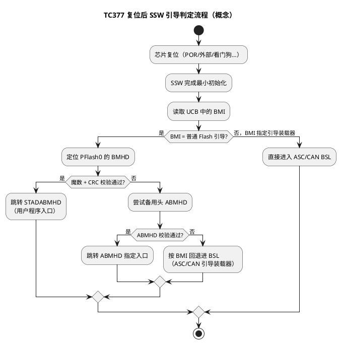

# TC377 BMI 与引导头机制

> 一句话定位：BMI（Boot Mode Index）决定"复位后走哪条引导路径"，BMHD（Boot Mode Header）决定"用户程序从哪进入、CRC 是否放行"——理解这两把钥匙，才能回答"程序为什么没跑起来"和"芯片变砖怎么救"。
> 等级：L2 ｜ 前置：[01-PFlash与DFlash](../TC377平台/存储器映射/01-PFlash与DFlash.md)、[04-复位启动初识-第一条指令从哪来](../../00-入门导读/04-复位启动初识-第一条指令从哪来.md)

与 [01 区启动代码分析](../../../01-编程语言/2-L2进阶/汇编基础/启动代码阅读/README.md) 的分工：那篇讲 SSW 跳进用户程序之后的**代码级流程串讲**（复位向量→拷贝→main）；本篇深入其上游的**芯片级引导机制**——BMI/BMHD 如何决定"跳不跳、跳到哪"。

## 原理

### BMI：引导模式的选择器

- BMI 存放在 UCB（User Configuration Block，用户配置块）中，SSW（Startup Software，芯片出厂固化的启动软件）在每次复位后最先读取它。
- BMI 决定本次复位走哪条路径：普通 Flash 引导（跳用户程序）、ASC 引导（异步串口 BSL，Bootstrap Loader）、CAN 引导等——各模式对应的 BMI 编码值**以 UM 的 Boot Mode Index 表为准**，不要凭记忆写烧录脚本。
- UCB 是"一次写入要慎重"的区域：带锁定（PROCON）属性，且 Flash 页有擦写寿命，产线必须管控写入次数。
- 修改 BMI 的正规途径：调试器（DAP）按 UM 的解锁时序写 UCB，或产线工具（如 Memtool）批量配置。

### BMHD：用户入口的守门员

- 普通引导下，SSW 校验 PFlash0 固定位置（0xA0000000 起）的用户引导头 BMHD；另有备用引导头 ABMHD（Alternate BMHD，位置查 UM）作兜底。
- 校验内容：引导头标识（魔数）、用户起始地址、CRC 与其反码双保险。
- 三级回退链：**BMHD0 校验失败 → 试 ABMHD → 仍失败 → 按 BMI 进入 BSL（ASC/CAN 引导装载器）**。这就是"程序烧错也能救回来"的硬件级保险。



### 为什么要有这套机制

- **安全**：入口地址受 CRC 保护，防止 Flash 内容损坏/被篡改后跳到不可信代码跑飞。
- **可恢复**：用户程序再烂，BSL 常在（ROM 中），产线刷写失败、程序自擦 Flash 中途断电，都能走 BSL 重烧。
- **产线分责**：BMI 在产线一次配好，应用工程师只管 BMHD + 应用镜像。

### BMI 与调试连接的关系

- UCB 中除引导模式外，还有**调试权限类配置**（如生产/出厂模式下禁用或限制 DAP 访问，具体档位以 UM 为准）——它和 BMI 同属"改前想清楚"的配置。
- 工程实践排序：开发件保持"调试开放 + 普通 Flash 引导"；量产切换动作放在产线最后一站，且切换前必须验证 BSL 路径可用。
- 变砖的本质：把"能进 BSL/能连 DAP"的配置改没了——所以任何 UCB 改写的变更单都要回答一句"失败后从哪恢复"。

## 寄存器与位表

BMHD 字段概念表（**各字段精确偏移、CRC 校验窗口与多项式以 UM 的 Boot Mode Header 章节为准**）：

| 字段 | 作用 | 备注 |
|---|---|---|
| BMHDID | 引导头标识（魔数） | 普通头与备用头取不同魔数，具体值查 UM |
| STADABMHD | 用户程序起始地址 | SSW 最终跳转目标，对齐要求查 UM |
| CRCBMHD | 引导头 CRC | 校验覆盖范围（窗口）查 UM |
| CRCBMHD_N | CRC 反码 | 与正码双保险，防位翻转 |
| PW 相关 | 临时解锁/覆盖模式密码 | 用途与长度查 UM |

BMI 常见引导模式（**编码值查 UM**）：

| 模式 | 行为 | 典型用途 |
|---|---|---|
| 普通 Flash 引导 | 校验 BMHD 后跳用户程序 | 量产常态 |
| ASC 引导（BSL） | 经异步串口接收并烧写程序 | 产线烧录 / 救砖 |
| CAN 引导（BSL） | 经 CAN 总线接收程序 | 整车刷写兜底 |
| 通用 / 调试友好配置 | 保留 DAP 等调试访问 | 开发期 |

"上电没反应"的第一轮排查表（先入口后应用）：

| 现象 | 先查什么 | 常见根因 |
|---|---|---|
| 完全无反应、BSL 也不应答 | 供电/复位脚/BMI 是否为 BSL 模式 | BMI 配错、硬件复位脚卡住 |
| 每次上电都进 BSL | BMHD 魔数与 CRC | CRC 窗口/多项式算错 |
| 偶发不启动 | BMHD 所在扇区内容 | Flash 位翻转、烧写不完整 |
| 调试器连不上 | UCB 调试权限配置 | 误切生产/禁调试档 |
| 启动到一半复位循环 | 应用侧 trap/看门狗 | 转异常定位流程（../异常与Trap/README.md） |
| 串口有 BSL 应答、Flash 无应用 | 烧录记录与镜像完整性 | 烧写中断、镜像 CRC 错 |

## 双平台对照

| 维度 | TC377 | S32K |
|---|---|---|
| 引导模式选择 | BMI（UCB 中软件配置） | BOOT 配置引脚 / 生命周期状态（型号相关，查 RM） |
| 用户入口来源 | BMHD 的 STADABMHD + CRC 校验 | 向量表第 1 项（复位向量），硬件直接取向量 |
| 校验失败回退 | ABMHD → BSL（ASC/CAN） | 依型号进入串行下载模式（详见 [02-S32K复位流程](02-S32K复位流程.md)，细节查 RM） |
| 引导代码位置 | SSW 在 ROM，不可改 | Flash 首区 / 硬件取向量，无独立 SSW 概念 |
| 调试权限管控 | UCB 调试配置（随 BMI 区改写） | 生命周期状态（S32K3） |
| 变砖恢复手段 | ASC/CAN BSL | JTAG（生命周期允许时）/ 串行 boot |

## 代码/实操

- **TRACE32 查看 BMHD**：
  ```
  d.dump 0xA0000000 ++0x40    ; 查看 BMHD0 各字段
  d.dump <ABMHD地址> ++0x40   ; 备用头，地址查 UM
  ```
- **确认当前 BMI 状态**：读 UCB 相应页（地址与解释查 UM），或用 Memtool 连接后查看引导配置汇总。
- **改写 UCB/BMI**：按 UM 时序——先写密码解锁页，再写配置字，最后确认（CONFIRM）落锁；改完通常需复位生效。
- **救砖流程**：确认 BMI 仍指向 ASC/CAN BSL → 接好串线/CAN 节点 → 用引导装载工具按协议握手 → 重烧 BMI 与应用 → 复位验证。
- **产线视角检查单**：
  1. 烧录站顺序：应用 → BMHD → UCB/BMI（先功能后配置，任何一站断电都可恢复）；
  2. BSL 通道留样验证：每批首件走一次 BSL 握手，确认兜底路径活着；
  3. UCB 改写动作记次数：与擦写寿命上限比对，接近阈值告警；
  4. 量产 BMI 生效前留一块"调试开放"工程件，用于问题复现与根因分析。

## 易错点与陷阱

- **BMI 改成"生产 + 禁调试"后 DAP 连不上**：之后所有调试通道关闭，只能走 BSL——改 UCB 前先确认恢复路径存在。
- **BMHD CRC 算错校验窗口**：现象是"程序明明烧进去了但每次上电都进 BSL"，检查烧录脚本的 CRC 覆盖范围与多项式是否与 UM 一致。
- **STADABMHD 指向了数据区/未放跳转指令**：SSW 校验通过后跳过去立即跑飞，表现为复位循环或 trap。
- **只写 BMHD0 忘了 ABMHD**：引导头所在扇区一旦损坏无兜底，量产件务必双头都写。
- **UCB 擦写寿命**：产线返工脚本来回擦 UCB，超限后该页永久失效；返工次数要纳入产线管控。
- **把"程序没跑"直接当应用 bug 查**：先看 BMI 模式与 BMHD 校验结果，再查应用——入口问题占"上电无反应"类问题相当比例。
- **烧录顺序颠倒**：先改 BMI 为量产配置再烧应用，中途断电后拿到一片"配置已锁、应用不完整"的半成品。

## 面试高频题

1. **BMI 和 BMHD 分别管什么？**
   答：BMI 决定引导模式（普通 Flash / ASC / CAN 引导），在 UCB 中；BMHD 提供普通引导下的用户入口地址与 CRC 校验，在 PFlash0 固定位置。
2. **BMHD 校验失败后芯片的行为路径？**
   答：先尝试备用头 ABMHD，仍失败则按 BMI 进入 BSL（ASC/CAN 引导装载器），不会随机跳转执行。
3. **为什么要对用户入口做 CRC 校验？**
   答：保证入口可信：Flash 内容损坏或被篡改时拒绝跳转，避免跑飞带来不可控行为，这是安全启动链的起点。
4. **一块 TC377 板子上电无任何反应，你怎么排查？**
   答：先确认 BMI 是否为普通引导、BMHD CRC 是否通过（TRACE32/Memtool 读引导状态），再看应用是否从 STADABMHD 进入，最后才查应用代码。
5. **产线烧录为什么特别怕动 BMI/UCB？**
   答：UCB 带锁定属性且擦写寿命有限，配置成禁调试/生产模式后调试通道关闭，出错只能走 BSL 或返厂，影响直通率。
6. **怎么防止"改 BMI 变砖"？**
   答：改前验证 BSL 通道可用；按"先应用后配置"顺序烧录；每批留调试开放工程件；变更单必填"失败恢复路径"。
7. **TC377 与 S32K 的引导兜底有什么本质差异？**
   答：TC377 靠 ROM 中 SSW + BMI/BSL 兜底，入口经过 CRC 校验；S32K 直接取向量表、无独立 SSW，兜底靠串行下载/生命周期管控（见 [02-S32K复位流程](02-S32K复位流程.md)）。

## 延伸

- 代码级启动流程（SSW→复位向量→拷贝→main）：[01 区启动代码阅读](../../../01-编程语言/2-L2进阶/汇编基础/启动代码阅读/README.md)，其中 [01-TC377启动代码分析](../../../01-编程语言/2-L2进阶/汇编基础/启动代码阅读/01-TC377启动代码分析.md) 与本篇上下游衔接
- TriCore 启动汇编细节：[TriCore汇编/03-读startup汇编](../../../01-编程语言/2-L2进阶/汇编基础/TriCore汇编/03-读startup汇编.md)
- PFlash 组织（BMHD 所在的存储器）：[../TC377平台/存储器映射/01-PFlash与DFlash](../TC377平台/存储器映射/01-PFlash与DFlash.md)
- 下一篇：[02-S32K复位流程](02-S32K复位流程.md)