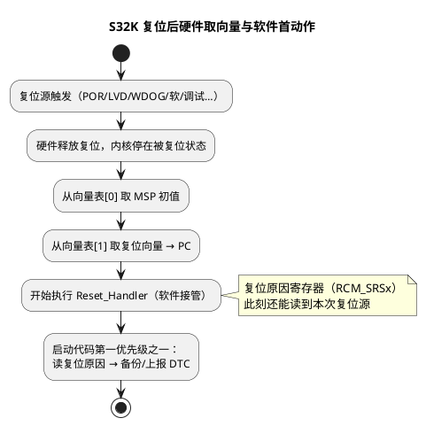

# S32K 复位流程与复位原因溯源

> 一句话定位：复位不可怕，可怕的是不知道**为什么复位**——POR/LVD/看门狗/软件/调试复位的全景，加上 RCM 复位原因寄存器的"第一时间读取并上报"，是量产排障的第一入口。
> 等级：L2 ｜ 前置：[04-复位启动初识-第一条指令从哪来](../../00-入门导读/04-复位启动初识-第一条指令从哪来.md)

与 [01 区 S32K 启动代码分析](../../../01-编程语言/2-L2进阶/汇编基础/启动代码阅读/02-S32K启动代码分析.md) 的分工：那篇讲复位之后 Reset_Handler 里的**代码级流程**；本篇讲复位本身的**类型、硬件行为与原因溯源方法论**。TC377 侧的引导机制见 [01-TC377-BMI与引导头](01-TC377-BMI与引导头.md)。

## 原理

### 复位类型全景

| 复位类型 | 触发源 | 典型场景 |
|---|---|---|
| POR（Power-On Reset，上电复位） | 芯片首次上电、电源跌到 POR 阈值以下 | 正常上电、电源异常 |
| LVD（Low-Voltage Detect，低压检测复位） | 电压低于 LVD 阈值 | 供电波动、大负载瞬态 |
| 看门狗复位 | WDOG 超时未喂狗 | 程序跑飞/死循环/调度异常 |
| 软件复位 | 代码写复位请求寄存器 | 看门狗策略复位、Bootloader 跳转前自复位 |
| 调试复位 | 调试器发起的系统/内核复位 | 开发期常见"查案干扰源" |
| 时钟类复位 | 时钟丢失/PLL 失锁（依型号） | 外部晶振损坏 |

各类复位哪些外设/寄存器被恢复、哪些保持，**以 RM 的复位章节为准**——这决定了"复位后还有没有现场可查"。

### 复位后硬件行为（Cortex-M 取向量）

复位释放后，Cortex-M 内核做两件事，**不经过任何软件**：

1. 从向量表偏移 0 取第 0 项 → 装入 MSP（主栈指针初值）；
2. 从向量表偏移 4 取第 1 项（复位向量）→ 装入 PC，开始执行 Reset_Handler。



### BOOT 配置：Flash 启动 vs 串行启动

- S32K 依型号提供启动模式选择：从内部 Flash 正常启动，或进入串行下载（Serial Boot，经 CAN/UART 等按协议接收程序）——具体由 BOOT 配置引脚（BOOT_CFG）/生命周期状态决定，**引脚编号与采样时序查对应型号 RM**。
- S32K1 系列多为单核 Cortex-M4、启动路径相对简单；S32K3 系列引入生命周期状态（运输/开发/量产）约束调试与刷写权限，**机制细节查 RM**。
- 串行启动是"Flash 里程序坏了"的兜底路径，地位类似 TC377 的 BSL。

## 寄存器与位表

复位原因记录于 RCM（Reset Control Module，复位控制模块）的状态寄存器（S32K1 为 RCM_SRS0/SRS1，**位定义以 RM 为准**）：

| 概念位/来源 | 含义 | 排障指向 |
|---|---|---|
| POR | 上电复位 | 电源、正常上电 |
| LVD / 低电压 | 低压检测 | 供电跌落、负载瞬态 |
| WDOG | 看门狗超时 | 程序跑飞、调度阻塞 |
| LOCKUP | 内核锁定（HardFault 升级） | 见 [03-HardFault定位](../../3-L3高级/异常与Trap/03-HardFault定位.md) |
| SOFT | 软件请求复位 | Bootloader/看门狗策略 |
| PIN | 外部复位引脚 | 硬件复位电路、EMC |
| 调试器/JTAG | 调试复位 | 开发环境干扰，量产件不应出现 |

注意：SRSx 为"累积"式状态——**写 1 清除**（具体写法查 RM），且调试复位本身会冲掉现场，量产件建议复位后立即读取并备份。

## 双平台对照

| 维度 | S32K | TC377 |
|---|---|---|
| 复位原因寄存器 | RCM_SRSx（POR/LVD/WDOG/SOFT/PIN/LOCKUP…） | RSTSTAT 类寄存器（具体位查 UM），含看门狗/软件/上电等源 |
| 读后是否清零 | 写 1 清除（查 RM） | 读写清除机制查 UM |
| 上电第一跳 | 向量表第 1 项，硬件直接取向量 | SSW 先跑，校验 BMHD 后跳 STADABMHD |
| 兜底引导 | 串行下载模式（BOOT_CFG/生命周期） | ASC/CAN BSL（BMI 决定） |
| 调试通道管控 | 生命周期状态（S32K3） | UCB 调试配置 + BMI 生产模式 |

## 代码/实操

**复位原因上报的标准姿势**（概念代码，寄存器访问以 RM 与 MCAL 头文件为准）：

```c
/* EcuM/Mcu 初始化早期调用，位于任何可能复位/喂狗逻辑之前 */
void ResetCause_Snapshot(void)
{
    uint16 srs = ((uint16)RCM->SRS[0] << 8) | RCM->SRS[1]; /* 具体位查 RM */
    if ((srs != 0U) && (g_LastResetCause == 0U)) {
        g_LastResetCause = srs;      /* 存入 NoInit 区（复位不清零的 RAM） */
        Dem_SetEventStatus(...);      /* 映射为 DTC 上报，见下方工程实践 */
    }
}
```

- **存哪**：放入复位后不被初始化的 RAM 区（NoInit 段，链接脚本配合），下次上电还能看到"上上次"原因。
- **何时读**：启动最早期（进 main 后、OS 启动前），避免被后续软件复位冲掉。
- **TRACE32 验证**：
  ```
  per.dump RCM.SRS0   ; 或 d.dump <RCM_SRSx 地址>
  ; 复现看门狗复位后连上调试器观察 SRS 位
  ```
- **上报 DTC**：把"异常复位原因"映射为 Dem 事件（如看门狗复位→DTC），售后/路试数据即可统计复位原因分布，配置思路见 [Dem事件与DTC](../../../06-诊断与标定/2-L2进阶/Dem配置/01-事件与DTC.md)。

**复位原因回归测试清单**（每次改启动/低功耗相关代码后跑一遍）：

| 用例 | 注入方式 | 期望 SRS 位 | 验证点 |
|---|---|---|---|
| 正常上电 | 重新上电 | POR | 仅 POR，无其他位 |
| 软件复位 | 调用复位请求 | SOFT | DTC 上报为软件复位 |
| 看门狗复位 | 屏蔽喂狗 | WDOG | 复位后 DTC 含喂狗丢失事件 |
| 低压复位 | 供电拉低 | LVD | 记录与供电波形时间对齐 |
| 外部复位 | 拉复位脚 | PIN | 与原理图复位源一致 |
| 深度睡眠唤醒 | 低功耗流程 | 唤醒类（查 RM） | 唤醒后功能恢复完整 |
## 易错点与陷阱

- **先接调试器复现，现场早被冲掉**：调试器复位/重新下载都会改写 SRS——量产问题靠 NoInit 备份 + DTC 上报，不靠"连上再查"。
- **忘了写 1 清除**：本次原因不清，下次读出来是累积值，无法区分"这次为什么复位"。
- **调试复位混进统计**：开发期频繁烧录会把调试复位原因带入日志，做复位统计时要过滤。
- **把 LVD 当软件 bug 查**：LVD/PORT 类复位指向电源与硬件，先查供电波形再查代码。
- **NoInit 区本身失效**：变量没放对段（被启动代码清零）或深睡/断电导致内容丢失，备份机制要做验证。
- **看门狗复位≠看门狗模块坏**：本质是程序未按期喂狗，指向跑飞/阻塞，继续走 [02-Trap定位方法](../../3-L3高级/异常与Trap/02-Trap定位方法.md) 与 [03-HardFault定位](../../3-L3高级/异常与Trap/03-HardFault定位.md)。
- **低功耗唤醒路径没纳入复位分析**：唤醒类复位有自己的语义，别和 POR 混在一起统计。
- **复位脚抖动**：外部复位源受 EMC 干扰毛刺触发 PIN 复位，硬件滤波与统计过滤要同步做。

## 面试高频题

1. **S32K 复位后，软件执行前硬件做了什么？**
   答：从向量表第 0 项装 MSP、第 1 项装 PC（复位向量），然后才执行 Reset_Handler——没有"隐藏启动软件"，跳转完全由向量表决定。
2. **怎么区分这次是看门狗复位还是上电复位？**
   答：复位后尽早读 RCM 复位原因状态位，按位判断复位源，读后按 RM 规定写 1 清除。
3. **为什么要"复位后第一时间读复位原因并上报 DTC"？**
   答：复位原因是累积状态且易被后续复位冲掉；第一时间快照存 NoInit 并经 Dem 上报，量产车才能统计"路上到底怎么复位的"。
4. **POR 和 LVD 复位排查方向有何不同？**
   答：两者都指向电源，但 LVD 常伴随大负载瞬态/电压跌落，需结合供电波形与负载切换时序分析。
5. **LOCKUP 复位说明什么？**
   答：内核进入锁定状态（通常是 HardFault 处理中再出错升级），要按 HardFault/Trap 定位流程查根因，而不是查复位本身。


6. **NoInit 变量怎么保证复位后还在？**
   答：放到启动代码不清零的段（链接脚本 NOLOAD/自定义段），并核对启动清零循环的边界符号没有覆盖它。
7. **复位原因上报为什么放 OS 启动前？**
   答：OS/任务启动后随时可能触发软件复位或喂狗逻辑，越早快照越接近第一现场。
## 延伸

- 代码级复位流程：[01 区 S32K启动代码分析](../../../01-编程语言/2-L2进阶/汇编基础/启动代码阅读/02-S32K启动代码分析.md)
- TC377 侧引导机制：[01-TC377-BMI与引导头](01-TC377-BMI与引导头.md)
- 复位原因上报 DTC：[Dem事件与DTC](../../../06-诊断与标定/2-L2进阶/Dem配置/01-事件与DTC.md)
- 复位后的异常排查：[../异常与Trap/README](../../3-L3高级/异常与Trap/README.md)
- 下一篇：[03-链接脚本与分散加载](03-链接脚本与分散加载.md)