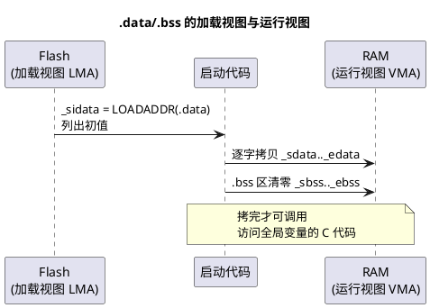

# 链接脚本与分散加载

> 一句话定位：链接脚本决定"每个段放进哪块内存、符号叫什么名字"，启动代码负责"照单搬运"——两者是一份契约，契约对不上就是最经典的"能编译、烧进去、跑飞"。
> 等级：L2 ｜ 前置：[01-TC377-BMI与引导头](01-TC377-BMI与引导头.md)、[02-S32K复位流程](02-S32K复位流程.md)

TC377 的内存区域背景（DSPR/PSPR/DMU）见 [../TC377平台/存储器映射/02-DSRAM-PSPR-DSPR](../TC377平台/存储器映射/02-DSRAM-PSPR-DSPR.md)；搬运的执行者（启动汇编）见 [TriCore汇编/03-读startup汇编](../../../01-编程语言/2-L2进阶/汇编基础/TriCore汇编/03-读startup汇编.md)。

## 原理

### 链接脚本的三大职责

1. **划地盘**：MEMORY 命令声明内存区域的起址与长度（Flash/RAM/PSPR…），链接器只准把段放进这些框。
2. **摆段**：SECTIONS 命令规定输入段（.text/.data/.bss/自定义段）聚合到哪个输出段、放在哪个区域、对齐多少。
3. **立符号**：在段的边界生成 `_etext/_sdata/_edata/_sbss/_ebss` 之类的全局符号——这些符号就是**链接器交给启动代码的搬运清单**。

### 分散加载（scatter loading）的本质

程序镜像里有两类"位置不一致"的内容：`.data` 等**已初始化变量**的初值必须存在 Flash（断电不丢），运行时却要待在 RAM；`.bss` 只需在 RAM 清零。所谓分散加载，就是复位后由启动代码把"加载地址（LMA，Load Memory Address）的内容"搬到"运行地址（VMA，Virtual/Run Memory Address）"、再把 .bss 清零——**链接脚本描述搬运计划，启动代码执行搬运**。



注意上面示意了契约双方：链接器生成符号（含 LOADADDR），启动代码按符号区间循环拷贝/清零——**任何一方改了，另一方必须同步**。

## 寄存器与位表

链接脚本没有"寄存器"，对应物是**符号与段表**。GCC 风格约定俗成的符号（命名以工程实际脚本为准）：

| 符号 | 含义 | 使用者 |
|---|---|---|
| `_etext` | 代码段（只读）结束 | 定位 .data 初值起点（旧式写法） |
| `_sidata` / `LOADADDR(.data)` | .data 的加载地址（Flash 中） | 启动拷贝循环的源 |
| `_sdata` / `_edata` | .data 运行区起/止 | 拷贝循环的目的与边界 |
| `_sbss` / `_ebss` | .bss 起/止 | 清零循环 |
| `__stack_end__` 类 | 栈顶 | 启动时设 SP |

常见段及其归宿：

| 段 | 内容 | 加载位置 | 运行位置 |
|---|---|---|---|
| .text/.rodata | 代码与常量 | Flash | Flash |
| .data | 已初始化全局/静态变量 | Flash（占空间） | RAM |
| .bss | 零初始化变量 | 不占镜像 | RAM（清零） |
| 自定义 NOLOAD 段 | NoInit 复位存活数据 | 不加载 | RAM（不清零） |
| RAM 函数段（如 .pspr_text） | 需在 PSPR 跑的代码 | Flash | PSPR（须拷贝） |

**map 文件阅读要点**（崩溃反查前先看三处）：

| 看什么 | 判断什么 |
|---|---|
| 各输出段首地址与大小 | 出错地址落在哪个段（text/data/bss/自定义） |
| 符号表（地址→符号） | 出错地址最近的符号名，锁到函数/变量 |
| 入口/向量表段位置 | 复位取向量是否指向预期入口 |
## 双平台对照

| 维度 | S32K（GCC，.ld） | TC377（Tasking，.lsl） |
|---|---|---|
| 脚本语言 | GNU ld 语法 | Tasking LSL 语法（内存派生 + section 映射） |
| 内存声明 | `MEMORY { ... }` | `derivative / memory` 定义（含 TriCore 各核 DSPR/PSPR 划分） |
| 段映射 | `SECTIONS { ... }` | `section_layout`（按空间 space → 区 section 映射） |
| 搬运清单 | `_sdata/_edata` 等符号 + `LOADADDR()` | copy table（启动代码遍历 `_lc_*` 系列符号拷贝，命名以工具链手册为准） |
| 多核/多内存区 | 单核为主，靠 MEMORY 分区 | 天然多核多区：每核 DSPR/PSPR 各自映射 |
| 入口指定 | `ENTRY(Reset_Handler)` | 工程配置/启动文件配合 |

Tasking 的 copy table 机制：链接器汇总所有"加载≠运行"的段生成拷贝表，`_STARTUP` 例程遍历执行——所以**在 .lsl 里把某段挪到 PSPR，拷贝通常自动带上**；而手写 GCC 工程常忘这一点，需自己在启动代码加循环。

## 代码/实操

GCC 风格精简骨架（逐段注释，命名习惯因工程而异）：

```ld
ENTRY(Reset_Handler)                 /* 入口符号（ELF 头/调试用） */

MEMORY                               /* 划地盘：两块 Flash、一块 RAM */
{
  FLASH (rx)  : ORIGIN = 0x00000000, LENGTH = 512K
  RAM   (rwx) : ORIGIN = 0x1FFF0000, LENGTH = 64K   /* 示意值：S32K1xx 实际 SRAM_L 基址为 0x1FFF8000，以芯片内存映射/链接器文件为准 */
}

SECTIONS
{
  .text : {                          /* 向量表 + 代码 + 只读数据 → Flash */
    KEEP(*(.isr_vector))             /* 向量表禁止被 --gc-sections 删除 */
    *(.text*)
    *(.rodata*)
    _etext = .;                      /* 只读区结束 */
  } > FLASH

  .data : AT(_etext)                 /* 运行在 RAM，初值紧贴 _etext 存 Flash */
  {
    _sdata = .;
    *(.data*)
    _edata = .;
  } > RAM
  _sidata = LOADADDR(.data);         /* LMA：启动代码从这里取初值 */

  .bss (NOLOAD) : {                  /* 不进镜像，只占运行地址 */
    _sbss = .;
    *(.bss*) *(COMMON)
    _ebss = .;
  } > RAM
}
```

启动代码一侧的契约（示意）：

```c
uint32 *src = &_sidata;              /* LOADADDR(.data) */
for (uint32 *p = &_sdata; p < &_edata; ) *p++ = *src++;
for (uint32 *p = &_sbss;  p < &_ebss;  ) *p++ = 0;
```

- **map 反查**：工程链接后生成 .map；崩溃地址（PC/出错地址）先看落在哪个段哪个符号，再到源码级用 addr2line（`arm-none-eabi-addr2line -e app.elf 0x200012a4`）。
- **新增自定义段的检查单**：① SECTIONS 里放了正确区域？② 加载≠运行的段有没有人搬？③ 启动代码/拷贝表覆盖它了吗？④ 启动早期（拷贝完成前）有没有人访问它？

## 易错点与陷阱

- **段放错内存区**：把大常量放进 RAM 区，链接不报错（区域够大），RAM 被白吃、栈空间告急——看 map 文件的段分布，别只看编译通过。
- **新增 section 启动代码没拷**：自定义初始化段（如标定值镜像）放 RAM，忘了在拷贝循环里加区间，上电读到随机值，且往往"调试器下载后正常、冷启动异常"。
- **PSPR/RAM 函数忘了加载**：函数标到 PSPR 运行（性能/总线隔离），但没安排加载侧拷贝，调用即跳到未初始化内存。
- **`KEEP` 漏加**：开 `--gc-sections` 后向量表/启动段被当作无人引用而删除，芯片取向量即跑飞。
- **`AT()` 与 `>region` 混淆**：VMA 决定运行地址、LMA 决定初值存放；搞反后"数据在 Flash 里被当代码搬"。
- **对齐不匹配**：段对齐（ALIGN）与硬件访问宽度（如非对齐访问限制）冲突，运行期才炸，见 [01-TC377-Trap分类与TIN](../../3-L3高级/异常与Trap/01-TC377-Trap分类与TIN.md)。
- **多核链接各自为政**：TC377 各核镜像的内存区在 .lsl 中重叠，烧录后互相踩踏——多核视角见 [../多核架构/01-主从核启动](../../3-L3高级/多核架构/01-主从核启动.md)。

## 面试高频题

1. **.data 和 .bss 的加载/运行区别？**
   答：.data 初值存 Flash（LMA），启动时搬到 RAM（VMA）；.bss 无初值镜像，只在 RAM 清零（NOLOAD）。
2. **`LOADADDR()` 和 `ADDR()` 分别得到什么？**
   答：前者是段的加载地址（Flash 中的源），后者是运行地址（RAM 中的目的），两者之差就是"要不要搬"。
3. **为什么向量表要 `KEEP()`？**
   答：代码体积优化会把"没有被调用关系引用"的向量表段删掉，KEEP 强制保留，防止复位取向量跑飞。
4. **程序能烧进去但一跑就飞，链接层面查什么？**
   答：查 map：入口/向量表位置、.data/.bss 边界符号与启动代码是否一致、自定义段是否有人搬、栈顶符号是否指到合法 RAM。
5. **Tasking .lsl 与 GCC .ld 最大的工程差异？**
   答：Tasking 生成 copy table 由启动例程统一搬运（自动跟随段映射），GCC 需要脚本符号与启动代码手工维持契约——迁移工程时最容易漏。

## 延伸

- 搬运的执行者：[TriCore汇编/03-读startup汇编](../../../01-编程语言/2-L2进阶/汇编基础/TriCore汇编/03-读startup汇编.md) 与 [01 区启动代码阅读](../../../01-编程语言/2-L2进阶/汇编基础/启动代码阅读/README.md)
- 内存区域背景：[../TC377平台/存储器映射/02-DSRAM-PSPR-DSPR](../TC377平台/存储器映射/02-DSRAM-PSPR-DSPR.md)、[../TC377平台/存储器映射/01-PFlash与DFlash](../TC377平台/存储器映射/01-PFlash与DFlash.md)
- map 反查在崩溃定位中的应用：[02-Trap定位方法](../../3-L3高级/异常与Trap/02-Trap定位方法.md)