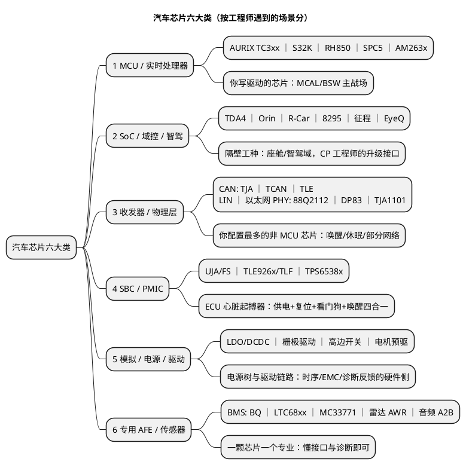
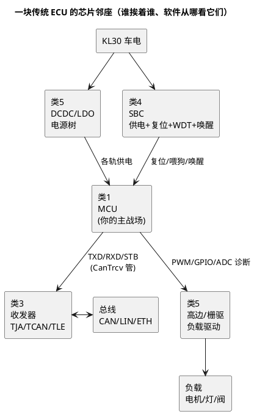

# 六大类总览：一张汽车芯片行业版图

> 一句话定位：把"汽车上的芯片"从两颗 MCU 扩成六大类全景地图——每类给"干什么/代表型号/典型功能域/工程师哪里会遇到/本库哪篇深挖"，选型讨论、供应链话题和面试"你了解行业芯片吗"都靠这张图起手。
> 等级：L1→L2 ｜ 前置：[01-从零认识一颗MCU](../../00-入门导读/01-从零认识一颗MCU.md)

## 原理：为什么要分六大类

拆开任何一块 ECU，主控 MCU 只是板上的一颗芯片——它周围还围着收发器（连总线）、SBC（管供电复位看门狗）、电源与驱动芯片（供轨/驱动负载），整车层面还有 SoC（域控）、AFE（BMS/雷达专用）。**"汽车芯片"是个生态，不是一个工种**。按"工程师哪里会遇到"分，正好六类：

## 六大类总表

| 类 | 干什么 | 代表型号 | 典型功能域 | 工程师哪里遇到 | 本库落点 |
|---|---|---|---|---|---|
| 1. MCU/实时处理器 | 确定性实时控制，跑 CP | TC3xx、S32K、RH850、SPC5、AM263x | 车身/动力/底盘/网关，全域长尾 | 天天写：MCAL/BSW/CDD | [01 篇](01-MCU与实时处理器.md) + [TC377平台](../TC377平台/README.md)、[S32K平台](../../1-L1基础/S32K平台/README.md) |
| 2. SoC/域控/智驾 | 大算力计算与服务 | TDA4、Orin、R-Car、8295、征程、EyeQ | 座舱域/智驾域/中央计算 | 架构评审、跨域联调（SOME-IP/DoIP） | [02 篇](02-SoC与域控智驾.md) + [车载以太网](../../../05-汽车网络通讯/3-L3高级/车载以太网/README.md) |
| 3. 收发器/物理层 | 总线数字侧↔物理层变换 | TJA1145、TCAN1145、TLE9251、88Q2112 | CAN/LIN/以太网节点 | 网络管理调睡眠、busoff 排障、EMC | [03 篇](03-收发器与物理层.md) + [收发器与物理层](../../../05-汽车网络通讯/1-L1基础/CAN/收发器与物理层/README.md) |
| 4. SBC/PMIC | 供电+复位+看门狗+唤醒 | UJA1169、FS26、TLE926x、TLF35584、TPS65381 | 每块 ECU 一颗 | EcuM 时序、WdgM 喂狗、睡眠电流 | [04 篇](04-SBC与PMIC.md) + [EcuM 唤醒源](../../../07-AUTOSAR架构/2-L2进阶/系统服务栈/EcuM/03-唤醒源.md) |
| 5. 模拟/电源/驱动 | 供轨与功率驱动 | LDO/DCDC、1ED 栅驱、VND 高边、DRV8 | 电源树、负载驱动、电机 | 电源树评审、PWM 链路、故障诊断 ADC | [05 篇](05-模拟电源与驱动.md) + [电源电路](../../../03-硬件基础/2-L2进阶/电源电路/README.md) |
| 6. 专用 AFE/传感器 | 垂直专业前端 | BQ796xx、LTC681x、MC33771、AWR、A2B | BMS/雷达/音频 | 三电/传感器岗位；SPI 协议+诊断 | [06 篇](06-AFE与专用传感器.md) + [ADC 采样原理](../../../03-硬件基础/2-L2进阶/模拟电路/ADC采样原理/README.md) |

> 型号均为家族级泛称，具体料号参数一律以厂商 DS 为准——本目录只建地图，不背手册。

## 详解

### 1. 六类与 CP 工程师的"亲疏度"

不是六类都要同等投入。按"日常接触频率 × 软件可干预度"排：

| 亲疏 | 类 | 姿势 |
|---|---|---|
| **天天打交道** | 类 1（MCU） | 本库主战场，双平台笔记纵向打穿 |
| **配置与排障都绕不开** | 类 3（收发器）、类 4（SBC） | 网络管理与 EcuM/看门狗的硬件侧，读懂手册能省一半诡异问题 |
| **看得懂链路即可** | 类 5（模拟/驱动） | 软件时序（PWM/ADC 诊断）的物理边界，03 区硬件笔记打底 |
| **认知层，知道即可** | 类 2（SoC）、类 6（AFE） | 隔壁工种与垂直专业——知道接口与分工，面试能聊，不必深挖 |

### 2. 一块 ECU 上的"芯片邻座"关系

看图记住一句话：**MCU 的四周全是别的芯片——供电看类 4/5，总线看类 3，负载看类 5**；类 2（SoC）在另一块板上，靠以太网跟你说话。

### 3. 这张版图怎么用

- **选型/评审场景**：新项目立项会抛出"用 TC397 还是 S32K3？收发器选哪家？"——从总表定位类别 → 进对应篇的对照表；
- **面试场景**："你了解汽车上常见的芯片吗？"——六大类结构化作答（先分类再举例，见面试高频题）；
- **排障场景**：症状先映射到"哪颗芯片的职责区"（睡不醒→类 4/3；发不出帧→类 3；复位→类 4；负载不动→类 5），再进对应篇查清单。

## 双平台对照

TC377 与 S32K 是类 1 里的两个代表，本库已有的双平台深挖笔记与版图笔记的分工：

| 维度 | 双平台笔记（S32K平台/TC377平台） | 版图笔记（本目录） |
|---|---|---|
| 粒度 | 单平台机制（时钟/中断/Flash/外设） | 跨平台横向（五阵营/三家对照） |
| 深度 | 寄存器与配置要点 | 家族级认知与选型维度 |
| 用途 | 写驱动、配 MCAL | 选型讨论、行业认知、迁移评估 |

**骨架约定不变**：全库笔记仍以 TC377/S32K 双平台对照为强制节；版图笔记在各自篇内局部扩展为多平台/多厂商对照，不回溯改动既有笔记。

## 易错点与陷阱

1. **把"汽车芯片"等同于 MCU**——一辆车半导体 BOM 里 MCU 只占一角；聊行业只报两颗 MCU 名字，等于承认视野停在工位上；
2. **忽视配套芯片对软件的影响**——睡眠电流超标、睡不醒、复位诡异，根因常在 SBC/收发器而非应用代码（类 3/4 两篇各有一节专讲软件交点）；
3. **拿消费电子经验套车规**——车规芯片的价格与交期逻辑不同（AEC-Q100 认证、供货周期以年计），选型讨论别拿手机 SoC 思维类比；
4. **型号当参数背**——本版图所有型号只到家族级；真要选型，参数必须回最新 DS/官网核对，家族认知只是"知道去查谁"；
5. **忽略国产替代线**——类 1/3/6 都有国产厂商快速跟进（招聘与选型都在发生），版图是 2026 年快照，定期补充而非当永恒真理。

## 面试高频题

**Q：你了解汽车上常见的芯片有哪些？**

答：分六大类作答——①MCU：TC3xx/S32K/RH850/SPC5，我主用 TC377 与 S32K；②域控 SoC：座舱 8295/R-Car、智驾 TDA4/Orin/征程，是 CP 域的跨域对端；③收发器：NXP TJA、TI TCAN、Infineon TLE，网络管理的硬件侧；④SBC/PMIC：UJA/FS、TLE/TLF，管供电复位看门狗唤醒；⑤模拟与驱动：电源树 LDO/DCDC、栅极驱动与高边开关；⑥专用 AFE：BMS 的 BQ/LTC68/MC33771、雷达与音频。收尾补一句定位："前四类我日常都在碰，后两类知道接口与分工。"

**Q：你是 MCU 工程师，为什么还要懂其他五类芯片？**

答：三个理由——排障（睡眠电流/睡不醒/复位类问题根因常在 SBC 与收发器）；联调（跨域联调要知道 SoC 侧的接口形态 SOME-IP/DoIP）；选型与评审（新项目讨论收发器/SBC 选型时能说上话）。一句话：**MCU 是主战场，邻座芯片决定主战场上的很多"诡异现象"归谁**。

**Q：六大类里你会往哪类深挖？**

答：结合岗位说——BSW/CDD 方向往类 3/4 深挖（网络管理与 EcuM 的硬件侧，投入产出比最高）；想转三电往类 6 的 BMS AFE 补；座舱/智驾兴趣归类 2，但要清楚那是另一个工种。展示"有版图、有取舍"，不是什么都想要。

## 延伸

- 六大类分篇：[01-MCU](01-MCU与实时处理器.md)、[02-SoC](02-SoC与域控智驾.md)、[03-收发器](03-收发器与物理层.md)、[04-SBC](04-SBC与PMIC.md)、[05-模拟电源](05-模拟电源与驱动.md)、[06-AFE](06-AFE与专用传感器.md)；
- 双平台深挖：[TC377平台](../TC377平台/README.md)、[S32K平台](../../1-L1基础/S32K平台/README.md)、[S32K1与S32K3对比](../../1-L1基础/S32K平台/S32K1与S32K3对比/01-内核与资源对比.md)；
- 需求侧背景：[04-行业观察-新能源与域控](../../../14-面试与成长/2-L2进阶/职业发展/04-行业观察-新能源与域控.md)——EE 架构演进如何改变各类芯片的分量；
- 手册获取：[15 区/官方文档](../../../15-资源收藏/官方文档/README.md)、[13 区/芯片手册架](../../../13-标准与书籍笔记/3-芯片手册/README.md)。

---

维护约定：笔记命名 `序号-主题.md`；真实截图放 `_images/`；流程/时序/状态/架构图用 PlantUML 内嵌正文，规范见 [图表规范与模板](../../../00-总览/图表规范与模板.md)。
