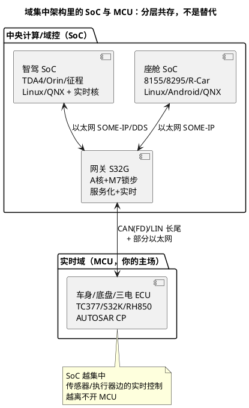

# SoC 与域控智驾：隔壁工种的地图

> 一句话定位：CP 工程师不必会写座舱/智驾 SoC（8155/8295、R-Car、TDA4、Orin、征程、EyeQ），但架构讨论、跨域联调、职业选择都要求你能听懂"谁管什么、SoC 域和 CP 域怎么交互（SOME-IP/DoIP/服务化）"——本篇是那张地图，点到即止。
> 等级：L1→L2 ｜ 前置：[04-行业观察-新能源与域控](../../../14-面试与成长/2-L2进阶/职业发展/04-行业观察-新能源与域控.md)

## 原理

### SoC 与 MCU 的本质差异

SoC 不是"更大的 MCU"，是另一种形态——算力单元异构（CPU+A 系核+GPU/NPU/DSP）、带 MMU 跑通用 OS（Linux/QNX/Android）、动态内存与服务化运行时：

| 维度 | MCU（CP 域） | SoC（座舱/智驾域） |
|---|---|---|
| 内核 | Cortex-M/R、TriCore、V850 | Cortex-A 多核 + 加速器（GPU/NPU/DSP） |
| OS | AUTOSAR CP OS（OSEK 型）/RTOS | Linux/QNX/Android/虚拟化（Hypervisor） |
| 内存 | 静态分配、无 MMU、MPU 保护 | 动态内存、虚拟地址、页表 |
| 编程 | C、静态配置、生成代码 | C++/Java/服务框架、动态部署 |
| 通信 | CAN/LIN 信号（Com/PduR） | 以太网服务（SOME-IP/DDS） |
| 实时性 | 硬实时（微秒级） | 软实时（毫秒级）+ 实时核补位 |

### 域控芯片三大阵营（家族级认知）

| 阵营 | 代表 | 定位 | 备注 |
|---|---|---|---|
| 座舱 | 高通 8155/8295（SA8155P/8295P）、R-Car H/M 系、NXP i.MX 8 | 仪表+中控+HUD 多屏融合 | 高通占新势力主流 |
| 智驾 | TI TDA4（Jacinto）、NVIDIA Orin/Thor、Mobileye EyeQ、地平线征程 J5/J6 | 感知-规划-控制计算 | TDA4 带 R5F 实时核（CP 血统） |
| 网关/跨控 | NXP S32G、TI DRA829/Jacinto 衍生 | 中央网关+区域控制 | A 核跑服务 + M7 锁步跑实时——**跨界形态** |

S32G 值得单独记：A 核跑 Linux/中间件、M7 锁步核跑 CP——**一颗芯片里同时装着"隔壁工种"和"你的工种"**，是网关域控的代表形态（也是 CP 工程师往域控走的最平滑落点）。

### SoC 侧的安全 MCU 伴飞形态

高 ASIL 智驾方案普遍"SoC + 外挂安全 MCU"：SoC 管感知规划（低 ASIL，QM~B），安全 MCU 管监控与仲裁（高 ASIL，功能监控、制动仲裁）——**这颗伴飞 MCU 干的还是 CP 的活**（看门狗、E2E、通信代理），是 CP 工程师切入智驾项目最现实的入口。

## 选型对照表

> 本篇是认知层地图，不比较参数；记住"哪家用在哪、跑什么 OS、和你怎么说话"即可：

| 关注对象 | 看什么 | 信息源 |
|---|---|---|
| 功能定位 | 座舱/智驾/网关哪一域 | 厂商产品页 + 车型拆解报道 |
| 算力构成 | A 核数量、NPU/DSP 算力口径（各家标法不一，厂商口径） | 厂商发布材料 |
| 实时核 | 有无 R5F/M7 锁步伴飞核（联调时的"CP 侧接口人"） | 器件页 |
| 软件形态 | Linux/QNX/Android、AUTOSAR AP、中间件 | 方案商资料 |

## 多平台对照（跨域视角）

CP 工程师与 SoC 域的三个交点——每个交点都是"你已有的功底 + 一层新知识"：

| 交点 | 你已有的 | 要补的一层 | 本库落点 |
|---|---|---|---|
| 跨域通信 | CAN/诊断功底 | SOME-IP 服务化、DoIP 以太网诊断 | [车载以太网三篇](../../../05-汽车网络通讯/3-L3高级/车载以太网/README.md) |
| 架构分层 | CP 全栈 | AP 的 POSIX/服务发现/执行管理 | [Classic vs Adaptive](../../../07-AUTOSAR架构/1-L1基础/架构总览/02-Classic-vs-Adaptive.md) |
| 域控形态 | MCAL/BSW | S32G 类 A+M 混装、跨核通信 | [多核架构](../../3-L3高级/多核架构/README.md) |

## 代码/实操

认知层的"实操"是听懂架构评审——下次听到这些词，你能对上号：

- "8295 座舱域挂在中控，仪表走虚拟机"——座舱 SoC + Hypervisor 多屏方案；
- "感知在 Orin 上，安全岛用外挂 MCU 仲裁"——SoC+安全 MCU 伴飞形态；
- "跨域走 SOME-IP，你们 CP 域提供服务"——你的 ECU 要暴露服务化接口（SoA 适配层，通常是 CDD/SW-C 封装）；
- "TDA4 的 R5F 上跑 CP"——实时核承担传感器抽象/通信网关，那部分就是 CP 工种。

## 易错点与陷阱

1. **拿 MCU 思维理解 SoC**：动态内存、虚拟地址、进程/服务生命周期——MCU 的"一切静态可控"直觉在 SoC 上全部失效，讨论接口时先对齐运行时模型；
2. **把"会 Linux"当转行智驾的门票**：座舱/智驾核心是应用框架/算法/系统集成，嵌入式底子优势有限——正确路径是"CP 深度 + 以太网/AP 一层"贴着域控走（[行业观察](../../../14-面试与成长/2-L2进阶/职业发展/04-行业观察-新能源与域控.md) 的原话）；
3. **以为域控普及后 MCU 会消失**：EE 架构再集中，传感器/执行器边的实时控制与功能安全监控仍在 MCU/区域控制器上——SoC 与 CP 是分层共存；
4. **把 AP 当 CP 的升级版**：AP（C++14/POSIX/动态服务发现）是另一个技术栈，服务于"变化的计算服务"；实时域反而因功能集中更重要；
5. **混淆算力口径**：各家 NPU TOPS 标法不同（稀疏/稠密、整包/单核），跨厂商比算力数字没有意义——比的是方案与工程化能力。

## 面试高频题

**Q：域控制器时代的 SoC 和 MCU 是什么关系？MCU 工程师会被淘汰吗？**

答：分层共存——SoC 管大算力计算与服务（座舱/智驾），MCU 管确定性实时控制与功能安全监控（底盘/三电/区域控制）；智驾方案里普遍还有"SoC+安全 MCU"伴飞形态，监控仲裁那颗跑的就是 CP。结论：MCU 技能被重新定价但不会被淘汰，"CP 深度 + SOME-IP/DoIP 一层"是性价比最高的升级。

**Q：你知道哪些座舱/智驾芯片？**

答：座舱——高通 8155/8295 主流、瑞萨 R-Car、NXP i.MX；智驾——TI TDA4（带 R5F 实时核）、NVIDIA Orin/Thor、Mobileye EyeQ、地平线征程 J5/J6；网关/跨控——NXP S32G（A 核+M7 锁步的跨界形态）。补一句自己的关联："我关注的是它们与 CP 域的接口——SOME-IP 服务化与 DoIP。"

**Q：如果让你支持一个域控项目的 CP 侧，你会做什么？**

答：三件事——①区域/实时侧 ECU 的 BSW 全栈（本行）；②对上提供 SOME-IP 服务化接口（CP 侧 SoA 适配）；③与 SoC 侧联调以太网链路与时间同步。展示"知道自己站在整条链的哪一环"。

## 延伸

- [00-六大类总览](00-六大类总览.md)：本篇所属的行业版图全景；
- 三个交点的深挖：[车载以太网](../../../05-汽车网络通讯/3-L3高级/车载以太网/README.md)、[Classic vs Adaptive](../../../07-AUTOSAR架构/1-L1基础/架构总览/02-Classic-vs-Adaptive.md)、[多核架构](../../3-L3高级/多核架构/README.md)；
- OS 侧背景：[嵌入式Linux](../../../08-操作系统/3-L3高级/嵌入式Linux/README.md)（跨界对照）；
- 需求侧：[04-行业观察-新能源与域控](../../../14-面试与成长/2-L2进阶/职业发展/04-行业观察-新能源与域控.md)——三代 EE 架构演进；
- [01-MCU与实时处理器](01-MCU与实时处理器.md)：S32G/TDA4 实时核所在的另一条 MCU 阵营线。

---

维护约定：笔记命名 `序号-主题.md`；真实截图放 `_images/`；流程/时序/状态/架构图用 PlantUML 内嵌正文，规范见 [图表规范与模板](../../../00-总览/图表规范与模板.md)。
