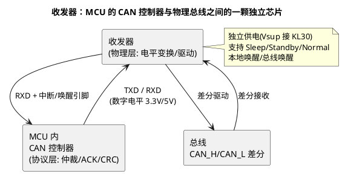

# 收发器与物理层：TJA、TCAN、TLE 三家地图

> 一句话定位：ECU 上除 MCU 外你配置最多的芯片——CAN/LIN/以太网收发器把数字世界接到差分总线，网络管理能不能睡好觉、busoff 排障、EMC 整改的背后都是它；NXP TJA、TI TCAN、Infineon TLE 三家对照 + 唤醒/部分网络机制 + 以太网 PHY 链路一篇讲清。
> 等级：L2 ｜ 前置：[01-收发器选型TJA1145](../../../05-汽车网络通讯/1-L1基础/CAN/收发器与物理层/01-收发器选型TJA1145.md)

## 原理

### 收发器在链路中的位置

协议在 MCU 里、物理在收发器里——**协议层排障看 MCU 寄存器与总线报文，物理层排障看收发器模式与电气**。两类问题的分界线就是这颗芯片。

### 三家 CAN 收发器对照（家族级）

| 维度 | NXP TJA 系 | TI TCAN 系 | Infineon TLE 系 |
|---|---|---|---|
| 经典 CAN 主力 | TJA1050/1051/1044 | TCAN1042/1044/1051 | TLE7250/7251 |
| CAN FD 主流 | TJA1044/1051（FD 版）、TJA1145 | TCAN1044A/1051A、TCAN1145 | TLE9251/9255 |
| 部分网络（PN） | TJA1145（CAN FD 唤醒帧过滤） | TCAN1145 | TLE9255（按 DS 确认能力） |
| 待机电流 | 微安级（查 DS） | 微安级（查 DS） | 微安级（查 DS） |
| 供电形态 | 5V 为主、3.3V IO 版本按料号 | 5V/3.3V 版本按料号 | 5V 为主 |
| 配置接口 | 部分型号带 SPI（TJA1145） | 部分型号带 SPI | 部分型号带 SPI |

选型三问（硬件负责选、软件必须会问）：①要不要 CAN FD？②要不要部分网络（总线唤醒帧过滤，睡得更深）？③待机电流预算多少（整车 KL30 电流分配）？——型号后缀与版本差异以 DS 为准，本表只建"问什么"的框架。

### 唤醒与部分网络：软件最相关的一节

传统收发器"总线任意活动即唤醒"；支持部分网络的收发器（TJA1145/TCAN1145 一类）可在 Sleep 模式下**只对特定唤醒帧格式（wake-up pattern + 帧 ID 过滤）响应**，其余总线活动不唤醒——这是"部分网络"的硬件基础。软件链路：

1. 睡前：CanIf/CanTrcv 配置收发器进 Sleep + 唤醒过滤条件（SPI 写寄存器）；
2. 唤醒：匹配的总线帧 → 收发器拉唤醒中断 → MCU 退出低功耗 → EcuM 唤醒源报事件（[EcuM/03-唤醒源](../../../07-AUTOSAR架构/2-L2进阶/系统服务栈/EcuM/03-唤醒源.md)）；
3. 排障：睡不醒→查过滤条件与唤醒帧格式是否匹配；假醒→查是否未使能过滤（任意活动都醒）。详见 [09 区/睡眠电流假醒](../../../09-调试与测试/3-L3高级/调试方法论/04-睡眠电流假醒.md)。

## 选型对照表

| 总线 | 家族级代表 | 软件关注点 |
|---|---|---|
| 经典 CAN | TJA1051 / TCAN1042 / TLE7250 | 无配置，TXD/RXD 直连，模式脚（STB/EN）GPIO 控制 |
| CAN FD | TJA1051(FD) / TCAN1051A / TLE9251 | 位时序在 MCU 侧配（[CAN-FD 篇](../../../05-汽车网络通讯/1-L1基础/CAN/CAN-FD/README.md)），收发器只看数据率上限（查 DS） |
| CAN FD + 部分网络 | TJA1145 / TCAN1145 | SPI 配置、唤醒过滤、CanTrcv 有对应支持（[07 区/CanTrcv](../../../07-AUTOSAR架构/2-L2进阶/通讯服务栈/07-CanTrcv.md)） |
| LIN | NXP TJA102x / Infineon TLE725x / TI TLIN 系 | 主从模式（Master 电阻）、波特率、INH 输出控电源 |
| 以太网 100BASE-T1 PHY | Marvell 88Q211x、TI DP83TC8xx、NXP TJA1101/1102 | MDIO 配置、休眠唤醒（Sleep 代理）、延时/线束诊断 |
| 以太网 1000BASE-T1 PHY | TI DP83TG7xx、Marvell 88Q51xx 等 | RGMII/SGMII 到 MAC 或 Switch，软件侧多为驱动适配 |

> 以太网 PHY 与 MCU/Switch 的关系：PHY 负责物理层编码（PAM3 等），MAC 在 MCU/S32G/TDA4 内部，二者走 RGMII/SGMII 接口——PHY 配置经 MDIO，驱动属 CDD/以太网驱动范畴（[100BASE-T1](../../../05-汽车网络通讯/3-L3高级/车载以太网/01-100BASE-T1.md)）。

## 多平台对照（双平台扩展版）

收发器本身不分 MCU 平台，但**集成形态**分——同一颗 MCU 搭配外挂收发器还是 SBC 内置收发器，软件链路完全不同：

| 维度 | TC377 典型链路 | S32K 典型链路 |
|---|---|---|
| 形态 | 外挂 TJA/TLE/TCAN | 外挂收发器，或 SBC（UJA1169）**内置 CAN/LIN 收发器** |
| CanTrcv 对接 | 直接收发器 SPI/GPIO | 收发器在 SBC 后面，配置经 SBC 驱动转发 |
| 唤醒链路 | 收发器 RXD 唤醒脚 → MCU ESR | SBC 唤醒源汇总 → MCU 唤醒脚 |
| 排障入口 | 收发器模式寄存器 | 先看 SBC 状态再透传到收发器 |

SBC 内置收发器是车身 ECU 的常见降本形态——这是本篇与 [04-SBC与PMIC](04-SBC与PMIC.md) 的交界处：**"收发器在哪颗芯片里"是排障第一问**。

## 代码/实操

- 配置链路（以带 SPI 的 FD 收发器为例）：CanTrcv_Init → SPI 写模式/唤醒过滤寄存器 → 验证 Normal 模式回读 → 联调睡眠链路（ComM → CanSM → CanIf → CanTrcv → 芯片寄存器），全链路见 [07 区/CanTrcv](../../../07-AUTOSAR架构/2-L2进阶/通讯服务栈/07-CanTrcv.md)；
- 排障三板斧：①量总线电平（隐性/显性电压，物理层先排）②读收发器模式寄存器（睡没睡对）③抓总线帧（协议层），顺序不要反；
- 终端电阻与拓扑是物理层问题的另一半，见 [03-终端电阻与拓扑](../../../05-汽车网络通讯/1-L1基础/CAN/收发器与物理层/03-终端电阻与拓扑.md)。

## 易错点与陷阱

1. **睡不醒先怀疑软件**：唤醒过滤条件与发送方唤醒帧格式不匹配是头号原因——两侧的"部分网络配置"要一起评审，单侧正确没用；
2. **假醒（总线上任何活动都醒）**：收发器实际在 Standby 而非 Sleep（过滤未使能），或配置没写进芯片（SPI 时序/片选问题）——读回寄存器确认，别信配置工具显示值；
3. **3.3V/5V IO 电平接错**：MCU 的 RXD/TXD 电平与收发器 IO 供电不匹配，轻则通信不稳重则烧 IO——选型时 IO 电压与 Vsup 分开核对；
4. **待机电流不查 DS 直觉估**：不同模式（Sleep/Standby/Off）电流差数量级，整车电流预算表要按模式逐项列；
5. **FD 数据率超收发器上限**：MCAL 位时序配了 2Mbps 但收发器只支持 5Mbps 以下环形缓冲形态（查 DS 环路时延对称性参数）——FD 链路收发器要求见 [03-收发器要求](../../../05-汽车网络通讯/1-L1基础/CAN/CAN-FD/03-收发器要求.md)；
6. **把 LIN 主从电阻当软件问题**：LIN 收发器 Master 模式需要外部上拉+二极管+电阻，从机内部上拉弱——通信不稳先看硬件形态再查波特率（[LIN 篇](../../../05-汽车网络通讯/1-L1基础/LIN/README.md)）。

## 面试高频题

**Q：CAN 收发器在系统里的作用？它和 CAN 控制器怎么分工？**

答：收发器做物理层——电平变换（数字 TXD/RXD ↔ 差分 CAN_H/CAN_L）、总线驱动与故障保护（显性/隐性、短路保护）；CAN 控制器（MCU 内）做协议层——仲裁、填充、CRC、ACK、错误计数。一句话：协议在 MCU、物理在收发器，排障按这两层分界。

**Q：部分网络（Partial Networking）怎么实现？软件要做什么？**

答：硬件基础是支持唤醒帧过滤的收发器（如 TJA1145/TCAN1145）：Sleep 模式下只对特定 wake-up pattern + ID 过滤匹配的总线帧唤醒。软件侧：睡前经 CanTrcv 配置过滤条件并切 Sleep；唤醒中断接入 EcuM 唤醒源。价值：总线上无关报文不再唤醒本 ECU，降低整车功耗。

**Q：ECU 睡不醒，你的排查顺序？**

答：①确认期望的唤醒事件存在（总线帧/本地唤醒源，抓总线）；②读收发器当前模式与唤醒过滤寄存器（是否真的睡了、条件是否匹配）；③查 MCU 唤醒脚与 EcuM 唤醒源配置；④查 SBC 链路（若收发器集成在 SBC 内）。原则：从事件源头往 MCU 侧一段段确认，别从应用代码开始猜。

## 延伸

- [00-六大类总览](00-六大类总览.md)：本篇所属的行业版图全景；
- 协议与物理层深挖：[05 区/收发器与物理层](../../../05-汽车网络通讯/1-L1基础/CAN/收发器与物理层/README.md) 三篇（选型 TJA1145、唤醒与休眠、终端电阻）；
- BSW 侧：[CanTrcv](../../../07-AUTOSAR架构/2-L2进阶/通讯服务栈/07-CanTrcv.md)、[CanSM](../../../07-AUTOSAR架构/2-L2进阶/通讯服务栈/03-CanSM.md)（通信模式与收发器联动）；
- 以太网延伸：[100BASE-T1](../../../05-汽车网络通讯/3-L3高级/车载以太网/01-100BASE-T1.md)、[车载以太网](../../../05-汽车网络通讯/3-L3高级/车载以太网/README.md)；
- 排障实录：[睡眠电流假醒](../../../09-调试与测试/3-L3高级/调试方法论/04-睡眠电流假醒.md)、[busoff排查](../../../09-调试与测试/3-L3高级/调试方法论/03-busoff排查.md)；
- 原件架：TCAN1145 数据手册存于 [13 区/芯片手册](../../../13-标准与书籍笔记/3-芯片手册/README.md)；
- 邻篇：[04-SBC与PMIC](04-SBC与PMIC.md)——收发器与 SBC 的集成形态交界。

---

维护约定：笔记命名 `序号-主题.md`；真实截图放 `_images/`；流程/时序/状态/架构图用 PlantUML 内嵌正文，规范见 [图表规范与模板](../../../00-总览/图表规范与模板.md)。
