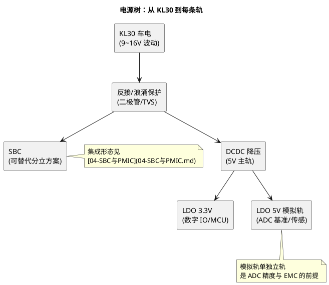
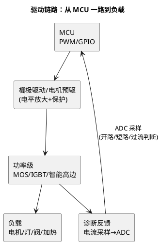

# 模拟电源与驱动：电源树和驱动链路上的小芯片

> 一句话定位：LDO/DCDC、栅极驱动、高边开关、电机预驱这些"几毛到几块钱的小芯片"决定电源树形态与负载驱动能力——软件工程师至少要能看懂电源树、说清驱动链路，因为 PWM 时序、诊断反馈、EMC 整改的边界都画在这些芯片上。
> 等级：L1→L2 ｜ 前置：[01-LDO原理与选型](../../../03-硬件基础/2-L2进阶/电源电路/01-LDO原理与选型.md)

## 原理

### 两张图：电源树与驱动链路

一块 ECU 上的模拟/电源/驱动芯片，都在这两条链上：

**软件视角一句话：你写的 PWM 在栅极驱动处被放大，你读的故障码来自诊断反馈电阻——两头都是这几颗小芯片。**

### 品类与代表（家族级）

| 品类 | 干什么 | 代表家族 | 软件关注点 |
|---|---|---|---|
| LDO 线性稳压 | 低压差稳压、干净小电流轨 | 各家通用车规 LDO（Infineon/ST/TI/ADI） | 压差/热（[01-LDO](../../../03-硬件基础/2-L2进阶/电源电路/01-LDO原理与选型.md)） |
| DCDC 开关稳压 | 高效降压主轨 | 各家 buck（含 SBC 内置） | 纹波与去耦（[04-纹波与去耦](../../../03-硬件基础/2-L2进阶/电源电路/04-纹波与去耦.md)）、EMC |
| 高边开关 | 电源正端智能开关（灯/阀诊断） | Infineon PROFET（BTS/BTN 系）、ST VIPOWER（VND/VNQ 系）、TI 高边开关系 | 开路/短路/过流诊断经电流镜或诊断脚进 ADC |
| 低边/预驱 | 负端开关与电机预驱 | 各家低边驱动；电机预驱 DRV 系（TI）等 | PWM 频率、死区、故障脚中断 |
| 栅极驱动 | 驱动 MOS/IGBT 栅极（三电功率级） | Infineon EiceDRIVER（1ED 系）、TI UCC/DRV 系、ST STDRIVE 系 | 死区互锁、米勒钳位、退饱和保护——安全相关的时序边界 |
| 电流采样放大 | 采样电阻→放大→ADC | 各家电流检测放大器 | 量程匹配与参考点（相电流 vs 母线电流） |

> 具体料号与参数以各厂 DS 为准；本表的作用是评审原理图时"认识品类、知道问什么"。

## 选型对照表

| 关注对象 | 看什么 | 谁主导 |
|---|---|---|
| 电源树拓扑 | 轨数/轨压/电流预算、DCDC 与 LDO 分工 | 硬件（软件评审电流预算） |
| 驱动能力 | 负载类型（阻性/感性/电机）→ 开关形态与保护 | 硬件 |
| 诊断能力 | 高边/预驱的故障反馈形式（电流镜/诊断脚/FAULT 中断） | **软硬件接口，软件必审** |
| 时序 | Power Good/使能/死区/软启动时间 | 软硬件联合（上下电时序影响 EcuM） |

## 多平台对照（双平台扩展版）

驱动芯片本身与 MCU 平台无关，差异在 MCU 侧的 PWM/ADC 外设——同样的驱动链路挂在两平台上：

| 维度 | TC377 侧 | S32K 侧 |
|---|---|---|
| PWM 源 | GTM TOM/ATOM（[GTM](../TC377平台/GTM/README.md)） | FTM（K1）/ eMIOS（K3） |
| 诊断采样 | EVADC 队列 | LPADC + 触发链（[Adc](../../../04-MCAL与外设驱动/2-L2进阶/Adc/README.md)） |
| MCAL 落点 | Pwm/Adc 模块 | 同左（配置对象不同） |
| 驱动芯片 | 同一颗（如同一高边开关） | 同一颗 |

结论：**驱动链路的"软件可移植部分"全在 MCAL 之上的应用/CDD 层**——这也是 CDD 设计方法论（[04 区/CDD](../../../04-MCAL与外设驱动/2-L2进阶/CDD设计方法论/README.md)）推荐把驱动芯片时序封装进 CDD 的原因。

## 代码/实操

软件工程师在这条链上的三个实际动作：

1. **电源树评审**：拿着电源树图核对每条轨的消费者与电流预算，确认软件可控制轨（使能脚）与 EcuM 上下电顺序的对应关系；
2. **PWM 参数联调**：电机/阀类负载的 PWM 频率由驱动芯片与负载特性共同约束（频率太高开关损耗大、太低有噪音）——与硬件一起定频率与死区，再落 MCAL Pwm 配置（[Pwm](../../../04-MCAL与外设驱动/2-L2进阶/Pwm/README.md)）；
3. **故障诊断链路**：高边开关诊断脚/电流镜 → ADC 采样 → 软件判开路/短路/过流 → Dem 上报故障位（[Dem 配置](../../../06-诊断与标定/2-L2进阶/Dem配置/README.md)）——量程换算（电流镜比例、分压电阻）算错的诊断阈值是经典 bug。

## 易错点与陷阱

1. **模拟轨与数字轨混接**：给传感器供电用了数字 5V 轨，纹波直接进采样值——看原理图先看"模拟轨单不独立"（[02-参考电压与精度](../../../03-硬件基础/2-L2进阶/模拟电路/ADC采样原理/02-参考电压与精度.md)）；
2. **诊断量程换算错**：电流镜比例系数、分压电阻、ADC 参考电压三重换算，任何一处抄错 DS 值，故障判定阈值整体偏移——换算链写成一行注释代码并注明出处；
3. **PWM 频率拍脑袋**：不做负载与驱动的开关损耗评估直接选 20kHz，要么啸叫要么发热——频率是软硬件联合决策，不是软件单方面定；
4. **忽视栅极电阻与 EMC 的联动**：栅极电阻小开关快但 EMC 差，整改 EMC 时改了栅阻没评估开关损耗——EMC 整改后要复测温升（[EMC 入门](../../../03-硬件基础/3-L3高级/PCB常识/04-EMC入门.md)）；
5. **感性负载不加续流**：继电器/阀线圈开关瞬间的反电动势，轻则复位重则烧驱动——看到感性负载先找续流二极管或钳位；
6. **Power Good 时不序**：多轨上电有先后，软件在轨未稳时初始化外设读到错值——初始化序列要等 PG（或 SBC 复位释放）再跑（[04-SBC与PMIC](04-SBC与PMIC.md) 时序一节）。

## 面试高频题

**Q：电机驱动链路上，MCU 之外还有哪些芯片？各干什么？**

答：栅极驱动（把 MCU 的 3.3V PWM 放大成驱动功率管的电平，带死区互锁/退饱和保护）→ 功率级 MOS/IGBT（或集成电机预驱/智能开关）→ 电流采样放大（采样电阻信号放大进 ADC）。软件负责 PWM 生成、死区确认、故障反馈判读（ADC+中断）与 Dem 上报。

**Q：为什么 ADC 采样要专门的模拟轨？**

答：数字轨（DCDC 出来的 3.3V/5V）带开关纹波，直接做传感器供电或 ADC 基准时纹波耦合进采样值，表现为低位跳动；独立 LDO 模拟轨纹波小得多。同理 ADC 参考电压、采样时间与源阻抗匹配（[03-采样时间与源阻抗](../../../03-硬件基础/2-L2进阶/模拟电路/ADC采样原理/03-采样时间与源阻抗.md)）都影响精度。

**Q：负载诊断（开路/短路）软件怎么实现？**

答：依赖驱动芯片的诊断能力——高边开关输出电流镜（按比例复制负载电流）或专用诊断脚，经分压/放大进 ADC；软件周期采样，与开路阈值/短路阈值/过流阈值比较，越限经去抖后上报 Dem 故障位。关键在换算链（比例+分压+基准）与阈值标定。

## 延伸

- [00-六大类总览](00-六大类总览.md)：本篇所属的行业版图全景；
- 硬件深挖：[电源电路](../../../03-硬件基础/2-L2进阶/电源电路/README.md)（LDO/DCDC/纹波/功耗）、[模拟电路](../../../03-硬件基础/2-L2进阶/模拟电路/README.md)、[EMC 入门](../../../03-硬件基础/3-L3高级/PCB常识/04-EMC入门.md)；
- 软件落点：[Pwm](../../../04-MCAL与外设驱动/2-L2进阶/Pwm/README.md)、[Adc](../../../04-MCAL与外设驱动/2-L2进阶/Adc/README.md)、[CDD 设计方法论](../../../04-MCAL与外设驱动/2-L2进阶/CDD设计方法论/README.md)；
- 邻篇：[04-SBC与PMIC](04-SBC与PMIC.md)（电源树上游的集成形态）、[06-AFE与专用传感器](06-AFE与专用传感器.md)（采样链的专用化延伸）。

---

维护约定：笔记命名 `序号-主题.md`；真实截图放 `_images/`；流程/时序/状态/架构图用 PlantUML 内嵌正文，规范见 [图表规范与模板](../../../00-总览/图表规范与模板.md)。
