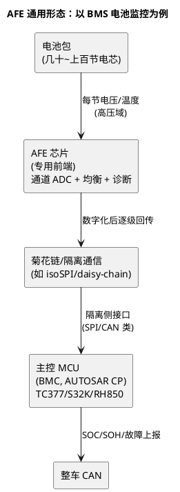

# AFE 与专用传感器：一颗芯片一个专业

> 一句话定位：BMS 前端（TI BQ、ADI LTC68xx、NXP MC3377x）、毫米波雷达（TI AWR）、车载音频（ADI A2B）这类专用芯片，每颗背后是一个垂直专业——嵌入式工程师遇到时的正确姿势是"懂接口、懂诊断、懂它在链路里的位置"，专业本身（电化学/雷达信号/声学）不归你重造。
> 等级：L1→L2 ｜ 前置：[ADC 采样原理](../../../03-硬件基础/2-L2进阶/模拟电路/ADC采样原理/README.md)

## 原理

### AFE 是什么：传感器与 MCU 之间的"专业翻译"

AFE（Analog Front End，模拟前端）= 专用调理电路 + 高精度 ADC + 数字接口。它把某个垂直领域的物理量（电池电压、雷达回波、声压）变成 MCU 能读的数字量——**"专用"体现在前端电路与算法是领域知识，不在你的 MCU 上**：

### 三大专用领域地图（家族级）

| 领域 | 代表家族 | 形态要点 | 主控侧软件做什么 |
|---|---|---|---|
| BMS 电池监控 | TI BQ796xx（菊花链）、ADI LTC681x（isoSPI）、NXP MC3377x | 多节电芯电压/温度采集、被动均衡、链式级联隔离 | SPI/链式协议驱动、CRC 校验、均衡策略执行、SOC/SOH 服务于应用层 |
| 毫米波雷达 | TI AWR 系（前端+处理）、加 TDA4 等做后处理 | 射频前端+DSP 一体，点云输出 | 传感器接口（以太网/CAN）与标定，信号处理不归 MCU 工程师 |
| 车载音频 | ADI A2B 总线 + 音频 DSP | 音频专用总线菊花链（麦克风/功放） | 总线配置与诊断，声学算法在 DSP |
| 其他 | 霍尔电流传感（ADI/TI/Allegro 等）、压力/惯性 MEMS | 传感器带调理输出模拟或 SENT/SPI | SENT 驱动（[MCAL Icu](../../../04-MCAL与外设驱动/2-L2进阶/Gpt与Icu/README.md)）、SPI 读取 |

> BMS AFE 的通道数（6/12/14/16/18 串）、均衡方式、隔离方案各家不同，选型看 DS——本表建"谁家有什么形态"的地图。

### 为什么"一颗芯片一个专业"

BMS AFE 的难点不在接口而在**测量安全**：高压域隔离、同步采样、线束诊断（开路检测）、冗余测量（ASIL 分解）——这些机制内建在芯片里，你的职责是用对它们（配置诊断、校验 CRC、喂它内部看门狗），而不是重新发明。雷达/音频同理：算法壁垒在芯片与方案商，MCU 工程师吃"接口与集成"这一段。

## 选型对照表

| 关注对象 | 看什么 | 谁主导 |
|---|---|---|
| 数字接口 | SPI / 菊花链 / 隔离形式——决定驱动形态 | 软硬件联合 |
| 诊断能力 | 内建诊断（开路/短路/内部看门狗）能否映射到 Dem | **软件必审** |
| 安全机制 | 冗余通道、内置自检、安全手册配套 | 系统安全工程 |
| 采样时序 | 同步采样、队列、触发——与主控调度匹配 | 软硬件联合 |

## 多平台对照（双平台扩展版）

AFE 与主控 MCU 解耦，但驱动落在哪个平台、形态不同：

| 维度 | TC377 作主控 | S32K 作主控 |
|---|---|---|
| 接口 | ASCLIN-SPI / QSPI（快速） | LPSPI |
| 驱动落点 | Spi MCAL + CDD 封装链式协议 | 同左（配置对象不同） |
| 同步/触发 | GTM 触发链 | TRGMUX/BCTU（K3） |
| 通用部分 | CRC 校验、诊断映射、均衡调度逻辑 | 同左（平台无关，纯 CDD/应用层） |

结论同 [05 篇](05-模拟电源与驱动.md)：**平台相关的是接口层（MCAL），专业相关的是协议层（CDD），两者分开封装，AFE 驱动即可跨平台复用**——这也是三电岗位 JD 里"SPI 驱动开发经验"的真实含义。

## 代码/实操

以 BMS AFE 驱动为例的软件工作分解（不用真做，读懂分工即可）：

1. **接口层**：Spi MCAL 配置（时钟极性/相位、片选、波特率——全部按 AFE DS 时序图核）；
2. **协议层 CDD**：命令帧组包/解包、CRC 校验、菊花链寻址与回传、通信超时重试；
3. **诊断层**：把 AFE 内建诊断（开路/欠压/过温）映射为 Dem 故障位；AFE 内部看门狗纳入 WdgM 监督链；
4. **应用层**：采样数据 → SOC/SOH 估算（电化学+算法工程师的领域）→ CAN 上报。

你负责 1~3（全是 CP 功底），4 是跨专业协作的边界。

## 易错点与陷阱

1. **把 AFE 当普通 SPI 外设**：菊花链/隔离拓扑下"命令发出去"不等于"数据有效"——CRC、帧计数、超时重试一个都不能省，链式通信的静默失败比 SPI 错误更隐蔽；
2. **忽视 AFE 内部看门狗**：多数安全 AFE 带内部看门狗，主控不按协议喂它，它主动断输出进安全态——"数据突然全零"先查你有没有喂它；
3. **诊断映射拍脑袋**：AFE 的诊断阈值是电化学/热特性的函数（跟温度相关），常量阈值会在低温区误报——阈值表要与电芯规格书联动；
4. **想学 BMS 就去背电化学**：嵌入式侧的 BMS 工作 80% 是通信、诊断、调度、安全机制——电池知识够用即可，别本末倒置（面试也是，考你的是链路与安全，不是电池材料）；
5. **混淆 SENT 与 SPI 传感器**：SENT 是单线异步传传感器数据的协议（成本低、汽车专用），驱动走 Icu 通道而非 Spi——接原理图先确认传感器接口类型；
6. **雷达/音频岗位按"传感器工程师"理解**：TI AWR 岗位多是信号处理/算法工种；MCU 工程师的相关入口是"传感器集成/接口/诊断"，投递前看清 JD 分工。

## 面试高频题

**Q：BMS 从芯片到软件的链路是什么样的？嵌入式工程师能做哪部分？**

答：链路——电芯 → AFE（TI BQ/ADI LTC68/NXP MC3377x，多节电压温度采集+均衡+诊断）→ 菊花链/隔离回传 → 主控 MCU（AUTOSAR CP）→ SOC/SOH 估算 → CAN 上报。嵌入式负责：SPI/链式协议驱动、CRC 与重试、诊断映射到 Dem、内部看门狗接入 WdgM、采样调度；SOC/SOH 算法与电池特性是算法/电化学侧协作。收尾点一句：AFE 驱动的平台相关部分只在 MCAL 接口层，协议层 CDD 可跨平台复用。

**Q：为什么 BMS 的 AFE 都用菊花链而不是每个从控一颗 CAN？**

答：高压电池包里从控板数量多且在高压域——菊花链用变压器/电容隔离级联（如 isoSPI），省线束、省隔离 CAN 收发器成本、布板简单；代价是链式通信要处理寻址、帧同步与静默失败（CRC/帧计数/超时重试）。一句话：成本与隔离工程决定拓扑，软件为拓扑的可靠性买单。

**Q：传感器信号进 MCU 有哪几种接口形态？**

答：模拟电压/电流（进 ADC，最简单）、SPI/I2C 数字（带诊断寄存器）、SENT（单线异步，传感器专用，走 Icu 类捕获）、CAN（智能传感器自带协议栈）。选驱动形态先看接口类型——这决定你用 Adc/Spi/Icu/CanDrv 哪条 MCAL 链。

## 延伸

- [00-六大类总览](00-六大类总览.md)：本篇所属的行业版图全景；
- 采样基础：[ADC 采样原理](../../../03-硬件基础/2-L2进阶/模拟电路/ADC采样原理/README.md)（采样/参考电压/源阻抗三篇）；
- 接口与驱动：[SPI 时序](../../../04-MCAL与外设驱动/2-L2进阶/Spi/01-SPI时序.md)、[Gpt与Icu](../../../04-MCAL与外设驱动/2-L2进阶/Gpt与Icu/README.md)（SENT 类）、[CDD 设计方法论](../../../04-MCAL与外设驱动/2-L2进阶/CDD设计方法论/README.md)；
- 安全侧：[11 区功能安全](../../../11-功能安全与信息安全/README.md)（AFE 冗余测量与 ASIL 分解的背景）；
- 职业侧：[04-行业观察-新能源与域控](../../../14-面试与成长/2-L2进阶/职业发展/04-行业观察-新能源与域控.md)——三电赛道与"懂控制策略的嵌入式工程师"更稀缺的判断。

---

维护约定：笔记命名 `序号-主题.md`；真实截图放 `_images/`；流程/时序/状态/架构图用 PlantUML 内嵌正文，规范见 [图表规范与模板](../../../00-总览/图表规范与模板.md)。
