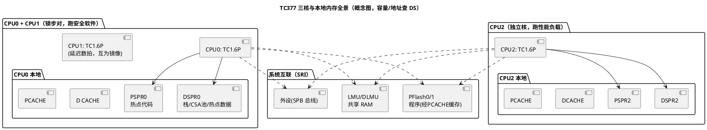

# TC1.6P 内核概览

> 一句话定位：认识 TC377 的三个心脏——TC1.6P 是什么（P=Performance 双发射）、三核怎么分工、每核口袋里有哪些本地内存，先建立"核-内存-互联"的全局地图，再进各专题笔记。
> 等级：L2→L3 ｜ 前置：[01-编程模型与寄存器](../../1-L1基础/ARM-Cortex-M/01-编程模型与寄存器.md)

## 太长不看

- **人话直觉**：TC377 = 三个"满配"同构核，各自带一套私有口袋（DSPR/PSPR）——没有天生的主从之分，谁是管家由启动固件说了算。
- **本篇解决**：三个核到底是什么关系、每核口袋里有什么？TriCore 与 Cortex-M 的本质差异在哪？
- **赶时间记住 3 条**：
  1. 典型配置 CPU0+CPU1 组锁步对跑安全软件、CPU2 独立跑性能负载；
  2. 每核独占 DSPR（放数据/栈/CSA）与 PSPR（放代码），零等待，放什么由链接脚本显式决定；
  3. trap/中断是两张向量表（BTV/BIV），别拿 Cortex-M"一张 NVIC 表走天下"的直觉硬套。

## 原理

### TriCore 与 TC1.6 家族定位

TriCore 是英飞凌的 32 位 RISC（Reduced Instruction Set Computer，精简指令集计算机）加载/存储（Load/Store）架构，带 DSP（Digital Signal Processing，数字信号处理）运算能力。汽车 AURIX 系列用的核是 TC1.6 家族：

| 变体 | 关键特征 | 典型搭载 |
|---|---|---|
| TC1.6.2（非 P） | 单发射、顺序执行 | AURIX 一代 TC2xx 为主 |
| TC1.6P（P=Performance） | 双发射（dual-issue）超标量、顺序执行（in-order） | AURIX 二代 TC3xx 全系（含 TC377） |

三点读法：

- **双发射**：每周期最多取指/译码/发射 2 条指令到两条并行流水线，理论峰值 IPC（Instructions Per Cycle，每周期指令数）为 2——同频率下比单发射核"干得多"，这也是 P 后缀的含义。
- **顺序执行**：与 Cortex-M 一样不做乱序（out-of-order），牺牲峰值换确定性与低功耗——车规实时场景宁可慢一点，也要每次都一样快。
- **家族内差异查 UM**：FPU（Floating Point Unit，浮点单元）配置、流水线级数等细节随型号/变体不同，以所用芯片的 UM（User's Manual，用户手册）内核章节为准，不背网上的表。

### TC377 三核配置概览

TC377 搭载 3 个 TC1.6P，典型拓扑（具体配置以 DS（Data Sheet，数据手册）为准）：

| 核 | 角色 | 说明 |
|---|---|---|
| CPU0 + CPU1 | 锁步对（lockstep pair） | 两核跑同一指令流互为镜像，比对失配即报安全故障，跑安全相关软件（详见 [05-Lockstep安全机制](05-Lockstep安全机制.md)） |
| CPU2 | 独立核 | 跑性能负载：通信、标定、诊断等 |

三个关键认知：

1. **同构对等**：三核没有 Cortex-A/M 那种主从异构——每个核都是"满配 TriCore"，各自一套完整寄存器组、本地内存、trap/中断向量、CSA 池。没有哪个核天生是"管家的核"。
2. **同频典型值**：内核频率典型 200 MHz 量级（ overclock 不存在的幻觉别有——具体最高频率与电压/温度条件查 DS）。
3. **一套 UM 的三份拷贝**：理解了一个核的机制（trap、CSA、DSPR），三个核都适用，只是各自独立一份。

### 每核本地内存：口袋里的四样东西

TC1.6P 每个"贴身"配置四块资源，这是 TriCore 性能模型的根基（容量大小查 DS）：

| 资源 | 全称 | 干什么用 |
|---|---|---|
| DSPR | Data Scratchpad RAM（数据暂存 RAM） | 核独占数据内存：栈、CSA 池、热点变量；紧耦合零等待 |
| PSPR | Program Scratchpad RAM（程序暂存 RAM） | 核独占代码内存：可放热点函数，零等待取指 |
| D CACHE | 数据缓存 | 缓存远端内存（LMU/PFlash 等）的数据访问 |
| PCACHE | 程序缓存 | 缓存 PFlash 的取指，减少等待状态 |

DSPR/PSPR 是"软件显式管理"的暂存区（放什么由链接脚本/MemMap 决定，不是硬件自动分配）；CACHE 对软件透明。展开见 [04-DSPR-PSPR与寻址](04-DSPR-PSPR与寻址.md)。

### 寄存器组概览

| 组 | 成员 | 一句话 |
|---|---|---|
| 数据寄存器 | D0~D15 | 算术/逻辑主战场，支持 64 位寄存器对 |
| 地址寄存器 | A0~A15 | 指针/地址运算；A10=SP、A11=RA 是"钦定角色" |
| 系统寄存器 | PC、PSW | 程序计数器、程序状态字（CC/IO/CDC 等字段概念见 01 区笔记） |
| 上下文寄存器 | PCXI/FCX/LCX | CSA 机制的三大指针（详见 [02-CSA上下文机制](02-CSA上下文机制.md)） |
| CSFR | 核心特殊功能寄存器 | BTV/BIV/SYSCON 等，`mfsr`/`mtsr` 访问，编号查 UM |

寄存器逐个角色与寻址模式在 [TriCore 寄存器与寻址](../../../01-编程语言/2-L2进阶/汇编基础/TriCore汇编/01-寄存器与寻址.md)已讲透，本篇不重复。

## 寄存器与位表

本篇只做"索引级"概览，位定义一律以 UM 对应章节为准（不同 TC1.6.x 小版本有保留差异）：

| 对象 | 属性 | 查证处 |
|---|---|---|
| PSW.CC/IO/CDC/IE | 条件码/IO 特权级/调用深度计数/全局中断使能（字段概念） | UM「PSW」章节 |
| PCXI（PIE/UL/PCX 字段） | 上一上下文档案 | UM「PCXI」章节 + 本目录 [02-CSA上下文机制](02-CSA上下文机制.md) |
| FCX/LCX | 空闲 CSA 链头/警戒线 | UM「Context」章节 |
| BTV/BIV | trap/中断向量基址 | UM「Trap/Interrupt」章节 + [03-Trap与中断机制](03-Trap与中断机制.md) |
| 每核 DSPR/PSPR/CACHE 容量 | 各核略有不同 | DS「Memory Map」章节 |

## 双平台对照

| 维度 | TriCore TC1.6P | Cortex-M4 | Cortex-M7 |
|---|---|---|---|
| 架构定位 | 32 位 RISC+DSP，车规专用 | 32 位通用 MCU，DSP 扩展指令 | M4 加强版，高性能 MCU |
| 发射/流水 | 双发射顺序执行 | 单发射 3 级流水 | 双发射超标量 6 级流水，分支预测 |
| 通用寄存器 | D0~D15 + A0~A15（数据/地址分家，共 32 个） | R0~R12 通用 + SP/LR/PC（16 个，数据地址不分家） | 同 M4 |
| 函数调用现场 | 硬件 CSA 机制，`call`/中断自动存 CSA | 软件压栈；异常入口硬件自动压 8 个寄存器 | 同 M4 |
| 异常模型 | trap（Class/TIN）+ 中断（BIV）双表，syscall 独立通道 | NVIC 单一向量表，异常号统一编号 | 同 M4 |
| 本地紧耦合内存 | 每核 DSPR/PSPR + D CACHE/PCACHE | 无 TCM（普通 SRAM 经总线矩阵） | 可选 ITCM/DTCM |
| 多核 | 原生多核 + 锁步对（TC377 三核） | 无（单核） | 无（单核） |
| 特权/保护 | IO 特权级 + MPU（可选） | 特权/非特权 + MPU | 同 M4 |

一句话记忆：**TC1.6P ≈ "M7 级的双发射性能 + 硬件上下文/双向量表 + 车规多核锁步"**，它是为动力/底盘域的确定性实时而生，不是通用 MCU 的换皮。

## 代码/实操

新接手 TC377 工程时，用三个动作把"纸面架构"落到"手上的工程"：

1. **看链接脚本/map 文件**：确认每核的 DSPR/PSPR 划分、CSA 池大小、各核栈（符号命名随工具链，方法见 [读 startup 汇编](../../../01-编程语言/2-L2进阶/汇编基础/TriCore汇编/03-读startup汇编.md)）。
2. **调试器认核**：TRACE32/英飞凌 AURIX Development Studio 连上后先确认三核各自停在复位/断点，分清 CPU0（常为锁步主视角）与 CPU2 的角色分工。
3. **频率与时钟树对表**：SCU 时钟配置寄存器算一遍实际核频（概念见各工程 MCAL 的 Mcu 驱动），别把标称值当运行值。

## 易错点与陷阱

1. **把"三核"当"三份独立 MCU"**：内存互联共享（LMU/PFlash/外设），跨核访问 DSPR 有代价且无硬件一致性——数据放哪、谁访问谁，是性能问题的第一嫌疑（见 04 篇）。
2. **以为 CPU0 是"主核"、CPU2 是"从核"**：同构对等，启动顺序（谁先跑 cstart）是工程/启动固件决定的，不是架构钦定。
3. **拿 Cortex-M 经验套中断**：M 上"向量表一张、NVIC 管全部"；TriCore 是 trap/中断两套向量基址（BTV/BIV），排查入口完全不同（见 03 篇）。
4. **双发射当"必然 2 IPC"**：双发射是峰值，取指带宽、数据相关、访存等待都会打折扣；确定性场合按最坏情况算。
5. **频率口口相传**：200 MHz 是典型值，实际核频由时钟树配置决定，测延迟/算定时器分频前先核实。

## 面试高频题

1. **TC1.6P 的 P 是什么意思？和 TC1.6.2 什么区别？**
   答：P=Performance，双发射超标量顺序执行，每周期最多发射 2 条指令；非 P 的 TC1.6.2 单发射。TC2xx 多用非 P，TC3xx 全系 TC1.6P。更深差异（流水线/FPU）以 UM 为准。

2. **TC377 三个核是什么关系？**
   答：3 × TC1.6P 同构对等；典型配置 CPU0+CPU1 组成锁步对跑安全相关软件，CPU2 独立跑性能负载（具体以 DS 为准）。每个核都有完整的寄存器组、本地 DSPR/PSPR、独立 trap/中断向量与 CSA 池。

3. **DSPR 和 PSPR 是什么？和 CACHE 什么区别？**
   答：每核独占的紧耦合零等待内存，DSPR 放数据（栈/CSA/热点变量）、PSPR 放可执行代码；CACHE 缓存的是远端内存（PFlash/LMU）的副本，对软件透明。DSPR/PSPR 放什么由软件（链接脚本/MemMap）显式决定。

4. **TC1.6P 和 Cortex-M7 比有什么本质不同？**
   答：同为双发射顺序执行量级，但 TriCore 有硬件 CSA 上下文机制、trap/中断双向量体系、数据/地址寄存器分家、原生多核锁步——为车规确定性与功能安全设计；M7 胜在生态与通用性，靠 NVIC+MPU+软件方案补位。

5. **TriCore 是哈佛结构还是冯·诺依曼结构？**
   答：概念上"程序与数据空间统一编址（32 位线性地址空间），但物理上取指与数据通路分离（PFlash/PSPR 取指、DSPR/LMU 数据、各自 CACHE）"——工程上按"统一编址、物理分路"理解最准，别纠结名词站队。

## 延伸

- 下一篇：[02-CSA上下文机制](02-CSA上下文机制.md)（本目录最重要的机制篇）
- [TriCore 寄存器与寻址](../../../01-编程语言/2-L2进阶/汇编基础/TriCore汇编/01-寄存器与寻址.md)（寄存器逐个展开）
- [TC377 平台](../../2-L2进阶/TC377平台/README.md)（外设与平台级视角）
- [多核架构](../多核架构/README.md)（三核协同与核间通讯）
- [ARM-Cortex-M](../../1-L1基础/ARM-Cortex-M/README.md)（双平台对照的另一端）
- [02-芯片与体系结构总览](../README.md)
- 工程深入场景：新接手一个 TC377 AUTOSAR 工程的第一天，用本篇地图做三件事——看 map 文件确认三核 DSPR/PSPR/CSA 池划分、调试器连上分清锁步对与 CPU2 各停在哪、把 SCU 时钟配置算一遍实测核频——避免拿 S32K 单核经验直接开工踩坑。
