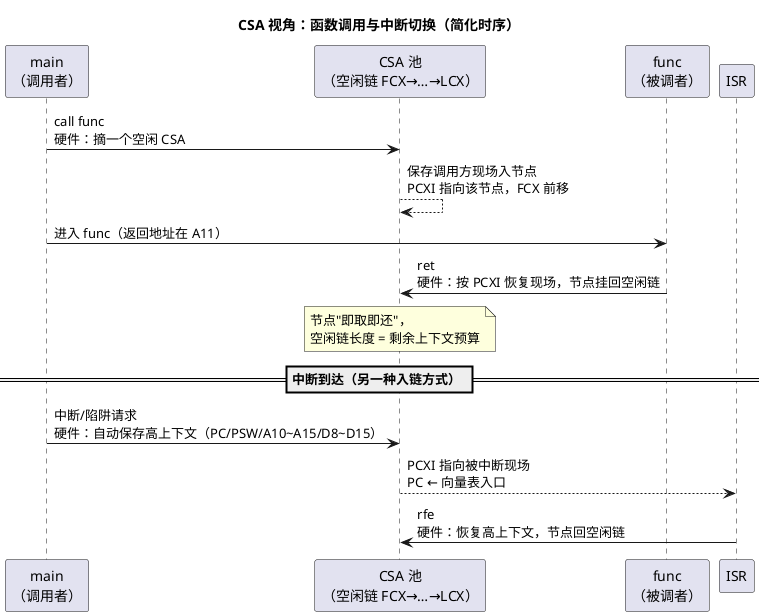

# CSA 上下文机制

> 一句话定位：TriCore 用硬件管理的链表（CSA）代替纯软件压栈来保存函数调用与中断现场——吃透 FCX/LCX/PCXI 三个指针和高/低上下文，才算真正理解 TriCore 的"栈"。
> 等级：L3 ｜ 前置：[01-TC1.6P内核概览](01-TC1.6P内核概览.md)

## 太长不看

- **人话直觉**：CSA=硬件管理的寄存存柜链表，刷卡存取不用自己搬箱子。
- **本篇解决**：TriCore 的函数调用现场到底存在哪？CSA 耗尽 trap 是怎么来的？
- **赶时间记住 3 条**：
  1. PCXI 指当前上下文，链表串起 CSA；
  2. 函数调用低上下文、中断高上下文；
  3. CSA 区大小在链接脚本里给足，耗尽=塌。

## 原理

### 为什么不用纯软件栈

Cortex-M 上一次函数调用的现场保存是编译器生成的压栈指令序列（`push {r4-r11}` 一条一条来），中断入口虽然硬件自动压 8 个寄存器，也只是一次"批量压栈"。TriCore 换了个思路——**把"保存现场"做成硬件数据结构操作**：

| 痛点（纯软件栈） | CSA 方案 |
|---|---|
| 保存 n 个寄存器要 n 条 st 指令，调用开销随寄存器数线性涨 | 硬件按指针批量搬移，`call`/中断入口一条指令级开销完成 |
| 中断延迟受编译器生成的压栈序列影响 | 现场保存路径固定，延迟确定性好 |
| 栈溢出只能靠软件护栏 | 链表耗尽有硬件警戒线（LCX），逼近即触发 trap |
| ABI 里 caller/callee 保存责任全靠软件约定 | 硬件保存的寄存器集合与 ABI 的非易失寄存器集合对齐，编译器省指令 | <!-- 技术性修正：TriCore EABI 中高上下文集为跨调用非易失 -->

一句话动机：**函数调用和中断切换是嵌入式最高频的"上下文动作"，把它硬件化，换调用速度和中断确定性**——这是 TriCore 为实时车控而生的核心设计之一。

代价也要看清：CSA 池是有限的 RAM 资源（每节点固定 64 字节），深调用链/深嵌套会真金白银地吃掉它，耗尽即 trap（见下文"上溢与下溢"）。

### CSA 节点：链表化的"现场盒子"

CSA（Context Save Area，上下文保存区）是链接器在 RAM 里划出的一块池子，按**固定 16 个字（64 字节）**切成一个个节点，节点间用链指针串成链表：

```text
一个 CSA 节点（64B，64 字节对齐；逐槽精确偏移查 UM 的 CSA 格式图）
+0x00 | 链字：上一层 PCXI（回溯链，指向更早被换出的现场）
+0x04 | 链字：下一个空闲 CSA 地址（仅节点空闲时有效，串空闲链用）
+0x08 | 寄存器槽位若干……（按上下文类别布局，见下表）
+0x3C |
```

两个"上下文类别"决定槽位里放什么：

| 上下文类别 | 保存内容（概念集合） | 谁来触发 |
|---|---|---|
| 高上下文（Upper Context） | PC、PSW、A10~A15、D8~D15——"整场快照"，含程序位置与状态 | `call`/`ret`、中断/trap/系统调用入口，**硬件自动** |
| 低上下文（Lower Context） | A2~A7、D0~D7、A11（返回地址）——易失/传参寄存器集，同样占满一个 64B 节点 | `svlcx`/`rslcx` 显式保存恢复（口径以 UM 的指令条目为准） | <!-- 技术性修正：低上下文集合原误写为"A11~A15、D8~D15"；UM 定义为 A2~A7、D0~D7、A11，且 CALL 保存的是高上下文 -->

注意两条铁律：

- **槽位布局不背偏移**：高/低上下文各槽的精确偏移、链字复用规则，以 UM 的"CSA Format"图为准；排查时用调试器的 CSA 解析功能，别手算第几字是 PSW。
- **硬件保存集 = ABI 非易失集**：正因为 D8~D15、A10~A15 这组寄存器随 `call`/`ret` 硬件自动保存/恢复，编译器 ABI 才把它们定为跨调用非易失——被调函数可以随便用，不用 software save；真正调用易失的是低上下文集 D0~D7、A2~A7（传参/返回值正走这里），跨调用要保留时用 `svlcx` 批量存。硬件机制与软件约定是一体两面。 <!-- 技术性修正：原表述把易失/非易失方向写反 -->

### 三个指针：FCX / LCX / PCXI

| 指针 | 全称 | 指向 | 一句话 |
|---|---|---|---|
| FCX | Free Context List head pointer | 空闲 CSA 链表头 | 下一个可分配的节点；分配=摘链头，回收=挂回链头 |
| LCX | Limit Context pointer | 空闲链上的警戒位置 | 空闲链缩短逼近它 → 硬件触发耗尽类 trap |
| PCXI | Previous Context Information | 最近一次被换出的现场 | 当前 CPU 的"上一层现场"档案，含上下文类别与 CSA 地址 |

三者都是 CSFR（Core Special Function Register，核心特殊功能寄存器），用 `mfsr`/`mtsr` 访问。运行中的不变式：**PCXI 链 = 调用/异常嵌套链**——每嵌套一层，就有一个新 CSA 挂上去；每返回一层，就摘一个回空闲链。

### 切换流程：一次调用与一次中断



读图要点：`call`/`ret` 与中断/`rfe` 走的是**同一套**"摘链—存现场—挂链"机制，保存的都是高上下文，区别在入口向量与返回方式。所以深调用链和深中断嵌套消耗的是同一口池子。 <!-- 技术性修正：CALL 与中断均保存高上下文，原文"区别只在 UL 位"不成立 -->

### 上溢与下溢：CSA 的两种"爆法"

| 故障 | 触发条件 | 典型 TIN（Class 1 内部保护类，细分号查 UM） | 现场症状 |
|---|---|---|---|
| 上溢（耗尽） | 空闲链缩短逼近/到达 LCX 警戒线 | 自由 CSA 链耗尽类（FCD，Free Context list Depletion） | 深调用/递归/深嵌套时"看似栈溢出"的崩溃，实为上下文耗尽 |
| 下溢 | 空闲链已空还要归还/恢复 | 自由 CSA 链下溢类（FCU，Free Context list Underflow） | 现场被二次恢复、链表指针错乱——多是软件改坏了链字或重复 rfe/ret |

上溢是工程里的高频事件，三步处置：查 map 里 CSA 池大小 → 估调用深度（配合 PSW.CDC 调用深度计数，见 [03-Trap与中断机制](03-Trap与中断机制.md)）→ 扩池或砍深调用/递归。

## 寄存器与位表

| 寄存器 | 字段/概念 | 位号与精确编码 |
|---|---|---|
| PCXI | PIE（上一层中断使能状态）、UL（上下文类别 Upper/Lower）、PCXS/PCXO（上一层 CSA 的段/偏移地址） | 位定义查 UM「PCXI」 |
| FCX | 与 PCXI 的 PCX 字段同构，指向空闲链头 | 访问用 `mfsr`/`mtsr`，寄存器编号查 UM「CSFR 列表」 |
| LCX | 空闲链警戒指针 | 同上 |
| PSW.CDC | 调用深度计数（配合 CSA 深度护栏） | 见 [03-Trap与中断机制](03-Trap与中断机制.md) |

## 双平台对照

| 维度 | TriCore（CSA） | Cortex-M（软件栈） |
|---|---|---|
| 函数调用现场 | 硬件上下文切换，现场入 CSA 链表 | 编译器生成 `push/pop` 序列，现场在栈上 |
| 异常入口现场 | 硬件自动保存高上下文（PC/PSW/A10~A15/D8~D15）入 CSA | 硬件自动压 8 个寄存器（R0~R3/R12/LR/PC/xPSR）入栈 |
| 异常返回 | `rfe` 从 CSA 整场恢复 | `bx LR`（EXC_RETURN）+ 硬件出栈 |
| "栈溢出"形态 | CSA 链耗尽（FCD trap）或 A10 栈越界（软/MPU 护栏） | MSP/PSP 越界写穿（常用 MPU/护栏值兜底） |
| 调用栈回溯 | 沿 PCXI→CSA 链逐层挖（链表天然就是调用链） | 沿栈帧回溯（需 FP/编译器帧链或 unwinder） |
| 栈指针角色 | A10 只管局部变量/临时量，调用现场不占栈 | SP 承担一切现场 |
| 实时性卖点 | 保存路径固定、延迟确定 | 依赖编译器生成的序列长度 |

## 代码/实操

### 1. CSA 池从哪来：startup 初始化

池子由链接脚本划定（`__CSA_BEGIN/__CSA_END` 类符号），startup 早期把每个节点串成空闲链、设置 FCX/LCX——**必须在第一次 `call` 之前完成**，否则第一个函数调用就触发 Class 1 上下文 trap。完整汇编走读见 [读 startup 汇编](../../../01-编程语言/2-L2进阶/汇编基础/TriCore汇编/03-读startup汇编.md)；多核工程里每核各初始化自己的池子。

### 2. 池大小怎么估

```text
预算 ≈ (最大调用深度 × 每层 1 节点 + 最深中断嵌套层数 × 每层 1~2 节点 + 安全余量) × 64 字节
```

- 调用深度可借 PSW.CDC（调用深度计数）在压力测试中实测峰值；
- 中断嵌套层数 = 工程允许的最高抢占链（OS/中断优先级设计决定）；
- 余量建议 ≥ 20%，并在 LCX 附近留出报警窗口（供 trap handler 记录现场）。

### 3. 调试：沿 CSA 链回溯调用栈

```text
TRACE32（TriCore）概念操作：
  1. Call Stack 窗口：调试器自动沿 PCXI/CSA 链解析调用栈——
     这是 CSA 机制的"免费红利"，ARM 上要靠帧链/unwinder 才有
  2. 手工回溯（怀疑调试器解析不可信时）：
     d.dump %PCXI          → 取 PCX 字段 → 得最近现场 CSA 地址
     d.dump <CSA地址>      → 第 0 字 = 上一层 PCXI；槽位里挖 PC/A11
     逐层重复，直到链尾 → 得到一串 PC → 对 map 文件还原调用链
  3. 监控池余量：观察 FCX 与 LCX 的距离，
     距离持续变小 = 某条调用链在"漏水"
```

崩溃取证（Class/TIN 定性、错误 PC 提取、上报策略）的完整流程在 [trap 入口代码与崩溃定位](../../../01-编程语言/2-L2进阶/汇编基础/TriCore汇编/04-trap入口代码.md)——那篇讲"取证流程"，本篇讲"链表机制与手工回溯"，互为表里。

## 易错点与陷阱

1. **把 CSA 耗尽当普通栈溢出查**：症状像（深调用崩溃），方向完全不同——先查 map 里 CSA 池大小和 FCX/LCX，再看 A10 栈；扩错地方白忙一天。
2. **以为 `call` 会动 A10**：CSA 机制下调用现场不占软件栈，A10 只被局部变量/临时量消耗；手写汇编时别拿 Cortex-M 的"call=push"直觉套。
3. **CSA 池配得刚刚好**：没有余量的池子，任何一次新增的深调用（哪怕只是某库多包了一层）都会在量产工况里爆 FCD——按"峰值×1.2"起步。
4. **trap handler 里忘存低上下文**：硬件只自动存高上下文；handler 要用更多寄存器时先 `svlcx`，退出前 `rslcx` 恢复（`rfe` 只负责高上下文），否则恢复时上下文类别错乱（见 01 区 trap 篇骨架）。 <!-- 技术性修正：svlcx 与 rslcx 成对，原文误写"与 rfe 成对" -->
5. **手算 CSA 槽位偏移**：高/低上下文槽位布局以 UM 为准，不同小版本有差异；用调试器的 CSA 解析，别背网表。
6. **在别的核上看这口的池子**：每核独立一套 FCX/LCX/PCXI，回溯 CPU2 的崩溃要在 CPU2 的上下文里看链，别拿 CPU0 的指针硬套。
7. **软件直接改写 CSA 池内存**：池子属于硬件数据结构，应用代码在池区域内放变量/当缓冲区用，等于在链表上埋雷——链接脚本层面的段保护要配好。

## 面试高频题

1. **TriCore 为什么用 CSA 而不是纯软件栈？**
   答：把最高频的上下文动作（函数调用、中断切换）硬件化：现场保存变成链表摘挂操作，调用与中断延迟确定；硬件保存集与 ABI 易失寄存器集对齐，编译器省压栈指令；链表耗尽有 LCX 警戒线可触发 trap。代价是 CSA 池占用 RAM 且深调用会耗尽它。

2. **高上下文和低上下文有什么区别？**
   答：高上下文是"整场快照"（PC、PSW、A10~A15、D8~D15），`call`、中断/trap/系统调用入口硬件自动保存；低上下文是易失寄存器集（A2~A7、D0~D7、A11 返回地址），由 `svlcx`/`rslcx` 显式保存恢复。PCXI 的 UL 位标记类别（槽位细节查 UM）。 <!-- 技术性修正：低上下文集合与触发者原文有误 -->

3. **FCX、LCX、PCXI 各是什么？**
   答：FCX 指向空闲 CSA 链表头（分配=摘头，回收=挂头）；LCX 是空闲链上的警戒线，逼近即触发耗尽类 trap；PCXI 记录最近被换出的现场（类别+CSA 地址），它的链就是当前调用/异常嵌套链。

4. **CSA 耗尽会发生什么？怎么排查？**
   答：空闲链缩短逼近 LCX 触发 Class 1 上下文类 trap（典型 TIN 如 FCD，细分号查 UM），常被误当"栈溢出"。排查：map 确认池大小 → 调试器看 FCX 与 LCX 距离 → 用 PSW.CDC 实测调用深度 → 扩池或砍深调用/递归。

5. **调试器里怎么回溯 TriCore 的调用栈？**
   答：沿 PCXI→CSA 链：PCX 字段给出最近现场 CSA 地址，节点第 0 字又是上一层 PCXI，逐层回溯同时挖出各层 PC/A11，对 map 文件还原调用链；TRACE32 的 Call Stack 窗口就是自动做这件事。这也是崩溃取证的核心手段。

6. **CSA 机制对 C/ABI 编码有什么实际影响？**
   答：D8~D15、A10~A15 为跨调用非易失寄存器（`call`/`ret` 硬件自动保存恢复），被调函数可直接使用；D0~D7、A2~A7 为调用者易失（传参与返回值也在这里），需跨调用保留时由编译器用 `svlcx`/`rslcx` 批量保存。写内联汇编/手写库时遵守该约定，否则轻则性能差、重则现场丢失。 <!-- 技术性修正：原表述易失/非易失方向写反 -->

## 延伸

- 上一篇：[01-TC1.6P内核概览](01-TC1.6P内核概览.md)
- 下一篇：[03-Trap与中断机制](03-Trap与中断机制.md)（谁在消耗 CSA：调用深度与中断嵌套）
- [读 startup 汇编](../../../01-编程语言/2-L2进阶/汇编基础/TriCore汇编/03-读startup汇编.md)（CSA 池初始化的汇编现场）
- [trap 入口代码与崩溃定位](../../../01-编程语言/2-L2进阶/汇编基础/TriCore汇编/04-trap入口代码.md)（沿 CSA 取证的完整流程）
- [TriCore 寄存器与寻址](../../../01-编程语言/2-L2进阶/汇编基础/TriCore汇编/01-寄存器与寻址.md)（寄存器角色速查）
- [异常与 Trap](../异常与Trap/README.md)（TC377 trap 分类与 TIN 表专区）
- 工程深入场景：量产车偶发"深工况下软件复位"，trap 记录显示 Class 1 FCD（空闲 CSA 链耗尽）——台架复现压力场景、看 FCX 与 LCX 距离持续收缩，最终定位是某诊断协议栈新增一层深递归调用吃穿了 CSA 池；扩池 + 砍递归双管齐下，这正是本篇机制最典型的兑现现场。
