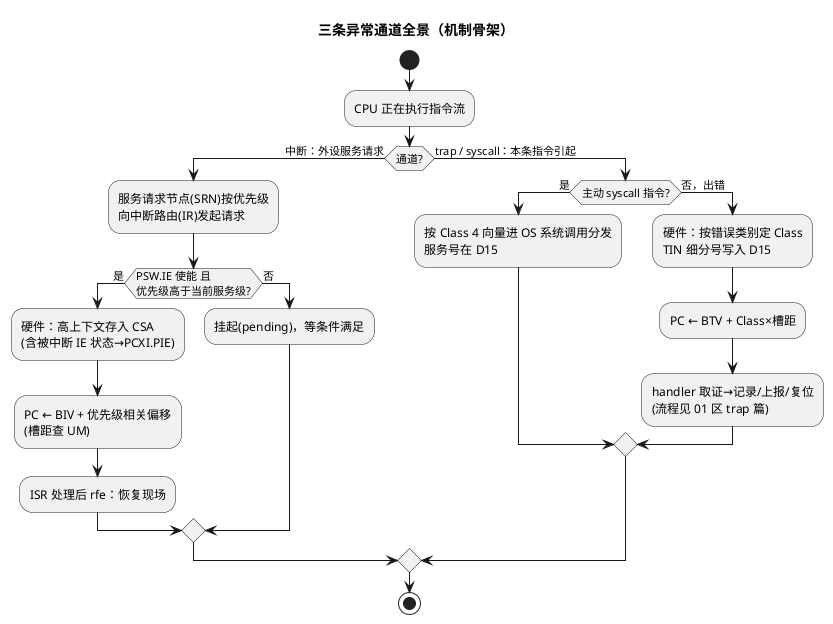

# Trap 与中断机制

> 一句话定位：把中断（异步事件）、trap（同步异常）、syscall（主动请求）三条进入"异常世界"的通道放进一张地图——向量怎么走、使能谁管、抢占怎么仲裁、调用深度怎么护栏，机制全景一篇讲清。
> 等级：L3 ｜ 前置：[01-TC1.6P内核概览](01-TC1.6P内核概览.md)、[02-CSA上下文机制](02-CSA上下文机制.md)

## 太长不看

- **人话直觉**：中断是预约来访，trap 是闯祸叫家长。
- **本篇解决**：中断、trap、syscall 三条"进异常世界"的路各走哪个向量、谁管使能？
- **赶时间记住 3 条**：
  1. trap 向量基址 BTV；
  2. 中断走 SRC/IR 路由；
  3. trap 必有 Class+TIN，定位先查表。

## 原理

### 三条异常通道：先分清"为什么进来的"

| 维度 | 中断（Interrupt） | trap（陷阱） | 系统调用（syscall） |
|---|---|---|---|
| 性质 | 异步：外设/定时事件，与当前指令无关 | 同步：某条具体指令执行出错或触发 | 同步+主动：程序刻意请求内核服务 |
| 向量基址 | BIV（Interrupt Vector Base） | BTV（Trap Vector Base） | 复用 trap 向量（典型 Class 4） |
| 编号来源 | 服务请求优先级号（进 PCXI 相关字段，概念见 [02-CSA上下文机制](02-CSA上下文机制.md)） | Class（类别）+ TIN（细分号，进 D15） | 服务号进 D15 |
| 入口现场 | 硬件自动保存高上下文入 CSA | 同左 | 同左 |
| 典型来源 | CAN/ADC/GPT/软件中断 | 访存违例、非法指令、CSA 耗尽、NMI | OS 服务入口（任务激活、资源管理等） |

读法：**中断回答"事件什么时候来"，trap 回答"错在哪条指令"，syscall 回答"我要什么服务"**——三条通道各有向量、各有编号体系，排查前先分清走的哪条道。



### 中断路径：使能、仲裁与抢占

TriCore 中断体系（模块名以 UM 为准）三层概念：

1. **源级**：每个外设的 SRN（Service Request Node，服务请求节点）独立配置优先级与使能——"这一路中断开不开、多优先"。
2. **路由级**：中断路由把所有已使能请求按优先级仲裁，选最高者送 CPU；被受理请求的优先级号被记录（供 handler 查询请求来源）。
3. **核级**：PSW.IE（全局中断使能位，位号查 UM）是总开关；`disable`/`enable` 指令直接操作它。中断受理时，被中断现场的 IE 状态被存入 PCXI.PIE，`rfe` 时自动还原——**这解决了"中断里改了开关、返回后要不要恢复"的经典问题，硬件包办**。

**抢占规则**：新请求优先级必须**高于**当前正在服务的优先级才抢占（同级不抢）；嵌套的每一层都自动入 CSA 链（见 [02-CSA上下文机制](02-CSA上下文机制.md)）。NMI（Class 5）不可被 `disable` 屏蔽，典型来源是 SMU 安全报警（时钟/电压/ECC/lockstep 失配，见 [05-Lockstep安全机制](05-Lockstep安全机制.md)）。

### trap 路径：机制只讲全景，代码细节去 01 区

trap 按 Class 0~7 八类向量（内存保护/内部保护/指令错误/数据错误/系统调用/NMI…），TIN 给出类内细分，完整分类表与 handler 骨架在 [trap 入口代码与崩溃定位](../../../01-编程语言/2-L2进阶/汇编基础/TriCore汇编/04-trap入口代码.md)。本篇只补两个机制视角：

- **BTV/BIV 都在 startup 装载**（装在第一次异常可能发生之前），装好前的窗口期异常=二次异常死循环，这是启动代码的硬性顺序要求（见 [读 startup 汇编](../../../01-编程语言/2-L2进阶/汇编基础/TriCore汇编/03-读startup汇编.md)）。
- **trap 与中断共用 CSA 但不共用向量**：一张 BTV 表按 Class 索引、一张 BIV 表按优先级索引——Cortex-M 上"一张 VTOR 表走天下"的直觉在这里要拆开。

### 调用深度计数（CDC）与栈极限：两道"防跑飞"护栏

| 护栏 | 机制 | 兜住什么 |
|---|---|---|
| PSW.CDC（Call Depth Counter） | 硬件计数器：`call` +1、`ret` -1，超限触发 Class 1 调用深度 trap（上限值与位域查 UM） | 失控递归——在 CSA 池被吃光**之前**报警，比 FCD 更早暴露问题 |
| A10 栈护栏 | 架构不直接监视 A10 越界；用 MPU（若配置）划分栈区 + 栈护栏值（canary）/OS 栈监控兜底 | 局部变量写穿栈（CSA 管不到的部分） |

两道护栏分工记住一句：**CDC 管"调用了多少层"，MPU/canary 管"栈被写了多深"**——前者架构免费送，后者要工程自己配。

### 抢占与重入

- **可抢占性由优先级差决定**：低优先级 ISR 执行中被高优先级打断=正常设计；同优先级串行，天然免了同类竞争。
- **重入风险来自共享资源而非机制本身**：ISR 与任务共享的变量/外设要原子保护——TriCore 提供 `disable`/`enable` 短区屏蔽、原子指令（如 `swap`/`cmpswap` 类，见 01 区指令篇）与 OS 资源管理三层工具。
- **AUTOSAR Os 的两类 ISR**（BSW 工程常态）：
  - Category 1：不经 OS 包装，延迟最小，禁调 OS API——MCAL 里高速采样/硬件定时常用；
  - Category 2：OS 包装入口/出口，可用 `ActivateTask` 等服务，代价是慢一点。
- **一个 ISR 只做搬运不做计算**：把数据扔给任务/队列再返回——中断延迟的受害者是所有更低优先级的中断。

## 寄存器与位表

| 对象 | 字段/概念 | 精确位号 |
|---|---|---|
| PSW.IE | 全局中断使能（`disable`/`enable` 操作） | 查 UM「PSW」 |
| PSW.CDC | 调用深度计数（超限→Class 1） | 查 UM「PSW」 |
| PSW.IO | IO 特权级（访问外设寄存器的权限） | 查 UM「PSW」 |
| PSW.PRS | 当前服务优先级（抢占仲裁基准，概念字段） | 查 UM「PSW」 |
| PCXI.PIE | 被中断现场的 IE 状态（rfe 自动还原） | 查 UM「PCXI」 |
| BIV / BTV | 中断/trap 向量基址（startup 用 `mtsr` 装载） | 寄存器编号查 UM「CSFR 列表」 |

## 双平台对照

| 维度 | TriCore | Cortex-M |
|---|---|---|
| 向量表 | 两张：BTV（按 Class）+ BIV（按优先级） | 一张 VTOR（异常号+中断号统一编号） |
| 全局中断开关 | PSW.IE（`disable`/`enable` 指令） | PRIMASK/BASEPRI/FAULTMASK 三层掩码 |
| 入口现场保存 | 高上下文（16 寄存器级）自动入 CSA | 自动压 8 寄存器（R0~R3/R12/LR/PC/xPSR）入栈 |
| 异常返回 | `rfe`（从 CSA 整场恢复，含 IE） | `bx EXC_RETURN`（硬件出栈） |
| 软件请求内核服务 | `syscall` 指令（Class 4，D15 服务号） | `SVC` 指令（SVC 异常，立即数服务号） |
| 调用深度护栏 | PSW.CDC 硬件计数，超限即 trap | 无对应机制，靠栈溢出检测/MPU |
| 不可屏蔽 | NMI（Class 5，常接 SMU 报警） | NMI（厂商定义来源） |
| 优先级仲裁 | 每核独立路由，优先级配置在源（SRN） | NVIC 集中管理，分组抢占/子优先级 |

## 代码/实操

```asm
; ---- 开关中断的三种手感（概念） ----
disable               ; 清 PSW.IE：临界区最粗暴的门（延迟短，但屏蔽一切）
enable                ; 置 PSW.IE
; 更细粒度的控制：
;   - 源级：SRN 使能位（外设模块寄存器，查 UM）——"只关这一路"
;   - 优先级：调整 SRN 优先级——"让它抢不过别人"
; AUTOSAR 工程里优先用 Os/Mcal 的 Irq 接口（SuspendAllInterrupts 等），
; 别在 C 里裸写汇编开关键，OS 需要追踪中断状态
```

排查异常问题时的通道速判：

1. **进的是 handler 不是预期函数** → 先查走哪条向量（BIV/BTV 基址 + 偏移），再查 D15（TIN/服务号）与 PCXI 链（现场）。
2. **中断不进来** → 三层排查：PSW.IE 总开关 → SRN 源使能/优先级 → 外设本身的请求标志。
3. **偶发跑飞** → 看是不是 NMI（Class 5，SMU 报警，查 SMU 状态寄存器定报警源，查 UM）。

## 易错点与陷阱

1. **拿 NVIC 直觉套 TriCore**：没有"一张向量表+NVIC 使能位"的统一模型，trap/中断两套向量、源级 SRN 独立配置——排查路径完全不同。
2. **以为 `disable` 能挡 NMI**：Class 5 不可屏蔽；NMI 的治理在 SMU/报警配置层（见 [05-Lockstep安全机制](05-Lockstep安全机制.md)），不在 CPU 标志位。
3. **中断里改 PSW.IE 忘了恢复语义**：受理时 IE 状态进 PCXI.PIE，`rfe` 会还原——handler 里手工动 IE 又指望"改了就一直生效"的写法，返回后行为会"莫明"复原，按机制理解别硬改。
4. **长临界区用 `disable` 一刀切**：屏蔽一切中断会拖高全局延迟；按需用源级屏蔽/优先级调整/原子指令，把临界区压到最短。
5. **忽略 CDC 报警直接扩 CSA 池**：调用深度超限 trap 是"递归失控"的早期信号，先找为什么深，再谈扩池——否则只是推迟爆炸点。
6. **Cat1 ISR 里调 OS API**：Category 1 不经 OS，调 `ActivateTask` 类服务属未定义行为——选类别时就该想清楚 ISR 里要干什么。

## 面试高频题

1. **trap 和中断的本质区别？**
   答：同步性——trap 由具体指令触发（出错/主动），向量走 BTV、Class+TIN 定位；中断异步、由外设事件触发，走 BIV、优先级仲裁。一句话：trap "错在哪条指令"，中断"什么时候来事件"。

2. **TriCore 中断使能有几层？**
   答：三层——核级 PSW.IE 总开关（`disable`/`enable`）、路由级仲裁（优先级比较）、源级 SRN 使能与优先级配置。中断受理时旧 IE 状态进 PCXI.PIE，`rfe` 自动还原。

3. **抢占是怎么决定的？同级会互相打断吗？**
   答：新请求优先级必须严格高于当前服务优先级（PSW 相关字段记录）才抢占；同级不抢、低级挂起。嵌套每层现场自动入 CSA 链，天然形成调用栈镜像。

4. **PSW.CDC 是干什么的？和 CSA 耗尽什么关系？**
   答：CDC 是调用深度硬件计数（call +1/ret −1），超限触发 Class 1 调用深度 trap——通常在 CSA 池耗尽（FCD）之前报警，是失控递归的早期护栏；两者都在 Class 1，排查时看 TIN 区分（细分号查 UM）。

5. **syscall 在 TriCore 上怎么实现？AUTOSAR OS 怎么用？**
   答：`syscall` 指令走 trap Class 4 向量进 OS 分发入口，服务号在 D15，其余参数按 ABI 寄存器传递；AUTOSAR OS 用它作为任务激活/调度等内核服务的受控入口，兼顾性能与保护。

6. **和 Cortex-M 的异常模型对比，最大的三处不同？**
   答：①两张向量表（BTV/BIV）vs 一张 VTOR；②入口现场入 CSA（16 寄存器级）vs 压 8 寄存器入栈；③架构自带 CDC 调用深度护栏，M 上只能靠软件/MPU。再加一句 NMI 常接 SMU 安全报警更显体系理解。

## 延伸

- 上一篇：[02-CSA上下文机制](02-CSA上下文机制.md)（异常现场存到哪）
- 下一篇：[04-DSPR-PSPR与寻址](04-DSPR-PSPR与寻址.md)
- [trap 入口代码与崩溃定位](../../../01-编程语言/2-L2进阶/汇编基础/TriCore汇编/04-trap入口代码.md)（Class/TIN 表与 handler 骨架）
- [读 startup 汇编](../../../01-编程语言/2-L2进阶/汇编基础/TriCore汇编/03-读startup汇编.md)（BTV/BIV 在启动时装载）
- [异常与 Trap](../异常与Trap/README.md)（TC377 trap 分类与 TIN 表专区）
- [ARM-Cortex-M](../../1-L1基础/ARM-Cortex-M/README.md)（NVIC 模型对照）
- 工程深入场景：产线车辆"偶发跑飞复位"，售后取回的 trap 记录里要先分清走的哪扇门——看进的是 BTV 还是 BIV 向量、D15 里是 TIN 还是优先级号，再沿 PCXI 链取现场；把 Class 3 数据错误 trap 误当普通中断丢进通用 handler 的话，"偶发"永远查不完。
