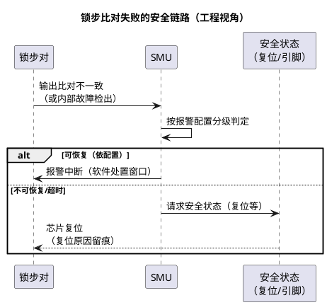

# Lockstep：多核工程视角下的锁步核使用

> 一句话定位：锁步不是多一个核跑任务，而是"两个核跑同一份任务、结果由硬件比对"——软件视角的关键变化是**任务往哪放、失败链路怎么走**，原理细节另见专门篇。
> 等级：L3 ｜ 前置：[05-Lockstep安全机制](../TriCore架构/05-Lockstep安全机制.md)

## 太长不看

- **人话直觉**：锁步对在 OS 眼里就是"一个核"——算力一份、调度域一个，多出来的不是性能而是硬件故障检出；吞吐型负载请去独立性能核。
- **本篇解决**：任务该往锁步核还是性能核放？比对失败后的安全链路怎么配置、怎么留痕？
- **赶时间记住 3 条**：
  1. 分配口诀：安全相关上锁步、吞吐型上性能核、共享资源单一归属；
  2. OS 核数按逻辑核配，别按物理核配——锁步对只算一个；
  3. SMU 报警必须映射到可上报的 DTC——只复位不留痕，售后就是查不出的"神秘复位"。

与 [../TriCore架构/05-Lockstep安全机制](../TriCore架构/05-Lockstep安全机制.md) 分工：那篇讲**原理**（双核冗余执行、延迟比对、故障注入检测覆盖）；本篇讲**多核工程视角**——锁步核怎么配置出来、软件任务怎么分配、比对失败后安全链路怎么落地。

## 原理

### TC377 锁步配置概念

- TC3xx 家族中，部分核可组成锁步对（哪两个核可组、如何启用——**配置载体与使能条件以 UM 对应章节为准**，通常随芯片出厂/启动配置生效，软件运行期不可随意切换）。
- 工程含义：启用锁步后，这对核对外表现为**一个逻辑核**——OS 只看到一个核的调度域，任务不会被分到"第二个影子核"上。
- 注意区分三样东西：锁步对（冗余执行）、独立多核（各跑各的）、性能核——三者并存于一颗 TC377（组织方式随型号，查 UM/数据手册）。

### 锁步核 vs 性能核：软件视角差异

| 维度 | 锁步对（逻辑核） | 独立性能核 |
|---|---|---|
| 调度 | OS 一个调度域 | OS 独立调度域（每核一个） |
| 算力 | 一份（双核互相校验，不叠加） | 独立一份 |
| 故障检测 | 硬件比对，瞬时失效可检出 | 靠软件监控（WdgM 等） |
| 适合放什么 | 安全相关任务 | 非安全任务、通信负载、算力型任务 |
| 核间通讯 | 不涉及（内部对软件透明） | 需显式机制（见 [03-核间通讯与共享资源](03-核间通讯与共享资源.md)） |

### 比对失败 → SMU → 安全状态链路

- 两核输出/状态不一致 → 硬件上报 **SMU（Safety Management Unit，安全管理单元）**；
- SMU 按预配置的报警响应动作执行：通知软件（中断）、超时看门狗问答失效、直至请求**安全状态**（如复位/引脚进入安全态）——响应等级与配置以 UM 的 SMU 章节为准；
- 工程意义：**从"检出"到"进入安全状态"全硬件/固件托管**，应用侧要做的是：配置正确的响应等级 + 在复位原因/日志里能看见这次 SMU 动作的痕迹（与 [../启动流程/02-S32K复位流程](../../2-L2进阶/启动流程/02-S32K复位流程.md) 的复位溯源闭环）。

### 任务分配决策表

| 任务特征 | 放哪 | 理由 |
|---|---|---|
| ASIL-D 混合故障模型控制（转向/制动类） | 锁步逻辑核 | 硬件冗余+比对覆盖随机硬件失效 |
| ASIL-B/QM 通信栈大流量 | 性能核 | 算力独立，且不需锁步代价 |
| 标定/诊断等后台任务 | 性能核 | 不挤占安全核带宽 |
| 安全监控类（WdgM/E2E 校验） | 锁步核 | 监控者自身必须可信 |
| 多核共享资源管理者 | 主核（常为锁步核） | 单一归属，避免并发写（见 [03-核间通讯与共享资源](03-核间通讯与共享资源.md)） |

> 原则一句话：**安全相关的上锁步，吞吐型的上性能核，共享资源单一归属。**

### 开发期如何确认锁步"真的在跑"

- 读启动配置/安全状态汇总（具体入口查 UM 与工具链），确认锁步对按预期生效、OS 核数与逻辑核数一致；
- 跑一次锁步相关的报警测试通道（若 UM/安全手册支持），验证"检出 → SMU → 复位原因留痕"整链路通；
- 发布前核对：调试期为方便而改过的安全配置（SMU 响应、报警使能）全部恢复，配置 diff 进评审。

### 与其它安全机制的配合（各管一层）

- 锁步管"核内随机失效"，ECC 管"存储器单/双位错"，MPU 管"访问越权"，WdgM 管"程序流/时序"——四层互补，不能互相替代；
- 双位 ECC 错、锁步失配这类"硬件级不可恢复"通常走 NMI/SMU 链路（NMI 视角见 [../异常与Trap/01-TC377-Trap分类与TIN](../异常与Trap/01-TC377-Trap分类与TIN.md)）；
- 安全概念评审时给每个危害事件画"检出层→响应层"矩阵，避免都指望锁步一层兜底。

| 失效类型 | 检出层 | 响应路径 |
|---|---|---|
| 核内随机硬件失效 | 锁步比对 | SMU → 安全状态 |
| RAM 单/双位错 | ECC（纠/检） | 修正或 NMI/SMU |
| 越权访问/跑飞 | MPU trap | trap handler → 记录复位 |
| 任务卡死/跑飞 | WdgM 监督 | 复位 + DTC |
### 安全概念 → SMU 配置映射表（模板）

| 安全概念条目 | 检出机制 | SMU 报警号 | 响应等级 | 复位后痕迹 |
|---|---|---|---|---|
| （示例）锁步失配 | 锁步比对 | 查安全手册映射表 | 复位（FSC 定义） | SMU 日志 + 独立 DTC |
| （示例）双位 ECC | RAM ECC | 查安全手册映射表 | 复位/安全引脚 | 同上 |
| （按项目填充） |  |  |  |  |

这张表是"安全概念与配置对齐"的落地物：评审时逐行核对，少一行就是配置缺口。
## 寄存器与位表

| 资源 | 作用 | 备注 |
|---|---|---|
| 锁步使能配置 | 决定哪些核组成锁步对 | 载体与条件查 UM（启动配置类，运行期不可改） |
| SMU 报警配置 | 锁步报警的响应等级/超时 | 以 UM 的 SMU 章节为准 |
| SMU 状态/日志寄存器 | 复位后回查报警源 | 与复位原因溯源配合，位定义查 UM |

## 双平台对照

| 维度 | TC377 | S32K3 |
|---|---|---|
| 锁步对象 | TriCore 核对（可组对，查 UM） | 主核 CM7 可配锁步（锁相核概念，随型号/配置） |
| 配置生效 | 启动期配置，运行期固定 | 依型号生命周期/配置而定，查 RM |
| 失败上报 | SMU 统一管理报警与安全状态 | 硬件自检/错误上报机制（查 RM 的安全手册） |
| 软件感知 | 对 OS 透明（一个调度域） | 同样以逻辑核呈现 |
| 恢复手段 | 复位 + 复位原因留痕 | 复位 + 复位原因留痕（RCM/SRS，见 [../启动流程/02-S32K复位流程](../../2-L2进阶/启动流程/02-S32K复位流程.md)） |

## 代码/实操

- **启动验证**：确认锁步配置生效（读配置状态/启动日志，具体入口查 UM + 工具），TRACE32 下观察逻辑核个数与预期一致；
- **SMU 配置检查单**：
  1. 锁步报警已映射到 SMU 报警号（无遗漏、无错号）；
  2. 响应等级符合安全概念（FSC/FSR 诉求），"该复位的复位、该留窗口的留窗口"；
  3. 报警测试通道触发一次，验证链路通到"安全状态"；
  4. SMU 动作在复位原因/日志中可回查，并映射为独立 DTC。
- **复位后溯源**：读复位原因 + SMU 报警日志寄存器，区分"看门狗复位 / SMU 主动复位 / 上电"，把 SMU 复位映射为独立 DTC 上报（配合 [06 区 Dem 事件与DTC](../../../06-诊断与标定/2-L2进阶/Dem配置/01-事件与DTC.md)）。

## 易错点与陷阱

- **以为锁步核算力翻倍**：双核算同一份任务，性能不增反略降（比对开销），把大流量通信塞进锁步核会拖累安全任务。
- **任务跨"逻辑核"分配出错**：OS 看到的是逻辑核，别按物理核数配置 OS 核数——核数配错直接集成失败。
- **SMU 报警没接 DTC**：锁步失败复位后无痕迹，售后"神秘复位"查无此因——SMU 报警必须映射到可上报事件。
- **安全概念与配置两张皮**：FSC 说锁步失效要进安全状态，SMU 却只配了中断提醒——配置评审要对齐安全概念文档。
- **开发期禁用安全机制忘了恢复**：为调试临时关 SMU 响应，量产镜像没开回来——用配置评审/发布检查单兜底。
- **把锁步当软件冗余用**：自己再跑一份任务"双保险"是误解——锁步检的是随机硬件失效，不能替代软件层面的多样性设计。
- **锁步复位与看门狗复位混在一个 DTC**：售后无法区分失效模式，两类复位原因必须分开上报。
- **逻辑核上塞满低优先级任务**：安全任务被 QM 任务挤占带宽，锁步核调度策略要显式设置优先级保护。
- **只在样机上验证过锁步链路**：产线工装差异（供电/时钟）可能暴露锁步报警路径问题，量产首件要复测报警链路。
- **把锁步报警当缺陷屏蔽掉**：报警是"检出"不是"误报"，先归因（EMC/供电/真实失效）再谈处置策略。

## 面试高频题

1. **锁步核和性能核在软件视角下最大的差别？**
   答：锁步对呈现为一个逻辑核、一个调度域、算力一份但有硬件故障检出；性能核独立调度、独立算力、需软件监控。
2. **锁步比对失败后系统的行为链路？**
   答：硬件上报 SMU → SMU 按报警配置响应（软件处置或直接请求安全状态/复位）→ 复位原因与 SMU 日志留痕。
3. **为什么安全监控类任务（如 WdgM）要放锁步核？**
   答：监控者若自身失效将失去监督意义，放锁步核用硬件冗余保证监控可信。
4. **TC377 和 S32K3 的锁步机制有何异同？**
   答：都是双份执行+硬件比对、对软件呈现逻辑核；TC377 由 SMU 统一管理报警与安全状态，S32K3 依型号可配主核锁相（机制与上报通道查各自手册）。
5. **锁步能替代软件看门狗吗？**
   答：不能：锁步覆盖随机硬件失效，WdgM 覆盖程序流/时序失效，两者是互补层，安全概念里都要有。
6. **怎么向客户证明锁步链路是通的？**
   答：用报警测试通道注入一次锁步失效，演示"检出 → SMU 响应 → 安全状态/复位 → DTC 留痕"全过程可复现。

## 延伸

- 锁步原理深讲：[../TriCore架构/05-Lockstep安全机制](../TriCore架构/05-Lockstep安全机制.md)
- 启动与释放（锁步核作为逻辑核的启动位置）：[01-主从核启动](01-主从核启动.md)
- 复位原因溯源：[../启动流程/02-S32K复位流程](../../2-L2进阶/启动流程/02-S32K复位流程.md)
- 程序流监控（软件侧互补层）：[07 区 WdgM 监督实体与checkpoint](../../../07-AUTOSAR架构/2-L2进阶/系统服务栈/WdgM/01-监督实体与checkpoint.md)
- 多核启动与逻辑核调度：[01-主从核启动](01-主从核启动.md)
- 下一篇：[03-核间通讯与共享资源](03-核间通讯与共享资源.md)
- 工程深入场景：安全概念评审逐条核"任务-核"映射表——安全相关 SWC 是否都落锁步核、SMU 报警是否都映射了可上报 DTC；漏一条就是审核 findings。