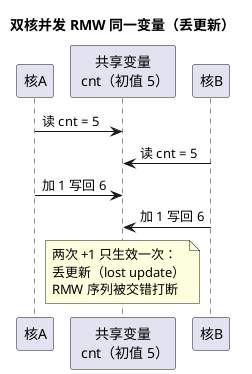

# 核间通讯与共享资源保护

> 一句话定位：多核系统的 bug 大多不是"算错"而是"抢错"——共享数据要么配原子/锁，要么配单一归属；volatile 挡不住编译器之外的乱序与竞态，屏障才是多核内存序的正解。
> 等级：L3 ｜ 前置：[01-主从核启动](01-主从核启动.md)、[02-IR路由与多核分配](../../2-L2进阶/TC377平台/中断系统/02-IR路由与多核分配.md)

## 太长不看

- **人话直觉**：两办公室传文件：柜子（共享内存）+签字（锁/原子）+微信（核间中断）。
- **本篇解决**：共享变量为什么加 volatile 不够？核间通知用轮询还是中断？
- **赶时间记住 3 条**：
  1. RMW 竞态用原子指令串行化；
  2. 屏障保可见顺序，volatile 不够；
  3. 通知用核间中断别轮询。

核间中断的 TC377 路由细节见 [../TC377平台/中断系统/02-IR路由与多核分配](../../2-L2进阶/TC377平台/中断系统/02-IR路由与多核分配.md)；启动期的共享资源初始化归属见 [01-主从核启动](01-主从核启动.md)。

## 原理

### 共享内存 + 自旋锁/信号量：硬件原子指令是地基

- 多核通讯最朴素的载体是**双方都能访问的共享 RAM**（TC377 各核 DSPR 之外的共享区、S32K 的系统 RAM，映射见各自存储器篇）；
- 但"共享"≠"随便并发写"：读-改-写（RMW）序列在两核交错时会丢更新，必须用**自旋锁（spinlock）/信号量**把竞争串行化；
- 锁的实现依赖硬件**原子指令**：TriCore 的 SWAP 类指令、ARM 的 LDREX/STREX 独占访问对——"原子"保证 RMW 不可分割，这是所有上层锁的基石。

### 核间中断：别用轮询磨 CPU

- 共享内存 + 标志位轮询简单但费电费带宽；**核间中断（IPI，Inter-Processor Interrupt）**让发送核"写共享区 + 踢中断"，接收核被打断后取数据，事件驱动；
- TC377 侧：用软件触发的服务请求（Service Request）路由到目标核实现核间信号，路由与分配见 [../TC377平台/中断系统/02-IR路由与多核分配](../../2-L2进阶/TC377平台/中断系统/02-IR路由与多核分配.md)；
- 数据与通知的配合：先写数据（带屏障），再发中断——顺序反了接收方可能读到旧数据。

### AUTOSAR 的答案：IOC/RTE 一句话

IOC（Inter-OS-Application Communicator）是 RTE 提供的跨核（跨 OS-Application）数据交换机制：生成代码替你处理一致性与通知，**能走 RTE/IOC 就不要手搓共享变量**（概念见 [07 区 AUTOSAR 架构](../../../07-AUTOSAR架构/README.md) 与 [07 区 RTE/IOC](../../../07-AUTOSAR架构/3-L3高级/RTE/03-IOC.md)）。

### 竞态实例：双核并发 RMW 同一变量丢更新



修复：`cnt++` 放进临界区（自旋锁/关该核中断内的原子操作），或改用原子指令一次完成。

### volatile 的局限与内存屏障

- volatile 只保证**编译器**不优化掉访问，**不保证**：原子性（RMW 仍可被切开）、多核可见顺序（写完另一核何时可见无承诺）、乱序（CPU/写缓冲可重排）；
- 多核正确姿势：**原子指令做数据一致性，屏障（barrier）保顺序与可见性**——TriCore 与 ARM 都有对应屏障语义，用芯片/编译器手册确认；
- 这也呼应寄存器编程里"MMIO 用 volatile"的场景边界：单核对硬件寄存器 volatile 够用，多核共享数据不够（寄存器编程基础见 [01 区寄存器编程](../../../01-编程语言/2-L2进阶/寄存器编程/README.md)）。

## 寄存器与位表

| 资源 | 作用 | 备注 |
|---|---|---|
| 原子指令（TriCore SWAP 类） | 不可分割的读改写 | 指令名/用法查内核手册 |
| 独占访问对（ARM LDREX/STREX） | 失败重试式原子 RMW | 指令语义查 ARM ARM |
| 屏障指令 | 顺序与可见性保证 | 各架构语义不同，查手册 |
| 软件触发的服务请求（TC377） | 核间中断信号源 | 通道选择与路由查 UM + 中断系统篇 |
| 目标核中断控制器 | 接收核间中断 | 优先级/使能按常规中断配置 |

**共享资源清单模板**（架构阶段冻结，评审必过）：

| 资源 | 归属核 | 访问方式 | 保护机制 | 备注 |
|---|---|---|---|---|
| （示例）共享缓冲 | 核A写/核B读 | 消息队列 | 环形缓冲+屏障 | 先写后通知 |
| （示例）CAN 外设 | 核A独占 | 驱动调用 | 归属纪律 | 核B不许直接配 |
| （示例）全局标定页 | 双核只读 | 直接读 | 切换由主核执行 | 无写竞争 |
| （按项目填充） |  |  |  |  |
## 双平台对照

| 维度 | TC377 | S32K |
|---|---|---|
| 原子基础 | SWAP 类指令 | LDREX/STREX（M 核）/ CAS 类 |
| 核间中断 | 软件触发服务请求经 IR 路由到目标核 | 依型号的核间中断机制（查 RM） |
| 共享内存 | 各核 DSPR 外的共享 DSRAM 区 | 系统 RAM（核均可访问区） |
| AUTOSAR 通道 | IOC/RTE 生成代码 | IOC/RTE 生成代码 |
| 单核兜底 | — | S32K1 单核无核间问题（仅中断与 DMA 并发） |

## 代码/实操

**手搓（最后手段）的自旋锁骨架（示意，须按目标架构核对原子与屏障）**：

```c
/* 依赖硬件原子交换：返回旧值 */
volatile uint32 lock;              /* 0=空闲 1=占用 */

void spin_lock(volatile uint32 *l)
{
    while (atomic_swap(l, 1) != 0) { /* 原子 RMW，失败重试 */
        /* 自旋等待；实时场合考虑让出/限次 */
    }
    barrier_after_lock();           /* 屏障：临界区代码不前移 */
}
void spin_unlock(volatile uint32 *l)
{
    barrier_before_unlock();        /* 屏障：临界区写入全部落地 */
    *l = 0;                         /* 普通写释放即可 */
}
```

**发送侧通知顺序（先数据后通知）**：

```c
spin_lock(&tx.lock);
tx.buf[tx.len++] = data;
spin_unlock(&tx.lock);
atomic_store_release(&tx.ready, 1);   /* 带释放语义的写 */
kick_intercore_irq(TARGET_CORE);      /* 核间中断通知 */
```

- **TRACE32 观察竞态**：两核各自断点 + 观察共享变量窗口；或数据断点（watchpoint）盯共享变量写者，验证"谁写的"；
- **工程检查单**：① 共享变量清单及归属评审；② 每项要么有锁要么单写多读；③ 通知链路先数据后中断；④ NoInit/标定区跨核访问也要进清单。

## 易错点与陷阱

- **"加了 volatile 就线程安全"**：最普遍的误解——volatile 不提供原子性与多核可见顺序，竞态照丢更新。
- **共享外设双核都去配**：违反"谁的外设谁碰"纪律，配置互相覆盖且时序不可复现——外设归属要在架构阶段冻结（多核启动归属见 [01-主从核启动](01-主从核启动.md)）。
- **先发中断再写数据**：接收核中断里读到旧数据，偶发且难复现——写完（带屏障）再踢中断。
- **自旋锁里做长活**：持锁核被抢占/在锁内干重活，另一核空转烧 CPU、实时性崩——临界区极短，长操作用消息/信号量队列。
- **忘了 DMA 这个"第三者"**：DMA 与 CPU 也是并发写共享内存的关系，Cache/一致性同样要纳入评审（一致性需求依平台而定）。
- **用普通变量做标志位**：编译器可能把轮询循环优化成死读，标志位至少 volatile，配合屏障才是完整答案。
- **清单只列数据不列外设**：外设寄存器同样是被并发访问的共享资源，清单必须覆盖外设与中断归属。

## 面试高频题

1. **为什么多核共享变量的 `count++` 会丢更新？**
   答：它是读-改-写三步，两核交错执行时后写覆盖先写，两次自增只见一次——必须原子指令或临界区保护。
2. **volatile 在多核场景下够用吗？**
   答：不够：它只挡编译器优化，不提供原子性、不保证跨核可见顺序；需要原子指令 + 内存屏障。
3. **核间通讯"先写数据还是先发中断"？**
   答：先写数据并保证落地（屏障），再发核间中断，否则接收方可能读到旧值。
4. **TC377 怎么实现核间中断？**
   答：用软件触发的服务请求源，经 IR 路由到目标核，目标核在中断服务里处理共享区数据（路由细节见中断系统篇）。
5. **AUTOSAR 里为什么不建议手搓共享变量？**
   答：RTE/IOC 生成代码已处理跨核数据一致性与通知，手搓容易引入竞态且绕过配置管理（详见 07 区 RTE/多核集成）。
6. **自旋锁与信号量怎么选？**
   答：临界区极短（几十指令级）用自旋锁避免上下文切换；可能阻塞/较长操作用信号量，别在持锁状态下做长活。


7. **外设归属纪律具体指什么？**
   答：每个共享外设指定唯一归属核：只有归属核的驱动可配置/访问它，其他核需要数据走通讯机制，杜绝并发配置竞态。
## 延伸

- 核间中断路由：[../TC377平台/中断系统/02-IR路由与多核分配](../../2-L2进阶/TC377平台/中断系统/02-IR路由与多核分配.md)
- 启动期共享资源归属：[01-主从核启动](01-主从核启动.md)
- AUTOSAR 多核与 RTE 侧展开：[07 区 AUTOSAR 架构](../../../07-AUTOSAR架构/README.md)、[07 区 RTE/IOC](../../../07-AUTOSAR架构/3-L3高级/RTE/03-IOC.md)、[07 区多核集成](../../../07-AUTOSAR架构/3-L3高级/多核集成/README.md)
- volatile 与寄存器编程基础：[01 区寄存器编程](../../../01-编程语言/2-L2进阶/寄存器编程/README.md)
- 工程深入场景：双核项目的跨核报文计数器偶发"少计"——复盘发现两核裸跑 `cnt++` 丢更新，正是本篇开篇那张竞态时序图的原型；修复时按"先数据后通知+原子操作"重写共享访问，并把该变量补进共享资源清单评审——这类 bug 台架千次不复现、路试一次就炸，纪律比技巧重要。