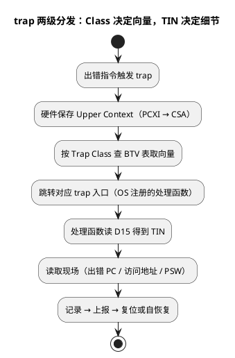

# TC377 Trap 分类与 TIN 机制

> 一句话定位：trap 是 TriCore 的同步异常——出错指令精确入 trap，向量按 Class（0~7）分发、细节用 TIN 传递；拿到"Class + TIN + 出错 PC"三元组，就拿到了定位的第一现场。
> 等级：L3 ｜ 前置：[03-Trap与中断机制](../TriCore架构/03-Trap与中断机制.md)

## 太长不看

- **人话直觉**：trap 是"这条指令出错了"——Class 告诉你哪栋楼、TIN 告诉你哪个房间、PC 告诉你案发现场在哪条街，三元组凑齐定位就有了起点。
- **本篇解决**：拿到一条 trap 记录，怎么从 Class/TIN 反推根因方向？哪些代码行为对应哪个 Class？
- **赶时间记住 3 条**：
  1. 定位第一现场 = Class（哪类错）+ TIN（类内哪种，在 D15 里）+ 出错 PC（map 反查源码行）；
  2. 高频对应：野指针函数调用→Class 4、非对齐/野地址访问→Class 3、栈溢出/CSA 耗尽→Class 5；
  3. Class 6 系统调用是 OS 正常机制，日志里出现不是故障——别当 bug 查。

trap 入口汇编（BTV 寻址、上下文保存代码级细节）见 [TriCore汇编/04-trap入口代码](../../../01-编程语言/2-L2进阶/汇编基础/TriCore汇编/04-trap入口代码.md)；trap 与中断在架构层面的关系见 [../TriCore架构/03-Trap与中断机制](../TriCore架构/03-Trap与中断机制.md)。本篇聚焦**分类体系与触发源**。

## 原理

### 分类分发的两级结构

- **Class（Trap Class，0~7）**：决定"走哪个向量"。trap 向量表基址在 BTV 寄存器，向量按 Class 索引（偏移关系查 UM）；操作系统初始化时把各 Class 的处理函数挂到 BTV 表里。
- **TIN（Trap Identification Number，Trap 识别号）**：同类内的细分编号，**trap 进入时由硬件放在 D15 传给处理函数**——所以 trap handler 第一件事往往就是读 D15。
- trap 入口与中断一样自动保存 Upper Context（PCXI 链入 CSA），因此**出错现场 PC 就保存在 CSA 链上的栈帧里**，这是事后回溯的依据（CSA 机制见 [../TriCore架构/02-CSA上下文机制](../TriCore架构/02-CSA上下文机制.md)）。



### Class 0~7 全景

| Class | 名称 | 典型触发场景（高频源举例） |
|---|---|---|
| 0 | 内存保护（Memory Protection） | MPU/MPR 命中保护区域：取指/数据访问越权，访问未分配给本核的区 |
| 1 | 浮点（FPU 相关） | 浮点指令的非法操作/异常组合（如除零类、非法模式），细节以 UM 为准 |
| 2 | 内部保护错误（Internal Protection Error） | 非法寄存器/状态操作、PSW 非法组合等处理器内部一致性检查 |
| 3 | 寻址与数据错误（Data/Address Error） | **非对齐访问**、数据总线错误、访问不存在的地址（野指针读写） |
| 4 | 非法操作（Illegal Operation） | **野指针函数调用跳到垃圾指令→非法操作码**、未定义指令 |
| 5 | 上下文错误（Context Error） | **栈溢出（上下文栈越界）**、CSA 耗尽、调用深度超限 |
| 6 | 系统调用（System Call） | 执行 SYSCALL——正常机制，OS 用它做系统服务入口，不是故障 |
| 7 | NMI（不可屏蔽中断） | 硬件级严重错误（如 ECC 双位错等，经 SMU/硬件上报），细节以 UM 为准 |

> **纪律**：上表用于建立索引直觉；**每类的确切名称、TIN 取值与触发条件一律以 UM 的 Trap Classification 表为准**，写 trap handler 时按 UM 逐项核对。

### trap vs 中断：一字之差的三点不同

| 维度 | trap（同步异常） | 中断（异步异常） |
|---|---|---|
| 触发 | 当前指令出错/主动触发 | 外部事件随时到来 |
| 现场 | 出错 PC 就是肇事指令 | PC 是"被打断的下一条" |
| 返回语义 | 多数 trap 不返回（复位/挂起），个别可修复后重试 | 处理完必返回被打断处 |
| 处理态度 | 定位根因为主 | 快进快出为主 |

### 三元组的排障价值

拿到 `Class + TIN + 出错 PC`：

- Class 告诉你"哪一类错"（寻址？非法操作？上下文？）——决定排查方向；
- TIN 告诉你"类内哪种错"——把方向收窄到具体行为；
- PC 告诉你"死在哪条指令"——map/addr2line 反查到源码行（流程见 [02-Trap定位方法](02-Trap定位方法.md)）。

高频根因 → 预期 Class 速查（定位起点，最终以三元组为准）：

| 代码行为 | 预期 Class | 下一步动作 |
|---|---|---|
| 通过未初始化函数指针调用 | 4（非法操作） | 反查指针来源 |
| 结构体指针越界读写 | 3（寻址/数据错误） | 核对出错地址与合法区 |
| 大局部数组 + 深递归 | 5（上下文错误） | 栈水位标定 |
| memcpy 目的地址算错 | 3 | 检查长度与目的指针 |
| 关外设时钟后读寄存器 | 3 或挂死超时 | 核对时钟门控 |
| MPU 区误配/越权访问共享区 | 0 | 核对保护区域配置 |
| 浮点库与硬件 FPU 模式不匹配 | 1 | 核对编译浮点选项 |
| 误把数据地址当函数调用 | 4 | 检查函数指针初始化 |

## 寄存器与位表

trap 相关的关键架构资源（**地址与位定义以 UM 为准**）：

| 资源 | 作用 | 备注 |
|---|---|---|
| BTV | trap 向量表基址 | 按 Class 索引入口，偏移查 UM |
| D15 | trap 入口时的 TIN 载体 | handler 里第一个要读的寄存器 |
| PCXI | 链回出错现场的上下文 | CSA 链回溯调用栈的入口 |
| PSW | 处理器状态字 | 含 trap/中断相关状态位，位定义查 UM |
| 出错上下文中的 A11/PC | 上/下文中的返回地址 | 反查源码的关键现场 |

AUTOSAR OS 侧：trap 入口通常由 OS 提供（把三元组转交 hook，如 ProtectionError/Trap hook），应用在 hook 里做记录与决策——具体接口名以所用 OS 手册为准。

## 双平台对照

| 维度 | TC377（TriCore trap） | S32K（Cortex-M 异常） |
|---|---|---|
| 同步异常统称 | trap | Fault（MemManage/BusFault/UsageFault） |
| 分发索引 | Class 0~7 → BTV 向量 | 异常号 → NVIC 向量表（HardFault 为固定号） |
| 细分编号 | TIN（经 D15 传递） | CFSR 分组位域（MMFSR/BFSR/UFSR） |
| 出错现场保存 | 自动存 Upper Context 到 CSA | 自动压栈 R0-R3/R12/LR/PC/xPSR |
| 出错地址线索 | 现场寄存器（依触发类型） | MMFAR/BFAR 错误地址寄存器 |
| 典型"非法跳转" | Class 4 非法操作 | UsageFault：未定义指令 |
| 严重错误升级 | NMI（Class 7） | HardFault / LOCKUP |

## 代码/实操

- **trap handler 里必做的三件事**（伪代码，接口以 OS/UM 为准）：
  1. `tin = __getD15();` 读 TIN；
  2. 从当前/上一个上下文取出错 PC（或经 PCXI 链）；
  3. 连同 Class 一起写入 NoInit 复位存活区，供重启后上报。
- **TRACE32 直接看现场**（概念命令）：
  ```
  r.s /c        ; 看核寄存器（含 D15 若未破坏）
  d.dump BTV    ; trap 向量表
  ; stack unwind 见 02-Trap定位方法
  ```
- **复现技巧**：闪断点/硬件断点挂在 trap 入口（向量地址），跑飞瞬间停下比事后看日志保真。
- **OS hook 注册位置**：集成阶段确认 trap 向量指向 OS 入口而非默认死循环；应用 hook 只做记录，不做复杂恢复（防止二次 trap 无路可走）。

## 易错点与陷阱

- **把 Class 6 系统调用当故障**：SYSCALL 是 OS 正常机制（进内核/系统服务），日志里出现 Class 6 不是 bug。
- **handler 里先动 D15 再保存**：D15 是 TIN 载体，入口第一句就该存走，任何编译器插入的代码都可能污染它（用 OS 入口/汇编序言保证）。
- **只记 Class 不记 TIN**：同类内 TIN 才是"哪种错"，少了它排查范围大几倍。
- **NMI（Class 7）当普通 trap 处理**：NMI 常伴随 ECC/硬件错误，处理链路与普通 trap 不同（SMU 相关，见 [../TriCore架构/05-Lockstep安全机制](../TriCore架构/05-Lockstep安全机制.md) 的安全链路）。
- **对照错平台手册**：TC2xx 与 TC3xx 的 trap 分类/触发细节有差异，查 UM 必须对准具体型号。
- **误以为 trap 一定复位**：trap 是否复位取决于 OS/应用策略，不处理或处理不当才会升级成不可控行为。
- **把 trap 入口当调试器断点重烧**：反复复位复现会覆盖 NoInit 记录，留存第一现场要一次到位。
- **trap 日志无上下文**：只存三元组不存任务号/时间戳，多任务环境里无法对齐"当时在跑谁"——记录结构里加任务上下文。
- **Class 0 保护 trap 反而当好事被修掉**：MPU 检出的越界写是"帮手"，先修根因再谈放宽保护配置。

## 面试高频题

1. **Trap 的 Class 和 TIN 分别是什么关系？**
   答：Class 决定向量分发（BTV 表索引），TIN 是类内细分编号，由硬件经 D15 传给 trap 处理函数。
2. **野指针函数调用（跳到垃圾地址）通常进哪个 Class？**
   答：跳过去执行到的不是合法指令 → 典型归入非法操作类（Class 4）；具体 TIN 以 UM 为准。
3. **栈溢出对应哪个 Class？**
   答：上下文错误类（Class 5）：上下文栈越界/CSA 相关错误，同类的还有调用深度超限。
4. **非对齐访问呢？**
   答：寻址与数据错误类（Class 3），TriCore 对非对齐的 load/store 有严格约束，违规即 trap。
5. **trap handler 第一步做什么？**
   答：保存现场后立即读 D15 取 TIN，再取出错 PC，形成"Class+TIN+PC"三元组记录。
6. **trap 和中断的现场有什么本质不同？**
   答：trap 的出错 PC 指向肇事指令本身（同步），中断的 PC 指向被打断的下一条指令（异步）——取证价值完全不同。
7. **TC377 的 trap 和 Cortex-M 的 HardFault 有何本质对应关系？**
   答：都是同步异常入口，但 TC377 用 Class 细分向量 + TIN 细分原因，Cortex-M 用固定向量 + CFSR 位域细分原因；现场保存方式也不同（CSA vs 自动压栈）。

## 延伸

- trap 入口汇编与现场保存：[TriCore汇编/04-trap入口代码](../../../01-编程语言/2-L2进阶/汇编基础/TriCore汇编/04-trap入口代码.md)
- 架构层机制：[../TriCore架构/03-Trap与中断机制](../TriCore架构/03-Trap与中断机制.md)、CSA 回溯基础：[../TriCore架构/02-CSA上下文机制](../TriCore架构/02-CSA上下文机制.md)
- 定位工作流与实操命令：[02-Trap定位方法](02-Trap定位方法.md)
- Cortex-M 侧对照：[03-HardFault定位](03-HardFault定位.md)
- 工程深入场景：量产车偶发复位，售后取回的 ECU 里唯一线索是 NoInit 区的 trap 三元组——按本篇"高频根因 → 预期 Class"速查表把 Class 4/TIN 对到野指针函数调用、再拿 faultPC 对 map 反查出是某回调表越界；没有这套分类索引，"偶发"问题就只能靠运气归因。