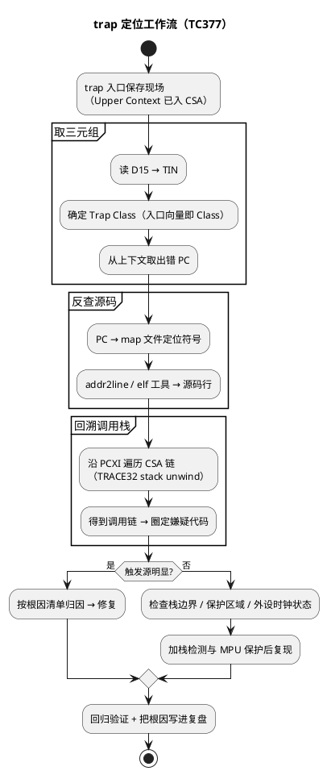

# Trap 定位方法（工作流 + 实操）

> 一句话定位：从"trap 了"到"改对代码"，中间是一条可复用的工作流——保存现场 → 取三元组 → 反查源码 → 回溯调用栈 → 归因；本篇把这条链固化成 activity 图和命令表。
> 等级：L3 ｜ 前置：[01-TC377-Trap分类与TIN](01-TC377-Trap分类与TIN.md)

## 太长不看

- **人话直觉**：trap 定位=现场取证：护现场→拿案号（Class/TIN）→查档案→倒推。
- **本篇解决**：trap 之后第一分钟做什么才能不毁掉现场？拿到 Class/TIN 后怎么反查到源码行？
- **赶时间记住 3 条**：
  1. 先保护 PCXI/PC/返回地址；
  2. Class+TIN 查表定性；
  3. addr2line/map 反查源码行。

分类与 TIN 机制看 [01-TC377-Trap分类与TIN](01-TC377-Trap分类与TIN.md)；Cortex-M 侧对应方法看 [03-HardFault定位](03-HardFault定位.md)。

## 原理

### 定位工作流全景



### 现场从哪来：CSA 链

- trap 入口自动保存 Upper Context，PCXI 指向最近一段 CSA；沿链回溯即可重建调用栈（机制见 [../TriCore架构/02-CSA上下文机制](../TriCore架构/02-CSA上下文机制.md)）。
- **注意**：如果 trap 根因就是栈溢出/CSA 耗尽，链本身可能已损坏——此时回溯不可信，先核对栈边界标志。

### 常见根因清单（按命中率排序的经验表）

| 根因 | 典型 trap 表现 | 验证手段 |
|---|---|---|
| 野指针/悬垂指针写 | 寻址/数据错误类，错误地址离谱 | 看出错地址是否落在合法 RAM 区 |
| 栈溢出 | 上下文错误类；或破坏别处数据后偶发跑飞 | 栈涂鸦（pattern 填充）看淹没线 |
| 跳转表/函数指针越界 | 非法操作类（跳进垃圾指令） | 出错 PC 是否在 Flash 代码区外 |
| 访问未初始化/时钟未开的外设 | 寻址/数据错误或无响应超时 | 检查外设时钟门控与寄存器读回值 |
| 非对齐访问 | 寻址/数据错误类 | 反汇编出错指令核对操作数地址 |
| 越界写数组 | 延迟爆炸：先坏数据，别处才 trap | 结合 map 看被破坏变量邻接关系 |

时钟门控背景见 [../TC377平台/时钟系统/03-外设时钟门控](../../2-L2进阶/TC377平台/时钟系统/03-外设时钟门控.md)。

## 寄存器与位表

本篇重点是"读什么"而非位定义（位表见 [01-TC377-Trap分类与TIN](01-TC377-Trap分类与TIN.md) 的 BTV/D15/PCXI 表）：

| 要取的信息 | 来源 | 用途 |
|---|---|---|
| TIN | D15（入口即读） | 类内细分 |
| Trap Class | 入口向量在 BTV 表的位置 | 大方向 |
| 出错 PC | 保存的上下文 | 反查源码行 |
| 出错访问地址 | 触发类对应现场寄存器（依类型） | 判断是否野地址 |
| 调用链 | PCXI→CSA 链 | 圈定嫌疑函数 |
| 栈水位 | 栈边界符号 vs 当前 SP | 判栈溢出 |

**trap 复盘脚本模板**（接上调试器后按序执行，命令以实际 TRACE32 版本为准）：

```
; 1) 确认停在哪个 trap 入口（对 BTV 表）
y.svsp /c
; 2) 当前核寄存器（D15 若尚未被污染即 TIN）
r.s /c
; 3) 反汇编出错 PC 前后（PC 用记录值替换）
d.l 0x<AADDR> -20 ++40
; 4) 调用栈回溯
stack.unwind
; 5) 栈水位核对（栈顶/栈底符号）
v.v %quad &__STACK_TOP &__STACK_END sp()
```
## 双平台对照

| 步骤 | TC377 | Cortex-M（S32K） |
|---|---|---|
| 取出错 PC | 从 CSA 上下文取 | 从自动压栈帧取 |
| 取细分原因 | D15 的 TIN | CFSR 位域 |
| 回溯调用栈 | 遍历 CSA 链 | 依 FP/R0-R3 压栈帧回溯 |
| 反查源码 | map + addr2line（tricore 工具链） | map + arm-none-eabi-addr2line |
| 错误地址寄存器 | 依触发类型的现场 | MMFAR/BFAR 直接给出 |

## 代码/实操

**实操命令示例表**（以 TRACE32 为例，具体命令随版本略有差异）：

| 目的 | 命令（概念） |
|---|---|
| 看核寄存器现场 | `r.s /c` |
| 反汇编出错 PC 附近 | `d.l <PC> -20 ++40` |
| 回溯调用栈 | `stack.unwind` / 界面 Backtrace 窗口 |
| 看 CSA 链 | `d.dump <PCXI指向> /walk` |
| map 反查符号 | 文本搜索 map 中包含该地址的符号区间 |
| 源码行级定位 | `addr2line -e app.elf 0x8001234`（对应工具链版本） |

**handler 落地检查单**（NoInit 记录区）：

```c
typedef struct {                 /* 复位存活区，放 NOLOAD 段 */
    uint32 class;                /* trap class */
    uint32 tin;                  /* D15 读出 */
    uint32 faultPC;              /* 出错 PC */
    uint32 spare[5];             /* 预留：访问地址/PSW 摘要等 */
} TrapRecord_T;                  /* 上电后由 Dem 上报，见 06 区 Dem 配置 */
```

**预防手段**（治本三板斧）：

1. **栈检测**：涂鸦法标定各任务栈水位，配置 OS 栈监控 hook；
2. **MPU 保护**：未用 RAM 区设保护，越界写当场 trap（把"延迟爆炸"变"当场抓获"）；
3. **程序流监控**：WdgM Alive/Deadline 监督关键任务，跑飞在超时窗口内被复位并留痕（见 [07 区 WdgM 监督实体与checkpoint](../../../07-AUTOSAR架构/2-L2进阶/系统服务栈/WdgM/01-监督实体与checkpoint.md)）。

## 易错点与陷阱

- **现场被 handler 自己污染**：C 函数入口先压栈改写现场——记录动作要放在汇编序言后尽早做，且不要信任 handler 内新调函数后的寄存器。
- **只看 PC 不回溯栈**：出错行常是"受害者"，根因在调用链上游（谁传的野指针）。
- **栈溢出后强解调用栈**：CSA 链可能已被淹没，回溯前先比对栈边界与涂鸦线。
- **偶发 trap 只靠日志猜**：必须留存三元组 + 复现条件（温度/报文序列/时序扰动），否则归因靠运气。
- **修复后不复盘**：同类问题会反复出现——把根因写进本表"常见根因清单"，团队知识才滚动。
- **在 trap handler 里做长逻辑**：handler 越短越好，重启后用正常上下文上报，避免二次 trap 无路可走。

## 面试高频题

1. **trap 后你第一步看什么？**
   答：保存现场后取"Class + TIN + 出错 PC"三元组：Class/TIN 定方向，PC 反查源码行。
2. **怎么从出错地址定位到源码？**
   答：PC 先对 map 文件找符号区间，再用工具链 addr2line/elf 解析得到源码文件与行号。
3. **TC377 怎么重建调用栈？**
   答：trap 已把上下文存入 CSA，从 PCXI 沿链遍历（TRACE32 stack unwind），重建出错调用链。
4. **栈溢出为什么常表现为"别处 trap"？**
   答：溢出先破坏相邻内存（别的任务数据/TCB），被破坏方先出错，溢出点反而是"案发现场之外的尸体"。
5. **有哪些手段把偶发 trap 变必现？**
   答：栈涂鸦 + MPU 保护把越界写当场化；注入测试（置错指针/关外设时钟）复现同类路径；WdgM 缩短监督窗口暴露跑飞。
6. **volatile 能防止 trap 吗？**
   答：不能。volatile 只约束编译器访问行为，不解决非法地址/非对齐/竞态——多核下更要靠屏障与原子操作（见 [../多核架构/03-核间通讯与共享资源](../多核架构/03-核间通讯与共享资源.md)）。


7. **为什么建议"handler 只记录、复位后上报"？**
   答：handler 里跑复杂逻辑易二次 trap 且现场被污染；NoInit 记录 + 重启后走正常诊断链路，稳且可复用。
## 延伸

- 三元组来源与分类表：[01-TC377-Trap分类与TIN](01-TC377-Trap分类与TIN.md)
- 现场保存的汇编细节：[TriCore汇编/04-trap入口代码](../../../01-编程语言/2-L2进阶/汇编基础/TriCore汇编/04-trap入口代码.md)
- map 文件与段布局：[../启动流程/03-链接脚本与分散加载](../../2-L2进阶/启动流程/03-链接脚本与分散加载.md)
- 程序流监控（WdgM）：[07 区系统服务栈/WdgM 监督实体与checkpoint](../../../07-AUTOSAR架构/2-L2进阶/系统服务栈/WdgM/01-监督实体与checkpoint.md)
- 工程深入场景：台架复现"高温下偶发 trap"，接上 TRACE32 后不乱敲命令，直接按本篇复盘脚本五步走——对 BTV 表确认 Class、读 D15 取 TIN、反汇编出错 PC 前后、stack.unwind 回溯调用链、核对栈水位——十分钟圈定嫌疑函数（某个温度补偿表越界读），这套流程本身就该固化进团队的 trap 排障 SOP。