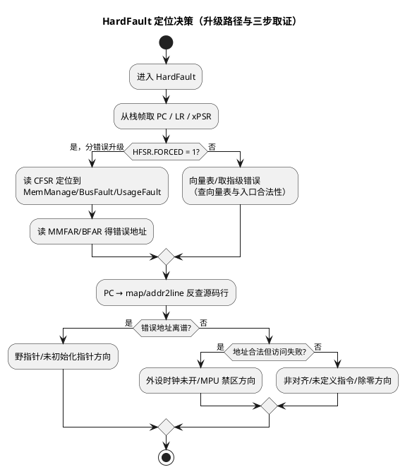

# Cortex-M HardFault 定位

> 一句话定位：HardFault 是 Cortex-M 的"总闸"异常——入栈帧给你出错 PC，CFSR 三组位域给你"哪种错"，BFAR/MMFAR 给你"错在哪"；三样凑齐，十分钟的定位流程胜过两小时瞎猜。
> 等级：L3 ｜ 前置：[02-NVIC与中断](../../1-L1基础/ARM-Cortex-M/02-NVIC与中断.md)

## 太长不看

- **人话直觉**：HardFault 是"总闸"——分错误没使能时什么错都升级到它；栈帧里的 PC 是案发现场地址，CFSR 三组位域回答"哪种错"，BFAR/MMFAR 回答"错在哪"。
- **本篇解决**：HardFault 之后十分钟内该看哪些寄存器？为什么现场只有 HardFault 拿不到细分信息？
- **赶时间记住 3 条**：
  1. 出错 PC 在栈帧 SP+0x18，拿去 map/addr2line 直接反查源码行；
  2. 开发期务必在 SHCSR 使能 MemManage/BusFault/UsageFault 分错误，否则全升级成 HardFault；
  3. handler 只做"存五元组 + 停机等复位"——跑复杂 C 逻辑会二次异常直接 LOCKUP。

ARM 寄存器/模式背景见 [01 区 ARM 汇编](../../../01-编程语言/2-L2进阶/汇编基础/ARM汇编/README.md)；S32K 复位与 LOCKUP 的关系见 [../启动流程/02-S32K复位流程](../../2-L2进阶/启动流程/02-S32K复位流程.md)；TriCore 侧对照方法见 [02-Trap定位方法](02-Trap定位方法.md)。

## 原理

### 自动压栈：硬件替你保存的第一现场

进入 HardFault 时，若使用标准 MSP/PSP 栈，硬件自动压入 8 个字（异常栈帧）：

| 栈内位置 | 内容 |
|---|---|
| SP+0x00 | R0 |
| SP+0x04 | R1 |
| SP+0x08 | R2 |
| SP+0x0C | R3 |
| SP+0x10 | R12 |
| SP+0x14 | LR（返回地址） |
| SP+0x18 | **PC（出错指令地址）** |
| SP+0x1C | xPSR |

拿到 PC → map/addr2line 反查源码行；LR 常指向调用者，是"谁调进来的"线索。（使用 FPU 且惰性压栈关闭时还有扩展帧，细则查 ARMv7-M ARM。）

### CFSR：三组错误状态位域

SCB 的 CFSR（Configurable Fault Status Register）由三段组成（**位定义以 ARMv7-M ARM 与芯片 RM 为准**）：

| 分组 | 报告对象 | 典型触发 |
|---|---|---|
| MMFSR（低 8 位） | MemManage 错 | 访问 MPU 禁止区域、执行 XN 区域 |
| BFSR（中 8 位） | BusFault 错 | 总线错误：访问未挂外设/错误地址、非法取指 |
| UFSR（高 16 位） | UsageFault 错 | **未定义指令、除零（若使能）、非对齐（若使能）** |

配套两个错误地址寄存器（有效时配合 CFSR 中的 VALID 位判读）：

| 寄存器 | 内容 | 何时有效 |
|---|---|---|
| MMFAR | MemManage 出错的访问地址 | MMFSR 相应 VALID 位为 1 |
| BFAR | BusFault 出错的访问地址 | BFSR 相应 VALID 位为 1 |

### 升级机制：为什么"没开分错误"全是 HardFault

MemManage/BusFault/UsageFault 若**未使能**（SHCSR 相应 ENABLE 位为 0），触发时直接**升级（escalate）为 HardFault**，HFSR 的 FORCED 位标记"这是升级来的"。工程含义：开发期主动使能三个分错误，定位粒度立刻细化；现场只有 HardFault 也能靠 FORCED 判断走升级路径。



### 三个典型触发

- **除零**：UDIV/SDIV 除数为 0，DIV_0_TRP 使能时 UsageFault，否则结果填 0（静默）；
- **未对齐**：LDR/STR 访问未对齐地址，UNALIGN_TRP 使能时 UsageFault；
- **未定义指令**：跳进数据区/损坏代码执行——等价 TriCore 的野指针函数调用场景。

## 寄存器与位表

| 寄存器 | 位置（概念） | 作用 | 备注 |
|---|---|---|---|
| SCB->CFSR | SCB 固定偏移（查 ARMv7-M） | 三组错误状态位域 | 位定义以 ARM/RM 为准 |
| SCB->HFSR | SCB 固定偏移 | HardFault 状态（FORCED/VECTTBL） | FORCED=升级标记 |
| SCB->BFAR | SCB 固定偏移 | BusFault 错误地址 | 配合 VALID 位 |
| SCB->MMFAR | SCB 固定偏移 | MemManage 错误地址 | 配合 VALID 位 |
| SCB->SHCSR | SCB 固定偏移 | 使能分错误/系统异常 | 开发期建议使能三fault |

## 双平台对照（与 TriCore trap 排查）

| 排查要素 | Cortex-M（S32K） | TriCore（TC377） |
|---|---|---|
| 第一现场 | 自动压栈帧（R0-R3/R12/LR/PC/xPSR） | Upper Context 存入 CSA |
| 错误原因细分 | CFSR 位域（MM/BF/UF） | Class + TIN（D15） |
| 错误地址 | MMFAR/BFAR 直读 | 依触发类型从现场寄存器推断 |
| 出错 PC 反查 | 栈帧 SP+0x18 → addr2line | 上下文 PC → map/工具反查 |
| 调用栈重建 | 压栈帧 + FP/LR 链 | PCXI 遍历 CSA 链 |
| 升级机制 | 分错误未使能 → HardFault（FORCED） | 分级在 Class/TIN 内部，无"升级"概念 |
| 最后一道 | HardFault 内再错 → LOCKUP | 严重硬件错误走 NMI 链路 |

## 代码/实操

**HardFault handler 取证骨架**（示意，编译器相关细节以工具链文档为准）：

```c
typedef struct { uint32 r0, r1, r2, r3, r12, lr, pc, xpsr; } Frame_T;

void HardFault_Handler_C(Frame_T *f)      /* 汇编序言取当前 SP 传入 */
{
    volatile uint32 cfsr = SCB->CFSR;
    volatile uint32 hfsr = SCB->HFSR;
    volatile uint32 bfar = SCB->BFAR;
    volatile uint32 mmfar = SCB->MMFAR;
    /* 五元组入 NoInit：f->pc + cfsr + hfsr + bfar + mmfar */
    for (;;) { /* 等看门狗/复位，复位后上报 DTC */ }
}
```

**Keil 实操步骤清单**：

1. Debug 会话挂 HardFault_Handler 断点（或直接在异常窗口 HardFault 处右键 halt）；
2. 停下后看 Call Stack + LR 定位被异常打断的上下文；
3. 打开 Peripherals → System Viewer → SCB，读 CFSR/HFSR/BFAR/MMFAR；
4. 若已飞走：用 handler 保存的 PC 值在 map/Disassembly 窗口跳转定位。

**TRACE32 实操步骤清单**：

1. 断点挂 HardFault 入口（` Break.Set <HardFault向量地址>`）；
2. 停下后 `d.dump sp()++0x20` 解压栈帧，取 SP+0x18 的 PC；
3. `d.l <PC> -20 ++40` 反看出错指令及前后文；
4. `per.dump SCB` 或直接读 CFSR/BFAR 地址，对位域表归因；
5. 源码级：把 PC 抄回 ELF，用 addr2line（`arm-none-eabi-addr2line -e app.elf <pc>`）得到文件行号。

## 易错点与陷阱

- **在 handler 里跑复杂 C 逻辑**：二次异常直接 LOCKUP，取证窗口消失——handler 只做"存五元组 + 停机等复位"。
- **忘开分错误就抱怨"只有 HardFault 没信息"**：SHCSR 使能 MemManage/BusFault/UsageFault 后，CFSR 才能细分，开发期固件务必打开。
- **CFSR 读后不清**：CFSR 为写 1 清除（查 ARM），不清除会污染下一次判读。
- **BFAR/MMFAR 无脑信**：先看对应 VALID 位，无效时内容是旧值。
- **把 xPSR 里的 EPSR 丢了**：Thumb 状态位（EPSR.T）为 0 也是经典死法（BLX 跳转地址最低位错），xPSR 要一并留存。
- **开发期 HardFault 统计混入测试注入**：注入类测试要在日志里打标记，别污染量产复位原因统计（见 [../启动流程/02-S32K复位流程](../../2-L2进阶/启动流程/02-S32K复位流程.md)）。

## 面试高频题

1. **HardFault 入栈帧有哪些内容？PC 在哪？**
   答：R0-R3、R12、LR、PC、xPSR 共 8 字；PC 在 SP+0x18——直接反查出错指令。
2. **CFSR 的三段分别是什么？**
   答：低 8 位 MMFSR（MemManage）、中 8 位 BFSR（BusFault）、高 16 位 UFSR（UsageFault），按位置对号入座。
3. **为什么很多 BusFault 最后显示成 HardFault？**
   答：分错误未使能时硬件自动升级到 HardFault（HFSR.FORCED=1）；开发期应使能分错误获得细粒度。
4. **BFAR 和 MMFAR 什么时候可信？**
   答：对应状态位域的 VALID 位为 1 时才可信，读后按规范写 1 清除。
5. **除零一定触发异常吗？**
   答：不一定：默认结果为 0 且不异常，只有使能 DIV_0_TRP 才报 UsageFault——"静默错误"更危险，建议打开。
6. **Cortex-M 与 TriCore 排查异常的最大差异？**
   答：Cortex-M 靠压栈帧+CFSR 位域取证；TriCore 靠 CSA 链+Class/TIN 取证；错误地址前者有专用寄存器，后者依类型从现场推断。

## 延伸

- ARM 模式与寄存器背景：[01 区 ARM 汇编](../../../01-编程语言/2-L2进阶/汇编基础/ARM汇编/README.md)
- S32K 复位原因与 LOCKUP：[../启动流程/02-S32K复位流程](../../2-L2进阶/启动流程/02-S32K复位流程.md)
- TriCore 侧对照：[01-TC377-Trap分类与TIN](01-TC377-Trap分类与TIN.md)、[02-Trap定位方法](02-Trap定位方法.md)
- 启动文件中向量表与栈初始化（压栈帧能用的前提）：[ARM汇编/03-启动文件startup解读](../../../01-编程语言/2-L2进阶/汇编基础/ARM汇编/03-启动文件startup解读.md)
- 工程深入场景：量产车偶发"跑着跑着复位"，返厂只捞到一段 CAN 报文——靠 CFSR/HFSR 解码+压栈帧栈回溯，从肇事地址反查到数组越界那一行；台架千次不复现，现场留痕机制才是救命稻草。