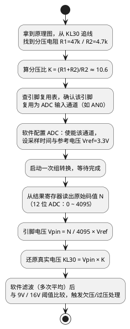

# 从一块 ECU 板开始

> 一句话定位：不背公式，直接拿一块 ECU 板"分区逛一圈、顺着电源树走一遍、打通一条 KL30 电压检测链路"——用一小时建立对硬件的整体直觉，这是本区所有笔记的地图页。
> 等级：L1 ｜ 前置：无

## 为什么从板子开始

软件工程师学硬件，最忌讳从"基尔霍夫定律"这种抽象入口进场——公式没少背，见到板子还是两眼一抹黑。正确的顺序是倒过来的：

1. **先知道板上有哪些"区"**，每区负责什么（宏观地图）；
2. **顺着电源树看一次电的流向**（板子的"血管"）；
3. **挑一条信号链路从原理图走到软件代码**（微观打通一次）。

走完这三步，后面每一篇笔记你都知道它"挂在板子的哪个位置"，学起来就是往地图上填细节，而不是记孤立知识点。

## 一、板上元件分区导览

把一块典型的车身控制器（TC377 或 S32K 主控）翻过来看，元件看似上百个，其实只分成四个功能区：

```
        ┌────────────────────────────────────────────────┐
        │              ECU 板（俯视分区）                 │
        │                                                │
        │  ┌──────────┐   ┌──────────────┐              │
        │  │ ① 电源区 │   │ ③ 通讯收发器区│              │
        │  │ 防反接    │   │ CAN 收发器    │              │
        │  │ TVS 保护  │   │ LIN 收发器    │              │
        │  │ DCDC/LDO  │   │ 端接/防护     │              │
        │  └────┬─────┘   └──────┬───────┘              │
        │       │                │                       │
        │  ┌────▼────────────────▼───────┐              │
        │  │        ② MCU 区              │              │
        │  │  主控芯片 · 晶振 · 复位芯片   │              │
        │  │  去耦电容阵列 · 调试口         │              │
        │  └──────────────┬───────────────┘              │
        │                 │                              │
        │  ┌──────────────▼───────────────┐              │
        │  │        ④ 驱动区               │              │
        │  │  高边驱动 · 继电器 · MOS 管    │              │
        │  │  （发热大、噪声大，独占一角）   │              │
        │  └──────────────────────────────┘              │
        └────────────────────────────────────────────────┘
```

| 分区            | 代表元件                             | 它的职责                                  | 软件为什么关心                          |
| --------------- | ------------------------------------ | ----------------------------------------- | --------------------------------------- |
| ① 电源区       | 防反接二极管/MOS、TVS、DCDC、LDO     | 把车载 12V"脏电"变成 MCU 要的干净 3.3V/5V | 欠压/过压 DTC、低功耗模式、复位原因排查 |
| ② MCU 区       | 主控、晶振、复位芯片、去耦电容       | 执行软件的"大脑+心脏"                     | 时钟配置、复位源、BOOT 引脚电平         |
| ③ 通讯收发器区 | CAN/LIN 收发器、端接电阻             | 把 MCU 的 0/1 电平翻译成总线信号          | 波特率、采样点、总线错误处理            |
| ④ 驱动区       | 高边驱动、MOS 管、继电器、续流二极管 | 用小电流信号控制大电流负载                | PWM 输出、诊断回读、开路/短路检测       |

逛板口诀：**先找连接器，再找最大的芯片（MCU），MCU 周围小八脚是收发器，挨着连接器的大个子是驱动**。

## 二、电源树怎么看

电源树就是"电从哪里来、经过谁、到哪里去"的一张族谱。看懂它，90% 的供电类问题（复位、掉电、DTC）就有了排查主线。

汽车 ECU 的电源主线只有一条：

```
 车载蓄电池 12V
      │
   KL30（常电，永远有电）
      │
      ├──▶ 防反接（二极管或 MOS：接反了不烧板）
      │
      ├──▶ TVS 瞬态抑制（抛负载/浪涌高压在这里被"削"掉）
      │
      ├──▶ DCDC 开关降压（12V ──▶ 5V，板上的"发电厂"）
      │        │
      │        ├──▶ LDO 线性稳压（5V ──▶ 3.3V，给 MCU IO 与外设）
      │        │
      │        └──▶ （有的板子再 LDO 出 1.25V 内核电，或由 MCU 内部自产）
      │
      ├──▶ KL15（点火开关电，"钥匙来了"的信号，经分压/比较整形进 MCU）
      │
      └──▶ KL30 电压检测通道（分压后进 ADC，本篇第三节的主角）
```

看电源树的三个直觉：

- **越靠近连接器越"糙"**（12V、抗浪涌），**越靠近 MCU 越"娇"**（3.3V、去耦成排）——所以防护器件全在入口，去耦电容全贴 MCU。
- **DCDC 效率高但吵**（开关噪声），**LDO 干净但发热**——两者常常串联配合，各干各的活。
- **KL30 是"永不睡觉"的线**：ECU 休眠了它也有电，所以静态电流预算、唤醒电路全挂在它身上。

## 三、实战：走通一条 KL30 电压检测链路

现在把前两节串起来。需求很典型：**软件要实时知道蓄电池电压多少伏**（低于 9V 报欠压、高于 16V 报过压）。硬件不会把 12V 直接怼进 MCU（会烧），而是用两只电阻把电压"缩小"后交给 ADC：

**第 1 步：在原理图上找到它。** 从连接器的 KL30 引脚出发，往后追：先遇到 R1（如 47kΩ），再遇到 R2（如 4.7kΩ）到地，R2 上端引出一条线，经过一个小电容（RC 滤波），最终落在 MCU 某个标注 `ANxx` 的引脚上——这就是一条"KL30 电压检测通道"。

**第 2 步：算一下缩了多少。** 分压比 = (R1+R2)/R2 = 10.6 倍。KL30 = 16V（常态上限）时，引脚上只有 16 ÷ 10.6 ≈ **1.5V**，远低于 3.3V 量程上限，安全；KL30 = 6V（冷启动）时约 0.57V，仍在量程内。一只 47k 一只 4.7k，就是硬件工程师留给软件的"缩放系数"。

**第 3 步：软件把它读回来。** 整条链路（原理图 → 引脚 → 软件）用一张活动图走通：



**心算验证一遍**：软件读到 N = 1864，则 Vpin = 1864/4095 × 3.3V ≈ 1.5V，KL30 ≈ 1.5 × 10.6 ≈ **15.9V**——正常。如果换算公式里分压系数填错（比如把 10.6 写成 1.06），读数就差十倍，这就是"软件 bug 长得像硬件故障"的经典案例。

这条链路里每一环都有对应笔记：分压是欧姆定律的应用，阻值为什么不能太大牵涉源阻抗，ADC 采样时间怎么设、参考电压准不准——都是后面各篇的主角。

## 下一步读什么

按顺序读 L1 带三站，读完你就能独立看懂一块板子的原理图：

1. [电压电流与基本定律](../1-L1基础/电压电流与基本定律/README.md)：本篇分压计算的出处，欧姆定律 + 分压/分流，配上汽车电压范围表；
2. [上拉下拉电阻](../1-L1基础/上拉下拉电阻/README.md)：为什么输入引脚总挂着一只电阻，I2C 为何必须上拉；
3. [原理图阅读](../1-L1基础/原理图阅读/README.md)：元器件符号、MCU 最小系统、数据手册怎么查——看懂板子的最小集。

之后若要处理供电类问题，先进 [L2 带·电源电路](../2-L2进阶/电源电路/README.md)；ADC 换算想读得更准，可提前读 [采样与量化](../2-L2进阶/模拟电路/ADC采样原理/01-采样与量化.md)（L1→L2 可提前读）。
