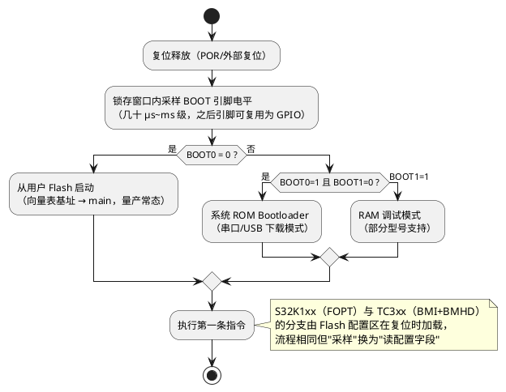

# BOOT 配置：芯片从哪里启动

> 一句话定位：复位释放后的第一件事，芯片按 BOOT 配置决定"从哪取第一条指令"——软件工程师要在原理图上找到 BOOT 引脚的上下拉（或确认它根本不是引脚决定的），并理解量产与维修对配置的不同要求。
> 等级：L1 ｜ 前置：[复位电路](02-复位电路.md)

## 原理

### 1. BOOT 配置引脚的作用

MCU 复位后、进入用户程序前，会在极短的锁存窗口内采样 BOOT 相关配置，决定：

- **启动介质**：用户 Flash / 系统 bootloader（ROM）/ 串口或 CAN 下载模式 / 调试 RAM 模式
- **启动模式标志**：如低功耗启动、时钟初值、部分外设初始使能状态

### 2. 不同平台的 BOOT 机制差异（重要：不全是引脚）

| 平台 | BOOT 机制 | 原理图上看什么 |
|---|---|---|
| 通用 Cortex-M（如 STM32F1） | BOOT0/BOOT1 引脚电平直接选启动介质 | 找 BOOT0 引脚的上/下拉电阻 |
| S32K1xx | 无独立 BOOT 选脚；启动选项由 Flash 配置区的 FOPT（FTFA_FOPT，含 LPBOOT、NMI 使能等位）在复位时加载 | **原理图上看不到**，要看烧写镜像/软件工程的 flash 配置字段 |
| TC3xx（AURIX） | BMI（Boot Mode Index，出厂固化不可改）+ BMHD（Boot Mode Header，位于 Flash、可改，含启动模式与校验）共同决定 | 原理图无 BOOT 脚；要看 BMHD 内容与 BMI 值 |

详细启动流程见 [启动流程](../../../../02-芯片与体系结构/2-L2进阶/启动流程/README.md)。

以"BOOT 引脚型"为例的采样→模式分支流程：



概念：BOOT 配置的"采样-锁存"发生在复位释放初期（几十 μs~ms 级）——之后引脚可复用为 GPIO，所以原理图上 BOOT 脚的上下拉要经得起"双重身份"的检查。

### 3. 原理图上怎么找 BOOT 引脚的上下拉配置

检索步骤（识别方法）：

1. 在 MCU 引脚表页搜引脚名：`BOOT`、`BOOT0`、`NBOOT`、`BOOT_CFG`、`BOOT_MODE`、`BMODE` 等
2. 看该网络上的电阻：上拉到 VDD → 锁存为 1；下拉到 GND → 锁存为 0
3. 对照 DS 的 boot pin 真值表，确认电平组合对应的启动介质
4. S32K1xx 这类"非引脚决定"的平台：改查工程的 flash 配置字段（FOPT）与烧写脚本
5. TC3xx：查 BMHD 的启动模式字段与 BMI 当前值（可用调试器/工具读）

### 4. 量产配置策略

- **固定 Flash 启动（主流）**：BOOT 脚用电阻焊死（如 BOOT0 下拉到 GND），减少产线变量；未用的 BOOT 脚绝不悬空——锁存输入悬空等于随机数
- **维修/产线预留**：BOOT 网络串 0Ω 电阻或留测试点/跳线，改电平即可强制进 ROM 下载模式救板
- ** BOOT 与复位的时序关系**：BOOT 采样窗口在复位释放之后，因此上/下拉必须在复位释放前就稳定（RC 复位时间已天然覆盖）

### 5. BOOT 误配置后果与恢复

| 误配置 | 后果 | 恢复手段 |
|---|---|---|
| BOOT 电平错（进了 ROM 下载） | 应用不跑，串口/CAN 上是 bootloader 协议 | 改 BOOT 电平+复位 |
| BOOT 脚悬空 | 随机启动介质，偶发"下电后再上电不跑" | 补上/下拉 |
| FOPT/BMHD 写错 | 复位后进错模式甚至反复重启 | 调试器接管擦除/重写配置区 |
| NMI 类脚被误当 BOOT 拉低 | 启动即进 NMI | 核对引脚复用与上下拉 |

### 6. 三大平台启动配置对照详解

**通用 Cortex-M（BOOT 引脚型）**：

```
复位 ─→ 采样 BOOT0/BOOT1 ─→ 选择向量表基址
        BOOT0=0 : 用户 Flash（量产常态）
        BOOT0=1 : 系统 ROM bootloader（串口/USB 下载）
        BOOT1  : 部分型号配合选择 RAM 启动
```

**S32K1xx（FOPT 型）**：

```
Flash 偏移 0x400 起的"程序 Flash 配置字段"：
  +0x408  Backdoor Comparison Key（后门密钥，解锁用）
  +0x40F? FOPT 字节 ← 启动配置所在（LPBOOT/NMI 等位，偏移以 RM 为准）
复位时硬件自动把该字段加载到 FTFA_FOPT 寄存器
→ 全片擦除后未重写配置字段，会按默认 FOOT 启动，行为可能与量产不一致
```

**TC3xx（BMI+BMHD 型）**：

```
BMI（Boot Mode Index，固化）+ BMHD（Boot Mode Header，Flash 内可改）：
  BMHD0/BMHD1（两个可互为备份，地址以 UM 为准）
    ├─ BMI 字段：normal / alternate / generic boot mode 等
    ├─ STAD（启动地址指针）
    ├─ CRC32 + CRC_INV（校验，验不过走 fallback BMHD）
  → 校验失败链：BMHD0 → BMHD1 → BMI 默认模式
  → 这套机制是"为什么写坏 BMHD 也能被救回"的原因
```

审图/审软对照结论：

| 问题 | 看哪里 |
|---|---|
| 这块板从哪里启动 | 引脚型看上下拉；FOPT/BMHD 型看镜像配置字段 |
| 为什么复位后停在下载模式 | BOOT 电平 or FOPT/BMHD 被改 |
| 为什么双备份启动 | TC3xx 的 BMHD0/1 校验链设计 |

### 7. 产线视角的 BOOT 流程（概念）

```
空板 ─→ 烧写工具经调试口写入 BL+应用+配置字段
     ─→ EOL 复位：预期从 Flash 启动进 BL → 校验应用 → 跳转
     ─→ CAN/UDS 检查：22 读版本、31 跑自检
     ─→ 刷写升级：10 切会话 → 27 解锁 → 34/36/37 换应用区
（全程 BOOT 恒为 Flash 启动，无硬件动作）
```
## 计算与选型（本篇为审图清单）

- [ ] 确认本平台 BOOT 是"引脚决定"还是"Flash 配置区决定"
- [ ] 引脚决定型：每个 BOOT 脚都有明确上/下拉，无悬空
- [ ] 上/下拉阻值常规（4.7k~100k），不被复用外设干扰
- [ ] 是否留维修跳线/测试点，位置是否便于产线操作
- [ ] Flash 配置区决定型：软件工程的 FOPT/BMHD 配置纳入版本管理，与烧写工具链对齐
- [ ] 冷启动/快速上下电场景下 BOOT 电平建立时间与复位时序不冲突

## ECU 实例

- 量产节点：BOOT0 经 10kΩ 下拉焊死，从用户 Flash 启动，产线直接烧应用
- 需要现场刷写的节点：应用内置 Bootloader（复位后总是先跑 BL，再跳应用）——BOOT 固定为 Flash 启动即可，"进入刷写"由 BL 内的会话/条件判断，不再依赖硬件 BOOT
- 早期开发板：拨码开关切 BOOT，方便在"串口下载/Flash 运行/调试 RAM"间切换
- 救板场景：FOOT/BMHD 写坏导致连调试器都难连的板卡，需用专用工具/特殊时序恢复（以芯片安全手册为准）

## 与软件的关联

1. **Bootloader 方案的前提**：BL+应用同在 Flash、BOOT 恒为 Flash 启动——软件"进刷写模式"靠 UDS 10/27 会话与条件检查，而不是硬件 BOOT；这让产线流程与硬件解耦
2. **flash 配置区是软件资产**：S32K 的 FOPT、TC3xx 的 BMHD 都在镜像里，构建系统必须保证每次链接都带正确的配置字段
3. **启动慢的锅别乱甩**：进 BL 校验/等跳转条件的耗时（几十~几百 ms）常被误认为"晶振慢/复位慢"——按启动阶段拆分计时定位
4. **量产下线检测（EOL）**：烧写后第一次复位的启动行为要与 BOOT 配置一致（如预期从 BL 跳应用），作为 EOL 检查项

## 易错点与陷阱

- 以为所有 MCU 都有 BOOT0 引脚（S32K1xx/TC3xx 用配置区），在原理图上瞎找
- BOOT 脚悬空：常温测试正常，低温/批量随机启动失败
- BOOT 脚上下拉与该脚复用功能冲突（启动后作 GPIO/外设脚，被外设电路强驱动）
- 拨码开关默认位错：整批产线板全进下载模式
- 修改 FOOT/BMHD 后没做全片擦除，新旧配置字段混用
- 把"进 Bootloader"做成硬件 BOOT 切换：产线需要开壳拨码，返修成本高

## 面试高频题

**Q1：BOOT 配置引脚的作用是什么？**
A：在复位释放初期的锁存窗口内采样，决定启动介质（用户 Flash/系统 ROM/下载模式）与部分启动模式标志；之后引脚可复用为 GPIO。是否用引脚取决于芯片——S32K1xx 用 Flash 配置区 FOPT，TC3xx 用 BMI+BMHD，而非独立引脚。

**Q2：S32K 和 TC377 的启动配置分别由什么决定？**
A：S32K1xx 由 Flash 配置区的 FTFA_FOPT（如 LPBOOT、NMI 位等）在复位时加载决定，原理图上没有 BOOT 选脚；TC3xx 由出厂固化的 BMI 加 Flash 中可修改的 BMHD 共同决定启动模式（含校验方式）。细节见启动流程章节。

**Q3：量产 ECU 的 BOOT 一般怎么配？为什么？**
A：固定为用户 Flash 启动，BOOT 脚（若有）电阻焊死不悬空；因为量产要消除产线变量、支持不开壳刷写——"进刷写模式"由内置 Bootloader 的软件逻辑（诊断会话）实现，不依赖硬件切换。

**Q4：BOOT 误配置会有什么现象？怎么恢复？**
A：典型是复位后不跑应用（停在 ROM 下载模式）、随机不启动（BOOT 悬空）或反复重启（配置区写坏）。恢复：改 BOOT 电平/补上下拉；配置区写坏的用调试器接管擦除重写，必要时用芯片厂商的恢复时序。

**Q5：软件 Bootloader 为什么通常不依赖硬件 BOOT？**
A：BL 常驻 Flash 头部，复位后先跑 BL、校验/等待后再跳应用，硬件 BOOT 恒为 Flash 启动即可；这样刷写入口由软件（UDS 会话+安全访问）控制，产线/售后无需开壳拨码，流程可追溯。

## 延伸

- [调试口](05-调试口.md)
- [MCU 复位电路](02-复位电路.md)（BOOT 采样与复位释放的先后关系）
- [启动流程](../../../../02-芯片与体系结构/2-L2进阶/启动流程/README.md)