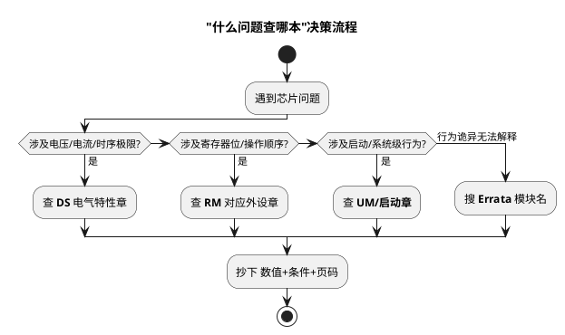

# Datasheet vs Reference Manual vs User's Manual

> 一句话定位：芯片文档三兄弟各管一段——DS 管"芯片是什么（电气参数/资源）"，RM 管"寄存器怎么用"，UM 管"芯片级综合行为"，查错书是工程师最常见的时间黑洞。
> 等级：L1 ｜ 前置：[从一块 ECU 板开始](../../../00-入门导读/01-从一块ECU板开始.md)

## 原理

### 1. 三类手册的分工

| 手册 | 全称 | 内容 | 什么时候翻 |
|---|---|---|---|
| DS | Datasheet（数据手册） | 电气特性（电压/电流/时序极限）、资源概览（外设清单/封装/引脚表）、绝对最大值 | 判断"能不能这么接""功耗多大""这个引脚什么特性" |
| RM | Reference Manual（参考手册） | 外设架构 + 寄存器逐位详解 + 编程模型 | 写驱动、配寄存器、查位定义与操作顺序 |
| UM | User's Manual（用户手册，英飞凌风格，如 TC3xx UM） | 芯片级综合：启动流程、电源/时钟/安全机制、外设行为（寄存器级的另一种组织方式） | 查系统级行为（启动模式、EVR、BMI/BMHD、安全机制） |

英飞凌 AURIX 的传统是"DS+UM"两本（UM 里直接含寄存器描述）；NXP S32K 是"DS+RM"两本（RM 巨厚，按外设分章）。**先弄清目标芯片的文档体系，再动手查**。

### 2. "什么问题查哪本"决策表

| 你的问题 | 查哪本 | 具体位置 |
|---|---|---|
| 这个 IO 能灌多少电流 | DS | 电气特性表 IO 章节 |
| 这个引脚是否 5V 容忍（FT 类型） | DS | 引脚复用/IO 类型表（缩写在术语表解释） |
| 某寄存器某一位什么含义 | RM | 对应外设章的寄存器位描述表 |
| 外设操作顺序（先使能什么再配什么） | RM | 外设章的 functional description / 编程示例 |
| 芯片复位后从哪取指、BOOT 怎么定 | UM（AURIX）/RM 启动章 | 启动流程章节 |
| 最短 ADC 采样时间 | DS+RM | DS 给参数极限，RM 给采样级数配置 |
| IO 最大翻转频率 | DS | IO 交流特性表 |
| 上电时序要求 | DS | Power supply / sequencing 章节 |
| 已知硅片问题 | Errata 勘误表 | 单独文档（见快速检索篇） |

### 3. DS 表格怎么读：min/typ/max 三列

```
符号     参数              最小   典型   最大   单位   测试条件
VIL      输入低电平         -0.3   —     0.3VDD  V    (注3)
VIH      输入高电平        0.7VDD  —      —     V    (注3)
```

- **min/max 是保证值**（全温/全压/工艺角内必须满足），**typ 只是统计典型**——设计永远按 min/max 算，typ 用来估功耗
- **脚注藏关键信息**：测试条件（温度、电压、负载电容、引脚分组）常决定数值是否适用于你的场景；跳过脚注=白读
- 单位与测试波形定义（如 tSU 参考哪个电平点）在表后 Note 里，读时序表前先读 Note

### 4. 版本配套管理

- DS/RM/Errata 各自独立出版本号，芯片手册之间必须**成套固定**：项目 wikis/配置管理里记录"本项目使用 S32K1xx RM Rev.x + DS Rev.y + Errata Rev.z"
- 硅片版本（Mask/Mask Set）与 Errata 条目绑定：换批次/换 Mask 要重新核对勘误
- 引脚封装变更（同系列不同封装）会改引脚表——BOM 换封装前重查 DS
- 经验：把三份 PDF 与项目代码同库存档，禁止"网上搜到哪版用哪版"

### 5. DS 章节地图速览（拿到新 DS 先扫这九站）

| 站 | 常见章名关键词 | 你要带走什么 |
|---|---|---|
| 1 | General description / Features | 资源清单：几个 CAN、几个 ADC 通道、主频多少 |
| 2 | Ordering information / Packaging | 封装与料号（含温度等级） |
| 3 | Pinout / Pin connections | 引脚复用表、IO 类型缩写 |
| 4 | General operating conditions | 工作电压/温度范围 |
| 5 | Electrical characteristics | 各域电流、IO 电气参数（min/typ/max） |
| 6 | Power management | 上电时序、POR/BOR/LVD 阈值 |
| 7 | Peripherals 概览各章 | 外设级极限参数（ADC 时钟、翻转频率） |
| 8 | Thermal | 热阻 θja/θjc 与封装功率上限 |
| 9 | Footnotes/Notes | 全部表格条件 |

### 6. RM 章节地图速览（按外设章的固定骨架读）

一本 RM 几千页，但每个外设章结构几乎一样：

```
1 Introduction     外设一句话定位与特性列表
2 Signal descriptions 引脚/信号（含复用关系）
3 Functional description ← 精读：框图+工作机制+操作顺序
4 Modes            工作模式与状态转换
5 Registers        寄存器总表
  xxx_CTRL1        每个寄存器：地址/复位值/位表/位描述
6 Interrupts/DMA   事件映射
（部分 RM 附 Initialization/例程——驱动骨架直接参考）
```

读法：先 1/3 章建立行为模型，写代码时再精读 5 章位表；评审别人驱动时反向（从位表回推行为）。

### 7. 读手册的三个姿势

1. **先地图后细节**：任何手册先扫目录与 Introduction，禁止从中间随机页读起
2. **条件三件套**：抄任何数字必带（温度/电压/负载）条件与页码
3. **交叉验证**：同一事实在 DS/RM/UM/Errata 多处出现时，以更具体的为准，冲突即问题（拿去问 FAE）
### 8. 文档族谱（不止三本）

| 文档 | 作用 | 备注 |
|---|---|---|
| Errata / Mask Set Errata | 硅片已知缺陷 | 与硅片版本绑定，必查 |
| Application Note | 专题应用（如 CAN 组网、低功耗设计） | 快速上手某类问题 |
| Safety Manual | 安全机制与失效率（FMEDA） | 功能安全项目必读 |
| Config Tool 手册 | 图形化配置生成的代码与 RM 对应关系 | S32CT/EB tresos 等 |
| IBIS 模型 | 信号完整性仿真 | 硬件侧，软件略 |
| CRC/校验工具说明 | 镜像/Flash 校验算法 | Bootloader 开发用 |
### 9. 查文档决策流程


## ECU 实例

- 新项目立项：硬件按 DS 电气表画原理图，软件按 RM 建寄存器头文件/芯片配置（或用厂商配置工具生成），启动相关按 UM 核对
- 台架问题复盘："CAN 采样点漂移"——先 RM 查位时序寄存器公式，再 DS 查振荡器容差，最后 Errata 搜 CAN——三本手册在这一件事上各管一段
- 产线良率问题：某批次 IO 输出电平临界，翻 DS 电气表的脚注发现测试条件与实际驱动能力档位不同，实为软件配置了弱驱动档

## 与软件的关联

1. **驱动代码的正确性=对 RM 的忠实度**：寄存器写入顺序、等待标志、通道分配都来自 RM；"配置位写反"类 bug 多数是没读全 RM 的功能描述
2. **参数极限写进校验**：DS 的 min/max（如 ADC 时钟上限）应在驱动初始化里做断言/校验，防止上层传参越界
3. **文档版本进入构建说明**：MCAL/驱动的 release note 注明适配的 RM 版本，升级 SDK 时先对 RM 版本差异
4. **Errata 条目驱动 workaround 代码**：已知硅片缺陷在驱动里加规避（如某通道顺序初始化），并在代码注释里引用 Errata 编号

## 易错点与陷阱

- 拿 RM 的"典型配置"当 DS 的"保证参数"用（或反之）
- 忽略 DS 表格脚注，直接抄数字
- 混用不同版本手册：新版改了位定义/参数，旧代码没同步
- 只看 DS 资源概览就断言外设能力，没去 RM 查通道复用冲突
- 忘了 Errata 是第四本"必读手册"
- 英飞凌平台找"RM"找不到——人家叫 UM

## 面试高频题

**Q1：Datasheet 和 Reference Manual 的区别？**
A：DS 描述芯片"是什么"——电气特性、资源、封装引脚与极限参数，面向选型与硬件设计；RM 描述"怎么用"——外设架构、寄存器位定义与编程模型，面向驱动开发。英飞凌 AURIX 体系用 UM 承担系统级+寄存器描述。

**Q2：DS 表格中 min/typ/max 三列分别什么含义？设计时用哪个？**
A：min/max 是厂商在规定条件（全温全压工艺角）下保证的极限，typ 是典型统计值。设计计算必须按 min/max 留余量，typ 只用于功耗估算等统计场合。

**Q3：想确认某引脚能否直接接 5V 信号，查哪里？**
A：查 DS 的引脚/IO 类型表，看该引脚类型缩写（如 FT 类表示 5V 容忍，具体缩写以 DS 术语表为准），并结合注脚确认是否需要电源在位、有无串联限流要求；不能只看引脚名猜。

**Q4：为什么工程要固定手册版本？**
A：DS/RM/Errata 随硅片版本更新，位定义、参数、已知缺陷都可能变化；版本漂移会导致驱动按旧文档写、评审按新文档查，产生系统性错误。项目应成套固定并纳入配置管理。

**Q5：启动流程（BOOT/BMI）应该查哪本？**
A：平台相关——S32K 在 RM/启动相关章节，AURIX TC3xx 在 UM（含 BMI/BMHD 详解）；拿不准时先查 DS 的 feature 描述定位章节，再进对应手册。

## 延伸

- [快速检索技巧](02-快速检索技巧.md)
- [MCU 电源与去耦](../MCU最小系统/01-电源与去耦.md)
- [MCU 复位电路](../MCU最小系统/02-复位电路.md)
- [启动流程](../../../../02-芯片与体系结构/2-L2进阶/启动流程/README.md)