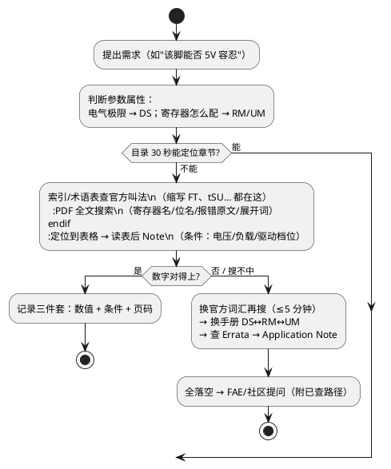

# 数据手册快速检索技巧

> 一句话定位：不背手册，练"最快翻到答案"的路径感——目录/索引进场、PDF 全文搜索定位、电气表反查、时序符号解读、Errata 必查，最后沉淀成检索习惯清单。
> 等级：L1 ｜ 前置：[Datasheet vs Reference Manual](01-Datasheet-vs-Reference-Manual.md)

## 原理（检索方法论）

### 1. 高效路径：目录 → 索引 → 全文搜

```
1) 目录（TOC）：30 秒扫一遍章名，建立"这题大概在哪章"的地图感
2) 索引/术语表（Index/Glossary）：缩写（FT、LVD、tSU…）的官方解释都在这
3) PDF 全文搜索（Ctrl+F）：直接搜目标词
     - 寄存器名/位名：搜 "CTRL1" "LPBOOT"
     - 缩写展开：搜 "Five-volt" 而不是 FT
     - 报错原文：RM/Errata 里搜编译器或工具报错的关键词
     - 多关键词组合：搜 "5 V tolerant" 带空格变体
```

注意：搜索词优先用手册自己的语言（先从目录/术语表确认官方叫法），中文笔记里的自译词往往搜不中。

从需求到答案的整体检索路径：



### 2. 用电气特性表反查"这个引脚能否 5V 容忍"

场景：外部芯片输出 5V，想直接接 MCU IO。

检索步骤（方法演示，以 S32K 类 DS 结构为例）：

1. DS 目录找 "Input/output" / "Pinout and connection information" 章
2. 定位引脚表（Pinout）中该引脚的 **IO 类型缩写**列（如 HD/STD/FT/TT 等）
3. 到该章 Table Note 或 Glossary 查缩写定义：FT 类通常表示 5V 容忍（Five-volt Tolerant），TT/STD 等为非容忍——**具体缩写集以该 DS 的术语表为准**
4. 再查注脚：是否要求 VDD 在位、有无串联电阻建议、是否包含 ADC 类特殊脚（ADC 脚通常不容忍 5V）
5. 结论落到"能/不能/加电阻后能不能"三选一，并引用 DS 页码记录

### 3. 时序参数符号解读（概念）

| 符号 | 含义 | 读法 |
|---|---|---|
| tSU | 建立时间（Setup） | 时钟沿前数据必须提前稳定的时长 |
| tH | 保持时间（Hold） | 时钟沿后数据仍需保持的时长 |
| tV | 有效时间（Valid） | 输出在时钟沿后多久内有效 |
| tW | 脉宽（Width） | 最小高/低电平宽度 |

套路：找到时序图 → 把表里符号与图上标注一一对应 → 看表后 Note 的参考电平与负载条件 → 再把数字代入自己的场景（如主频降一半后 tSU 是否仍满足）。

### 4. Errata 勘误表必查

- 每个硅片版本（Mask Set）有独立 Errata 文档，列出该版已知缺陷与规避方法
- 项目启动、以及**每次诡异 bug**：拿模块名搜 Errata（如搜 "EVADC" "FLEXCAN"）
- 条目结构：模块 → 触发条件 → 影响 → 规避方案（workaround）
- 经验：十次"完全无法解释的行为"里有一次能在 Errata 里找到现成答案

## 案例演练

### 案例一：查"IO 最大翻转频率"该翻哪里

思路（不背答案，练路径）：

1. 先问自己：这参数是"电气极限"还是"寄存器配置"？——是极限 → DS
2. DS 目录找 IO 电气特性章（关键词 "I/O AC" / "Output timing"）
3. 在交流参数表里找输出翻转相关符号（如 fIO/tIO），注意区分**不同驱动档位/不同电压下的不同数值**（读注脚！）
4. 若还要"配到那个频率怎么设时钟与寄存器"→ 转去 RM 的时钟/Port 章
5. 记录格式：值 + 条件（电压/负载/档位）+ DS 页码

### 案例二：查"EVADC 最短采样时间"该翻哪里

1. EVADC 是 AURIX 的增强型 ADC——先确认"最短采样时间"是参数极限还是可配置项：**两者都有**（硬件下限+可配级数）
2. UM/DS 里找 ADC 章的转换时序公式：总转换时间 = 采样 + 转换 + 等待，采样阶段由采样级数（如 [7:0] 位字段）控制
3. DS 交流表给"每采样级数的时长"与最小级数（参数名以手册为准）
4. RM/UM 给寄存器怎么配；两者数字对上（配置值×每级时长 ≥ 硬件下限）才收工
5. 高阻抗源还要回算源阻抗×采样电容的充电时间——超出本文范围，记住"DS+RM 两头对"这个动作

## 检索习惯清单

- [ ] 新芯片到手：先把 DS/RM/UM/Errata 四份收集齐并固定版本
- [ ] 先读 DS 第一章 feature 概览 + 引脚图，建立地图感
- [ ] 搜不到时换手册的"官方词汇"再搜（术语表查标准叫法）
- [ ] 任何抄走的参数都带三件套：数值+条件+页码
- [ ] 查到的结论当天归档进工程 wiki 或个人笔记，注明手册版本与页码
- [ ] 同一问题两次以上检索不中，回上来重新分类问题属性
- [ ] 带新人时先问对方查了哪本手册哪一章，训练路径感
- [ ] 手册版本号变化时，先 diff 目录级变化再决定是否重读
- [ ] 时序表必读表后 Note
- [ ] 诡异 bug 三步走：Errata → RM 功能描述 → 论坛/FAE
- [ ] 定期把"这次怎么找到的"沉淀成本篇的方法，路径感靠复盘积累

### 5. DS 高频缩写速查（以各手册术语表为准）

| 缩写 | 常见含义 |
|---|---|
| FT | 5V 容忍（Five-volt Tolerant）类 IO |
| TT / STD / HD | 非 5V 容忍 / 标准 / 高驱动 IO 档位 |
| VIL / VIH | 输入低/高电平阈值 |
| VOL / VOH | 输出低/高电平 |
| Ioh / Iol | 拉/灌电流 |
| tSU / tH / tV / tW | 建立/保持/有效/脉宽时间 |
| POR / BOR / LVD | 上电/掉电/欠电压检测 |
| FI / FO | 扇入/扇出能力（部分厂商用） |

### 6. 检索时间预算（防钻牛角尖）

```
目标明确的关键词检索：≤5 分钟无果 → 换关键词（官方术语）
换词两轮仍无果        → 换手册（DS↔RM↔UM）
三本手册都无果        → 查 Errata → 再查 Application Note
全部落空              → FAE/社区提问（附上已查路径）
```

检索不是意志力比赛：路径都走一遍还没命中，大概率问题问错了（回到"这参数到底是什么属性"重新分类）。
## ECU 实例

- 台架上 S32K CAN 偶发丢帧：先 RM 查 FlexCAN 位时序寄存器与采样点计算，再 DS 查振荡器容差，最后在 Errata 搜 FlexCAN——三层各排除一类原因
- 配 ADC 采样时间：按"案例二"路径，DS 算下限、RM 配级数，避免"抄 demo 配置在高阻抗传感器上读数偏小"
- 5V 信号直连 MCU IO 引发争议：按"反查方法"确认该脚类型非 FT，改为分压/电平转换，争论结束

## 与软件的关联

1. **寄存器头文件校对**：驱动里的位掩码应与 RM 逐位核对（版本固定的意义），检索习惯好的人十分钟核对完一章
2. **参数断言**：把 DS 查到的 min/max 落成驱动里的参数检查，检索成果变成运行时保护
3. **错误信息反查**：编译器/调试器报错里的缩写（如 "lockup" "bus fault"）直接去 RM 搜，比搜索引擎更快命中官方解释
4. **评审效率**：代码评审时能当场翻出 RM 页码指证，是效率与信服力

## 易错点与陷阱

- 用自译中文词搜英文手册（应该先查官方术语）
- 抄参数不带条件（温度/电压/负载），换场景就错
- 只搜到第一处命中就下结论（同名寄存器可能多处章节）
- 忽略 Errata，把硅片缺陷当代码 bug 调一周
- DS 概览页的"资源数量"当引脚级事实（实际复用冲突要看引脚表）

## 面试高频题

**Q1：怎么快速查一个引脚是否 5V 容忍？**
A：DS 的引脚表找该脚 IO 类型缩写 → 到术语表/注脚查缩写含义（如 FT 类为 5V 容忍，以该 DS 定义为准）→ 确认附加条件（VDD 在位、串阻要求）。不能靠猜，要能引用页码。

**Q2：tSU/tH/tV 各是什么？**
A：建立时间=时钟沿前数据需提前稳定的时长；保持时间=时钟沿后数据需继续保持的时长；有效时间=时钟沿后输出有效的最大延迟。读时序表要把符号对回时序图，并核注脚里的电平与负载条件。

**Q3：为什么 Errata 必查？怎么查？**
A：Errata 记录该硅片版本的已知缺陷与规避方案，很多"无法解释的现象"其实有现成答案。拿模块名（如 FlexCAN、EVADC）直接在 Errata PDF 里全文搜，逐条核对触发条件。

**Q4：查"IO 最大翻转频率"，你的路径是？**
A：判断属性→极限参数在 DS → 目录定位 IO 交流特性表 → 找翻转频率符号并注意驱动档位/电压条件与注脚 → 若要配置实现再转 RM 时钟/Port 章。答案带条件与页码记录。

**Q5：PDF 全文搜索有什么技巧？**
A：用手册官方词汇搜（先经术语表确认叫法）；寄存器名/位名/报错原文直接搜；缩写搜不中就搜展开词；多版本手册要确认当前打开的是项目固定版本。

## 延伸

- [Datasheet vs Reference Manual vs User's Manual](01-Datasheet-vs-Reference-Manual.md)
- [BOOT 配置](../MCU最小系统/04-BOOT配置.md)
- [调试口](../MCU最小系统/05-调试口.md)