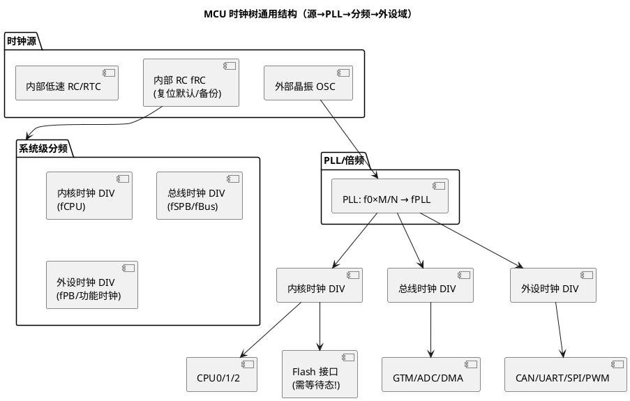

# 时钟树与 PLL

> 一句话定位：PLL（Phase-Locked Loop，锁相环）把"一颗 20 MHz 晶振"倍频成"内核 200/300 MHz + 各外设域精确分频"，时钟树（Clock Tree）负责把不同频率分发给谁——理解它才能看懂 Mcu 配置工具里那一堆 P/N/M/DIV 参数。
> 等级：L2 ｜ 前置：[晶振原理与负载电容计算](01-晶振原理与负载电容计算.md)

## 原理

### 1. 为什么需要 PLL

两个独立需求，单靠晶振都满足不了：

- **内核要高频**：CPU 算力要 100~300 MHz，但基音晶体超过几十 MHz 后贵且难做——需要"倍频"
- **外设要精确**：CAN 位时序、UART 波特率要从系统时钟**整数分频**出精确波特率——需要"基准干净、分频比好算"

PLL 的角色：鉴相器（PFD）比较参考时钟（晶振 f0）与反馈时钟（VCO 分频后）的相位，误差经环路滤波器控制压控振荡器（VCO），直到两者同频同相——输出频率被"锁定"为 f0 的有理数倍：

```
              ┌─────────────────────────────────────┐
   f0 (晶振)  │  ┌─────┐   ┌────────┐   ┌─────────┐ │    fPLL
  ────────────┼─▶│ P/N │──▶│ 环路   │──▶│  VCO    │─┼────────────▶
   参考分频    │  │ 分频 │   │ 滤波器 │   │ (高频)  │ │
              │  └──┬──┘   └────────┘   └────┬────┘ │
              │     ▲      鉴相器 PFD         │      │
              │     └────────────────────────┤      │
              │              ┌───────────────┘      │
              │              │  P2/K 反馈分频        │
              └──────────────┴──────────────────────┘

  锁定后： fPLL = f0 × (P/N) × (P2/K)   ← 各系数含义各平台不同，以 RM 为准
```

为什么"PLL 锁定=频率精确"：锁定时反馈时钟与晶振参考严格同频同相，所以 fPLL 的长期平均频率与晶振同精度（ppm 级）——**倍频不损失精度**（抖动会略变差，但频率准确度保持）。

### 2. 时钟树通用结构（源 → PLL → 分频 → 各外设域）



看懂三点即可读懂任何平台：

1. **多源选择**（晶振/内部 RC/PLL 输出）经多路器选一个进系统域，复位默认选内部 RC
2. **逐级分频**：PLL 高频先切成内核/总线/外设三档（频率依次递减），外设还能再各自分频
3. **约束链**：内核 ≥ 总线 ≥ 外设（多数平台硬性要求，违反则总线时钟相位错乱，以 RM 时钟树图为准）

### 3. 跨时钟域（一句话）

两个无同步关系的时钟域之间传信号，必须过**同步器**（两级触发器打拍）——否则采样到亚稳态（metastability，输出在 0/1 之间悬挂不定），传染给下游逻辑导致状态机跑飞。AUTOSAR 软件工程师只需知道：Mcu 配置里"异步外设时钟"（如某些 ADC/以太网时钟独立于总线时钟）初始化时先配时钟关系再使能接口，避免亚稳态初值。

## 计算与选型

### 频率规划算例（符号推导 + 示例数字）

设计输入：晶振 f0 = 20 MHz，目标内核 200 MHz、总线 100 MHz、CAN 功能时钟尽量"整除友好"。

```
第 1 步：定 PLL 输出
        fPLL = f0 × (M/N)，取 M=20、N=2 → fPLL = 20 × 20/2 = 200 MHz
        约束：PFD 输入频率（f0/N=10MHz）与 VCO 范围须在数据手册限值内（以 RM/DS 为准）

第 2 步：内核时钟
        fCPU = fPLL / DIV_CPU = 200/1 = 200 MHz

第 3 步：总线时钟（约束 fSPB ≤ fCPU）
        fSPB = fPLL / DIV_SPB = 200/2 = 100 MHz

第 4 步：外设/功能时钟
        fPB  = fPLL / DIV_PB  = 200/4 = 50 MHz
        CAN 位时序从 50 MHz 分频：500 kbit/s → 50M/500k = 100 tq/位 → 整除，采样点参数好配
        （若想 1 tq=20ns 更细粒度，也可给 CAN 单独选 fPLL=200MHz → 400 tq/位）

第 5 步：校核三条红线（全部以 RM/DS 限值为准）
        ① fCPU ≤ 最大主频（如 300 MHz）
        ② fSPB ≤ fCPU 且 ≤ 外设最大总线时钟
        ③ Flash 等待态随 fCPU 匹配——200MHz 必须插等待态，不配则取指出错
```

**波特率"整除友好"原则**：给通讯外设的功能时钟要能被目标波特率整除出足够多的 tq（时间量子），如 50 MHz 对 500k/2M/5M CAN-FD 都是整数分频——频率规划阶段没规划好，后面位时序参数怎么配都别扭。

### PLL 使能顺序与锁定等待（通用流程）

```
① 配分频/倍频系数（此时 PLL 未使能，改参数安全）
② 使能 PLL
③ 等待 LOCK 标志置位（环路捕获需要 μs~ms 级，以 DS 典型值为准）
   └─ 必须带超时保护：晶振坏 → 永远锁不上 → 看门狗复位死循环
④ LOCK 后：部分平台要求等待"锁定丢失检测使能"稳定期
⑤ 切换系统时钟源到 PLL 输出
⑥ 读回确认；使能 LOCK 丢失中断（时钟失效监测，见 RC 时钟篇 CSS 一节）
```

## ECU 实例

- 某域控制器（TC377）：20 MHz 晶振 → CCU PLL → 三核各 300 MHz、fSPB 100 MHz、CAN 模块功能时钟独立选择；GTM 输出 PWM 用独立分频避免与 CPU 负载相关抖动（具体寄存器与参数以 TC377 RM 与项目 Mcu 配置为准，见 [TC377 时钟系统](../../../02-芯片与体系结构/2-L2进阶/TC377平台/时钟系统/README.md)）
- 某车身 ECU（S32K144）：8 MHz 晶振 → SPLL → 内核 80 MHz、Run 时总线 40 MHz；CAN PE 时钟从 SPLLDIV2 取 40 MHz，500 kbit/s 得 80 tq/位，采样点 75% 配置顺利（以 S32K RM 与 EB tresos 配置为准，见 [S32K 时钟系统](../../../02-芯片与体系结构/1-L1基础/S32K平台/时钟系统/README.md)）
- 排障案例：新项目改内核 300 MHz 后偶发 Flash 取指错误——等待态（wait states）未随主频更新，MCAL 配置工具里 Flash 等待域漏配

## 与软件的关联

1. **Mcu 配置是全部外设的地基**：CAN/UART/SPI/PWM 的分频全从时钟树参数推算，时钟树改动（哪怕只改晶振 8→20 MHz）要求全量回归位时序/波特率相关测试
2. **EB tresos/Tresos Studio 的 Mcu 配置页**本质就是在填上面算例里的 M/N/DIV——看不懂频率规划就只能照抄老配置
3. **低功耗切换**：睡眠前降频/停 PLL（省电）、唤醒后按相反顺序恢复并等 LOCK——顺序错了等于没恢复（呼应[RC 时钟](02-RC时钟.md)切换流程）
4. **ADC 采样时钟**常独立于总线时钟且有范围限制（过高转换精度下降），Mcu 配置里单列
5. **跨时钟域外设**（异步 FIFO 型，如某些 Ethernet MAC）初始化时先配时钟关系再使能接口，避免亚稳态初值

## 易错点与陷阱

- 改了主频没改 Flash 等待态：高速取指出错，症状随机，极难定位
- 约束链违反（fSPB > fCPU）：部分平台配置工具直接报错，裸写寄存器的项目则带病运行偶发外设异常
- 等 LOCK 无超时：晶振失效时启动卡死在轮询，看门狗复位循环
- CAN 功能时钟选了"整除不友好"的源：tq 数不是整数，采样点被迫取近似值，量产频偏叠加后偶发位错误（回到[晶振原理篇](01-晶振原理与负载电容计算.md)的容差账）
- 配置工具生成代码后手工改寄存器：生成器再生成一次就覆盖回去，配置漂移
- 低功耗恢复时钟顺序颠倒（先切源后等 LOCK）：唤醒后首帧 CAN 报文位错误

## 面试高频题

**Q1：为什么需要 PLL？直接用高频晶振不行吗？**
A：内核要 100~300 MHz，高频晶体贵且做不高（基音几十 MHz 封顶）；PLL 把晶振倍频上去且锁定后输出频率与晶振同精度（ppm 级不损失）。同时外设需要从系统时钟整数分频出精确波特率，PLL 提供干净的倍频基准。

**Q2：画出/描述时钟树的通用结构。**
A：时钟源（晶振/内部 RC）→ 多路器选择 → PLL 倍频 → 系统级分频成内核/总线/外设三档 → 各外设再各自分频。约束链：内核 ≥ 总线 ≥ 外设（多数平台硬性要求）。

**Q3：20 MHz 晶振要 200 MHz 内核、100 MHz 总线、50 MHz 外设，怎么配？**
A：fPLL = 20×(20/2) = 200 MHz；fCPU = 200/1，fSPB = 200/2，fPB = 200/4。校核：主频上限、fSPB≤fCPU、Flash 等待态匹配。具体系数名与限值以 RM 为准。

**Q4：PLL 使能流程为什么必须等 LOCK？**
A：锁定前 VCO 频率未与参考同步，输出频率不准且有捕获瞬态；此时切换系统时钟会导致总线时钟频率错误/毛刺，外设分频全部失准。等待还必须带超时，防晶振失效死循环。

**Q5：TC377 与 S32K 的时钟管理单元有什么对应关系？**
A：功能对应：TC377 的 CCU（含 OSC/PLL 控制、时钟分配、失效监测）对应 S32K 的 SCG（SOSC/SPLL/FIRC 时钟源与分配）+ PCC（外设时钟门控）。概念一致（源选择→倍频→分频→门控），寄存器组织不同，详见两平台时钟系统笔记。

## 延伸

- [RC 时钟](02-RC时钟.md)（时钟树的复位默认源与时钟安全监测）
- [晶振原理与负载电容计算](01-晶振原理与负载电容计算.md)（时钟树的源头精度）
- [TC377 时钟系统](../../../02-芯片与体系结构/2-L2进阶/TC377平台/时钟系统/README.md)（CCU 实战）
- [S32K 时钟系统](../../../02-芯片与体系结构/1-L1基础/S32K平台/时钟系统/README.md)（SCG 实战）
- [电源电路：纹波与去耦](../电源电路/04-纹波与去耦.md)（时钟电源的噪声治理）
- [时钟电路目录](README.md)
