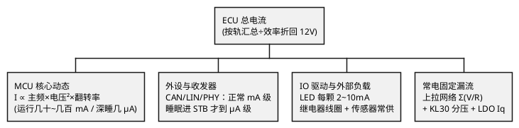

# 功耗估算

> 一句话定位：把"这个 ECU 吃多少电流"变成一张支路账单——正常态决定电源选型与热设计，睡眠态决定整车静态电流指标能否过审；账单里最大的几项，往往都是软件能关而没关的。
> 等级：L2 ｜ 前置：[欧姆定律与功率](../../1-L1基础/电压电流与基本定律/01-欧姆定律与功率.md)、[基尔霍夫定律](../../1-L1基础/电压电流与基本定律/02-基尔霍夫定律.md)

## 原理

### 为什么要做功耗预算（Power Budget）

1. **电源选型**：各支路电流之和决定 DCDC/LDO 的电流规格与余量；
2. **热设计**：各器件损耗决定温升（见 [01-LDO原理与选型](01-LDO原理与选型.md) 的热计算）；
3. **整车静态电流指标**：整车熄火后所有 ECU 的睡眠电流有总盘子（整车暗电流预算，典型几 mA~几十 mA 级，以 OEM 项目规范为准）；单个 ECU 常见分配 100μA~几 mA 量级——超标直接导致"停车两周打不着火"；
4. **电池续航账**：60Ah 电瓶，100mA 暗电流理论上 600 小时耗尽，叠加自放电与低温衰减，余量并不宽裕（数字以项目规范为准）。

预算的生命周期：设计期估算（本篇方法）→ 样件期实测（电流表/功耗分析仪对照，偏差大就回炉）→ 量产期监控（产线工装顺带测睡眠电流，防批次漂移）。三个阶段用同一张支路表说话，改板/换料时只改受影响行。

### 估算方法：列支路表

按电源轨逐条列负载：`支路 = 器件 × 模式 × 典型电流 × 占空比`，最后按轨汇总、除以电源效率折算回 12V 侧输入电流。

总功耗的拆解树（正常态与睡眠态按各自拓扑分别列）：

MCU 各模式典型电流量级（以具体芯片手册为准，量级供预算参考）：

| MCU 模式 | 电流 | 说明 |
|---|---|---|
| 运行（全速+外设全开） | 几十~几百 mA | 主频与外设决定 |
| 运行（降频） | 几~几十 mA | 时钟树裁剪后 |
| 待机/睡眠（RAM 保持，RAM 保持+RTC） | 几百 μA~几 mA | 唤醒源保持 |
| 深度睡眠/关断（仅唤醒电路） | 几 μA~几十 μA | 大部分域断电 |

收发器与外围（正常/待机/睡眠，以器件手册为准）：

| 器件 | 正常 | 待机/睡眠 |
|---|---|---|
| CAN 收发器 | 几~几十 mA | 几 μA~几十 μA |
| LIN 收发器 | 几 mA | <10μA |
| 车载以太网 PHY | 几十 mA | 几~几十 mA（部分支持睡眠） |
| 传感器（常供） | mA 级 | 睡眠时用 EN 关断 |
| LED（每颗） | 2~10mA | 睡眠必须关 |
| LDO Iq | — | 1~50μA/颗（全温最大值） |

上拉网络（容易被忽略的固定漏流）：每个"上拉到常电的输入脚"= V/R 持续漏电；12V 检测分压电阻网络也是常电负载。

CAN 终接电阻：两端各 120Ω 并联为 60Ω 挂在 CAN_H/CAN_L 之间，显性位期间从收发器拉几十 mA 瞬时电流——按通信占空比折算平均电流；若本节点睡眠但总线活跃，终接漏流仍计入（部分网络用"局部唤醒"开关终接以省电，以原理图为准）。

## 计算与选型

### 睡眠电流预算表（完整算例）

目标：睡眠总电流 ≤ 100μA@12V（入门级分配，实际以项目规范为准）。

| # | 支路 | 计算 | 电流 |
|---|---|---|---|
| 1 | MCU 深度睡眠（RAM 保持+RTC） | 手册典型 15μA，取 20μA | 20μA@3.3V |
| 2 | CAN 收发器睡眠模式 | 手册 5μA，取 8μA | 8μA@5V |
| 3 | 常电 LDO Iq | 全温最大 25μA | 25μA@12V |
| 4 | KL30 检测分压网络 | 1MΩ+100kΩ：12V/1.1MΩ | ≈11μA@12V |
| 5 | 唤醒输入上拉（×2） | 100kΩ×2 → 12V/100k×2 | 240μA ← **超标！** |
| 6 | 外部看门狗/SBC 睡眠 | 手册 2μA | 2μA |

问题定位：第 5 项两个 100k 上拉就吃掉 240μA，全表直接爆掉。

整改后（换 1MΩ 上拉 + 关断非必要轨）：

| # | 支路 | 整改 | 电流 |
|---|---|---|---|
| 1 | MCU 深度睡眠 | 不变 | 20μA@3.3V → 折 12V 侧约 7μA（LDO 效率折算，忽略） |
| 2 | CAN 收发器睡眠 | 不变 | 8μA@5V → 约 4μA |
| 3 | 常电 LDO Iq | 不变 | 25μA@12V |
| 4 | KL30 分压 | 2MΩ+200kΩ | ≈5.4μA@12V |
| 5 | 唤醒输入上拉 | 换 1MΩ×2 | 24μA@12V |
| 6 | SBC 睡眠 | 不变 | 2μA |
| — | **合计（粗略，均按 12V 侧叠加）** | | **≈ 67μA ✓** |

要点：**预算表必须留 30% 余量**（温漂、批次、老化），67μA 对 100μA 指标才算安全。

### 正常态功耗预算（简表示例）

| 轨 | 负载 | 电流 | 小计 |
|---|---|---|---|
| 5V（DCDC） | MCU 全速 150mA + CAN×2 30mA + 传感器 40mA | 220mA | 5V@0.22A |
| 3.3V（LDO←5V） | 外设 30mA | 30mA | 3.3V@0.03A |
| 12V 直挂 | 继电器线圈×2（动作时） 100mA | 100mA | 占空比折算 |

12V 侧输入 ≈ 5V 侧功率/效率 + LDO 支路 ≈ (1.1W/0.9) + 0.16W + 继电器 1.2W（动作时）→ 据此选 DCDC（≥2A 余量）与保险丝（以项目规范为准）。

### 隐藏耗电大户清单

- 没关的外设时钟：MCU 外设寄存器 clock gate 没关，睡眠电流多出几 mA；
- 上拉网络：上拉到常电的每个输入脚都在漏（见预算表第 5 项教训）；
- CAN/LIN 终接电阻与常供收发器：睡眠时收发器没进睡眠模式（STB 引脚没拉）；
- LED 指示灯：调试期点亮忘记关；
- LDO 的 EN 没关：整轨白挂 Iq+负载；
- 调试器连接：禁用低功耗模式 + 引脚额外上拉，睡眠电流永远测不准；
- 外部传感器常供：没 EN 脚就加高边开关（见 ../MOS管与三极管/03-高边低边驱动.md）；
- NvM/EEPROM 周期写入：平均电流抬升，深度睡眠被周期性打断。

## ECU 实例

- 整车暗电流预算：OEM 通常给全车总盘（几 mA~几十 mA 级），分到每个 ECU 从 100μA 到几 mA 不等（以项目规范为准）；
- 测量方法：12V 串联 μA 级电流表/功耗分析仪，等所有延时任务（NvM 写回、总线休眠）结束后读稳态值；分段测（拔保险丝/关外设）定位支路；
- 实测与预算对照：预算 67μA、实测 80μA 属正常（模型误差）；实测 800μA 就是"有东西没关"；
- 高温复测：85°C 下漏流成倍增长，低温指标合格不等于高温合格（以全温实测为准）。

## 与软件的关联

1. **低功耗模式配置**：进睡眠前的"关灯清单"——外设时钟门控（Mcu/SetMode 前逐个 Mcal_DeInit）、GPIO 置为模拟/无上拉状态、收发器进睡眠（STB 脚）、关非必要电源轨 EN。任何一项漏做，睡眠电流直接 mA 级（Mcu 时钟门控细节见 [Mcu模块](../../../04-MCAL与外设驱动/2-L2进阶/Mcu模块/README.md)）。
2. **EcuM 睡眠流程**：EcuM GO_SLEEP 前的网络释放、NvM 写回、外设安全态由 BswM/EcuM 编排，睡眠电流是这套流程做没做对的"成绩单"（见 [EcuM 上下电时序](../../../07-AUTOSAR架构/2-L2进阶/系统服务栈/EcuM/02-上下电时序.md)）。
3. **唤醒源配置**：唤醒脚没配好 → 睡不着（电流大）或醒不来（功能丢失）；唤醒滤波时间也影响总线唤醒电流尖峰。
4. **调试定位法**：二分法关外设/停任务，观察电流表落点；或用功耗分析仪抓电流波形，看是"平台高"（外设没关）还是"周期尖峰"（任务/NvM 唤醒）。
5. **调试器连接陷阱**：测睡眠电流必须拔掉调试器（它会把 MCU 钉在调试模式并额外供电路）。

## 易错点与陷阱

- 拿手册"典型值"做预算：要用全温最大值，85°C 下漏流可能是 25°C 的数倍；
- 只测一块板：批次/温度离散没覆盖，量产翻车；
- 调试器连着测睡眠：数据永远不可信；
- 忘记 CAN 总线活跃时的终接漏流：单板睡眠达标、装车超标；
- 周期性任务把 MCU 从深度睡眠频繁拉起：平均电流远超深度睡眠值，"睡了但没睡好"；
- 上拉电阻"顺手选 10k"：对常电输入脚，10k 就是每脚 120μA@12V，睡眠预算杀手；
- 电源效率没折算：5V 侧 100mA 在 12V 侧不是 100mA，要除效率并乘电压比；
- 忽视“峰值 vs 平均”：保险丝/电源规格看峰值与持续时间，睡眠指标看平均——两张账不能混着算；
- 拿正常态预算套睡眠态：睡眠时电源拓扑会变（主 Buck 关、只留常电 LDO），支路表要按睡眠拓扑重列，不是简单打折。

## 面试高频题

1. **Q：为什么要做功耗预算？**
   A：三个用途——电源选型（电流规格与余量）、热设计（器件损耗与温升）、整车静态电流指标（睡眠电流决定整车暗电流是否达标，超标会导致停放亏电）。

2. **Q：睡眠电流预算怎么列？**
   A：按常电轨逐支路列：MCU 深睡电流 + 收发器睡眠 + LDO Iq（全温最大）+ 常电上拉/分压网络 + SBC 等，全部折到 12V 侧求和，再留 30% 余量对照指标；逐项都有手册出处。

3. **Q：睡眠电流超标怎么定位？**
   A：μA 表串联测稳态；二分法关外设/停任务看电流落点；或功耗分析仪抓波形区分"平台高"（外设时钟没关）与"周期尖峰"（任务频繁唤醒）；同时确认调试器已断开、收发器已进睡眠模式。

4. **Q：哪些耗电项最容易被忽略？**
   A：上拉到常电的输入网络（每脚 V/R）、KL30 检测分压、CAN 终接电阻（总线活跃时）、收发器没进睡眠模式、LDO EN 没关、调试器连接。

5. **Q：MCU 各模式电流差多少量级？**
   A：全速运行几十~几百 mA，降频运行几~几十 mA，睡眠（RAM 保持）几百 μA~几 mA，深度睡眠几~几十 μA——跨度五个数量级，所以模式配置是睡眠预算成败的关键（具体以芯片手册为准）。

6. **Q：整车为什么对单个 ECU 的睡眠电流锱铢必较？**
   A：一辆车几十个 ECU 常接电瓶，暗电流是叠加的：单车预算若 20mA、装 40 个节点，平均每个只许 0.5mA；超标节点会耗干电瓶导致"停放数日打不着火"的批量售后问题。

## 延伸

- [01-LDO原理与选型](01-LDO原理与选型.md)：Iq 与效率折算
- [02-DCDC原理](02-DCDC原理.md)：电源效率进预算
- [04-纹波与去耦](04-纹波与去耦.md)：测电流时的噪声干扰
- [Mcu模块](../../../04-MCAL与外设驱动/2-L2进阶/Mcu模块/README.md)：时钟门控与低功耗模式
- [EcuM 上下电时序](../../../07-AUTOSAR架构/2-L2进阶/系统服务栈/EcuM/02-上下电时序.md)：睡眠流程编排

