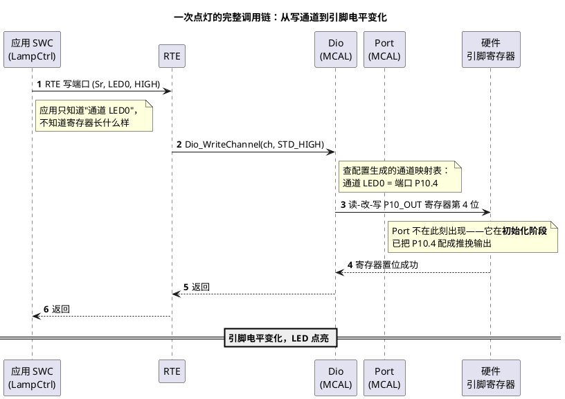

# 01-MCAL第一课-从点灯到分层驱动

> 一句话定位：把"控制一个引脚"这件小事放进 AUTOSAR 分层里走一遍全链路，从此看见 Dio/Port/Mcu 这些词不再发怵，并搞懂为什么配置工具生成的代码长那样。
> 等级：L1 ｜ 前置：无

## MCAL 是什么

MCAL（Microcontroller Abstraction Layer，微控制器抽象层）是 **AUTOSAR 分层架构里最底下的一层驱动**。AUTOSAR 从下往上大致分四层，可以想象成一栋楼：

| 层                       | 大白话                                   | 例子                               |
| ------------------------ | ---------------------------------------- | ---------------------------------- |
| 应用层（SWC）            | 住顶楼的业务逻辑："该开灯了"             | 车灯控制、门窗逻辑                 |
| RTE                      | 电梯+传话筒：应用想用硬件，只跟它说话    | 端口函数                           |
| BSW（服务层/ECU 抽象层） | 中层管家：把"一类硬件"管起来             | CanIf、NvM、IoHwAb                 |
| **MCAL**           | **地基层：真正碰寄存器的唯一楼层** | Dio、Port、Mcu、Adc、Spi、CanDrv… |

一句话记法：**应用层说"要什么"，MCAL 干"怎么碰寄存器"，中间各层负责传话和翻译。** 所以 MCAL 的每个模块都直接对应芯片手册里的一章（Port 对应端口章节、Adc 对应 ADC 章节）——这也是为什么本区笔记总在"标准接口 × 双平台实现"两头对照。

## 为什么要分层：换芯片少改应用

假设不分层，应用代码直接写寄存器：

```c
/* 裸机风格：直接碰寄存器 */
P10_OUT.bits.P4 = 1;      /* TC377 点灯写法 */
```

这段代码在 S32K 上**一行都跑不了**——S32K 的寄存器名字、地址、位定义完全不同，你得把全工程翻一遍。车厂量产一个平台动辄几十万行代码，换颗芯片就重写一遍，没人养得起这种团队。

分层的价值就一句话：**把"换芯片要改的部分"压缩到最底层。** 应用层只调用标准接口：

```c
Dio_WriteChannel(DioConf_DioChannel_LED0, STD_HIGH);  /* 两颗芯片通用 */
```

换芯片时，应用层与大多数 BSW 原封不动，只重新配置生成一套 MCAL。代价是分层带来一层层函数调用——**用一点点运行时开销，换回移植性与团队分工**，这笔账在汽车行业稳赚。

## 一次点灯的完整调用链

应用里一行 `Dio_WriteChannel`，往下到底发生了什么？把整条链拉直了看：



三个直觉要点：

1. **Dio 与 Port 分工**：Dio 管"运行时读写电平"，Port 管"上电时把引脚配成什么模式（方向/上下拉/复用）"。就像 Port 装修房子，Dio 日常开灯关灯。
2. **配置生成的映射表是关键**：`DioConf_DioChannel_LED0` 到"P10.4"的翻译不是写死的 if-else，而是配置工具根据你的引脚分配生成的——这就是下一节生成流程的意义。
3. **真正的写寄存器是读-改-写**：一条 C 语句背后是"读整个寄存器→改一位→写回去"，多任务并发时的原子性问题属于 L2 再展开。

## MCAL 家族速览：13 个模块一张表

AUTOSAR MCAL 常用模块就 13 个上下，本区的子目录正是照它们建的。先混个脸熟，不用记全——工作时按表索骥：

| 模块          | 管什么            | 本区位置 | 大白话                        |
| ------------- | ----------------- | -------- | ----------------------------- |
| Mcu           | 时钟/RAM/复位     | 2-L2进阶 | 整颗芯片的"总开关房"          |
| Port          | 引脚模式          | 1-L1基础 | 装修：每根脚干什么            |
| Dio           | 电平读写          | 1-L1基础 | 开灯关灯                      |
| Gpt           | 定时器            | 2-L2进阶 | 闹钟/节拍器                   |
| Icu           | 输入捕获          | 2-L2进阶 | 秒表：记下信号跳变时刻        |
| Pwm           | PWM 输出          | 2-L2进阶 | 调光灯/电机调速               |
| Adc           | 模数转换          | 2-L2进阶 | 把电压读成数字                |
| Spi           | SPI 通信          | 2-L2进阶 | 高速外设的串行通道            |
| Wdg           | 看门狗            | 2-L2进阶 | 死机保险丝                    |
| CanDrv/LinDrv | 总线收发          | 2-L2进阶 | 车用网络的"网卡"              |
| Fls/Fee       | Flash/模拟 EEPROM | 2-L2进阶 | 掉电不丢的仓库                |
| （DMA）       | 搬运工            | 3-L3高级 | 不占 CPU 的搬运（非标准模块） |

两个分类直觉：**Port/Dio/Mcu 是每项工程的必经之路**（先配引脚、先有时钟）；**CanDrv/Fls/Fee/Wdg 与上层 BSW 强耦合**（分别上接 CanIf/NvM/WdgM），读到它们时建议与 07 区对应栈笔记对照。

## MCAL 与 iLLD/RTD：一句话关系

**iLLD（TC377 英飞凌库）和 RTD（S32K NXP 库）是厂商提供的"寄存器操作工具箱"，MCAL 是按 AUTOSAR 标准把工具箱包成的"统一门面"**——MCAL 内部往往就是调 iLLD/RTD 干活，你在 02 区平台笔记里学的厂商库，正是本区 MCAL 实现篇的地基。

## 配置工具生成流程：5 步直觉

EB tresos 这类配置工具干的事，直觉上就 5 步：

1. **导入芯片描述文件**：工具拿到"这颗芯片有几个 Port 引脚、几组 ADC"的家底清单（厂商提供的 XDM/描述文件）；
2. **图形界面点选配置**：你勾选启用哪些模块、把 P10.4 分配给 Dio 通道 LED0、给 Adc 设采样组——全程点鼠标，不写代码；
3. **保存为 ARXML**：界面上的每次点击落成一份 ARXML 配置描述（就是一堆结构化的"我想要"）；
4. **代码生成**：点 Generate，工具按"我想要"产出 `Dio_Cfg.c/h`、`Port_Cfg.c` 等配置代码——把"想要"翻译成"通道映射表、初始化结构体"；
5. **集成编译**：生成的配置文件与 MCAL 静态代码（SWS 标准实现）一起进工程编译——静态代码不变，变的全是配置。

记住一个判断：**凡是 `_Cfg.c` 结尾的文件，几乎都是工具生成的，别手改**——下次重新生成会被覆盖；要改就回工具里改配置。

## 新手三连问

- **"MCAL 代码是谁写的？我要写吗？"**——芯片厂商提供 MCAL 实现包（含静态代码+描述文件），你的日常是"配置+生成+集成"，不是从零写驱动；要手写的通常是 CDD（本区 2-L2进阶/CDD设计方法论）。
- **"为什么我改了生成的代码，编译没问题却总被冲掉？"**——生成物随时会被重新 Generate 覆盖，改动只能落在配置工具里；这也是评审时"改动进了哪层"的第一判断依据。
- **"学 MCAL 要先啃完芯片手册吗？"**——不用。先带着本文的调用链去配置工具里跑通 Port/Dio，再按需翻手册对应章节（正确顺序：先见森林，再看树木）。

## 下一步读什么

- 本区入口：[MCAL总览](../1-L1基础/MCAL总览/README.md)——分层位置图、MCAL vs iLLD vs RTD、配置生成流程的展开版；
- 同带热身：[驱动分层思想](../1-L1基础/驱动分层思想/README.md)与 [Port与Dio](../1-L1基础/Port与Dio/README.md)——把本文的调用链落到可动手的配置；
- 平台地基地（跨区）：[02-芯片与体系结构/1-L1基础/S32K平台](../../02-芯片与体系结构/1-L1基础/S32K平台/README.md)、[02-芯片与体系结构/2-L2进阶/TC377平台](../../02-芯片与体系结构/2-L2进阶/TC377平台/README.md)——MCAL 实现篇翻的双平台手册背景；
- 完整阅读顺序见本区 [README 入门坡道](../README.md)。

---

维护约定：笔记命名 `序号-主题.md`；真实截图放 `_images/`；流程/时序/状态/架构图用 PlantUML 内嵌正文，规范见 [图表规范与模板](../../00-总览/图表规范与模板.md)。
