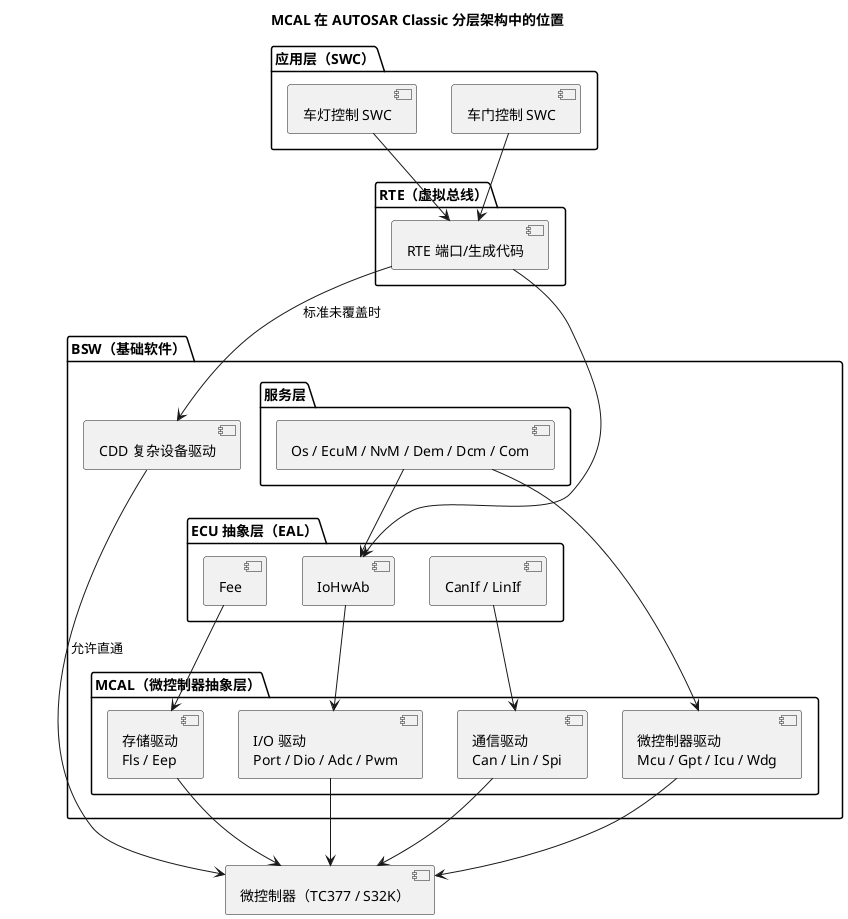

# 01-MCAL分层位置

> 一句话定位：把 MCAL 放回 AUTOSAR 分层架构的准确位置（BSW 里的哪一小层）、数清 13 个常用标准模块、划清它与 CDD 的边界——分层图一图在手，评审时"这段代码该放哪层"不再靠感觉。
> 等级：L1→L2 ｜ 前置：[MCAL第一课-从点灯到分层驱动](../../00-入门导读/01-MCAL第一课-从点灯到分层驱动.md)

## 原理

### 1. 从"四层楼"到 BSW 内部的三小层

导读里用"四层楼"记 AUTOSAR：应用层（SWC）→ RTE → BSW → 微控制器。但工程里说的 MCAL 不是与 BSW 并列的一层，而是 **BSW 内部最靠下的一小层**。BSW 内部自上而下分三小层，外加一个旁路：

| BSW 内部 | 大白话 | 典型模块 | 与硬件的距离 |
|---|---|---|---|
| 服务层（Services） | 全车通用的管家 | Os、EcuM、NvM、Dem、Dcm、Com | 只调下层，不碰芯片 |
| ECU 抽象层（EAL） | 把"一类硬件"统一接管 | IoHwAb、CanIf、Fee、CanTrcv | 管板级外设，仍不碰芯片寄存器 |
| **MCAL** | **唯一碰芯片寄存器的层** | Port、Dio、Mcu、Adc、Can… | 直接读写芯片外设 |
| CDD（旁路） | 标准没覆盖时的逃生门 | 自研复杂驱动 | 允许直通硬件 |



记法：**MCAL 内部再按"管什么外设"分四组（I/O、通信、存储、微控制器）**，每组的模块直接对应芯片手册的一章；EAL 则对应"板上的东西"（收发器、模拟前端、EEPROM 芯片）。

### 2. 13 个常用标准模块清单

把常用模块数一数正好 13 个，加上括号里按需出现的，就覆盖了日常九成场景：

| 组 | 模块 | 管什么硬件 | 直接上家（谁调用它） |
|---|---|---|---|
| 微控制器驱动 | **Mcu** | 时钟/PLL、RAM、复位、低功耗 | EcuM、Os、各模块取时钟 |
| 微控制器驱动 | **Gpt / Icu** | 通用定时器 / 输入捕获 | Os 计数器、应用节拍 |
| 微控制器驱动 | **Wdg** | 内部看门狗 | WdgM（服务层） |
| I/O 驱动 | **Port** | 引脚复用/方向/上下拉 | EcuM 一次性初始化 |
| I/O 驱动 | **Dio** | 数字电平读写 | IoHwAb、SWC（经 RTE） |
| I/O 驱动 | **Adc** | ADC 采样 | IoHwAb |
| I/O 驱动 | **Pwm** | PWM 输出 | IoHwAb |
| 通信驱动 | **Can / Lin** | CAN/LIN 控制器 | CanIf / LinIf（EAL） |
| 通信驱动 | **Spi** | SPI 控制器 | SpiHandler/Drivers（EAL） |
| 存储驱动 | **Fls** | 片上 Flash | Fee（EAL）→ NvM |
| 存储驱动 | **Eep** | （外/内）EEPROM | Ea（EAL）→ NvM |
| （按需） | Fr、Eth、CanTrcv* | FlexRay、以太网、收发器 | 各上层接口 |
| （按需） | Dma* | DMA 控制器 | 非经典标准模块，厂商附送 |

注意两点：**Fee 在标准上属于 EAL**（Flash EEPROM 仿真），但工程上随 MCAL 驱动包一起交付、在同一个配置工具里配，所以大家嘴上也把它当"MCAL 包的一部分"——归属按 SWS 分，交付按包走。CanTrcv 严格说也是 EAL。

### 3. MCAL 与 CDD 的边界

判断"一个驱动该进 MCAL 还是 CDD"，问三个问题：

1. **AUTOSAR 有没有对应 SWS？**（有标准接口规范→ MCAL；没有→ CDD）
2. **配置工具能不能表达它的需求？**（能表达→ MCAL；表达不了（如 GTM 的 ARU/DPLL 联动）→ CDD）
3. **这个功能是不是只有本项目用、且带强时序/私有协议？**（是→ CDD）

两个"否/是"就该走 CDD。CDD 不是"没规矩的野代码"——它是 AUTOSAR 预留的正式扩展点，对外暴露干净接口、对内可以用寄存器或厂商库，资源约定反而要比 MCAL 更严格（详见 [CDD设计方法论](../../2-L2进阶/CDD设计方法论/README.md)）。

## 配置与文档详解

每个 MCAL 模块在 AUTOSAR 都有一份 **SWS（Software Specification）** 定义 API、配置语义与错误分类——"接口标准化"的实体就是这堆文档。读驱动的正确入口是 SWS，不是源码：

| 模块 | SWS 文档名（示例） | 关键 API 代表 | 生产错误码代表 |
|---|---|---|---|
| Mcu | SWS_McuDriver | Mcu_InitClock | MCU_E_PARAM_CLOCK |
| Port | SWS_PortDriver | Port_Init | PORT_E_PARAM_INVALID |
| Dio | SWS_DioDriver | Dio_WriteChannel | DIO_E_PARAM_INVALID_CHANNEL_ID |
| Gpt | SWS_GptDriver | Gpt_StartTimer | GPT_E_PARAM_CHANNEL |
| Adc | SWS_AdcDriver | Adc_StartGroupConversion | ADC_E_BUSY |

规律：命名 `<模块>_Init/DeInit/Read/Write/Start…`，返回值多为 `Std_ReturnType`，开发期错误统一报给 Det（开发错误跟踪）。**先读 SWS 的 API 章节再开配置工具，效率翻倍。**

## 双平台对照

| 维度 | TC377（AURIX） | S32K（NXP） |
|---|---|---|
| MCAL 交付方 | 英飞凌 AURIX MCAL 驱动包（EB tresos 插件+源码） | NXP MCAL（S32K1 基于 SDK、S32K3 基于 RTD 构建） |
| 配置工具 | EB tresos（配 MCAL）+ ADS（裸驱原型） | EB tresos（配 MCAL）+ S32 Config Tools（裸驱原型） |
| Mcu 背后硬件 | CCU/PLL/复位体系 | SCG/PCC/RCM（K1）、MC_CGM/PRAMC（K3） |
| Port/Dio 背后硬件 | IO 端口模块（P00..P33，IOCR/OMR/IN） | K1：PORT PCR/PDOR；K3：SIUL2 |
| 定时器/PWM 背后 | GTM（TOM/ATOM/TIM） | K1：FTM/LPIT；K3：eMIOS/SysTick |
| Flash 背后 | DMU（PFlash/DFlash） | K1：FTFC；K3：C55 Flash |

同一行对照的直觉：**API 一模一样（SWS 冻结），寄存器世界完全不同（厂商实现）**——这正是"标准接口 × 双平台实现"的含义。

## 代码示例

EcuM 驱动初始化阶段的典型顺序（顺序本身就是分层知识：先有时钟，再有引脚，后开外设）：

```c
#include "Mcu.h"
#include "Port.h"
#include "Dio.h"

void EcuM_DriverInitList_Zero(void)
{
    /* 1. Mcu 最先：时钟没起来，别的模块寄存器都写不进/读不稳 */
    Mcu_Init(&Mcu_Config);
    (void)Mcu_InitClock(McuClockSettingConfig_0);
    while (Mcu_GetPllStatus() != MCU_PLL_LOCKED)
    {
        /* 等待 PLL 锁定：具体超时策略由集成方决定 */
    }

    /* 2. Port 其次：引脚没复用前，外设"接不出去"，操作它等于白做 */
    Port_Init(&Port_Config);

    /* 3. 之后才是 Dio/Adc/Spi… 的正常使用（Dio 无 Init，靠 Port 配好） */
    Dio_WriteChannel(DioConf_DioChannel_LED0, STD_HIGH);
}
```

## 易错点与陷阱

1. **以为"上了 AUTOSAR 就自带 MCAL"**：MCAL 由芯片厂商随驱动包交付，与芯片型号、编译器、tresos 版本强配套——起手第一件事是核对版本矩阵，现象是"装不上插件/生成报错"，对策是按驱动包 Release Note 配套。
2. **把 CanIf/CanSM/NvM/WdgM 当 MCAL**：它们在 EAL/服务层；MCAL 只有 Can/Fls/Wdg 这类"驱动"，分层位置记反会导致排障找错文件。
3. **把 Fee 当 MCAL 正式成员**：SWS 上 Fee 在 EAL，只是随 MCAL 包交付；面试说归属按 SWS，干活知道它和 Fls 一起配。
4. **CDD 里"顺手"初始化 MCAL 已管的外设**：现象是"单独都好，一起就坏"（后到者覆盖前者配置），对策是资源 owner 表+初始化次序约定。
5. **初始化顺序颠倒**（外设 Init 先于 Port/Mcu）：现象是模块"无声"、引脚无输出，对策是按 Mcu→Port→外设的顺序排初始化列表。
6. **拿 S32K1 SDK 的认知硬套 S32K3**：两代生态（SDK vs RTD）API 与架构差异大，对策是按平台重读对应包文档。

## 面试高频题

**Q1：MCAL 的全称与定位？它上下各是谁？**
答：Microcontroller Abstraction Layer，微控制器抽象层，是 BSW 内部最底部的子层，唯一直接操作芯片寄存器的层；上面是 ECU 抽象层（IoHwAb/CanIf/Fee 等），下面就是微控制器硬件。

**Q2：MCAL 与 ECU 抽象层的本质区别？**
答：MCAL 管"这颗芯片"的外设（Port/Dio/Adc/Can 控制器），换芯片整套替换；EAL 管"这块板/一类硬件"（收发器、EEPROM 仿真、传感器抽象），屏蔽板级差异。一个抽象芯片，一个抽象板卡。

**Q3：AUTOSAR MCAL 常用模块有哪些？怎么分组？**
答：四组共 13 个左右——微控制器驱动（Mcu/Gpt/Icu/Wdg）、I/O 驱动（Port/Dio/Adc/Pwm）、通信驱动（Can/Lin/Spi）、存储驱动（Fls/Eep，Fee 严格在 EAL）；按需还有 Fr/Eth/Dma 等。

**Q4：什么时候用 CDD 而不是 MCAL？**
答：三个判据：无对应 SWS、配置工具表达不了（如 GTM 高级特性联动）、强私有协议/极限时序需求。CDD 是 AUTOSAR 正式扩展点，允许直通硬件，但要自己承担可移植性损失。

## 延伸

- [02-MCAL-vs-iLLD-vs-RTD](02-MCAL-vs-iLLD-vs-RTD.md)：MCAL 门面之下的厂商库世界；
- [驱动分层思想](../驱动分层思想/README.md)：把本文的分层图落到"寄存器→厂商库→MCAL→IoHwAb"四级代码台阶；
- [MCAL第一课](../../00-入门导读/01-MCAL第一课-从点灯到分层驱动.md)：一次 Dio_WriteChannel 的全链路热身；
- [iLLD与MCAL的关系](../../../02-芯片与体系结构/2-L2进阶/TC377平台/资源与iLLD/02-iLLD与MCAL的关系.md)（02区）：TC377 侧两者的共存与冲突；
- [分层架构](../../../07-AUTOSAR架构/1-L1基础/架构总览/01-分层架构.md)（07区）：BSW 全景的展开版。

---

维护约定：笔记命名 `序号-主题.md`；真实截图放 `_images/`；流程/时序/状态/架构图用 PlantUML 内嵌正文，规范见 [图表规范与模板](../../../00-总览/图表规范与模板.md)。
