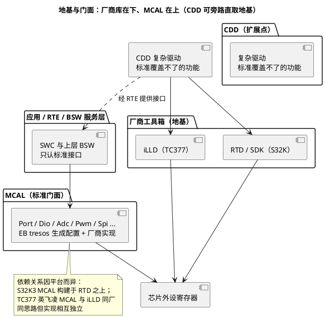

# 02-MCAL-vs-iLLD-vs-RTD

> 一句话定位：分清"标准接口的门面"（MCAL）与"厂商工具箱"（iLLD/RTD/SDK）——谁给谁打工、一个 GPIO 初始化在三层各长什么样、什么时候可以绕开 MCAL 直接用厂商库，这是双平台工程师每天都在做的选择题。
> 等级：L1→L2 ｜ 前置：[01-MCAL分层位置](01-MCAL分层位置.md)

## 原理

### 1. 三者关系一张表

| 维度 | MCAL | iLLD（TC377） | RTD/SDK（S32K） |
|---|---|---|---|
| 定位 | AUTOSAR 标准接口的"门面" | 英飞凌寄存器操作工具箱 | NXP 寄存器操作工具箱 |
| 接口标准化程度 | SWS 冻结，跨芯片同名同参 | 厂商私有命名（IfxPort_xxx） | 厂商私有命名（Siul2_Port_Ip_xxx / PORT_xxx） |
| 怎么得到代码 | 配置工具生成配置 + 厂商实现包 | 随 ADS 直接给库源码 | 随 S32 Design Studio/RTD 包给库源码 |
| 学习曲线 | 陡（要懂 AUTOSAR+配置工具） | 平缓（例程多，裸驱视角） | 平缓（例程多，裸驱视角） |
| 可移植性 | 高（换芯片换包不换上层） | 无（绑定 AURIX） | 无（绑定 S32K 系列） |
| 典型用户 | 量产 AUTOSAR 工程 | 原型验证、CDD 内部、无 AUTOSAR 工程 | 同左 |

### 2. "地基"与"门面"：谁包谁

一句话总纲：**iLLD/RTD 是 MCAL 的地基，不是替代**——MCAL 的标准接口之下，最终总要有人去写那颗芯片的寄存器，这个人就是厂商库（或与之同思路的厂商实现）。



两条到达硬件的路：**标准路（经 MCAL）与近路（CDD 直取厂商库）**。近路快但不可移植，且要管住资源 owner（谁初始化、谁拥有哪个外设），否则"后写的赢、先配的坏"。

### 3. 选型建议：什么时候直接用厂商库

| 场景 | 建议 | 理由 |
|---|---|---|
| 量产 AUTOSAR 工程，常规外设 | MCAL | 可移植、工具校验、评审友好 |
| 原型/台架验证、算法 bring-up | 直接 iLLD/RTD | 快，不背配置工具与分层负担 |
| MCAL 配置面覆盖不了（GTM ARU/DPLL 联动等） | CDD + 厂商库 | 标准表达不了，硬塞 MCAL 是折磨 |
| 无 AUTOSAR 的工具类小工程 | 直接厂商库 | 杀鸡不用牛刀 |
| 多平台车型项目（同功能双芯片） | 尽量 MCAL，CDD 隔离在最小接口后 | 保住上层复用 |

## 配置详解：一个 GPIO 初始化在三层各长什么样

同一个动作（把 P10.4 / PTA3 配成推挽输出并拉高）的三种写法对照——**越往下越具体、越往上越"看不见硬件"**：

| 层 | TC377 写法 | S32K 写法 | 换板时改哪 |
|---|---|---|---|
| 裸寄存器 | 写 `P10_IOCR0` 的 PCx 字段选输出档，再写 `P10_OMR` | 写 `PORTA_PCR3` 的 MUX/DSE，再写 `PDOR/PSOR` | 重写全部，位定义全换 |
| 厂商库 | `IfxPort_setPinModeOutput(...)` | `PORT_SetPinMux(...)` + `GPIO_PinWrite(...)`（SDK）；RTD 经 Pins 工具生成 | 重写调用，API 名全换 |
| MCAL | tresos 里把 P10.4 分配给 Dio 通道 LED0，代码只留 `Port_Init` + `Dio_WriteChannel` | 同左（S32K 侧配 PTA3） | 只改配置不动代码 |

## 双平台对照

| 维度 | TC377 | S32K |
|---|---|---|
| 厂商库名 | iLLD（随 ADS 交付，按外设分包 IfxPort/IfxGtm/IfxEvadc…） | S32K1：SDK（老生态）；S32K3：RTD（Real-Time Drivers） |
| GPIO 库 API 代表 | `IfxPort_setPinModeOutput()`、`IfxPort_setPinState()` | K1 SDK：`PORT_SetPinMux()`、`GPIO_PinWrite()`；K3 RTD：`Siul2_Port_Ip_*`（Pins 工具生成配置） |
| MCAL 与厂商库关系 | 英飞凌 MCAL 与 iLLD 同厂同思路、实现相互独立 | S32K3 MCAL 直接构建于 RTD 之上；S32K1 MCAL 基于 SDK |
| 配置工具 | EB tresos（MCAL）；ADS（裸驱例程） | EB tresos（MCAL）；S32 Config Tools（裸驱/Pins） |
| 例程生态 | ADS 官方例程全是 iLLD 裸驱 | S32DS 官方例程全是 SDK/RTD 裸驱 |
| 学习建议顺序 | 先 ADS 点灯→再进 tresos | 先 S32CT 点灯→再进 tresos |

## 代码示例

三层 GPIO 初始化对照（读代码体会"抽象逐级抬高"）：

```c
/* ── 第 0 层：裸写寄存器（TC377 示意，位定义以 UM 为准）── */
MODULE_P10.IOCR0 &= ~(0x1Fu << 8);            /* P10.2 对应 PCx 字段清零 */
MODULE_P10.IOCR0 |=  (0x10u << 8);            /* 选通用推挽输出档 */
MODULE_P10.OMR     =  (1u << 4) << 16;        /* OMR 高半字=置位第 4 位（原子置 1） */

/* ── 第 1 层：厂商库（两平台 API 名完全不同，不可移植）── */
IfxPort_setPinModeOutput(&MODULE_P10, 4,
        IfxPort_OutputMode_pushPull, IfxPort_OutputIdx_general);  /* TC377 iLLD */
/* S32K1 SDK 对照：PORT_SetPinMux(PORTA, 3u, kPORT_MuxAsGpio); GPIO_PinWrite(GPIOA, 3u, 1u); */

/* ── 第 2 层：AUTOSAR MCAL（两平台代码一字不差）── */
Port_Init(&Port_Config);                      /* 配置已由 tresos 按 ARXML 生成 */
Dio_WriteChannel(DioConf_DioChannel_LED0, STD_HIGH);  /* 通道名是生成的宏 */
```

## 易错点与陷阱

1. **MCAL 工程里随手调 IfxPort/PORT_xxx 改引脚**：现象是重新生成或重新初始化后被冲掉、owner 不明；对策是引脚操作收口到 Port/Dio，厂商库只许在 CDD 内部出现。
2. **以为"会跑 ADS 例程=会 MCAL"**：例程是裸驱视角（没有初始化次序、OS、配置变体概念）；对策是把例程思路翻译进配置工具而不是翻译进工程。
3. **版本错配**：tresos 版本、MCAL 驱动包版本、iLLD/RTD 版本、编译器版本必须按 Release Note 配套；现象是插件装不上或生成阶段报怪错，对策是先查版本矩阵再排错。
4. **拿 S32K1 SDK 的 API 认知套 S32K3 RTD**：两代生态命名与结构差异大（K1 的 `PORT_xxx` 到 K3 变 `Siul2_Port_Ip_*`），对策是按 [SDK与RTD生态对比](../../../02-芯片与体系结构/1-L1基础/S32K平台/S32K1与S32K3对比/02-SDK与RTD生态对比.md) 重新建立索引。
5. **全工程直接用厂商库"图快"**：丢掉可移植性与工具校验，换芯片全工程翻新；对策是"快"只许发生在原型期与 CDD 内部。
6. **应用代码 include 厂商库头文件**：应用与芯片焊死；对策是厂商头文件只许出现在 MCAL 实现与 CDD 的 .c 里。

## 面试高频题

**Q1：iLLD/RTD 会替代 MCAL 吗？**
答：不会，定位不同。MCAL 是 AUTOSAR 标准接口门面（可移植、工具生成配置），iLLD/RTD 是厂商寄存器工具箱（能力全、不可移植）；S32K3 上 MCAL 甚至就构建于 RTD 之上——是包含关系不是竞争关系。

**Q2：一个 AUTOSAR 工程里两者如何共存？**
答：常规外设走 MCAL；MCAL 表达不了的功能放 CDD，CDD 内部调厂商库。共存靠资源 owner 表（引脚/通道/中断/时钟逐一归属）与初始化次序约定（CDD 后于 MCAL 且不做全局动作）。

**Q3：厂商为什么既免费送 iLLD/RTD，又要提供 MCAL 驱动包？**
答：厂商库做生态、降裸驱门槛、圈住开发者；MCAL 是车厂 AUTOSAR 采购体系的入场券，两者服务不同客户群——量产项目与原型/工具链。

**Q4：直接调厂商库有什么风险？**
答：四条：绕过配置校验（错误运行期才炸）、重复初始化冲突（后写覆盖）、不可移植（换芯片重写）、MISRA/评审难通过（厂商库代码不在合规基线内）。

## 延伸

- [01-MCAL分层位置](01-MCAL分层位置.md) ｜ [03-配置与生成流程](03-配置与生成流程.md)：门面背后的生成机制；
- [iLLD分层设计](../../../02-芯片与体系结构/2-L2进阶/TC377平台/资源与iLLD/01-iLLD分层设计.md)（02区）：工具箱内部的分层；
- [iLLD与MCAL的关系](../../../02-芯片与体系结构/2-L2进阶/TC377平台/资源与iLLD/02-iLLD与MCAL的关系.md)（02区）：TC377 侧共存三坑的机制版；
- [SDK与RTD生态对比](../../../02-芯片与体系结构/1-L1基础/S32K平台/S32K1与S32K3对比/02-SDK与RTD生态对比.md)（02区）：S32K 两代生态；
- [CDD设计方法论](../../2-L2进阶/CDD设计方法论/README.md)：什么时候、怎么走"近路"。

---

维护约定：笔记命名 `序号-主题.md`；真实截图放 `_images/`；流程/时序/状态/架构图用 PlantUML 内嵌正文，规范见 [图表规范与模板](../../../00-总览/图表规范与模板.md)。
