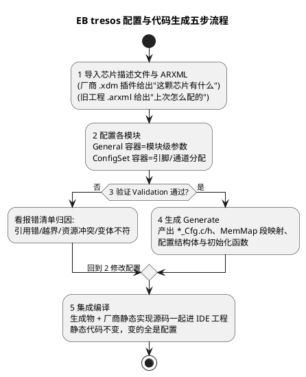

# 03-配置与生成流程

> 一句话定位：把"EB tresos 里点鼠标"变成可复述的工程流程——ARXML 进、C 代码出，中间有校验和变体策略；认得清生成物长什么样，报错才知道往哪归因。
> 等级：L2 ｜ 前置：[02-MCAL-vs-iLLD-vs-RTD](02-MCAL-vs-iLLD-vs-RTD.md)

## 原理

### 1. 五步流程总图

MCAL 的"写代码"其实是"配置→生成"：你在图形界面里表达"我想要"，工具负责翻译成 C。五步闭环如下：



第 1 步的芯片描述文件（厂商随 MCAL 包提供的 .xdm 等）决定了下拉菜单里有哪些选项——**配置界面本身就是按芯片能力生成的**，所以换芯片包=换一整套可配项。

## 配置详解

### 1. 生成物解剖

点一次 Generate，输出目录里新增/更新的典型文件：

| 生成物 | 内容 | 能不能手改 |
|---|---|---|
| `<Module>_Cfg.c / _Cfg.h` | 配置结构体（如 Port_ConfigType 数组）、通道映射宏（DioConf_DioChannel_LED0） | **不能**，重新生成即覆盖 |
| `MemMap.h` 相关段定义 | 把代码/数据钉进内存分区（详见 01 区 [AUTOSAR-MemMap机制](../../../01-编程语言/2-L2进阶/内存管理/05-AUTOSAR-MemMap机制.md)） | 不能 |
| 版本信息 / 回调注册代码 | 模块版本号、通知回调（如 Adc_Group<0> 的转换结束通知） | 不能 |
| 厂商静态实现源码 | SWS API 的实现本体（`<Module>.c`，非 `_Cfg` 结尾） | 原则不改；改动需走变更管理 |

判断口诀：**`_Cfg` 结尾=生成物，别碰；要改就回工具里改配置再生成。**

### 2. 配置项三要素与变体策略

一个模块的配置可以拆成三类，分清它们，改动影响面就清楚：

| 要素 | 管什么 | 例子 |
|---|---|---|
| ① 模块级参数 | 行为开关与量纲 | GptChannelTickFrequency、Adc 分辨率、Det 开关 |
| ② 资源分配 | 引脚/通道归谁 | PortPinId=P10.4 分给 Dio 通道 LED0、GTM/FTM 通道占用 |
| ③ 生成策略（变体） | 配置进代码还是进表 | PreCompiled / LinkTime / PostBuild |

**变体（Variant）是 L2 关键概念**：PreCompiled 把配置编译成常量（最快、最省 RAM，配置焊死在镜像里）；PostBuild 把配置存成运行时表（RAM 换灵活性，一份代码可带多套配置）；LinkTime 折中。混用变体（在 PreCompile 工程里配 PostBuildOnly 参数）会在校验/生成阶段报错——这是"策略错"不是"配置错"。

### 3. 常见生成报错归因

报错先分类，再动手：**配置错（我配错了）/ 策略错（变体不匹配）/ 环境错（版本与包）**：

| 报错类型 | 典型样子 | 归因方向 |
|---|---|---|
| 引用校验失败 | "referenced element not found"、引脚被两个模块占用 | 配置错：查资源 owner 与引用链 |
| 参数越界 | tick 频率超出硬件可达范围 | 配置错：读芯片描述文件的能力表 |
| 变体不符 | PostBuildOnly parameter in PreCompile variant | 策略错：统一变体或换参数 |
| 插件/版本不匹配 | 模块加载失败、schema 不识别 | 环境错：核对 tresos×驱动包×编译器版本矩阵 |
| 描述文件缺失 | 下拉列表没有这颗芯片/外设 | 环境错：MCAL 包没装全 |
| Warning（不阻塞生成） | 默认值不满足硬件约束 | 易漏项：Warning 也要逐条过，否则运行期才炸 |

## 双平台对照

| 维度 | TC377 | S32K |
|---|---|---|
| 配置工具与插件 | EB tresos + 英飞凌 MCAL 插件 | EB tresos + NXP MCAL 插件 |
| 生成代码底层实现 | 与 iLLD 同厂同思路（独立实现，直写寄存器） | S32K3：基于 RTD 生成；S32K1：基于 SDK |
| 裸驱侧对照工具 | ADS（点灯用 iLLD） | S32 Config Tools（点灯用 Pins/时钟工具） |
| 内存分区语境（MemMap） | DSPR/PSPR/DFlash0 等段名 | m_data/m_text 等段（LCF 链接文件语境） |
| 集成入口 | EcuM 驱动初始化列表按序调 `<Module>_Init` | 同左（标准做法，两平台一致） |
| ARXML 角色 | 配置持久化/导入导出/评审 diff 的载体 | 同左 |

两平台流程**完全同构**——这就是"标准工具链"的意义：学会一遍，两平台通用，差异只在插件与生成物内部实现。

## 代码示例

生成物 vs 手写代码的分界（认脸，不是背文件名）：

```c
/* ===== 以下是 tresos 生成的 Dio_Cfg.h 片段（示意，勿手改）===== */
/* 通道号编码规则由生成器决定，宏名与配置一一对应 */
#define DioConf_DioChannel_LED0   ((Dio_ChannelType)0x0A4u)  /* P10.4 */
#define DioConf_DioChannel_KEY0   ((Dio_ChannelType)0x0A5u)  /* P10.5 */
#define DioConf_DioPort_LEDPORT   ((Dio_PortType)0x03u)

/* ===== 以下是手写的集成/应用代码（改这里才不会被覆盖）===== */
#include "Dio.h"

void App_Led_InitState(void)
{
    /* 用生成宏引用通道——换引脚只改配置，这行代码不动 */
    Dio_WriteChannel(DioConf_DioChannel_LED0, STD_HIGH);
    if (Dio_ReadChannel(DioConf_DioChannel_KEY0) == STD_LOW)
    {
        /* 按键低有效：电平语义翻译应放 IoHwAb，此处示意读法 */
        (void)Dio_FlipChannel(DioConf_DioChannel_LED0);
    }
}
```

## 易错点与陷阱

1. **手改 `_Cfg.c`**：现象是编译过了、下次 Generate 全被冲掉；对策是任何改动先问"这是配置还是代码"，配置回工具改。
2. **变体混用**：现象是校验/生成报 PostBuildOnly 相关错误；对策是全工程变体策略统一，起手就定。
3. **只看 Error 无视 Warning**：现象是生成顺利但上板外设行为怪；对策是 Warning 逐条确认（多数是默认值与硬件约束不符）。
4. **生成后没同步到 IDE 工程**：现象是"改了配置没效果"；对策是把生成输出目录固定为工程内路径，或生成后强制 Rebuild。
5. **版本矩阵不配套**：现象是插件加载失败/一堆 schema 报错；对策是先查 tresos、驱动包、编译器三方的 Release Note 配套表，再谈配置。
6. **换芯片直接拷 ARXML 硬导**：现象是导入后校验一片红；对策是接受"重新配置"的现实，用旧 ARXML 当参考逐项迁移。

## 面试高频题

**Q1：为什么用配置工具而不是手写驱动配置？**
答：三个理由：参数组合爆炸（一个 Adc 就是几十项）手写必错；工具能做跨模块一致性校验（引脚冲突、时钟可达性）；配置落在 ARXML 可 diff、可评审、可重生成，工程可追溯。

**Q2：PreCompiled 与 PostBuild 变体的区别？**
答：PreCompiled 把配置编译进代码（常量/宏，性能最优、配置焊死）；PostBuild 把配置存为运行时表（初始化时传入，一份镜像多套配置，代价是 RAM 与一层查表）。LinkTime 介于两者。选择看产品线是否需要同镜像多硬件变体。

**Q3：生成的代码为什么不能手改？**
答：生成物是 ARXML 的投影，重新 Generate 必被覆盖，手改等于埋一颗"下次生成才爆"的雷；正确路径是改配置→重新生成→评审 diff。

**Q4：ARXML 在整个流程里扮演什么角色？**
答：配置的持久化与交换格式：界面上的每次勾选最终落成 ARXML，导入导出、跨工具迁移、版本 diff、评审都基于它——"配置在 ARXML、代码是生成物"是 MCAL 工程的基本世界观。

## 延伸

- [01-MCAL分层位置](01-MCAL分层位置.md) ｜ [02-MCAL-vs-iLLD-vs-RTD](02-MCAL-vs-iLLD-vs-RTD.md)；
- [方法论与ARXML](../../../07-AUTOSAR架构/2-L2进阶/方法论与ARXML/README.md)（07区）：ARXML 的全局视角；
- [AUTOSAR-MemMap机制](../../../01-编程语言/2-L2进阶/内存管理/05-AUTOSAR-MemMap机制.md)（01区）：生成物里 MemMap 段的原理；
- [EcuM 上下电时序](../../../07-AUTOSAR架构/2-L2进阶/系统服务栈/EcuM/02-上下电时序.md)（07区）：Init 函数们被谁、按什么顺序调用；
- [MCAL第一课](../../00-入门导读/01-MCAL第一课-从点灯到分层驱动.md)：五步流程的直觉版。

---

维护约定：笔记命名 `序号-主题.md`；真实截图放 `_images/`；流程/时序/状态/架构图用 PlantUML 内嵌正文，规范见 [图表规范与模板](../../../00-总览/图表规范与模板.md)。
