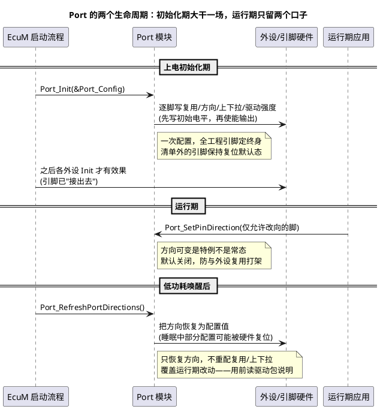

# 01-Port配置

> 一句话定位：Port 是"装修队"——芯片几百根脚谁干什么（复用/方向/上下拉/驱动强度/斜率）在上电初始化一次配好；每个配置项都有电气后果，配错不是编译错误，而是板子"无声"。
> 等级：L1 ｜ 前置：[01-MCAL分层位置](../MCAL总览/01-MCAL分层位置.md)

## 原理

### 1. Port 管什么：一根引脚的全部"出身"

Port 模块在 `Port_Init` 里一次性回答每个引脚的五个问题：

1. **复用**：这根脚接哪个功能（GPIO，还是 UART_TX / CAN_RX / PWM 输出）；
2. **方向**：输入还是输出（复用给外设时方向随外设功能）；
3. **上下拉**：无/上拉/下拉——输入脚的"默认电平保险"；
4. **驱动强度/斜率**：输出能灌多大电流、边沿多陡（EMC 与负载匹配）；
5. **初始电平**：输出脚使能前的"预置值"（防毛刺用，见易错点 3）。

初始化后 Port 基本退场，运行期只留 `Port_SetPinDirection`（需配置允许）和 `Port_RefreshPortDirections`（低功耗恢复）两个口子——**Port 是配置期模块，Dio 才是运行期模块**。



### 2. 引脚配置真值表直觉

配置项不是孤立的开关，是**一组"电气场景套餐"**。按场景对号入座，比逐项试错快得多：

| 场景 | 方向 | 复用 | 上下拉 | 说明 |
|---|---|---|---|---|
| 按键输入（板上无上拉） | 输入 | GPIO | **内部上拉** | 按下接地：读低=按下 |
| 按键输入（板上有上拉） | 输入 | GPIO | 无 | 别内外叠加，电平会被"分压"到中间态 |
| LED 推挽输出 | 输出 | GPIO | 无 | 先写初始电平再使能输出，防上电毛刺 |
| 开漏 I2C | 输出 | GPIO/外设 | 无（外部上拉） | 拉高靠总线上的上拉电阻 |
| UART TX/RX | 随外设 | 复用功能 | 一般无 | 方向由外设功能接管，Port 不再管方向 |
| CAN RX/TX | 随外设 | 复用功能 | 通常无 | 总线偏置归收发器，乱加上拉会拉歪总线 |
| 复位后未使用脚 | 输入 | GPIO | 上拉或下拉 | 防悬空：降功耗、抗 EMC 干扰 |
| 模拟输入（ADC） | 输入 | 模拟功能 | 无 | 数字上下拉会污染采样，务必关 |

### 3. 方向可变（DirChangesAllowed）与 Port_RefreshPortDirections

- **PortPinDirectionChangeable**：默认 FALSE。为什么默认关？运行期改方向易与外设复用状态冲突（如复用脚改回 GPIO 输出会顶掉外设），开放它等于声明"这根脚我来管时序"。真需要双向的场景（如单线协议、按键/复用输出共用脚）才开。
- **Port_RefreshPortDirections** 的用途：从低功耗唤醒后，部分硬件会复位 IO 方向，此 API 把所有引脚方向刷回配置值。三个陷阱：① 只恢复**方向**，不恢复复用模式/上下拉——若低功耗把它们也弄丢，得重新 `Port_Init`；② 会把运行期用 `Port_SetPinDirection` 改过的方向**打回配置值**；③ 对哪些引脚生效（全部/仅允许改向的）各驱动包实现有差异——以所购包文档为准。

## 配置详解

| 配置项 | 含义 | 典型取值 | 配错的后果 |
|---|---|---|---|
| PortPinId | 引脚编号（Port+Pin） | P10.4 / PTA3 | 配错脚：功能"跑"到别的脚上 |
| PortPinMode | 复用功能（GPIO/Alt 功能号，部分平台含电气模式） | DIO_MODE_0 / ALT2 | 外设无声：信号出不去/进不来 |
| PortPinDirection | 方向 | 输入/输出 | 输出写了个寂寞（还在输入态） |
| PortPinDirectionChangeable | 允许运行期改向 | 默认 FALSE | 乱开：运行期误改向顶掉外设 |
| 初始电平 | 输出使能前的预置值 | STD_HIGH/LOW | 不设：上电随机毛刺 |
| 上下拉 | 输入脚默认电平 | 无/上拉/下拉 | 悬空脚电平漂移，读数抖动 |
| 驱动强度/斜率 | 电流能力与边沿速率 | 平台档位 | EMC 超标或驱动不足（灯变暗） |

API 面（很小，配置大、代码小）：`Port_Init`、`Port_SetPinDirection`、`Port_RefreshPortDirections`、`Port_GetVersionInfo`（可选 `Port_SetPinMode`，视驱动包支持）。

## 双平台对照

| 维度 | TC377 | S32K |
|---|---|---|
| 端口组织 | P00..P33（P10/P33 常用），每端口至多 16 脚 | PTA..PTE（K1）；K3 为 SIUL2 统一编址 |
| 复用寄存器 | `Pn_IOCR`（PCx 字段选输入/输出/复用档） | K1：`PORT_PCRx[MUX]`；K3：SIUL2 `IMCR`+`MSCR` |
| 上下拉位置 | IOCR 特殊输入档（输入+上拉/输入+下拉） | PCR 的 PE/PS 位（K1）；SIUL2 寄存器（K3） |
| 驱动强度/斜率 | Pad Class / PDCR 类寄存器 | PCR 的 DSE/SRE 位 |
| 标准刷新 API | `Port_RefreshPortDirections`（同 SWS） | 同左 |
| 厂商库 API | `IfxPort_setPinMode()` 等 iLLD | K1 SDK `PORT_SetPinMux()`；K3 RTD `Siul2_Port_Ip_*` |

注意 S32K1 还有 SIM 一层"模块级路由"（引脚对了信号不一定到模块），两级复用的分工见 02 区 [SIM复用配置](../../../02-芯片与体系结构/1-L1基础/S32K平台/时钟系统/02-SIM复用配置.md)。

## 代码示例

```c
#include "Port.h"
#include "Dio.h"

/* 初始化：通常在 EcuM 驱动初始化列表里，Mcu 之后、其他外设之前 */
void Board_PortSetup(void)
{
    Port_Init(&Port_Config);   /* 配置由 tresos 按 ARXML 生成，代码只有这一行 */
}

/* 运行期改方向：必须该脚配置了 DirectionChangeable=TRUE 才有效 */
void Board_SwitchToOutput(void)
{
    (void)Port_SetPinDirection(DioConf_DioChannel_LED0, PORT_PIN_OUT);
}

/* 低功耗唤醒后恢复方向（注意：只恢复方向，且会覆盖运行期改动） */
void Board_AfterWakeup(void)
{
    Port_RefreshPortDirections();
}
```

## 易错点与陷阱

1. **引脚没进 Port 配置清单**：现象是外设"无声"（寄存器都对、脚上没动静）；对策是排障第一步先核对 Port 配置清单里有没有这根脚、复用档对不对。
2. **运行期改向但没开 DirectionChangeable**：现象是 `Port_SetPinDirection` 报参数无效或无效果；对策是回配置工具打开该项（并想清楚为什么要运行期改向）。
3. **输出脚先使能输出再写电平**：现象是上电瞬间毛刺（LED 闪一下/继电器抖一下）；对策是初始电平与输出使能的正确次序（先预置电平再使能，实现由 Port_Init 保证，手写裸寄存器时尤其当心）。
4. **内外上拉叠加或缺失**：现象是输入电平停在中间态/悬空漂移；对策是按原理图确定"上拉只有一个 owner"——要么板上的、要么内部的。
5. **把 RefreshPortDirections 当万能恢复**：现象是唤醒后复用/上下拉仍不对；对策是认清它只刷方向，全量恢复用 Port_Init（代价是引脚会重新走一遍初始化）。
6. **CAN/差分脚随手配内部上下拉**：现象是总线显隐性电平异常、偶发错误帧；对策是总线偏置交给收发器，MCU 侧只配复用。

## 面试高频题

**Q1：Port 和 Dio 怎么分工？**
答：Port 是配置期模块：初始化时一次性定好复用/方向/上下拉/驱动强度，运行期基本退场；Dio 是运行期模块：只读写电平、不做任何配置。一句话——Port 装修，Dio 开关灯。

**Q2：Port_RefreshPortDirections 什么时候用？要注意什么？**
答：从低功耗唤醒后，部分硬件会复位 IO 方向，用它把方向刷回配置值。注意：只恢复方向不复用/上下拉；会把运行期改过的方向打回配置值；具体作用范围以驱动包文档为准。

**Q3：为什么 DirectionChangeable 默认关闭？**
答：运行期改向容易与外设复用状态冲突（改回 GPIO 输出会顶掉外设功能），且通常意味着双向时序要软件自己保证。默认关闭是把这类风险挡在配置评审期，开放即声明"我知道我在干什么"。

**Q4：一根脚配了复用但外设没输出，你的排查顺序？**
答：四步：查 Port 清单（脚配了没、复用档对没）→ 查外设时钟（门控开了没）→ 查外设自身配置与使能 → 回读寄存器确认配置真的写进去了。跨层排查比盯着外设寄存器快。

## 延伸

- [02-Dio接口](02-Dio接口.md)：Port 配好之后，运行期读写的另一半；
- [01-MCAL分层位置](../MCAL总览/01-MCAL分层位置.md)：Port 在 13 个模块里的位置；
- [SIM复用配置](../../../02-芯片与体系结构/1-L1基础/S32K平台/时钟系统/02-SIM复用配置.md)（02区）：S32K1 引脚级与模块级两级复用的分工；
- [IO栈](../../../07-AUTOSAR架构/2-L2进阶/IO栈/README.md)（07区）：Port/Dio 之上的 IoHwAb 全貌；
- [02-抽象与移植性](../驱动分层思想/02-抽象与移植性.md)：复位默认态差异——Port 的漏泄点。

---

维护约定：笔记命名 `序号-主题.md`；真实截图放 `_images/`；流程/时序/状态/架构图用 PlantUML 内嵌正文，规范见 [图表规范与模板](../../../00-总览/图表规范与模板.md)。
