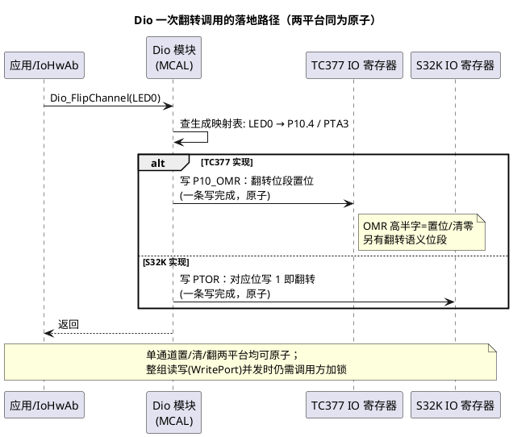

# 02-Dio接口

> 一句话定位：Dio 是 MCAL 里最"瘦"的模块——没有 Init、不管方向，只做读写电平和翻转；分清 Channel/Port/Group 三个概念，就能解释它为什么这么瘦、以及为什么瘦是对的。
> 等级：L1 ｜ 前置：[01-Port配置](01-Port配置.md)

## 原理

### 1. 与 Port 的分工：配置归 Port，读写归 Dio

| | Port | Dio |
|---|---|---|
| 工作期 | 初始化期（一次性） | 运行期（高频） |
| 管什么 | 复用/方向/上下拉/驱动强度 | 电平：读输入、写输出、翻转 |
| 有无 Init | 有（Port_Init） | **没有**（无状态，全靠 Port 配好） |
| 代码量感 | 配置大、代码一行 | 接口十来个、个个轻量 |

一句话：**Port 决定"这根脚是什么"，Dio 决定"这根脚现在是高还是低"**。

### 2. Channel / Port / Group 三概念辨析

| 概念 | 是什么 | 类型 | 适用场景 | 代价 |
|---|---|---|---|---|
| Channel | **单根引脚**的逻辑名 | `Dio_ChannelType`（16 位编码，规则由生成器定） | 点灯、读按键——90% 场景 | 单脚粒度，最灵活 |
| Port | **一整个端口**（如 P10 的全部引脚） | `Dio_PortType` + `Dio_PortLevelType` | 整组并行输出、总线快照 | 耦合该端口所有位，一脚改动牵全组 |
| Group | 一个 Port 内**连续几位**（offset+mask） | `Dio_ChannelGroupType` | 数码管段选、并行锁存 | 必须连续位段；宽度受平台限制 |

选择直觉：单点控制用 Channel；整组一致快照/输出用 Port；"几个脚一起、但不想拖累整端口"用 Group。三者都是逻辑名，物理映射全部由配置工具生成的宏/结构体承担——**代码里永远不该出现裸的 `0x0A4`**。

### 3. 为什么 Dio 不做方向配置（设计哲学）

四条理由，条条是分层设计课：

1. **职责单一**：方向/复用是"配置期决策"，运行期只该动数据寄存器——把配置权关在门外，接口才能最小；
2. **错误左移**：方向错误在 Port 配置评审期就该抓住，若允许运行期随手改向，错误会拖到产线才炸；
3. **无状态所以无 Init**：SWS 明确 Dio 不需要初始化——没有运行时状态就没有初始化顺序依赖，随便谁先调；
4. **路径最短**：读输入寄存器、写输出寄存器，一级映射直达硬件，ISR/高频任务里可放心调用。

### 4. 两个运行期真相：读的是输入寄存器；翻转是原子的

- **Dio_ReadChannel 读的是引脚实际电平**（TC377 `Pn_IN` / S32K `PDIR`），不是你写进输出锁存的值——开漏脚、复用脚、被负载拉低的脚，读回值 ≠ 写入值。这是排查"写了 1 读出 0"的第一直觉。
- **Dio_FlipChannel 在两平台都落在原子翻转寄存器上**（TC377 `OMR` / S32K `PTOR`），单脚翻转不需要临界区；但 `Dio_WritePort` 这类整组读改写不是处处原子，并发写同一端口要靠调用方互斥（漏泄问题详见 [02-抽象与移植性](../驱动分层思想/02-抽象与移植性.md)）。



## 接口与配置详解

核心 API 一张表（全部为标准 SWS 接口，两平台同名同参）：

| API | 参数→返回 | 用途与注意 |
|---|---|---|
| `Dio_WriteChannel` | (ChannelId, Level)→void | 写单脚电平；电平≠"开"（有效电平翻译放 IoHwAb） |
| `Dio_ReadChannel` | (ChannelId)→Level | 读**引脚实际电平**（输入寄存器），非输出锁存 |
| `Dio_FlipChannel` | (ChannelId)→Level（翻转后） | 原子翻转（OMR/PTOR），返回新电平 |
| `Dio_WritePort` | (PortId, Level)→void | 整端口写；并发写同端口需互斥 |
| `Dio_ReadPort` | (PortId)→Level | 整端口快照读 |
| `Dio_WriteChannelGroup` | (*ChannelGroupIdPtr, Level)→void | 只写组内位（按 mask），组须为连续位段 |
| `Dio_ReadChannelGroup` | (*ChannelGroupIdPtr)→Level | 读组内位并对齐到最低位 |
| `Dio_GetVersionInfo` | (*VersionInfo)→void | 版本查询，集成自检用 |

配置侧（在 tresos 的 Dio ConfigSet 里做的）：定义 DioChannel/DioPort/DioChannelGroup，把逻辑名与物理脚绑定，生成 `DioConf_DioChannel_*`、`DioConf_DioChannelGroup_*` 宏——**Dio 的"配置"就是把逻辑名钉到物理脚上这一件事**。

## 双平台对照

| 维度 | TC377 | S32K |
|---|---|---|
| 输出寄存器 | `P10_OMR`（一条写含置位/清零位段） | `PDOR` + 专用 `PSOR/PCOR/PTOR`（置/清/翻） |
| 输入寄存器 | `P10_IN` | `PDIR` |
| Dio API | SWS 标准（上表全部同名同参） | 同左 |
| 通道宏 | `DioConf_DioChannel_LED0`（tresos 生成） | 同左（生成规则一致） |
| ChannelGroup 限制 | 连续位段（offset+mask），宽度按实现 | 同左，宽度上限查各自驱动包 |
| 底层实现 | 直写 IO 寄存器（与 iLLD 同思路） | K1 直写 / K3 经 RTD |

## 代码示例

```c
#include "Dio.h"

/* 按键消抖后翻转 LED，并演示 Group 整组输出（段选示意） */
void App_KeyAndLeds(void)
{
    static uint8 debounce = 0u;

    /* 读按键：低有效；电平语义在应用侧只谈'按下/未按下' */
    if (Dio_ReadChannel(DioConf_DioChannel_KEY0) == STD_LOW)
    {
        if (debounce < 3u)
        {
            debounce++;
        }
        else
        {
            (void)Dio_FlipChannel(DioConf_DioChannel_LED0);  /* 原子翻转 */
        }
    }
    else
    {
        debounce = 0u;
    }

    /* Group：只写组内 4 位，其余脚不受影响 */
    Dio_WriteChannelGroup(&DioConf_DioChannelGroup_SEG, (Dio_PortLevelType)0x05u);
}
```

## 易错点与陷阱

1. **以为 Dio 能改方向/复用**：现象是翻遍 Dio.h 找不到方向接口；对策是认清方向归 Port（运行期唯一口子是 `Port_SetPinDirection`）。
2. **代码里硬编码通道号（`0x0A4`）**：现象是换引脚/换平台后全工程搜数字；对策是只用生成宏 `DioConf_DioChannel_*`，改配置不改码。
3. **把 STD_HIGH 当"开"**：现象是低有效 LED 逻辑全反；对策是电平只在 IoHwAb 翻译成设备语义（"开/关"），应用不谈电平。
4. **写的 1 读回是 0**：现象是自检/回读判失败；对策是明白读的是引脚输入（开漏、复用、负载压降都会让回读≠写入），自检逻辑要么读输出锁存语义的专用口，要么按电路特性设计。
5. **多任务并发写同一 Port 的不同位**：现象是偶发丢位（读改写窗口被打断）；对策是单脚操作用 Channel API（原子），整组操作加互斥或收口到单一 owner。
6. **ChannelGroup 配成不连续位**：现象是校验报错或组操作踩到别的脚；对策是组必须是同一 Port 内连续位段，不连续就拆成多个组或改用单通道。

## 面试高频题

**Q1：Dio 为什么没有 Init 函数？**
答：SWS 设计上 Dio 是无状态模块——没有运行时状态要初始化，引脚的一切配置由 Port_Init 完成。无 Init 还带来一个好处：没有初始化顺序依赖，任何模块都能直接调用。

**Q2：Channel、Port、Group 三者的区别与选择？**
答：Channel 是单脚逻辑名（最常用）；Port 是整个端口整组读写（并行输出/快照，但耦合全部位）；Group 是端口内连续几位（offset+mask，段选类场景）。粒度与耦合之间的折中，按"要动几个脚"选。

**Q3：Dio_FlipChannel 是原子的吗？为什么要在意？**
答：在 TC377/S32K 上都落到原子翻转寄存器（OMR/PTOR），一条写完成，无需关中断。在意的原因：若实现退化成"读-改-写"，ISR 与任务并发翻转会丢动作——这是典型的抽象漏泄点，标准没承诺原子性，靠的是平台实现。

**Q4：为什么写了 STD_HIGH 读回来却是 STD_LOW？**
答：Dio_ReadChannel 读的是引脚实际电平（输入寄存器），不是输出锁存：开漏脚没上拉读回 0、脚被复用给外设、负载把电平拉塌都会如此。排查看电路与复用状态，而不是怀疑 Dio。

## 延伸

- [01-Port配置](01-Port配置.md)：Dio 依赖的那次性配置；
- [01-MCAL分层位置](../MCAL总览/01-MCAL分层位置.md)：Dio 在模块清单里的位置与 SWS；
- [01-寄存器到IoHwAb分层](../驱动分层思想/01-寄存器到IoHwAb分层.md)：Dio 调用该收口在哪一层；
- [IO栈](../../../07-AUTOSAR架构/2-L2进阶/IO栈/README.md)（07区）：从 Dio 到 SWC 的完整 IO 链路；
- [MCAL第一课](../../00-入门导读/01-MCAL第一课-从点灯到分层驱动.md)：Dio_WriteChannel 全链路热身。

---

维护约定：笔记命名 `序号-主题.md`；真实截图放 `_images/`；流程/时序/状态/架构图用 PlantUML 内嵌正文，规范见 [图表规范与模板](../../../00-总览/图表规范与模板.md)。
